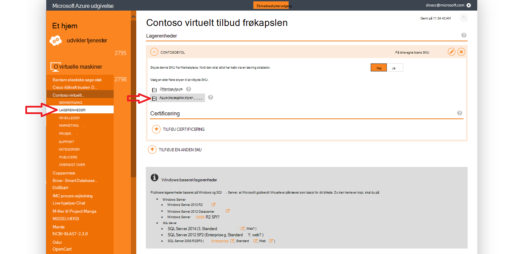
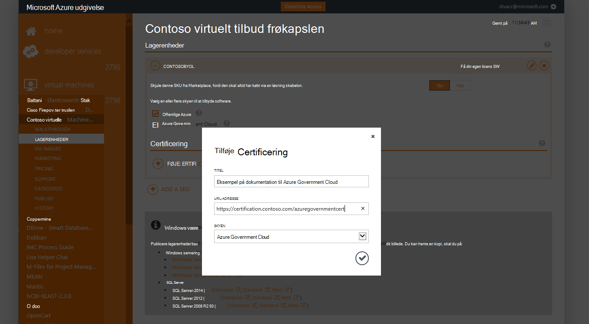
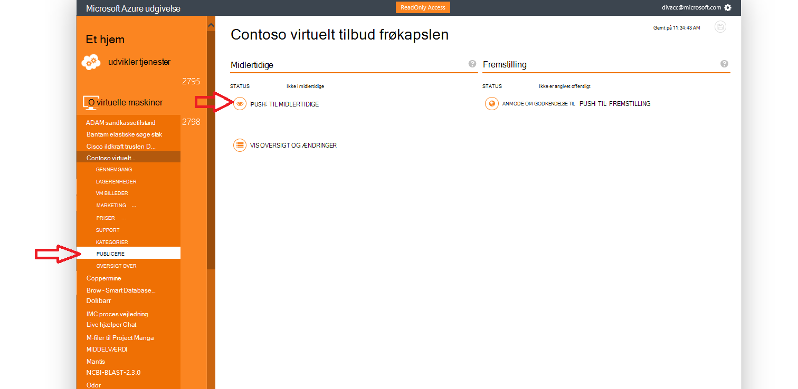
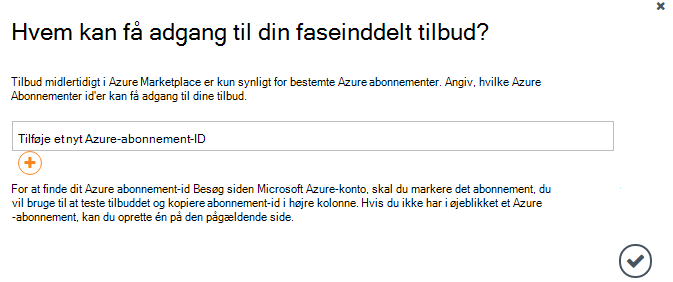
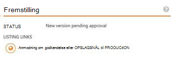

<properties
            pageTitle="Azure Government dokumentation | Microsoft Azure"
            description="Dette indeholder en sammenligning af funktioner og vejledning om udviklingsprogrammer til Azure Government."
            services="Azure-Government"
            cloud="gov"
            documentationCenter=""
            authors="tsingh"
            manager="asimm"
            editor=""/>
 
<tags    ms.service="multiple"
            ms.devlang="na"
            ms.topic="article"
            ms.tgt_pltfrm="na"
            ms.workload="azure-government"
            ms.date="10/20/2016"
            ms.author="zakramer;tsingh;divacc"/> 

# Azure Government Marketplace
Find nedenstående oplysninger for de partnere, der er interesseret i at publicere dine tilbud til Azure Marketplace for Government.

## Publicering
>[AZURE.NOTE] Hvis du ikke er en eksisterende Azure Marketplace certificeret partner, Fuldfør trinnene [her](../marketplace-publishing/marketplace-publishing-getting-started.md) , før du fortsætter.

### Trin 1  
Log på [https://publish.windowsazure.com](https://publish.windowsazure.com)

### Trin 2
Klik på de tilbud, du vil publicere

### Trin 3
Klik på **Lagerenheder** , og klik på feltet Azure Government Cloud

>[AZURE.NOTE] Kun flytte din egen licens (BYOL) lagerenheder understøttes.  Denne indstilling er ikke tilgængelig for Pay-as-You-Go (PayG) lagerenheder.

### Trin 4
Klik på + Tilføj certificering link til at tilføje links til en hvilken som helst certificering for dit tilbud.

### Trin 5
Anmodning om en prøveversion konto i Microsoft Azure Government cloud til giver dig mulighed at teste dit billede i portalen publicering: [https://azuregov.microsoft.com/trial/azuregovtrial](https://azuregov.microsoft.com/trial/azuregovtrial)

Dit berettigelse som en partner, der fungerer US national, stat, lokale eller tribal objekter er godkendt, og der ydes en bekræftelse via mail.  Din prøvekonto vil være tilgængelige i er 3-5 arbejdsdage.

### Trin 6
Klik på Publicer og opslagsnål til midlertidige. 

Du bliver bedt om at angive et whitelisted-abonnement, der har adgang til den faseinddelt tilbyder. Angiv abonnement-ID fra netop hentede Azure Government prøveversion kontoen.

### Trin 7
Når tilbuddet er blevet midlertidigt, kan du teste dit billede ved at logge på [https://portal.azure.us](https://portal.azure.us) ved hjælp af kontoen Azure Government prøveversion.

### Trin 8
Når du har godkendt billedet bruge prøveabonnementet, kan du gøre tilbuddet tilgængelige live ved at klikke på Publicer og anmode om godkendelse til at gå til fremstilling. 

## Næste trin

Abonnere på [Microsoft Azure Government Blog](https://blogs.msdn.microsoft.com/azuregov/)supplerende oplysninger og opdateringer.
