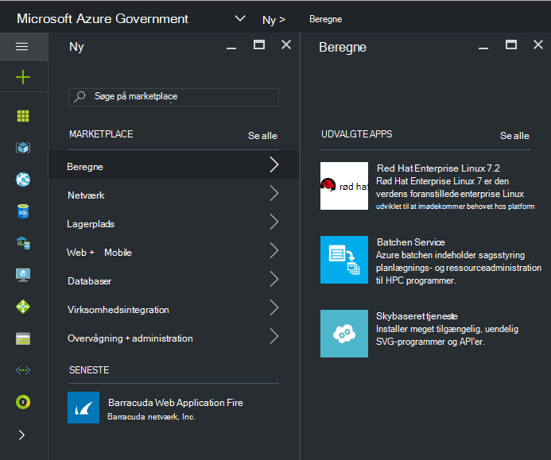

 <properties
    pageTitle="Azure Government dokumentation | Microsoft Azure"
    description="Dette indeholder en sammenligning af funktioner og vejledning om udviklingsprogrammer til Azure Government."
    services="Azure-Government"
    cloud="gov"
    documentationCenter=""
    authors="VybavaRamadoss"
    manager="asimm"
    editor=""/>

<tags   ms.service="multiple"
    ms.devlang="na"
    ms.topic="article"
    ms.tgt_pltfrm="na"
    ms.workload="azure-government"
    ms.date="10/20/2016"
    ms.author="zakramer;vybavar"/>

# Azure Marketplace for Government
Azure Marketplace er tilgængelige til Azure Government med en opdateret liste over billeder fra vores marketplace udgivere. 

## Variationer
Nedenfor er nogle overvejelser, når du bruger Azure Marketplace til Government:

- Kun flytte din egen licens (BYOL) billeder er tilgængelige. Du kan ikke få adgang til billeder, der kræver købstransaktion via Azure Marketplace
- Kun et undersæt af billeder er tilgængelig i øjeblikket i forhold til den offentlige marketplace. Du kan finde på listen over tilgængelige billeder [her](../azure-government-image-gallery.md) 
- Inden du klargør et billede, skal virksomhedens Administrator aktivere Marketplace køb for abonnementet Azure
  - Log på portalen som en virksomhedens Administrator
  - Gå til at *administrere*
  - Klik på blyantsikonet ud for elementet *Azure Marketplace* linje under *Tilmelding detaljer*
  - Skifte *Aktiveret/deaktiveret* efter behov
  - Klik på *Gem*

>[AZURE.NOTE] Hvis du er interesseret i at foretage se dine billeder, der er tilgængelige i Azure Government [partner onboarding retningslinjer](documentation-government-manage-marketplace-partners.md) for at få mere at vide.

### Trin 1
Starte Marketplace

  

### Trin 2
Gennemse forskellige produkter til at finde den rigtige.

Marketplace publisher indeholder en liste over certificering som en del af produktbeskrivelse kan hjælpe dig med at træffe det rette valg. 

### Trin 3
Vælg en product\image

### Trin 4
Start Opret strømmen, og Angiv de nødvendige parametre til installation

>[AZURE.NOTE] I rullemenuen placering er kun Azure Government placeringer synlige

### Trin 5
Overhold priser

### Trin 6
Udfør alle trin og klikke på Ok for at starte processen klargøring

## Næste trin

Abonnere på [Microsoft Azure Government Blog](https://blogs.msdn.microsoft.com/azuregov/)supplerende oplysninger og opdateringer.
