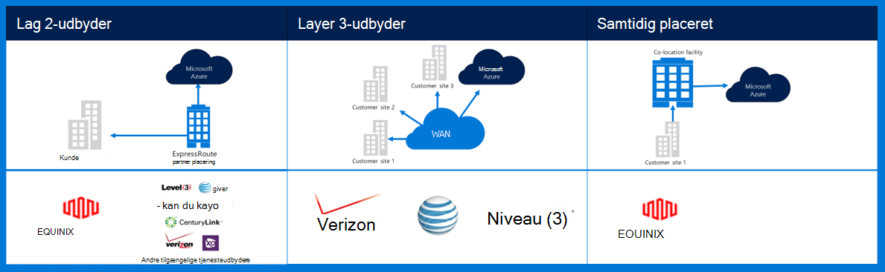
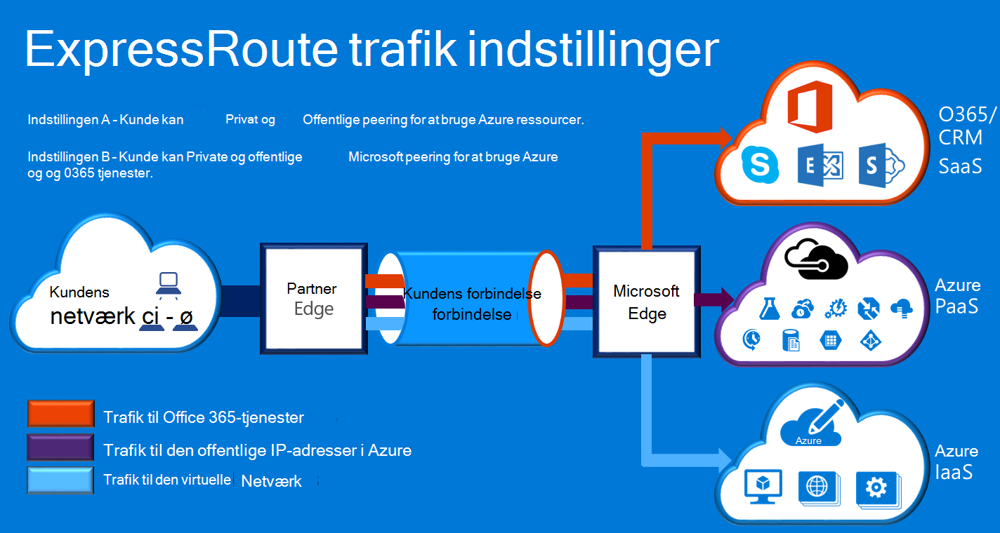

<properties
    pageTitle="Azure Governmenmt dokumentation | Microsoft Azure"
    description="Dette viser en sammenligning af funktioner og vejledning til private forbindelse til e Government"
    services="Azure-Government"
    cloud="gov" 
    documentationCenter=""
    authors="ryansoc"
    manager="zakramer"
    editor=""/>

<tags
    ms.service="multiple"
    ms.devlang="na"
    ms.topic="article"
    ms.tgt_pltfrm="na"
    ms.workload="azure-government"
    ms.date="09/28/2016"
    ms.author="ryansoc"/>

#  Azure Government netværk

##  ExpressRoute (Private Connectivity)

ExpressRoute er alment tilgængelig i Azure Government. Du kan finde yderligere oplysninger (herunder partnere og peering placeringer), <a href="https://azure.microsoft.com/en-us/documentation/services/expressroute/">ExpressRoute offentlige dokumentation </a>.

###  Variationer

ExpressRoute er alment tilgængelig (GA) i Azure Government. 

- Government kunder oprette forbindelse til en fysisk isolerede kapacitet via en dedikeret Azure Government (Gov) ExpressRoute (ER)-forbindelse

- Azure Gov sikrer øget tilgængelighed og holdbarhed ved at udnytte flere område par placeret mindst 500 bort fra hinanden 

- Som standard alle Azure Gov ER connectivity er konfigureret aktiv-aktiv overflødige med understøttelse af bursting og leverer op til 10 G kredsløb kapacitet (mindste er 50MB)

- Azure Gov ER placeringer give optimerede reaktionsveje (kortest hop, lav ventetid, høj ydeevne, osv.) til kunder og Azure Gov geografisk overflødige områder

- Azure Gov ER private forbindelsen ikke anvende, gennemgang eller er afhængige af internettet

- Azure Gov fysiske og logiske infrastruktur er fysisk dedikeret og adskilt, og adgang er begrænset til personer, USA

- Microsoft ejer og fungerer alle fiber infrastruktur mellem Azure Gov områder og Azure Gov ER opfylder-mig placeringer

- Azure Gov ER har forbindelse til Microsoft Azure, O365 og CRM skytjenester

### Overvejelser i forbindelse med

Der er to grundlæggende tjenester, som giver privat netværksforbindelse til Azure Government: VPN (-til-websted til en typisk organisation) og ExpressRoute.

Azure ExpressRoute bruges til at oprette private forbindelser mellem Azure Government datacentre og infrastrukturen lokalt eller i et outsourcing miljø. ExpressRoute forbindelser går ikke via offentlige internettet – de tilbyder flere pålidelighed, hurtigere hastigheder og nederste latenstider end typisk internetforbindelser. Brug af ExpressRoute forbindelser til at overføre data mellem på lokale systemer og Azure afkastet betydeligt omkostninger fordele i nogle tilfælde.   

Med ExpressRoute, du opretter forbindelse til Azure på en ExpressRoute placering (som en Exchange-provider facilitet), eller du forbindelse direkte til Azure fra dit eksisterende WAN-netværk (f.eks en multiprotokol markere skifte (MPLS) VPN, fra et netværk-udbyderen).

    

For netværkstjenester til at understøtte Azure Government kundeprogrammer og løsninger, anbefales det, at der er implementeret ExpressRoute (private connectivity) for at oprette forbindelse til Azure Government. Hvis der bruges VPN-forbindelser, overvejes følgende:

- Kunder skal kontakte deres godkende officielle/kontoret til at afgøre, om private forbindelse eller andre sikker forbindelse ordning er påkrævet og identificere eventuelle yderligere begrænsninger skal du tænke på.

- Kunder skal beslutte, om du vil tillade, at websted VPN er distribueret via en privat connectivity zone.

- Kunder skal anskaffe et MPLS kredsløb eller VPN med en licenseret privat connectivity-udbyder.

Alle kunder, der anvender en privat connectivity arkitektur skal validere, at en passende implementering er opstilles og vedligeholdes for kunde forbindelsen til gatewayen netværk/internettet (GN / jeg) kant router afgrænsning punkt til Azure Government. På samme måde, din organisation skal oprette netværksforbindelse mellem et lokalt miljø og Gateway netværk/kunde (GN/C) kant router afgrænsning punkt til Azure Government.

## Næste trin

Til supplerende oplysninger og opdateringer skal du abonnere på den <a href="https://blogs.msdn.microsoft.com/azuregov/">Microsoft Azure Government Blog.</a>
