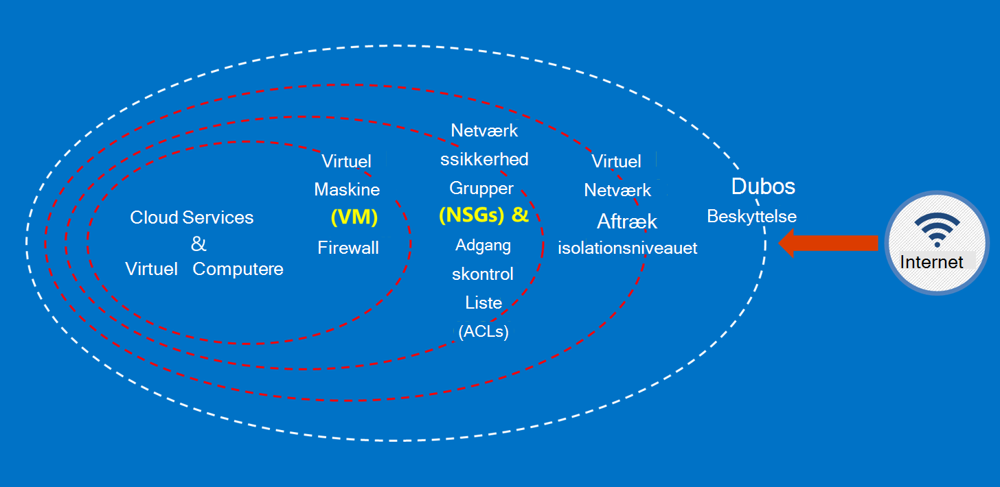

<properties
    pageTitle="Azure Government dokumentation | Microsoft Azure"
    description="Dette giver en sammenligning af funktioner og vejledning om udvikling af programmer til Azure Government"
    services="Azure-Government"
    cloud="gov" 
    documentationCenter=""
    authors="ryansoc"
    manager="zakramer"
    editor=""/>

<tags
    ms.service="multiple"
    ms.devlang="na"
    ms.topic="article"
    ms.tgt_pltfrm="na"
    ms.workload="azure-government"
    ms.date="08/25/2016"
    ms.author="ryansoc"/>

#  Oversigt over Azure Government dokumentation

##  Introduktion til Azure Government dokumentation

Dette websted beskriver funktionerne i [Microsoft Azure Government](https://azure.microsoft.com/features/gov/) tjenester og giver generelle retningslinjer gælder for alle kunder. Før herunder specifikt organiseret data i dit Azure Government abonnement, skal du lære at kende Azure Government funktionerne og se din account Manager, hvis du har spørgsmål.

Du skal referere til [Microsoft Azure Hav tillid til Center overholdelse siden](http://www.microsoft.com/en-us/TrustCenter/Compliance/default.aspx) aktuelle oplysninger om tjenesterne Azure Government dækket bestemte godkendelser og bestemmelser. Yderligere Microsoft-tjenester kan også være tilgængelige, men er ikke omfattet af Azure Government dækket tjenesterne og behandles ikke af dette dokument. Azure Government services kan også give dig at bruge en lang række yderligere ressourcer, programmer eller tjenester, der leveres af tredjeparter – eller Microsoft under separat vilkår for anvendelse og beskyttelse af personlige oplysninger politikker, som ikke er medtaget i omfanget af dette dokument. Du er ansvarlig for gennemlæst betingelserne for alle disse "tilføjelsesprogrammet" tilbud, som Marketplace tilbud, til at sikre, at de opfylder dine behov om overholdelse af angivne standarder.

Azure Government er tilgængelig for enheder, der håndterer data, som er underlagt visse government lovgivning og krav (som NIST 800.171 (DIB), ITAR, IRS 1075, DoD L4 og CJIS), hvor brug af Azure Government der kræves for at overholde regler. Azure Government kunder er underlagt validering af berettigelse.

Objekter med spørgsmål om berettigelse til Azure Government bør kontakte deres account Manager.

##  Principper for sikring af kundedata i Azure Government

Azure Government tilbyder en række funktioner og tjenester, du kan bruge til at opbygge skyen løsninger at opfylde dine behov omfattet/kontrolleres data. En kompatibel kundeløsning er ikke noget mere end en effektiv gennemførelse af out box Azure Government funktioner, forbundet til en vane at dækkende data sikkerhed.
Når du er vært for en løsning i Azure Government, håndterer Microsoft mange af disse krav på niveauet for skyen infrastruktur.

I følgende diagram vises Azure forsvarslinjer i dybde-modellen. Microsoft yder eksempelvis grundlæggende skyinfrastruktur DDOS, sammen med kunde-funktioner som sikkerhedsfunktioner for kundespecifikt program DDOS skal.

Denne side beskrives de fundamentale principper til sikring af dine tjenester og programmer, giver vejledning og bedste fremgangsmåder til, hvordan du anvende disse principper Det vil sige, hvordan kunder bør gøre smart brug af Azure Government til at opfylde forpligtelser og ansvarsområder, der kræves til en løsning, der håndterer ITAR oplysninger.

Overordnet principper til sikring af kundedata er:
* Beskytte data ved hjælp af kryptering
* Administrere hemmeligheder
* Isolationsniveauet til at begrænse adgang til data

##  Beskyttelse af kundedata ved hjælp af kryptering

Mindske risikoen og møde lovmæssige forpligtelser kører bil stigende fokus og vigtigheden af kryptering af data. Bruge en effektiv kryptering implementering til at forbedre aktuelle netværk og programmet sikkerhedsforanstaltninger – og formindske den samlede risiko i dit miljø til skyen.

### Kryptering på resten
Kryptering af data på resten gælder for beskyttelse af kunde indhold, der ligger i lagerplads på disken. Der er flere måder at dette sker:

### Lagerplads Service kryptering

Azure-lager Service kryptering er aktiveret på konto lagerpladsen, hvilket resulterer i Bloker BLOB og siden BLOB som krypteres automatisk, når skrevet til Azure-lager. Når du læser data fra Azure-lager, dekrypteres af tjenesten lagerplads før den returneres. Brug dette til at sikre dine data uden at ændre eller tilføje kode i alle programmer.

### Azure Disk kryptering
Bruge Azure Disk kryptering til at kryptere den OS og data diske bruges ved en Azure Virtual Machine. Integration med Azure-tasten samling giver dig kontrol og hjælper med at du administrerer disk kryptering taster.

### Klientsiden kryptering
Klientsiden kryptering er indbygget i Java og .NET lagerplads klientbiblioteker, som kan udnytte Azure-tasten samling API'er, hvilket gør det nemt at implementere. Brug Azure-tasten samling til at få adgang til hemmeligheder i Azure-tasten samling til bestemte personer ved hjælp af Azure Active Directory.

### Kryptering undervejs

Den grundlæggende kryptering tilgængelig for forbindelse til Azure Government understøtter Transport niveau sikkerhed (TLS) 1.2-protokollen og x.509-certifikater. Forbundsrepublikken oplysninger behandling af FIPS (Standard) 140-2 niveau 1 cryptographic algoritmer bruges også til infrastruktur netværksforbindelser mellem Azure Government datacentre.  Windows Server 2012 R2 og Windows 8-plus FOS og Azure filshares kan bruge små og mellemstore virksomheder 3.0 til kryptering mellem VM og filsharet. Bruge klientsiden kryptering til at kryptere dataene, inden de overføres til lageret i en klientprogrammet, og du kan dekryptere dataene efter det overføres tør for lagerplads.

### Bedste fremgangsmåder til kryptering

* IaaS FOS: Bruge Azure Disk kryptering. Slå lagerplads Service kryptering til at kryptere de Virtuelle filer, der bruges til at sikkerhedskopiere disketterne i Azure-lager, men dette krypterer kun nyligt skrevne data. Det betyder, at hvis du opretter en VM og derefter aktivere lagerplads Service kryptering på kontoen lagerplads, der indeholder filen Virtuelle, kun ændringerne, krypteres, ikke den oprindelige Virtuelle fil.
* Klientsiden kryptering: Dette er den mest sikre metode til at kryptere dine data, fordi den krypterer før overførsel og krypterer data på resten. Det kræver dog, at du føjer kode til programmerne ved hjælp af lagerplads, som du ikke måske gøre. I disse tilfælde kan du bruge HTTPs til dine data i overførsel og lagerplads Service kryptering til at kryptere dataene på resten. Klientsiden kryptering også flere belastning på klienten – du har konto til denne i dine planer, skalerbarhed, især hvis du kryptering og overførsel af en stor mængde data.

Du kan finde flere oplysninger om krypteringsindstillinger i Azure [Lagerplads Security Guide](/storage-security-guide).

##  Beskyttelse af kundedata ved at administrere hemmeligheder

Sikker key management er vigtigt for beskyttelse af data i skyen. Kunder skal bestræbe dig på at forenkle key management og stadig har kontrollen over nøgler, der bruges af skyen programmer og tjenester til at kryptere data.

### Bedste fremgangsmåder for administration af hemmeligheder

* Brug tasten samling af legitimationsoplysninger til at minimere risikoen for at få vist via faste konfigurationsfiler, scripts, eller i kildekode hemmeligheder. Azure-tasten samling krypterer nøgler (såsom kryptering taster til Azure Disk kryptering) og hemmeligheder (såsom adgangskoder), ved at gemme dem i FIPS 140-2 niveau 2 valideret hardware sikkerhed moduler (HSMs). Du kan importere eller oprette nøgler i disse HSMs for større sikkerhed.
* Programkode og skabeloner bør kun indeholde URI referencer til hemmeligheder (hvilket betyder, at de faktiske hemmeligheder ikke er i kode, konfiguration eller kildekode typer lagre). Dette forhindrer vigtige phishing-angreb på interne og eksterne repos som høst-BOT'er i GitHub.
* Anvende stærke RBAC objekter inden for nøgle samling. Hvis der er tillid til operatoren forlader virksomheden eller overførsler til en ny gruppe i organisationen, skal de forhindres i at få adgang til hemmeligheder.  

Yderligere oplysninger finder du [Nøgle samling til Azure Government](/azure-government/azure-government-tech-keyvault)

##  Isolationsniveauet til at begrænse adgang til Data

Isolationsniveauet handler om brug af grænser, segmentering og beholdere til at begrænse adgang til data til kun godkendte brugere, tjenester og -programmer. Adskillelsen mellem lejere er for eksempel en væsentlige sikkerhed metode til multiprofiler skyen platforme som Microsoft Azure. Logiske isolationsniveauet hjælper med at forhindre, at én lejer forstyrrer datahandlinger af enhver anden lejer.

### Miljø isolationsniveauet
Azure Government miljøet er en fysisk forekomst, der er adskilt fra resten af Microsofts netværk. Dette opnås gennem en række fysiske og logiske kontrolelementer, der omfatter følgende: sikring af de fysiske grænser ved hjælp af Biometriske enheder og kameraer.  Brug af bestemte legitimationsoplysninger og multifaktor-godkendelse af Microsoft medarbejdere, der kræver logiske adgang til produktionsmiljøet.  Alle service infrastruktur til Azure Government er placeret i USA.

#### Hver kunde isolationsniveauet
Azure implementerer netværksadgangskontrol og opdeling gennem VLAN isolationsniveauet, ACLs, indlæse balancere og IP-filtre

Kunder kan yderligere isolere deres ressourcer på tværs af abonnementer, grupper, virtuelle netværk og undernet.

Du kan finde flere oplysninger om isolationsniveauet i Microsoft Azure [isolationsniveauet sektion af Azure Security Guide](/azure-security-getting-started/#isolation).

Til supplerende oplysninger og opdateringer skal du abonnere på den <a href="https://blogs.msdn.microsoft.com/azuregov/">Microsoft Azure Government Blog.</a>
