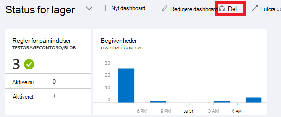
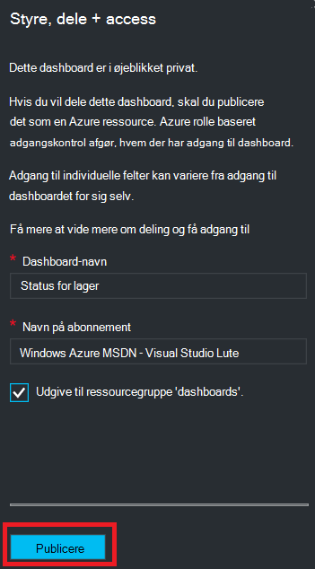
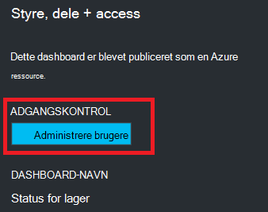
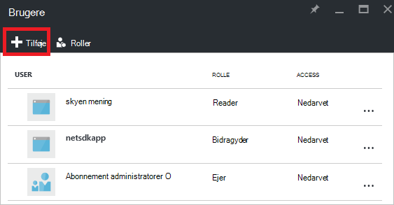
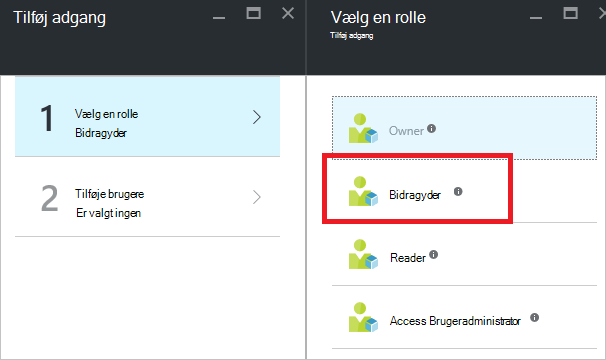
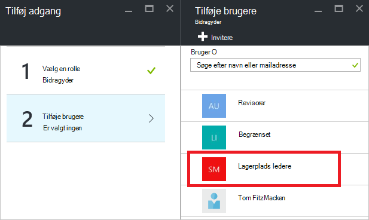
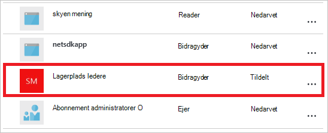

<properties
   pageTitle="Azure portalen dashboard access | Microsoft Azure"
   description="Denne artikel forklares, hvordan du kan dele adgang til et dashboard i portalen Azure."
   services="azure-portal"
   documentationCenter=""
   authors="tfitzmac"
   manager="timlt"
   editor="tysonn"/>

<tags
   ms.service="multiple"
   ms.devlang="NA"
   ms.topic="article"
   ms.tgt_pltfrm="NA"
   ms.workload="na"
   ms.date="08/01/2016"
   ms.author="tomfitz"/>

# Dele Azure dashboards

Når du har konfigureret et dashboard, kan du publicere den og dele den med andre brugere i organisationen. Du give andre adgang til dit dashboard ved hjælp af Azure [Rolle baseret adgangskontrol](../active-directory/role-based-access-control-configure.md). Du tildeler en bruger eller gruppe af brugere til en rolle, og rollen definerer om disse brugere kan se eller redigere den publicerede dashboard. 

Alle publicerede dashboards implementeres som Azure ressourcer, hvilket betyder, at de findes som håndterbare elementer i dit abonnement og er indeholdt i en ressourcegruppe.  Dashboards er ikke anderledes end andre ressourcer, som en virtuel maskine eller en lagerplads konto fra en access-kontrolelement perspektiv.

> [AZURE.TIP] Individuelle felter i dashboardet gennemtvinge krav til deres egne access baseret på de ressourcer, der vises.  Du kan derfor designe et dashboard, der deles bredt, mens du stadig beskytte dataene på individuelle felter.

## Forstå adgangskontrol til dashboards

Med rollebaseret adgangskontrol, kan du tildele brugere til roller på tre forskellige niveauer af omfang:

- abonnement
- ressourcegruppe
- ressource

Du tildeler tilladelser nedarves fra abonnement ned til ressourcen. Dashboardet publicerede er en ressource. Derfor kan du allerede har brugere, der er tildelt rollerne i abonnementet, som også fungerer for publicerede dashboard. 

Her er et eksempel.  Antag, at du har et abonnement til Azure og forskellige medlemmer af teamet har fået tildelt rollerne **ejer**, **bidragyder**eller **læser** for abonnementet. Brugere, der er ejere eller bidragydere er i stand til listen, få vist, oprette, redigere eller slette dashboards i abonnementet.  Brugere, der er læsere kan ikke kan liste og visning dashboards, men ændre eller slette dem.  Brugere med læseradgang er i stand til at foretage lokale ændringer i en publiceret dashboard (f.eks., når fejlfinding af et problem), men kan ikke til at publicere ændringerne på serveren.  De får mulighed for at gøre en privat kopi af dashboardet for sig selv

Men du kan også tildele tilladelser til ressourcegruppen, der indeholder flere dashboards eller til en enkelt dashboard. Du kan for eksempel beslutte, en gruppe af brugere bør har begrænsede tilladelser på tværs af det abonnement, men større adgang til et bestemt dashboard. Du kan tildele disse brugere til en rolle til pågældende dashboard. 

## Publicere dashboard

Antag, at du er færdig med at konfigurere et dashboard, du vil dele med en gruppe af brugere i dit abonnement. Nedenstående trin viser en brugerdefineret gruppe med navnet lagerplads administratorer, men du kan navngive din gruppe, hvad du vil have. Du kan finde oplysninger om at oprette en Active Directory-gruppe og føje brugere til den pågældende gruppe [administrere grupper i Azure Active Directory](../active-directory/active-directory-accessmanagement-manage-groups.md).

1. Vælg **del**i dashboard.

     

2. Før du tildeler adgang, skal du publicere dashboard. Som standard publiceres dashboard til en ressourcegruppe med navnet **dashboards**. Vælg **Publicer**.

     

Dit dashboard udgives nu. Hvis de tilladelser, der er overført fra abonnementet er egnet, behøver du ikke foretage dig noget mere. Andre brugere i din organisation vil kunne få adgang til og redigere dashboardet baseret på deres abonnement niveau rolle. Men i dette selvstudium, Lad os tildele en gruppe af brugere til en rolle til pågældende dashboard.

## Tildele adgang til et dashboard

1. Vælg **Administrer brugere**efter udgivelse dashboard.

     

2. Du får vist en liste over eksisterende brugere, der allerede er tildelt en rolle til dette dashboard. Listen over eksisterende brugere kan være forskellig fra billedet nedenfor. Højst sandsynligt nedarves tildelingerne fra abonnementet. Hvis du vil tilføje en ny bruger eller gruppe, skal du vælge **Føj**.

     

3. Vælg den rolle, der repræsenterer de tilladelser, du vil tildele. I dette eksempel skal du vælge **bidragyder**.

     

4. Vælg den bruger eller gruppe, du vil tildele rolle. Hvis du ikke kan se den bruger eller gruppe, du leder efter, på listen, kan du bruge søgefeltet. Listen over tilgængelige grupper, afhænger af de grupper, du har oprettet i din Active Directory.

      

5. Når du er færdig med at tilføje brugere eller grupper, skal du vælge **OK**. 

6. Den nye tildeling er føjet til listen over brugere. Bemærk, at **Access** er angivet som **tildelt** i stedet for **nedarvet**.

     

## Næste trin

- Se en liste over roller, [RBAC: indbyggede roller](../active-directory/role-based-access-built-in-roles.md).
- Se [administrere Azure ressourcer via portal](resource-group-portal.md)for at få mere for at vide om administration af ressourcer.