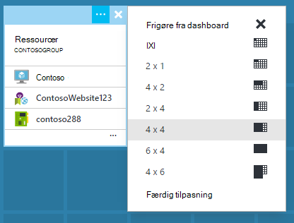

<properties
   pageTitle="Azure portalen dashboards | Microsoft Azure"
   description="I denne artikel beskrives det, hvordan du kan oprette og redigere dashboards i portalen Azure."
   services="azure-portal"
   documentationCenter=""
   authors="sewatson"
   manager="timlt"
   editor="tysonn"/>

<tags
   ms.service="multiple"
   ms.devlang="NA"
   ms.topic="article"
   ms.tgt_pltfrm="NA"
   ms.workload="na"
   ms.date="09/06/2016"
   ms.author="sewatson"/>

# Oprette og dele dashboards i portalen Azure

Du kan oprette flere dashboards og dele dem med andre, der har adgang til dine Azure abonnementer.  Dette indlæg gennemgår de grundlæggende regler for oprettelse af/redigering, publicere og administration af adgang til dashboards.

## Tilpasse dashboards kontra blade

Siden Start dashboards nogle måneder siden, er der oprettet en stabil fald i blade tilpasninger og en hurtig stigning i dashboard tilpasninger. Denne stærke brugen tendens viser, at du foretrækker tilpasse dashboards over blade. For at understøtte denne tendens skal fjerne vi muligheden for at tilpasse blade og allokeres vores indsats for at forbedre dashboard funktionalitet. Hvis du har tilpasset et blade, fjernes tilpasningerne snart. Hvis du vil bevare tilpasningen, du fastgøre de brugerdefinerede felter på et dashboard. Blot højreklikke på feltet, og vælg **Fastgør til dashboard** , som vist på følgende billede.

## Oprette et dashboard

Vælg knappen **nyt dashboard** ud for navnet på den aktuelle dashboard for at oprette et dashboard.  

Denne handling opretter en ny, tom, private dashboard og giver dig til tilpasning af tilstand, hvor du kan navngive dit dashboard og tilføje eller omarrangere felter.  I denne tilstand overtager galleriet kan skjules felt navigationsmenuen til venstre.  Galleriet felt mulighed for at beregne felter til Azure ressourcerne i forskellige måder: Du kan søge efter [ressourcegruppe](../azure-resource-manager/resource-group-overview.md#resource-groups), efter ressourcetype, efter [mærke](../resource-group-using-tags.md)eller ved at søge efter din ressource ved navn.  

Tilføje felter ved at trække og slippe dem til overfladen dashboard, hvor du vil.

Der er en ny kategori, kaldes **Generelt** felter, der ikke er knyttet til en bestemt ressource.  I dette eksempel skal Fastgør vi feltet tabsbeløb.  Du kan bruge dette felt til at tilføje brugerdefineret indhold til dit dashboard.  Feltet understøtter almindelig tekst, [tabsbeløb syntaksen](https://daringfireball.net/projects/markdown/syntax)og et begrænset antal HTML.  (Sikkerhed, kan du gøre ting som Indsæt `<script>` koder, eller brug visse udseende element af CSS, der kan forstyrre på portalen.) 

## Redigere et dashboard

Når du har oprettet dit dashboard, kan du fastgøre felter fra galleriet felt eller den flise repræsentation af blade. Lad os fastgøre repræsentation af vores ressourcegruppe. Du kan enten pinkode, når du gennemser elementet eller fra bladet ressource gruppe. Begge tilgange resulterer i Fastgør felt repræsentation af ressourcegruppen.

Når du Fastgør elementet, vises det på dit dashboard.

Nu hvor vi har et tabsbeløb felt og en ressourcegruppe fastgjort til dashboard, kan vi ændre størrelsen på og omarrangere felterne i et passende layout.

Du kan se alle de kontekstafhængige kommandoer for dette felt ved at holde musen og vælge "..." eller højreklikker på et felt. Som standard er der to elementer:

1. **Frigør fra dashboard** – fjerner feltet fra dashboardet
2.  **Tilpas** – indsætter Tilpas tilstand

Ved at vælge Tilpas, kan du ændre størrelsen på og ændrer rækkefølgen af felter. Hvis du vil ændre størrelsen på et felt, Vælg den nye størrelse i genvejsmenuen som vist på følgende billede.

Eller hvis feltet understøtter alle størrelser, kan du trække det nederste højre hjørne til den ønskede størrelse.

Få vist dashboardet efter ændring af størrelsen på felter.

Når du er færdig med at tilpasse et dashboard, skal du blot markere de **færdig tilpasning** at afslutte Tilpas tilstand eller højreklikke og vælge **færdig tilpasse** i kontekstmenuen.

## Publicere et dashboard og administrere adgangskontrol

Når du opretter et dashboard, er det private som standard, hvilket betyder, at du er den eneste, der kan se den.  For at gøre det ses af andre, skal du bruge knappen **del** , der vises sammen med de andre dashboard-kommandoer.

Du bliver bedt om at vælge et abonnement og ressourcegruppe til dit dashboard til udgivelse. Hvis du vil integrere problemfrit dashboards i økosystemet, har vi implementeret delte dashboards som Azure ressourcer (så du kan dele ved at skrive en mailadresse).  Adgang til de oplysninger, der vises af de fleste af felter i portalen er underlagt [Azure rolle baseret adgangskontrol](../active-directory/role-based-access-control-configure.md ). Delte dashboards er ikke anderledes end en virtuel computer eller en lagerplads konto fra en access-kontrolelement perspektiv.  

Antag, at du har et Azure abonnement og medlemmer af teamet har fået tildelt rollerne **ejer**, **bidragyder**eller **læser** af abonnementet.  Brugere, der er ejere eller bidragydere er i stand til listen, få vist, oprette, redigere eller slette dashboards i dette abonnement.  Brugere, der er læsere kan ikke kan liste og visning dashboards, men ændre eller slette dem.  Brugere med læseradgang er i stand til at foretage lokale ændringer i en delt dashboard, men kan ikke til at publicere ændringerne på serveren.  De kan dog foretage en privat kopi af dashboardet til deres egen brug.  Som altid gennemtvinge individuelle felter på dashboardet til deres egne adgangsregler for kontrolelementet, der er baseret på de ressourcer, som de svarer til.  

Fordel hjælper på portalen publicering oplevelse dig med et mønster sted, hvor du placerer dashboards i en ressourcegruppe med navnet **dashboards**.  

Du kan også vælge at publicere et dashboard til en bestemt ressourcegruppe.  Adgangskontrol til pågældende dashboard svarer til adgangskontrol for ressourcegruppen.  Brugere, der kan administrere ressourcerne i denne ressourcegruppe også have adgang til de pågældende dashboards.

Efter dit dashboard er blevet publiceret, vil ruden **Deling + access** kontrolelement opdatering og få vist oplysninger om publicerede dashboard, inklusive et link for at administrere brugeradgang til dashboard.  Dette link åbner standard rolle baseret adgangskontrol bladet bruges til at administrere adgang for en hvilken som helst Azure ressource.  Du kan altid vende tilbage til denne visning ved at vælge **dele**.

## Næste trin

- For at administrere ressourcer skal du se [administrere Azure ressourcer via portal](resource-group-portal.md).
- Hvis du vil installere ressourcer, se [Implementer ressourcer til Ressourcestyring skabeloner og Azure-portalen](../resource-group-template-deploy-portal.md).