<properties 
    pageTitle="Bruge Azure portal til at administrere Azure ressourcer | Microsoft Azure" 
    description="Bruge Azure portal og Azure ressource administrere til at administrere dine ressourcer. Viser, hvordan du arbejder med dashboards til at overvåge ressourcer." 
    services="azure-resource-manager,azure-portal" 
    documentationCenter="" 
    authors="tfitzmac" 
    manager="timlt" 
    editor="tysonn"/>

<tags 
    ms.service="azure-resource-manager" 
    ms.workload="multiple" 
    ms.tgt_pltfrm="na" 
    ms.devlang="na" 
    ms.topic="article" 
    ms.date="09/12/2016" 
    ms.author="tomfitz"/>

# Administrere Azure ressourcer via portal

> [AZURE.SELECTOR]
- [Azure PowerShell](../powershell-azure-resource-manager.md)
- [Azure CLI](../xplat-cli-azure-resource-manager.md)
- [Portal](resource-group-portal.md) 
- [REST-API](../resource-manager-rest-api.md)

Dette emne viser, hvordan du bruger [Azure-portalen](https://portal.azure.com) med [Azure ressourcestyring](../azure-resource-manager/resource-group-overview.md) til at administrere dine Azure ressourcer. Se [Implementer ressourcer til Ressourcestyring skabeloner og Azure portal](../resource-group-template-deploy-portal.md)for at få mere for at vide om installation af ressourcer via portalen.

På nuværende tidspunkt understøtter ikke hver tjeneste portal eller Ressourcestyring. I disse tjenester skal du bruge [Klassisk portal](https://manage.windowsazure.com). Du kan finde status for hver tjeneste, [Azure portalen tilgængelighed diagram](https://azure.microsoft.com/features/azure-portal/availability/).

## Administrere grupper

1. Vælg **grupper**for at få vist alle ressourcegrupperne i dit abonnement.

    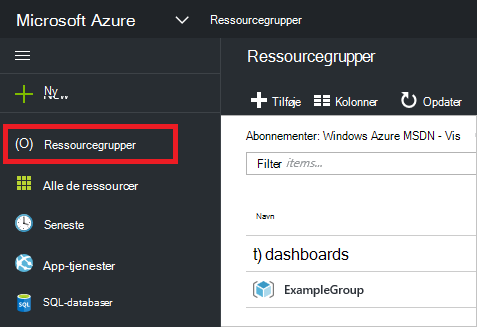

1. Hvis du vil oprette en tom ressourcegruppe, skal du vælge **Tilføj**.

    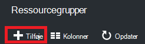

1. Angiv et navn og placering til den nye ressourcegruppe. Vælg **Opret**.

    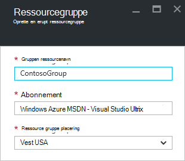

1. Du skal muligvis vælge **Opdater** for at se de senest oprettede ressourcegruppe.

    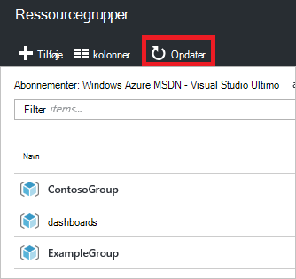

1. Hvis du vil tilpasse de oplysninger, der vises for dine grupper, Vælg **kolonner**.

    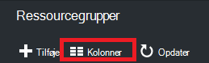

1. Vælg kolonner for at tilføje, og vælg derefter **Update**.

    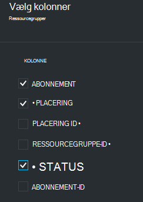

1. Se [Implementer ressourcer til Ressourcestyring skabeloner og Azure portal](../resource-group-template-deploy-portal.md)for at få mere for at vide om installation af ressourcer til din nye ressourcegruppe.

1. Giver hurtig adgang til en ressourcegruppe, kan du fastgøre bladet til dit dashboard.

    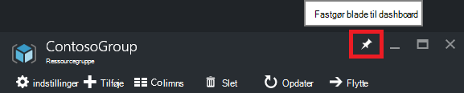

1. Dashboard viser ressourcegruppen og dens ressourcer. Du kan vælge enten ressourcegrupperne eller en af dens ressourcer til at navigere til elementet.

    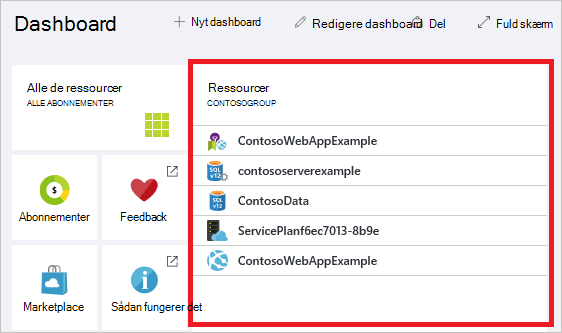

## Mærke ressourcer

Du kan anvende mærker til grupper og ressourcer til at organisere dine aktiver logisk. Du kan finde oplysninger om at arbejde med mærker [ved hjælp af mærker til at organisere dine Azure ressourcer](../resource-group-using-tags.md).

[AZURE.INCLUDE [resource-manager-tag-resource](../../includes/resource-manager-tag-resources.md)]

## Overvåge ressourcer

Når du vælger en ressource, præsenteres bladet ressource standard grafer og tabeller til overvågning, ressourcetype.

1. Vælg en ressource, og Bemærk sektionen **overvågning** . Den indeholder diagrammer, der er relevante for ressourcetypen. Følgende billede viser standard overvågningsdata en lagerplads-konto.

    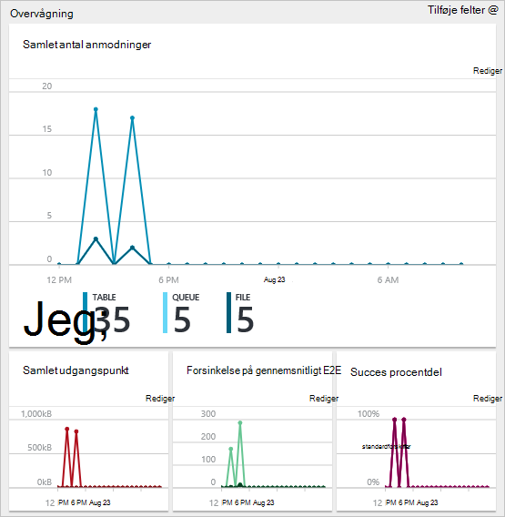

1. Du kan fastgøre en del af bladet til dit dashboard ved at vælge ellipsen (...) over afsnittet. Du kan også tilpasse størrelsen i afsnittet i bladet eller fjerne den helt. Følgende billede viser, hvordan du fastgøre, tilpasse eller fjerne sektionen CPU og hukommelse.

    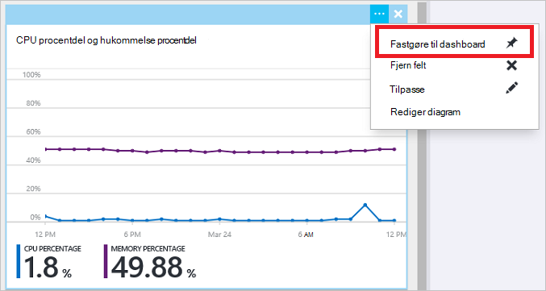

1. Når du Fastgør sektionen til dashboard, vil du se oversigten på dashboardet. Og vælge det med det samme tager dig til flere oplysninger om dataene.

    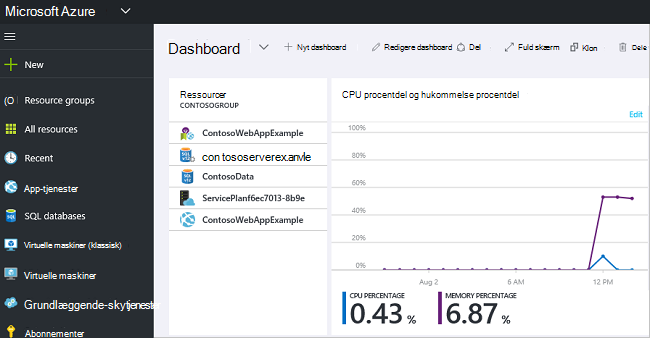

1. Gå til dit standarddashboard for at helt for at tilpasse de data, du overvåge via portalen, og vælg **nyt dashboard**.

    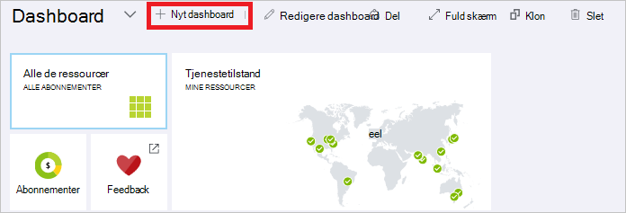

1. Giv din nye dashboard på et navn, og træk felter til dashboard. Felterne er filtreret efter forskellige indstillinger.

    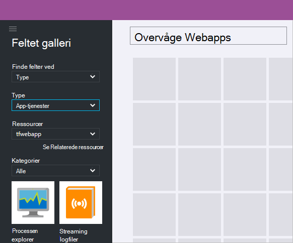

     Se [oprette og dele dashboards i Azure-portalen](azure-portal-dashboards.md)for at få mere for at vide om at arbejde med dashboards.

## Administrere ressourcer

I bladet for en ressource, kan du se indstillinger for administration af ressourcen. På portalen viser indstillinger for filstyring for bestemt ressourcetypen. Du kan se kommandoerne management langs øverst del af bladet ressource og i venstre side.

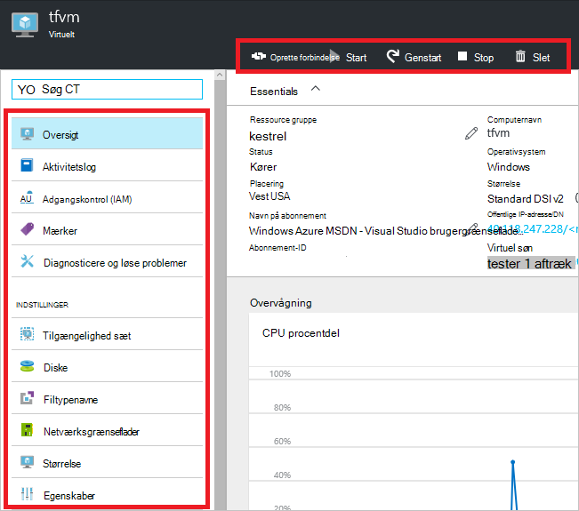

Du kan udføre handlinger som starte og stoppe en virtuel maskine eller omkonfigurere egenskaberne for den virtuelle maskine fra disse indstillinger.

## Flytte ressourcer

Hvis du vil flytte ressourcer til en anden ressourcegruppe eller et andet abonnement skal du se [flytte ressourcer til ny ressourcegruppe eller et andet abonnement](../resource-group-move-resources.md).

## Lås ressourcer

Du kan låse et abonnement, ressourcegruppe eller ressource for at forhindre andre brugere i organisationen fra kommer til at slette eller ændre kritiske ressourcer. Du kan finde yderligere oplysninger finder [Lås ressourcer med Azure ressourcestyring](../resource-group-lock-resources.md).

[AZURE.INCLUDE [resource-manager-lock-resources](../../includes/resource-manager-lock-resources.md)]

## Få vist dit abonnement og omkostninger

Du kan få vist oplysninger om dit abonnement og de akkumulerede omkostninger for alle dine ressourcer. Vælg **abonnementer** og det abonnement, du vil have vist. Du kan kun har et abonnement på Vælg.

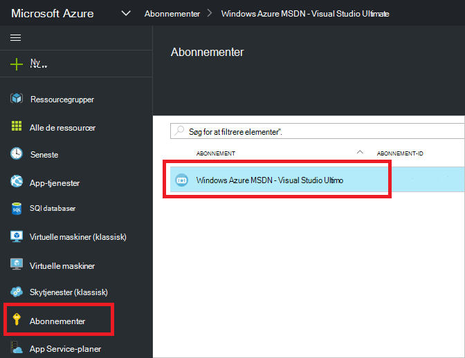

Du kan se en Brænd sats i bladet abonnement.

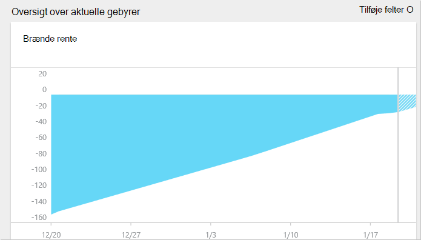

Og en oversigt over omkostninger ved ressourcetype.

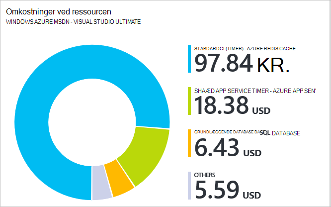

## Eksport skabelon

Når du konfigurerer din ressourcegruppe, kan du vil have vist skabelonen Ressourcestyring for ressourcegruppen. Eksportere skabelonen, der indeholder to fordele:

1. Du kan nemt automatisere fremtidige installationer af løsningen, fordi skabelonen, der indeholder alle komplet infrastruktur.

2. Du kan blive fortrolig med skabelon syntaksen ved at kigge på JavaScript Object Notation (JSON), der repræsenterer din løsning.

Du kan finde en trinvis vejledning, [eksportere Azure ressourcestyring skabelon ud fra eksisterende ressourcer](../resource-manager-export-template.md).

## Slette ressourcegruppe eller ressourcer

Hvis du sletter en ressourcegruppe, slettes alle de ressourcer, der er indeholdt i den. Du kan også slette enkelte ressourcer i en ressourcegruppe. Du vil forsigtig, når du sletter en ressourcegruppe, fordi der kan være ressourcer i andre ressourcegrupper, der er knyttet til den. Ressourcestyring slette ikke ressourcer, der er sammenkædet, men de kan måske ikke fungere uden de forventede ressourcer.

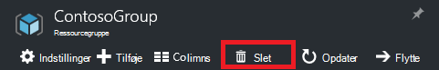

## Næste trin

- For at få vist overvågningslogge, se [overvåge forskellige handlinger med ressourcestyring](../resource-group-audit.md).
- Fejlfinde installation fejl, skal du se [fejlfinding ressource gruppe-installationer med Azure-portalen](../resource-manager-troubleshoot-deployments-portal.md).
- Hvis du vil installere ressourcer via portalen, se [Implementer ressourcer til Ressourcestyring skabeloner og Azure-portalen](../resource-group-template-deploy-portal.md).
- For at administrere adgang til ressourcer skal du se [Brug rolletildelinger til at administrere adgang til dine Azure abonnementsressourcer](../active-directory/role-based-access-control-configure.md).

