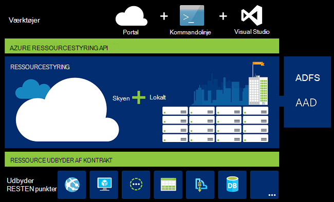

<properties
   pageTitle="Oversigt over Azure ressourcestyring | Microsoft Azure"
   description="Beskriver, hvordan du bruger Azure ressourcestyring til implementering, administration og få adgang til kontrol over ressourcer på Azure."
   services="azure-resource-manager"
   documentationCenter="na"
   authors="tfitzmac"
   manager="timlt"
   editor="tysonn"/>

<tags
   ms.service="azure-resource-manager"
   ms.devlang="na"
   ms.topic="get-started-article"
   ms.tgt_pltfrm="na"
   ms.workload="na"
   ms.date="10/21/2016"
   ms.author="tomfitz"/>

# Oversigt over Azure ressourcestyring

Infrastruktur for dit program består normalt af mange komponenter – måske en virtuel maskine, lagerplads-konto, og virtuelt netværk eller en WebApp, database, databaseserver og 3 part services. Du kan ikke se disse komponenter som separate enheder, i stedet for du kan se dem som relaterede og indbyrdes afhængige dele af et enkelt objekt. Du vil installere, administrere og overvåge dem som en gruppe. Azure ressourcestyring gør det muligt at arbejde med ressourcer i din løsning som en gruppe. Du kan installere, opdatere eller slette alle ressourcerne til din løsning i en enkelt, koordineret handling. Du bruger en skabelon til installation og denne skabelon kan arbejde for forskellige miljøer som test, midlertidige og fremstilling. Ressourcestyring giver sikkerhed, overvågning og mærkning funktioner for at hjælpe dig med at administrere dine ressourcer efter installation. 

## Terminologi

Hvis du ikke kender til Azure Ressourcestyring, er der nogle ord, du ikke muligvis at kende.

- **ressource** - en god element, der er tilgængelige via Azure. Nogle almindelige ressourcer er et virtuelt, lagerplads konto, online, database og virtuelt netværk, men der er mange flere.
- **ressourcegruppe** - en objektbeholder, der indeholder relaterede ressourcer for en Azure løsning. Ressourcegruppen kan indeholde alle ressourcerne til løsningen eller kun de ressourcer, som du vil administrere som en gruppe. Du beslutter, hvordan du vil tildele ressourcer til ressourcegrupper, der er baseret på hvad giver mest mening for din organisation. Se [ressourcegrupper](#resource-groups).
- **ressource udbyder** - en tjeneste, der leverer de ressourcer, du kan installere og administrere gennem ressourcestyring. Hver ressource-udbyder tilbyder handlinger til at arbejde med de ressourcer, der er installeret. Nogle almindelige ressource udbydere er Microsoft.Compute, som leverer virtuelt ressourcen, Microsoft.Storage, som leverer lagerplads konto ressourcen, og Microsoft.Web, som leverer ressourcer, der hører til online. Se [ressource udbydere](#resource-providers).
- **Ressourcestyring skabelon** - A JavaScript Object Notation (JSON)-fil, der definerer en eller flere ressourcer skal installeres til en ressourcegruppe. Den definerer også afhængigheder mellem de ressourcer, der er installeret. Skabelonen kan bruges til at installere ressourcerne, ensartet måde og flere gange. Se [installation af skabelon](#template-deployment).
- **syntaksen for deklarativ** - syntaks, kan du angive "Her er hvad jeg vil oprette" uden at skrive rækkefølgen af programmering kommandoer til at oprette den. Skabelonen ressourceleder, der er et eksempel på deklarativ syntaks. I fil definerer du egenskaberne for infrastruktur skal installeres til Azure. 

## Fordelene ved at bruge ressourcestyring

Ressourcestyring giver adskillige fordele:

- Du kan installere, administrere og overvåge alle ressourcerne for at finde din løsning som en gruppe i stedet for håndtering af disse ressourcer enkeltvis.
- Du kan gange installere din løsning i hele udviklingslivscyklus og har tillid til dine ressourcer er installeret på en konsistent tilstand.
- Du kan administrere infrastrukturen via deklarativ skabeloner i stedet for scripts.
- Du kan definere afhængigheder mellem ressourcer, så de er implementeret i den rigtige rækkefølge.
- Du kan anvende adgangskontrol på alle tjenester i dine ressourcegruppe, da rollebaseret adgangskontrol (RBAC) indbygget er integreret i management-platform.
- Du kan anvende mærker til ressourcer til logisk organisere alle ressourcerne i dit abonnement.
- Du kan få overblik over din organisations fakturering ved at få vist omkostninger for en gruppe af ressourcer dele samme mærke.  

Ressourceleder, der indeholder en ny måde at installere og administrere dine løsninger. Hvis du brugte den tidligere implementeringsmodel og ønsker at få mere at vide om ændringerne, kan du se [om ressourcestyring installation og klassisk installation](../resource-manager-deployment-model.md).

## Ensartet administration af lag

Ressourceleder, der indeholder et ensartet administration af lag til de opgaver, du foretager via Azure PowerShell, Azure CLI, Azure-portalen, REST-API og værktøjer til udvikling af. Alle værktøjerne Brug et almindelige sæt handlinger. Du kan bruge de værktøjer, der fungerer bedst for dig, og kan bruge dem i flæng uden forvirring. 

På følgende billede viser hvordan alle værktøjerne interagere med samme Azure ressourcestyring API. API sender anmodninger til tjenesten Ressourcestyring, som godkender og godkender af anmodninger. Ressourcestyring dirigerer derefter anmodningerne til udbyderne relevante ressource.

## Vejledning

Følgende forslag hjælpe dig med at få fuldt udbytte af Ressourcestyring, når du arbejder med dine løsninger.

1. Definere og anvende infrastrukturen gennem deklarativ syntaksen i ressourcestyring skabeloner i stedet for via vigtigt kommandoer.
2. Definere alle installation og konfiguration trin i skabelonen. Du skal have nogen manuelle trin til konfiguration af din løsning.
3. Køre vigtigt kommandoer til at administrere dine ressourcer, som skal starte eller stoppe en app eller en computer.
4. Arranger ressourcer med den samme livscyklus i en ressourcegruppe. Bruge mærker til alle andre organisering af ressourcer.

Du kan finde flere anbefalinger, [bedste fremgangsmåder til oprettelse af Azure ressourcestyring skabeloner](../resource-manager-template-best-practices.md).

## Ressourcegrupper

Der er nogle vigtige faktorer, du skal overveje, når du definerer din ressourcegruppe:

1. Alle ressourcerne i din gruppe skal dele den samme livscyklus. Du installerer, opdatere og slette dem sammen. Hvis en ressource, som en databaseserver, skal findes på en anden installation cyklus bør det i en anden ressourcegruppe.
2. Hver ressource kan kun findes i én ressourcegruppe.
3. Du kan tilføje eller fjerne en ressource til en ressourcegruppe når som helst.
4. Du kan flytte en ressource fra én ressourcegruppe til en anden gruppe. Du kan finde flere oplysninger, kan du se [flytte ressourcer til ny ressourcegruppe eller et andet abonnement](../resource-group-move-resources.md).
4. En ressourcegruppe kan indeholde ressourcer, der er placeret i forskellige områder.
5. En ressourcegruppe kan bruges til at begrænse adgang til kontrol af administrative handlinger.
6. En ressource kan arbejde med ressourcer i andre grupper. Denne interaktion er almindelige, når de to ressourcer er relaterede, men du kan ikke dele den samme livscyklus (for eksempel Onlines forbindelse til en database).

Når du opretter en ressourcegruppe, skal du angive en placering for ressourcegruppen. Du måske spekulerer du over, "Hvorfor en ressourcegruppe skal en placering? Og, hvis ressourcerne, der kan have forskellige steder end ressourcegruppen, hvorfor betyder ressource gruppe placering noget overhovedet?" Ressourcegruppen gemmer metadata om ressourcerne. Derfor, når du angiver en placering for ressourcegruppen, du angiver hvor pågældende metadata er gemt. Overholdelse af angivne standarder årsager skal du sikre dig, at dine data er gemt i et bestemt område.

## Udbydere af ressource

Hver ressource-udbyder tilbyder en række ressourcer og handlinger til at arbejde med en Azure service. Eksempelvis hvis du vil gemme nøgler og hemmeligheder, er du arbejde med provideren **Microsoft.KeyVault** ressource. Denne ressource-udbyder tilbyder en ressourcetype, kaldet **vaults** til at oprette den vigtige samling af legitimationsoplysninger og en ressourcetype, kaldet **vaults/hemmeligheder** til oprettelse af et hemmeligt i den vigtige samling af legitimationsoplysninger. 

Før du går i gang med installationen dine ressourcer, skal du få en forståelse af udbyderne af tilgængelige ressource. Viden om navnene på ressource udbydere og ressourcer, der hjælper dig med at definere ressourcer, du vil anvende til Azure.

Du kan hente alle ressource udbydere med følgende PowerShell-cmdlet:

    Get-AzureRmResourceProvider -ListAvailable

Eller med Azure CLI du hente alle ressource udbydere med følgende kommando:

    azure provider list

Du kan se gennem listen returnerede efter udbyderne ressource, som du vil bruge.

Føje navneområdet udbyder til din kommando for at få mere at vide om en ressource-udbyder. Kommandoen returnerer de understøttede ressourcetyper provideren ressource og understøttede placeringen af og API versioner for hver ressourcetype. Følgende PowerShell-cmdlet får mere at vide om Microsoft.Compute:

    (Get-AzureRmResourceProvider -ProviderNamespace Microsoft.Compute).ResourceTypes

Eller med Azure CLI du hente de understøttede ressourcetyper, placeringer og API versioner for Microsoft.Compute, med følgende kommando:

    azure provider show Microsoft.Compute --json > c:\Azure\compute.json

Se [ressourcestyring udbydere, områder, API versioner, og ved hjælp af skemaer](../resource-manager-supported-services.md)kan finde flere oplysninger.

## Installation af skabelon

Med Ressourcestyring, kan du oprette en skabelon (i JSON-format), der definerer til infrastruktur og konfiguration af din Azure løsning. Ved hjælp af en skabelon, kan du gentagne gange installere løsningen i hele dets livscyklus og har tillid til dine ressourcer er installeret på en konsistent tilstand. Når du opretter en løsning fra portalen, medtager løsningen automatisk en skabelon til distribution. Du behøver ikke at oprette din skabelon fra bunden, fordi du kan starte med skabelonen til din løsning og tilpasse den for at opfylde dine behov. Du kan hente en skabelon til en eksisterende ressourcegruppe ved enten at eksportere den aktuelle tilstand for ressourcegruppen, eller få vist den skabelon, der bruges til en bestemt installation. Få vist den [eksporterede skabelon](../resource-manager-export-template.md) er en praktisk metode til at få mere at vide om syntaksen skabelon.

Hvis du vil vide mere om formatet på skabelonen, og hvordan du opbygger, se [Redigering Azure ressourcestyring skabeloner](../resource-group-authoring-templates.md) og [Ressourcestyring skabelon gennemgang](../resource-manager-template-walkthrough.md).

Ressourcestyring behandler skabelonen som enhver anden anmodning (se billedet til [Administration af ensartet lag](#consistent-management-layer)). Den fortolker skabelonen og konverterer dens syntaks til REST-API handlinger for de relevante ressource udbydere. For eksempel når modtager ressourcestyring en skabelon med følgende ressource definition:

    "resources": [
      {
        "apiVersion": "2016-01-01",
        "type": "Microsoft.Storage/storageAccounts",
        "name": "mystorageaccount",
        "location": "westus",
        "sku": {
          "name": "Standard_LRS"
        },
        "kind": "Storage",
        "properties": {
        }
      }
      ]

Den konverterer definitionen til den efterfølgende REST-API-operation, som sendes til provideren Microsoft.Storage ressource:

    PUT
    https://management.azure.com/subscriptions/{subscriptionId}/resourceGroups/{resourceGroupName}/providers/Microsoft.Storage/storageAccounts/mystorageaccount?api-version=2016-01-01
    REQUEST BODY
    {
      "location": "westus",
      "properties": {
      }
      "sku": {
        "name": "Standard_LRS"
      },   
      "kind": "Storage"
    }

Hvordan du definerer skabeloner og ressourcegrupper er helt op til dig, og hvordan du vil administrere din løsning. Du kan for eksempel installere dit tre trin program gennem en enkelt skabelon til en enkelt ressourcegruppe.

Men du behøver ikke at definere din hele infrastruktur i en enkelt skabelon. Ofte, giver det mening at dividere dine krav til installation i et sæt målrettede, formål-specifikke skabeloner. Du kan nemt genbruge disse skabeloner til forskellige løsninger. Du skal installere en bestemt løsning, kan du oprette en masterside skabelon, der kæder alle de nødvendige skabeloner. Følgende billede viser, hvordan du kan installere en tre trin løsning ved hjælp af en overordnet skabelon, der indeholder tre indlejrede skabeloner.

Hvis du forestiller dig din niveauer, der har separate levetiden, kan du installere din tre niveauer for at adskille ressourcegrupper. Bemærk ressourcerne, der stadig være knyttet til ressourcer i andre grupper.

Se [mønstre for udformning af Azure ressourcestyring skabeloner](../best-practices-resource-manager-design-templates.md)for flere forslag om at designe dine skabeloner. Finde oplysninger om indlejrede skabeloner, [ved hjælp af sammenkædede skabeloner med Azure ressourcestyring](../resource-group-linked-templates.md).

Azure ressourcestyring analyserer afhængigheder for at sikre ressourcer, der er oprettet i den rigtige rækkefølge. Hvis en ressource er baseret på en værdi fra en anden ressource (som en virtuel maskine, der er brug for en lagerplads konto om en disk), kan du angive en afhængighed. Du kan finde flere oplysninger [definerende afhængigheder i Azure ressourcestyring skabeloner](../resource-group-define-dependencies.md).

Du kan også bruge skabelonen til opdateringer til infrastruktur. For eksempel kan du føje en ressource til din løsning og tilføje af konfigurationsregler for de ressourcer, der allerede er implementeret. Hvis skabelonen angiver oprettelse af en ressource, men som ressourcen findes allerede, udfører Azure ressourcestyring en opdatering i stedet for at oprette et nyt aktiv. Azure ressourcestyring opdaterer eksisterende aktiv til den samme tilstand, som det ville være som ny.  

Ressourceleder, der indeholder udvidelser til scenarier, når du har brug for flere handlinger som installation af særlig software, der ikke er inkluderet i konfigurationen. Hvis du allerede bruger en konfiguration management-tjenesten, som DTK, kok eller Puppet, kan du fortsætte med at arbejde med denne tjeneste ved hjælp af filtypenavne. Se oplysninger om virtuelt udvidelser, [om virtuelt extensions og funktioner](../virtual-machines/virtual-machines-windows-extensions-features.md). 

Til sidst skal bliver skabelonen en del af koden for din app. Du kan tjekke den ind på din datakilde kode lager og opdaterer dem, som din app udvikler sig. Du kan redigere skabelonen til Visual Studio.

Når du har defineret din skabelon, er du klar til at installere ressourcerne til Azure. Finde kommandoer til at installere ressourcerne, i:

- [Implementere ressourcer til Ressourcestyring skabeloner og Azure PowerShell](../resource-group-template-deploy.md)
- [Implementere ressourcer til Ressourcestyring skabeloner og Azure CLI](../resource-group-template-deploy-cli.md)
- [Implementere ressourcer til Ressourcestyring skabeloner og Azure-portalen](../resource-group-template-deploy-portal.md)
- [Implementere ressourcer til Ressourcestyring skabeloner og ressourcestyring REST-API](../resource-group-template-deploy-rest.md)

## Mærker

Ressourceleder, der indeholder en mærkning funktion, der gør det muligt at kategorisere ressourcer efter behov for administration af eller fakturering. Bruge mærker, når du har en kompleks samling af grupper og ressourcer, og har brug for til visualisering af disse aktiver på den måde, der giver mest mening for dig. Du kan for eksempel mærke ressourcer, udskrive og bruge en lignende rolle i din organisation eller tilhører samme afdeling. Uden koder, kan brugerne i organisationen oprette flere ressourcer, der kan være svært at identificere og administrere senere. For eksempel kan du slette alle ressourcerne for et bestemt projekt. Hvis disse ressourcer ikke er mærket for projektet, har du finde dem manuelt. Mærkning, kan det være en vigtige metode til at reducere unødvendige omkostningerne i dit abonnement. 

Ressourcer behøver ikke at være placeret i samme ressourcegruppe til at dele et mærke. Du kan oprette din egen mærke taksonomien for at sikre, at alle brugere i din organisation bruger almindelige koder i stedet for brugere, der kommer til at anvende en smule anderledes mærker (såsom "Afd" i stedet for "afdeling").

I følgende eksempel viser et mærke, der er anvendt på en virtuel maskine.

    "resources": [    
      {
        "type": "Microsoft.Compute/virtualMachines",
        "apiVersion": "2015-06-15",
        "name": "SimpleWindowsVM",
        "location": "[resourceGroup().location]",
        "tags": {
            "costCenter": "Finance"
        },
        ...
      }
    ]

For at hente alle ressourcerne med et tag værdi skal du bruge følgende PowerShell-cmdlet:

    Find-AzureRmResource -TagName costCenter -TagValue Finance

Eller Azure CLI følgende kommando:

    azure resource list -t costCenter=Finance --json

Du kan også få vist mærket ressourcer via Azure-portalen.

[Anvendelsesrapport](../billing/billing-understand-your-bill.md) for dit abonnement omfatter mærkenavne og værdier, som gør det muligt at afbryde omkostninger ved mærker. Du kan finde flere oplysninger om mærker, [ved hjælp af mærker til at organisere dine Azure ressourcer](../resource-group-using-tags.md).

## Adgangskontrol

Ressourceleder, der gør det muligt at styre, hvem der har adgang til bestemte handlinger for organisationen. Indbygget integrerer rollebaseret adgangskontrol (RBAC) i administration platform og gælder adgangskontrol for alle tjenester i dine ressourcegruppe. 

Der er to primære begreber at forstå, når du arbejder med rollebaseret adgangskontrol:

- Rolledefinitioner - beskriver et sæt af tilladelser og kan bruges i mange opgaver.
- Rolletildelinger - knytte en definition med en identitet (bruger eller gruppe) for et særlig omfang (abonnement, ressourcegruppe eller ressource). Opgaven er overført ved lavere områder.

Du kan føje brugere til foruddefinerede platform og ressource-specifikke roller. For eksempel kan du drage fordel af rollen foruddefinerede kaldet læser, der giver brugere at få vist ressourcer, men ikke ændre dem. Du har føjet brugere i organisationen, skal bruge denne type adgang til rollen Læser og anvende rollen til abonnement, ressourcegruppe eller ressource.

Azure indeholder følgende fire platform roller:

1.  Ejer - kan administrere alt, herunder access
2.  Bidragyder - kan administrere alt undtagen access
3.  Læser - kan se alt, men kan ikke foretage ændringer
4.  Access Brugeradministrator - kan administrere brugeradgang til Azure ressourcer

Azure indeholder også flere ressource-specifikke roller. Nogle almindelige dem er:

1.  Virtuelt Bidragyder - kan administrere virtuelle maskiner, men ikke Giv adgang til dem og kan ikke administrere den virtuelle netværk eller lagerplads konto som de er forbundet
2.  Netværk Bidragyder - kan administrere alle de netværksressourcer, men ikke give adgang til dem
3.  Lagerplads konto Bidragyder - kan administrere lagerplads konti, men ikke give adgang til dem
4. SQL Server Bidragyder - kan administrere SQL-servere og databaser, men ikke deres sikkerhedsrelaterede politikker
5. Websted Bidragyder - kan administrere websteder, men ikke de web-planer, som de er forbundet

Se den fulde liste over roller og tilladte handlinger [RBAC: indbygget i roller](../active-directory/role-based-access-built-in-roles.md). Du kan finde flere oplysninger om rollebaseret adgangskontrol, [Azure rollebaseret adgangskontrol](../active-directory/role-based-access-control-configure.md). 

Du vil køre kode eller script, der har adgang til ressourcer i nogle tilfælde, men du vil ikke køre under en brugers legitimationsoplysninger. I stedet, du vil oprette en identitet, kaldet en tjeneste vigtigste for programmet og tildele den relevante rolle for tjenesten vigtigste. Ressourceleder, der gør det muligt at oprette legitimationsoplysninger for programmet og fra et program godkende programmet. For at få mere for at vide om oprettelse af principper for tjenesten, kan du se en af følgende emner:

- [Bruge Azure PowerShell til at oprette en tjeneste sikkerhedskonto få adgang til ressourcer](../resource-group-authenticate-service-principal.md)
- [Brug Azure CLI til at oprette en tjeneste sikkerhedskonto få adgang til ressourcer](../resource-group-authenticate-service-principal-cli.md)
- [Bruge portal til at oprette Active Directory-program og service-konto, som kan få adgang til ressourcer](../resource-group-create-service-principal-portal.md)

Du kan også direkte låse kritiske ressourcer for at forhindre brugere i at slette eller ændre dem. Du kan finde yderligere oplysninger finder [Lås ressourcer med Azure ressourcestyring](../resource-group-lock-resources.md).

## Logfiler over aktivitet

Ressourceleder, der registrerer alle handlinger, oprette, redigere eller slette en ressource. Du kan bruge loggene aktivitet, til at finde en fejl, når fejlfinding eller til at overvåge, hvordan en bruger i din organisation har ændret en ressource. Vælg **aktivitetslogfiler** for at se loggene, i bladet **Indstillinger** for en ressourcegruppe. Du kan filtrere loggene ved mange forskellige værdier, herunder hvilke bruger startet handlingen. Du kan finde oplysninger om at arbejde med aktivitet logge [overvågningslog handlinger med ressourcestyring](../resource-group-audit.md).

## Tilpassede politikker

Ressourceleder, der gør det muligt at oprette tilpassede politikker til administration af dine ressourcer. Typer af politikker, du opretter kan indeholde forskellige scenarier. Du kan gennemtvinge en navngivningsregel på ressourcer, grænse, hvilke typer og forekomster af ressourcer kan installeres eller grænse, hvilke områder kan være vært for en type ressource. Du kan kræve en mærke værdi på ressourcer til at organisere fakturering af afdelinger. Du opretter politikker for at reducere omkostninger og bevare konsistens i dit abonnement. 

Definer politikker med JSON og derefter anvende disse politikker, enten på tværs af dit abonnement eller i en ressourcegruppe. Politikker er anderledes end rollebaseret adgangskontrol, fordi de er anvendt på ressourcetyper.

I følgende eksempel viser en politik, der sikrer mærke konsistens ved at angive, at alle ressourcer omfatter et costCenter mærke.

    {
      "if": {
        "not" : {
          "field" : "tags",
          "containsKey" : "costCenter"
        }
      },
      "then" : {
        "effect" : "deny"
      }
    }

Der er mange flere typer politikker, kan du oprette. Se [Politik om brug af til at administrere ressourcer og kontrollere adgangen](../resource-manager-policy.md)kan finde flere oplysninger.

## SDK'er

Azure SDK'er er tilgængelige for flere sprog og platforme.
Hver af disse sprog-installationer er tilgængelige via økosystemet pakke manager og dens GitHub.

Der genereres kode i hver af disse SDK'er fra Azure RESTful API specifikationer.
Disse specifikationer er Åbn kilde og baseret på Swagger 2.0-specifikationen.
Der genereres SDK kode via en open source-projekt, der kaldes AutoRest.
AutoRest transformerer disse RESTful API specifikationer i klientbiblioteker på flere sprog.
Hvis du vil forbedre alle aspekter af den genererede kode i SDK'er, er det hele sæt værktøjer til at oprette SDK'er åbne, frit tilgængelige og baseret på et bredt vedtaget API specifikation af format.

Her er vores Open Source SDK typer lagre. Vi Velkommen feedback, problemer og trække anmodninger.

[.NET](https://github.com/Azure/azure-sdk-for-net) | [Java](https://github.com/Azure/azure-sdk-for-java) | [Node.js](https://github.com/Azure/azure-sdk-for-node) | [PHP](https://github.com/Azure/azure-sdk-for-php) | [Python](https://github.com/Azure/azure-sdk-for-python) | [fonetisk](https://github.com/Azure/azure-sdk-ruby)

> [AZURE.NOTE]Hvis SDK ikke giver den nødvendige funktionalitet, kan du også ringe til [Azure REST-API](https://msdn.microsoft.com/library/azure/dn790568.aspx) direkte.

## Eksempler

### .NET

- [Administrere Azure ressourcer og grupper](https://azure.microsoft.com/documentation/samples/resource-manager-dotnet-resources-and-groups/)
- [Installere en SSH aktiveret VM med en skabelon](https://azure.microsoft.com/documentation/samples/resource-manager-dotnet-template-deployment/)

### Java

- [Administrere Azure ressourcer](https://azure.microsoft.com/documentation/samples/resources-java-manage-resource/)
- [Administrere Azure ressourcegrupper](https://azure.microsoft.com/documentation/samples/resources-java-manage-resource-group/)
- [Installere en SSH aktiveret VM med en skabelon](https://azure.microsoft.com/documentation/samples/resources-java-deploy-using-arm-template/)

### Node.js

- [Administrere Azure ressourcer og grupper](https://azure.microsoft.com/documentation/samples/resource-manager-node-resources-and-groups/)
- [Installere en SSH aktiveret VM med en skabelon](https://azure.microsoft.com/documentation/samples/resource-manager-node-template-deployment/)

### Python

- [Administrere Azure ressourcer og grupper](https://azure.microsoft.com/documentation/samples/resource-manager-python-resources-and-groups/)
- [Installere en SSH aktiveret VM med en skabelon](https://azure.microsoft.com/documentation/samples/resource-manager-python-template-deployment/)

### Fonetisk

- [Administrere Azure ressourcer og grupper](https://azure.microsoft.com/documentation/samples/resource-manager-ruby-resources-and-groups/)
- [Installere en SSH aktiveret VM med en skabelon](https://azure.microsoft.com/documentation/samples/resource-manager-ruby-template-deployment/)

Ud over disse eksempler, kan du søge i galleriet eksemplerne.

[.NET](https://azure.microsoft.com/documentation/samples/?service=azure-resource-manager&platform=dotnet) | [Java](https://azure.microsoft.com/documentation/samples/?service=azure-resource-manager&platform=java) | [Node.js](https://azure.microsoft.com/documentation/samples/?service=azure-resource-manager&platform=nodejs) | [Python](https://azure.microsoft.com/documentation/samples/?service=azure-resource-manager&platform=python) | [fonetisk](https://azure.microsoft.com/documentation/samples/?service=azure-resource-manager&platform=ruby)

## Næste trin

- Se [eksportere en Azure ressourcestyring skabelon ud fra eksisterende ressourcer](../resource-manager-export-template.md)for en enkel introduktion til at arbejde med skabeloner.
- Du kan finde en mere omfattende gennemgang af oprettelse af en skabelon, [Ressourcestyring skabelon gennemgang](../resource-manager-template-walkthrough.md).
- For at forstå de funktioner, du kan bruge i en skabelon, skal du se [skabelon funktioner](../resource-group-template-functions.md)
- Se [oprette og implementere Azure ressourcegrupper via Visual Studio](../vs-azure-tools-resource-groups-deployment-projects-create-deploy.md)oplysninger om brug af Visual Studio med ressourcestyring.
- Oplysninger om brug af eller-kode med Ressourcestyring, under [arbejde med Azure ressourcestyring skabeloner i Visual Studio-kode](../resource-manager-vs-code.md).

Her er en videodemonstration af denne oversigt:

[AZURE.VIDEO azure-resource-manager-overview]

[powershellref]: https://msdn.microsoft.com/library/azure/dn757692(v=azure.200).aspx
