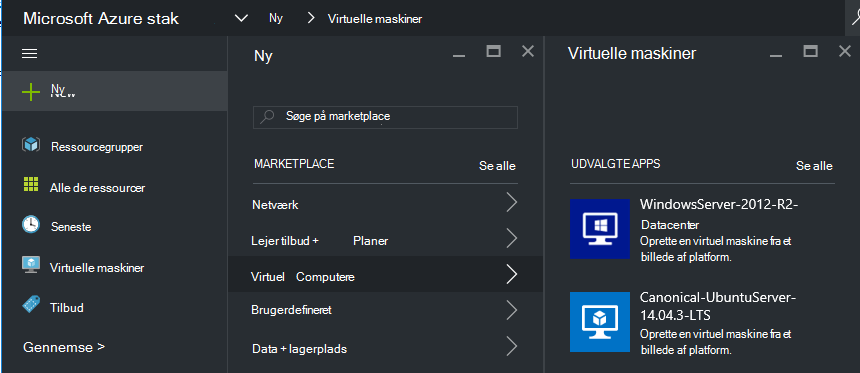
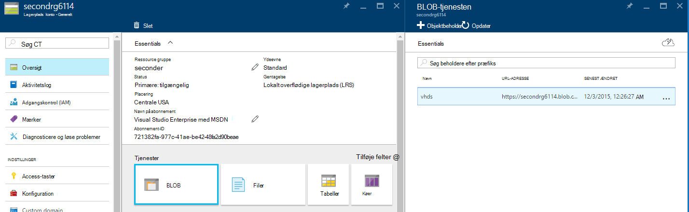
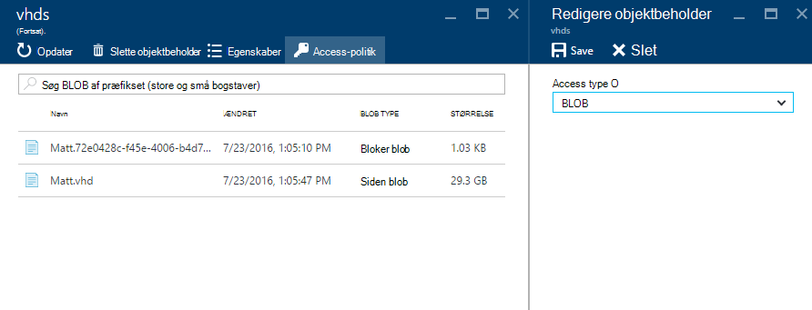
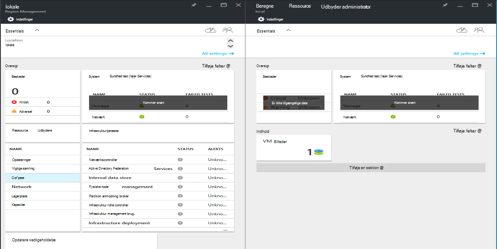
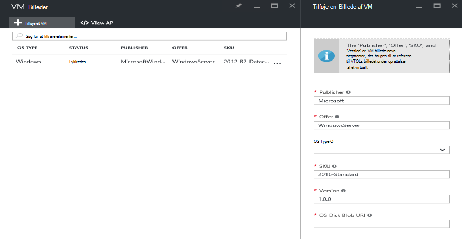

<properties
    pageTitle="Tilføjelse af en VM billede til Azure stak | Microsoft Azure"
    description="Tilføje din organisations brugerdefinerede Windows eller Linux VM billede for lejere bruge"
    services="azure-stack"
    documentationCenter=""
    authors="mattmcg"
    manager="darmour"
    editor=""/>

<tags
    ms.service="azure-stack"
    ms.workload="na"
    ms.tgt_pltfrm="na"
    ms.devlang="na"
    ms.topic="get-started-article"
    ms.date="09/26/2016"
    ms.author="mattmcg"/>

# <a name="make-a-custom-virtual-machine-image-available-in-azure-stack"></a>Gøre et billede af brugerdefineret virtuelt tilgængelige Azure stablede


Azure stak kan administratorer til rådighed VM billeder, som deres organisations brugerdefinerede Virtuelle, til deres lejere. Billeder kan refereres til af Azure ressourcestyring skabeloner eller føjes til Azure Marketplace Brugergrænsefladen med oprettelse af et element, Marketplace. Et billede af Windows Server 2012 R2 er medtaget som standard i Azure stak Technical Preview.

> [AZURE.NOTE] VM billeder med Marketplace elementer kan installeres ved at vælge **Ny** i Brugergrænsefladen og derefter vælge den **virtuelle maskiner** kategori. VM billede elementer vises.


## <a name="add-a-vm-image-to-marketplace-with-powershell"></a>Tilføje et VM til Marketplace med PowerShell

Hvis VM billedet Virtuelle er tilgængelig lokalt på konsollen VM (eller et andet eksternt forbundne enhed), kan du bruge følgende trin:

1. Forberede en Windows eller Linux-operativsystemet virtuel harddisk billede i Virtuelle format (ikke VHDX).
    -   Til Windows-afbildninger indeholder artiklen [overføre en Windows VM billede til Azure til Ressourcestyring installationer](virtual-machines-windows-upload-image.md) billede forberedelse instruktionerne i afsnittet **forberede den virtuelle harddisk til at uploade** .
    -   Følg trinnene for at forberede billedet eller bruge en eksisterende Azure stak Linux-billede, som beskrevet i artiklen [installere Linux virtuelle maskiner på Azure stak](azure-stack-linux.md)for Linux billeder.

2. Klone [Azure stak værktøjer lager](https://aka.ms/azurestackaddvmimage)og derefter importere modulet **ComputeAdmin**

    ```powershell
    Import-Module .\ComputeAdmin\AzureStack.ComputeAdmin.psm1
    ```

3. Tilføje VM billedet ved aktivering af Cmdletten Tilføj VMImage.
    -  Medtag i publisher, tilbud, SKU og version til VM billedet. Disse parametre bruges i Azure ressourcestyring skabeloner, som henviser til VM billedet.
    -  Angive osType som Windows eller Linux.
    -  Medtage dit Azure Active Directory-lejer-ID i formularen * &lt;myaadtenant&gt;*. onmicrosoft.com.
    - Følgende er en eksempel aktivering af scriptet:

    ```powershell
       Add-VMImage -publisher "Canonical" -offer "UbuntuServer" -sku "14.04.3-LTS" -version "1.0.0" -osType Linux -osDiskLocalPath 'C:\Users\AzureStackAdmin\Desktop\UbuntuServer.vhd' -tenantID <myaadtenant>.onmicrosoft.com
    ```

    > [AZURE.NOTE] Cmdletten anmoder om legitimationsoplysninger for at tilføje VM billedet. Angive administratoren Azure Active Directory legitimationsoplysninger, såsom serviceadmin@ * &lt;myaadtenant&gt;*. onmicrosoft.com på prompten.  

Kommandoen gør følgende:
- Godkender Azure stak-miljø
- Overfører den lokale virtuelle harddisk til en nyligt oprettet midlertidige konto
- Lægger VM billedet til VM billede lager
- Opretter et Marketplace element

Gå til Marketplace i portalen for at bekræfte, at kommandoen blev kørt, og derefter kontrollere, at VM billedet er tilgængelige i kategorien **virtuelle computere** .

> 

Følgende er en beskrivelse af kommandoparametre.


| Parameter | Beskrivelse |
|----------| ------------ |
|**tenantID** | Dit Azure Active Directory-lejer-ID i formularen * &lt;AADTenantID*. onmicrosoft.com&gt;. |
|**Publisher** | Gå til segmentet publisher navn af VM billedet, lejere brug, når du installerer billedet. Et eksempel er "Microsoft". Medtag ikke et mellemrum eller andre specialtegn i dette felt.|
|**tilbud** | Gå til segmentet tilbud navn for det VM billede, lejere brug, når du installerer VM billedet. Et eksempel er 'WindowsServer'. Medtag ikke et mellemrum eller andre specialtegn i dette felt. |
| **SKU** | Gå til segmentet SKU navn for det VM billede, lejere brug, når du installerer VM billedet. Et eksempel er 'Datacenter2016'. Medtag ikke et mellemrum eller andre specialtegn i dette felt. |
|**version** | Versionen af billedet VM, lejere brug, når du installerer VM billedet. Denne version er i formatet * \#.\#. \#*. Et eksempel er '1.0.0'. Medtag ikke et mellemrum eller andre specialtegn i dette felt.|
| **osType** | OsType af billedet skal være 'Windows' eller 'Linux'. |
|**osDiskLocalPath** | Den lokale sti til OS disken Virtuelle, som du overført som et VM billede til Azure stak. |
|**dataDiskLocalPaths**| En valgfri matrix af de lokale stier til datadisce, der kan overføres som en del af billedet VM.|
|**CreateGalleryItem**| Et boolesk flag, som bestemmer, om du vil oprette et element i Marketplace. Standard er indstillet til sand.|
|**titel**| Det viste navn på Marketplace element. Standard er angivet til Publisher-tilbud-Sku af VM billedet.|
|**Beskrivelse**| Beskrivelse af elementet Marketplace. |
|**osDiskBlobURI**| Dette script accepterer du kan vælge en Blob-lager URI for osDisk.|
|**dataDiskBlobURIs**| Du kan også accepterer dette script også en matrix med Blob-lager URI'er for at tilføje datadisce til billedet.|


## <a name="add-a-vm-image-through-the-portal"></a>Tilføje et VM via portalen

> [AZURE.NOTE] Denne metode kræver oprettelse af Marketplace elementet separat.

Et krav af billeder er, at de kan benyttes af en Blob storage URI. Forberede en Windows eller Linux-operativsystemet virtuel harddiskafbildning i Virtuelle format (ikke VHDX), og overfør derefter billedet til en lagerplads konto i Azure eller Azure stablede. Hvis dit billede er allerede overført til Blob-lager i Azure eller Azure stak, kan du springe dette trin.

Følg trinnene fra [overføre en Windows VM billede til Azure til Ressourcestyring installationer](https://azure.microsoft.com/documentation/articles/virtual-machines-windows-upload-image/) artikel gennem trinnet, **overføre VM billede til kontoen lagerplads**. Husk på følgende:

-   Følg vejledningen for at forberede billedet til et Linux-billede, eller brug et eksisterende Azure stak Linux-billede, som beskrevet i artiklen [installere Linux virtuelle maskiner på Azure stablen](azure-stack-linux.md).

- Det er mere effektivt at overføre et billede til Azure stak Blob-lager end til Azure Blob-lager, fordi det tager mindre tid til at overføre VM billedet til Azure stak billede lager. Mens du følger vejledningen Overfør, Sørg for at erstatte det [Godkende PowerShell med Microsoft Azure stak](azure-stack-deploy-template-powershell.md) trin for trinnet 'Login to Azure'.

- Skal du notere Blob-lager URI, hvor du vil overføre billedet. Det har følgende format: * &lt;storageAccount&gt;/&lt;blobContainer&gt;/&lt;targetVHDName&gt;*.vhd

2.  Gøres blob anonymt handicapvenlige, skal du gå til konto blob-objektbeholderen til lagring, hvor VM billedet Virtuelle blev overført til **Blob,** og vælg derefter **Access-politik**. Hvis du vil, kan du i stedet oprette en delt adgang signatur til objektbeholderen og medtage dem som en del af blob URI.





1.  Log på Azure stak som administrator. Gå til **Administration af område**. Vælg derefter **Beregne ressource udbyder** **RPs** > **VM billeder** > **Tilføj.**

    

2.  Angiv den publisher, tilbud, SKU og version af billedet VM bladet følgende. Disse navn segmenter referere til VM billedet i Azure ressourcestyring skabeloner. Sørg for at vælge **osType** korrekt. Angiv den URI, hvor billedet er overført til **osDiskBlobURI**i trin 1. Klik på **Opret** for at starte oprettelsen VM billedet.

    

3.  Billede af VM status ændres til 'Lykkedes', når billedet er blevet tilføjet.

4.  Lejere kan installere VM billedet ved at angive i publisher, tilbud, SKU og version af VM billedet i en skabelon til Azure ressourcestyring. Hvis du vil gøre VM billedet mere tilgængelige for lejer forbrug i Brugergrænsefladen, er det bedst at [oprette et Marketplace element](azure-stack-create-and-publish-marketplace-item.md).
