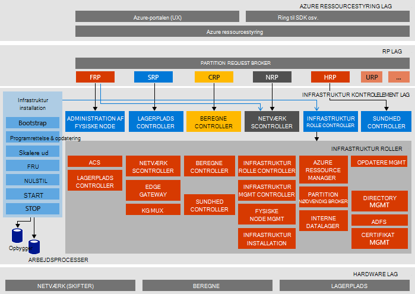

<properties
    pageTitle="Microsoft Azure stak bevis af konceptet (Konceptet) arkitektur | Microsoft Azure"
    description="Få vist Microsoft Azure stak Konceptet arkitekturen."
    services="azure-stack"
    documentationCenter=""
    authors="heathl17"
    manager="byronr"
    editor=""/>

<tags
    ms.service="azure-stack"
    ms.workload="na"
    ms.tgt_pltfrm="na"
    ms.devlang="na"
    ms.topic="article"
    ms.date="10/25/2016"
    ms.author="helaw"/>

# Microsoft Azure stak Konceptet arkitektur

Azure stak Konceptet er en en-node installation af Azure stak Technical Preview 2. Alle komponenter er installeret på virtuelle computere, der kører på en enkelt værtsmaskinen. 

## Logiske arkitektur diagram
I følgende diagram vises den logiske arkitektur for Azure stak Konceptet og dens komponenter.

## Virtuelt roller
Azure stak Konceptet tilbyder tjenester ved hjælp af følgende FOS på værten Konceptet:

 - **MAS ACS01** Virtuelt værtstjenester til Azure stak lagerplads.

 - **MAS ADFS01** Virtuelt vært Active Directory Federation Services.  Denne virtuelt bruges ikke i Technical Preview-2.  

 - **MAS ASQL01**  Virtuelt give et interne datalager for Azure stak infrastruktur roller.  

 - **MAS BGPNAT01** Virtuel maskine, der fungerer som en kant router og indeholder NAT og VPN-funktioner til Azure stablen.

 - **MAS CA01** Virtuelt tilbyder certifikat nøglecenter funktioner til Azure stak rolletjenester.

 - **MAS CON01** Virtuelt er tilgængelige for udviklere til installation af PowerShell, Visual Studio og andre værktøjer.

 - **MAS DC01** Virtuelt Active Directory, DNS og DHCP værtstjenester til Microsoft Azure stablen.

 - **MAS GWY01** Virtuelt give kant gateway tjenester som VPN-websted til websted forbindelser til lejer netværk.

 - **MAS NC01**  Virtuelt vært Controller, netværk, som administrerer Azure stak netværkstjenester.  

 - **MAS SLB01**  Virtuelt indeholder tjenester Azure stablede til belastningsjustering til både lejere og Azure stak infrastrukturtjenester.  

 - **MAS SUS01**  Virtuel computer vært for Windows Server Update Services, og at de er ansvarlig for at give opdateringer til andre Azure stak virtuelle computere.

 - **MAS WAS01**  Virtuelt vært portal og Azure ressourcestyring tjenester.

 - **MAS XRP01** Virtuel maskine, der er vært core ressource udbydere af Microsoft Azure stak, herunder udbyderne Beregn-, Netværks- og lagerplads ressource.

## Lagerplads tjenester
Lagerplads tjenester i operativsystemet på værten fysisk omfatter:

 - **ACS Blob-tjenesten** Azure ensartet lagerplads Blob-tjenesten, som leverer blob og tabel lagerplads.

 - **SoFS** Skala ud filserver.

 - **Referencer CSV** Robust fil System klynge delt lydstyrken.

 - **Virtuel Disk**, **Lagerplads**og **Lagerplads mellemrum direkte** er den respektive underliggende lagerplads teknologi i Windows Server til at aktivere Microsoft Azure stak core lagerplads ressource udbyder.

## Næste trin

[Installere Azure stak](azure-stack-deploy.md)

[Første scenarier til at prøve](azure-stack-first-scenarios.md)

