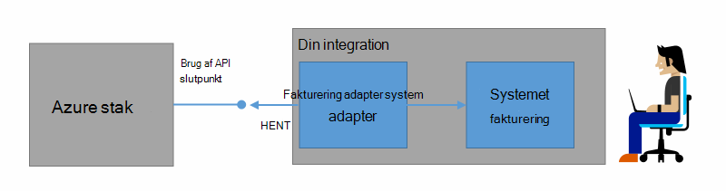
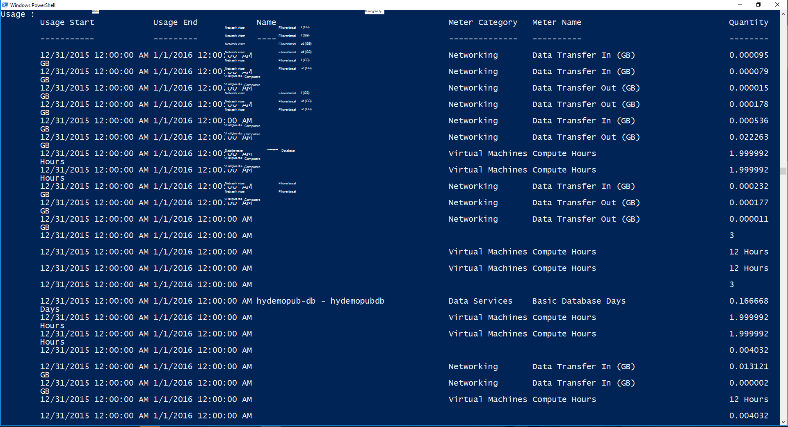

<properties
    pageTitle="Kunde fakturerings- og kortejeren Azure stablede | Microsoft Azure"
    description="Lær at hente oplysninger om ressourceforbrug fra Azure stablen."
    services="azure-stack"
    documentationCenter=""
    authors="AlfredoPizzirani"
    manager="byronr"
    editor=""/>

<tags
    ms.service="azure-stack"
    ms.workload="na"
    ms.tgt_pltfrm="na"
    ms.devlang="na"
    ms.topic="article"
    ms.date="10/18/2016"
    ms.author="alfredop"/>

# Kunden fakturering og kortejeren Azure stablede

Nu hvor du bruger Azure stak, er det en god ide at tænke over, hvordan du holder styr brugen. Tjenesteudbydere, der er afhængige af brugeroplysninger til at opkræve betaling deres kunder, og at forstå omkostninger til at formidle tjenester.
Virksomheder, også, spore typisk brugen af afdeling.

Azure stak er ikke et fakturering system. Den ikke tage et gebyr din lejere for de ressourcer, de bruger. Men Azure stak har infrastrukturen til at samle og sammenlægge Brugsdata for hver enkelt ressource-udbyder. Du kan få adgang til disse data og eksportere den til et fakturering system ved hjælp af en fakturering adapter, eller du kan eksportere den til et business intelligence-værktøj som Microsoft Power BI.

## Hvilke brugeroplysninger kan jeg finde, og hvordan?

Azure stak ressource udbydere generere brugen poster med hver time intervaller. Posterne, der viser mængden af hver ressource, der blev brugt, og hvilke abonnement consumed ressourcen. Disse data er gemt. Du kan få adgang til dataene via REST-API.

En tjenesteadministratoren kan hente Brugsdata for alle abonnementer, lejer. Individuelle lejere kan hente kun deres egne oplysninger.

Brugen poster indeholder oplysninger om opbevaring, netværk og Beregn brugen. Du kan finde en liste over meter [i denne artikel](azure-stack-usage-related-faq.md).

## Hente oplysninger om ressourceforbrug

For at generere poster, er det vigtigt, at du har ressourcer, der kører og aktivt bruger systemet. Hvis du er sikker på, om du har de ressourcer, der kører, i Azure stak Marketplace installere og derefter køre en virtuel maskine (VM). Kig på VM overvågning blade at sikre, at den kører.

Vi anbefaler, at du kører Windows PowerShell-cmdletter for at få vist data om brug af.
PowerShell kalder ressource brugen API'er.

1.  [Installere og konfigurere Azure PowerShell](https://azure.microsoft.com/en-us/documentation/articles/powershell-install-configure/).

2.  Bruge PowerShell-cmdlet **Logon-AzureRmAccount**for at logge på til Azure ressourcestyring.

3.  For at markere det abonnement, du brugte til at oprette ressourcer skal du skrive **Get-AzureRmSubscription – SubscriptionName "sub" | Vælg AzureRmSubscription**.

4.  Brug PowerShell-cmdlet'en [**Get-UsageAggregates**](https://msdn.microsoft.com/en-us/library/mt619285.aspx)for at hente dataene.
    Hvis Brugsdata findes, returneres i PowerShell, som i følgende eksempel. PowerShell returnerer 1.000 linjer af brugen per opkald.
    Du kan bruge argumentet *for* at hente sæt af linjer ud over de første 1.000. Du kan finde flere oplysninger om af Brugsdata, [ressource brugen API reference](azure-stack-provider-resource-api.md).

    

## Næste trin

[Udbyder Ressourceforbrug API](azure-stack-provider-resource-api.md)

[Lejer Ressourceforbrug API](azure-stack-tenant-resource-usage-api.md)

[Brugen beslægtede ofte stillede spørgsmål](azure-stack-usage-related-faq.md)
