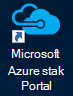
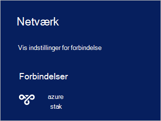

<properties
    pageTitle="Oprette forbindelse til Azure stak | Microsoft Azure"
    description="Lær, hvordan du opretter forbindelse Azure stak"
    services="azure-stack"
    documentationCenter=""
    authors="ErikjeMS"
    manager="byronr"
    editor=""/>

<tags
    ms.service="azure-stack"
    ms.workload="na"
    ms.tgt_pltfrm="na"
    ms.devlang="na"
    ms.topic="get-started-article"
    ms.date="10/18/2016"
    ms.author="erikje"/>

# <a name="connect-to-azure-stack"></a>Oprette forbindelse til Azure stak
Hvis du vil administrere ressourcer, skal du oprette forbindelse til Azure stak Konceptet computeren. Du kan bruge en af følgende forbindelsesindstillinger for:

 - Fjernskrivebord: kan en bruger samtidige hurtigt at oprette forbindelse fra Konceptet computeren.
 - Virtuel privat netværksforbindelse (VPN): giver flere samtidige brugere oprette forbindelse fra kunder uden for Azure stak infrastrukturen (kræver konfiguration).

## <a name="connect-with-remote-desktop"></a>Oprette forbindelse til Fjernskrivebord
Med funktionen Fjernskrivebord, kan en enkelt samtidige bruger arbejde med portalen til at administrere ressourcer. Du kan også bruge værktøjer på MAS CON01 virtuel maskine.

1.  Log på Azure stak Konceptet fysisk maskinen.

2.  Åbn en forbindelse til Fjernskrivebord, og oprette forbindelse til MAS CON01. Angiv **AzureStack\AzureStackAdmin** som brugernavnet og den administrative adgangskode, du har angivet under installationen af Azure stablen.  

3.  Dobbeltklik på **Microsoft Azure stak Portal** ikonet (https://portal.azurestack.local/) for at åbne [portal](azure-stack-key-features.md#portal)på skrivebordet MAS CON01.

    

4.  Log på med de Azure Active Directory-legitimationsoplysninger, der er angivet under installationen.

## <a name="connect-with-vpn"></a>Oprette forbindelse til VPN
Virtuel privat netværksforbindelser lade flere samtidige brugere oprette forbindelse fra kunder uden for Azure stak infrastrukturen. Du kan bruge portalen til at administrere ressourcer. Du kan også bruge værktøjer, som Visual Studio og PowerShell, på din lokale klient.

1.  Installere modulet AzureRM ved hjælp af følgende kommando:
   
    ```PowerShell
    Install-Module -Name AzureRm -RequiredVersion 1.2.6 -Scope CurrentUser
    ```   
   
2. Hent Azure stak værktøjer scriptene.  Disse filer kan hentes ved enten at navigere til [GitHub lager](https://github.com/Azure/AzureStack-Tools), eller køre følgende Windows PowerShell-script som administrator support:
    
    >[AZURE.NOTE]  Følgende trin kræver PowerShell 5.0.  For at kontrollere din version, skal du køre $PSVersionTable.PSVersion og sammenligne "Overordnet" version.  

    ```PowerShell
       
       #Download the tools archive
       invoke-webrequest https://github.com/Azure/AzureStack-Tools/archive/master.zip -OutFile master.zip

       #Expand the downloaded files. 
       expand-archive master.zip -DestinationPath . -Force

       #Change to the tools directory
       cd AzureStack-Tools-master
    ````

3.  Gå til mappen, **Opret forbindelse** i den samme PowerShell-session, og importere modulet AzureStack.Connect.psm1:

    ```PowerShell
    cd Connect
    import-module .\AzureStack.Connect.psm1
    ```

4.  For at oprette Azure stak VPN-forbindelsen, skal du køre følgende Windows PowerShell. Før du kører, skal du udfylde administratoradgangskode og Azure stak host adressefelter. 
    
    ```PowerShell
    #Change the IP Address below to match your Azure Stack host
    $hostIP = "<HostIP>"

    # Change password below to reference the password provided for administrator during Azure Stack installation
    $Password = ConvertTo-SecureString "<Admin Password>" -AsPlainText -Force

    # Add Azure Stack One Node host & CA to the trusted hosts on your client computer
    Set-Item wsman:\localhost\Client\TrustedHosts -Value $hostIP -Concatenate
    Set-Item wsman:\localhost\Client\TrustedHosts -Value mas-ca01.azurestack.local -Concatenate  

    # Update Azure Stack host address to be the IP Address of the Azure Stack POC Host
    $natIp = Get-AzureStackNatServerAddress -HostComputer $hostIP -Password $Password

    # Create VPN connection entry for the current user
    Add-AzureStackVpnConnection -ServerAddress $natIp -Password $Password

    # Connect to the Azure Stack instance. This command (or the GUI steps in step 5) can be used to reconnect
    Connect-AzureStackVpn -Password $Password 
    ```

5. Når du bliver bedt om det, har du tillid til værten for Azure stablen.

6. Når du bliver bedt om det, kan du installere et certifikat (spørgsmålet vises bag vinduet Powershell session).

7. For at teste forbindelsen portalen i en webbrowser, skal du gå til *https://portal.azurestack.local*.

8. For at gennemse og administrere Azure stak forbindelsen, skal du bruge **netværk** på din klient:

    

>[AZURE.NOTE] Denne VPN-forbindelse giver ikke forbindelse til FOS eller andre ressourcer. Finde oplysninger om forbindelse til ressourcer, i [Én Node VPN-forbindelse](azure-stack-create-vpn-connection-one-node-tp2.md)


## <a name="next-steps"></a>Næste trin
[Første opgaver](azure-stack-first-scenarios.md)

[Installere og oprette forbindelse med PowerShell](azure-stack-connect-powershell.md)

[Installere og oprette forbindelse til CLI](azure-stack-connect-cli.md)


