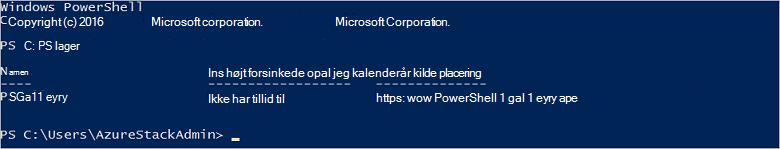

<properties
    pageTitle="Oprette forbindelse til Azure stak med PowerShell | Microsoft Azure"
    description="Lær, hvordan du administrerer Azure stak med PowerShell"
    services="azure-stack"
    documentationCenter=""
    authors="HeathL17"
    manager="byronr"
    editor=""/>

<tags
    ms.service="azure-stack"
    ms.workload="na"
    ms.tgt_pltfrm="na"
    ms.devlang="na"
    ms.topic="article"
    ms.date="10/19/2016"
    ms.author="helaw"/>

# Installere PowerShell og oprette forbindelse til Azure stak
I denne vejledning skal vi du gennemgå trinnene til at oprette forbindelse til Azure stak med PowerShell. Når fuldført, kan disse trin også hjælpe dig med at administrere og installere ressourcer.

## Installer Azure stak PowerShell-cmdlet'er

1.  AzureRM cmdletter installeres fra galleriet PowerShell. For at starte skal du åbne en PowerShell-konsollen på MAS CON01 og køre følgende kommando for at returnere en liste over typer lagre PowerShell tilgængelige:

        Get-PSRepository

      

2.  Kør følgende kommando for at installere modulet AzureRM:

        Install-Module -Name AzureRM -RequiredVersion 1.2.6 -Scope CurrentUser

    >[AZURE.NOTE] *-Omfang CurrentUser* er valgfrit. Hvis du vil mere end den aktuelle bruger skal have adgang til modulerne, kan du bruge en kommandoprompt og lade fra parameteren *omfang* .

3.  For at bekræfte installationen af AzureRM moduler, skal du udføre følgende kommandoer:

        Get-Command -Module AzureRM.AzureStackAdmin

## Oprette forbindelse til Azure stak
Et modul er tilgængelig til hentning, der håndterer konfigurere PowerShell forbindelsen til Azure stak for dig.  Gå til [Azure stak værktøjer](http://aka.ms/ConnectToAzureStackPS) til modul og yderligere trin. 

## Hente en liste over abonnementer
I dette afsnit, skal kontrollere du PowerShell-cmdlet'er kører mod Azure stak ved at hente og vælge et abonnement til brug.

Kør følgende kommando for at hente en liste over Azure stak abonnementer der er knyttet til din konto:

    Get-AzureRmSubscription

## Næste trin
[Installere skabeloner med PowerShell](azure-stack-deploy-template-powershell.md)

[Oprette forbindelse til Azure CLI](azure-stack-connect-cli.md)

[Installere skabeloner med Visual Studio](azure-stack-deploy-template-visual-studio.md)

