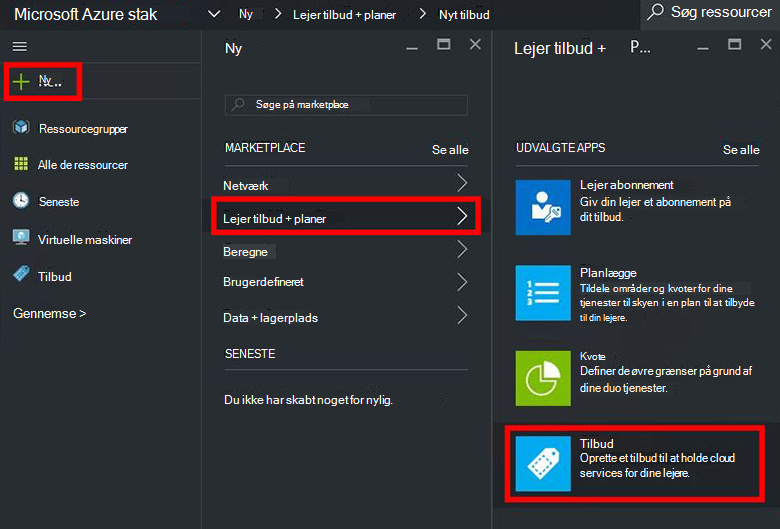
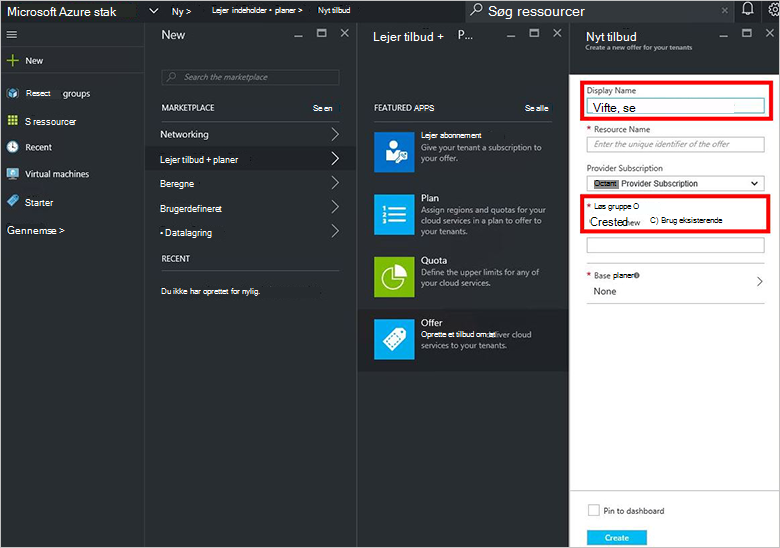
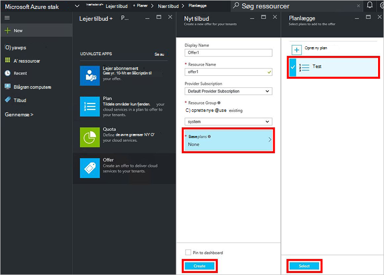
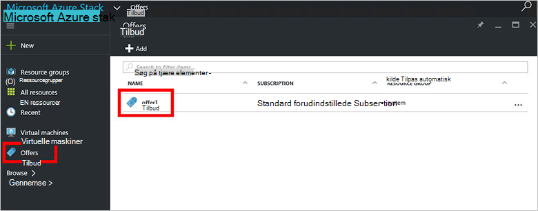
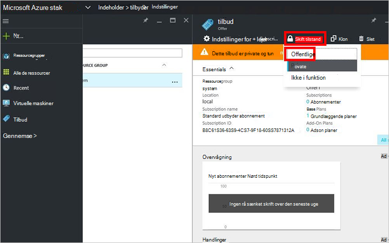

<properties
    pageTitle="Oprette et tilbud Azure stablede | Microsoft Azure"
    description="Lær, hvordan du opretter et tilbud til din lejere Azure stablede som tjenesteadministrator af en."
    services="azure-stack"
    documentationCenter=""
    authors="ErikjeMS"
    manager="byronr"
    editor=""/>

<tags
    ms.service="azure-stack"
    ms.workload="na"
    ms.tgt_pltfrm="na"
    ms.devlang="na"
    ms.topic="get-started-article"
    ms.date="09/26/2016"
    ms.author="erikje"/>

# Oprette et tilbud Azure stablede

[Indeholder](azure-stack-key-features.md#services-plans-offers-and-subscriptions) er grupper af en eller flere planer, der udgør udbydere til lejere til at købe eller abonnere på. Dette dokument viser, hvordan du opretter et tilbud, der indeholder den [plan, du har oprettet](azure-stack-create-plan.md) i det sidste trin. Dette tilbud giver abonnenter mulighed for at klargøre virtuelle computere.

1.  [Log på](azure-stack-connect-azure-stack.md#log-in-as-a-service-administrator) portalen som tjenesteadministrator af en, og klik derefter på **Ny** > **lejer indeholder + planer** > **tilbyder**.
    

2.  Udfyld **Visningsnavn** og **Ressourcenavn**i bladet **Nye tilbyder** , og vælg derefter en ny eller eksisterende **Ressourcegruppe**. Det viste navn er den tilbud fulde navn. Kun administratoren kan se ressourcenavnet. Det er det navn, som administratorer bruger til at arbejde med tilbuddet som en Azure ressourcestyring ressource.

    

3.  Klik på **Base planer** , og vælg de planer, du vil medtage i tilbuddet i bladet **planlægge** , og klik derefter på **Vælg**. Klik på **Opret** for at oprette tilbuddet.

    
    
4. Klik på **tilbyder** , og klik derefter på de tilbud, du lige har oprettet.

    

5.  Klik på **Skift status**, og klik derefter på **offentlige**.
  
    

Tilbud skal offentliggøres for lejere at få fuld visning, når du abonnerer. Tilbud kan være:

- **Offentlige**: synligt for lejere.

- **Privat**: kun synlige for administratorer af tjenester. Nyttige under udarbejdelsen af planen eller tilbud, eller hvis tjenesteadministratoren ønsker at godkende hver abonnement.

- **Decommissioned**: lukket til nye abonnenter. Tjenesteadministratoren kan bruge afvikles forhindre, at fremtidige abonnementer, men lade aktuelle abonnenter uændret.

Ændringer til tilbuddet er ikke umiddelbart er synlige til lejer. Hvis du vil se ændringerne, du muligvis nødt til at log/login for at se det nye abonnement i "abonnement vælgeren" Når du opretter ressourcer/ressource grupper.

## Næste trin

[Abonnere på et tilbud og derefter klargøre en VM](azure-stack-subscribe-plan-provision-vm.md)
