<properties
    pageTitle="Opret en plan Azure stablede | Microsoft Azure"
    description="Oprette en plan, hvor abonnenter klargøring virtuelle maskiner som tjenesteadministrator af en."
    services="azure-stack"
    documentationCenter=""
    authors="ErikjeMS"
    manager="byronr"
    editor=""/>

<tags
    ms.service="azure-stack"
    ms.workload="na"
    ms.tgt_pltfrm="na"
    ms.devlang="na"
    ms.topic="get-started-article"
    ms.date="09/26/2016"
    ms.author="erikje"/>

# Opret en plan Azure stablede

[Planer](azure-stack-key-features.md#services-plans-offers-and-subscriptions) er grupperinger af en eller flere tjenester. Du kan oprette planer til at tilbyde til din lejere som en udbyder. Også Abonner din lejere på dine tilbud til at bruge de planer og -tjenester, de indeholder. I dette eksempel viser, hvordan du opretter en plan, der indeholder Beregn-, Netværks- og lagerplads ressource udbydere. Denne plan giver abonnenter mulighed for at klargøre virtuelle computere.

1.  Gå til https://portal.azurestack.local i en webbrowser.

2.  [Log på](azure-stack-connect-azure-stack.md#log-in-as-a-service-administrator) portalen Azure stak som tjenesteadministrator af en og angive legitimationsoplysninger for administrator din service (den konto, du oprettede under trin 5 i afsnittet [køre PowerShell-scriptet](azure-stack-run-powershell-script.md) ), og klik derefter på **Log på**.

    Administratorer kan oprette tilbud og planer og administrere brugere.

3.  Hvis du vil oprette en plan og tilbud, der kan abonnere på lejere, skal du klikke på **Ny** > **lejer indeholder + planer** > **Plan**.

    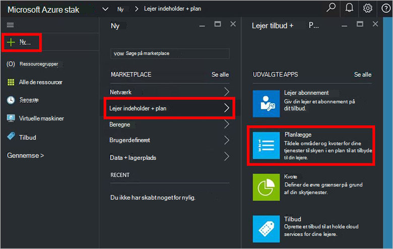

4.  Udfyld **Visningsnavn** og **Ressourcenavn**i bladet **Nye Plan** . Det viste navn er den plan brugervenligt navn, som lejere se. Kun administratoren kan se ressourcenavnet. Det er det navn, som administratorer bruger til at arbejde med plan som en Azure ressourcestyring ressource.

    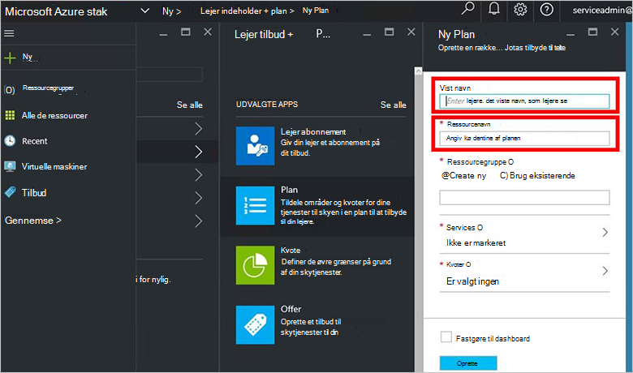

5.  Oprette en ny **Ressourcegruppe**, eller Vælg en eksisterende database, som en beholder for plan (f.eks. "OffersAndPlans")

    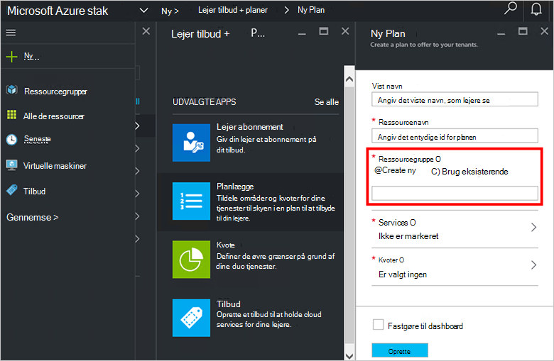

6.  Klik på **tjenester**, Vælg **Microsoft.Compute**, **Microsoft.Network**og **Microsoft.Storage**, og klik derefter på **Vælg**.

    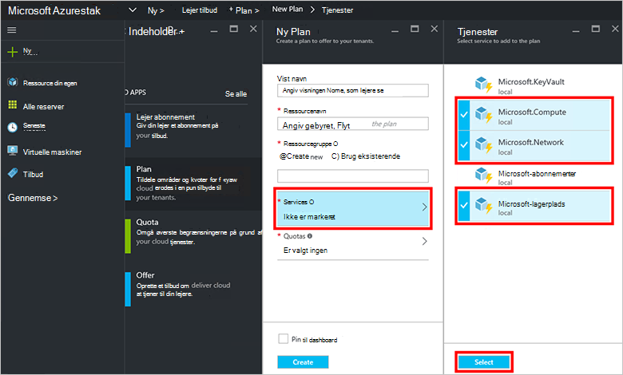

7.  **Kvoter**, skal du klikke på **Microsoft.Storage (lokalt)**, og klik derefter enten Vælg kvoten standard eller klik på **Opret ny kvote** for at tilpasse kvoten for.

    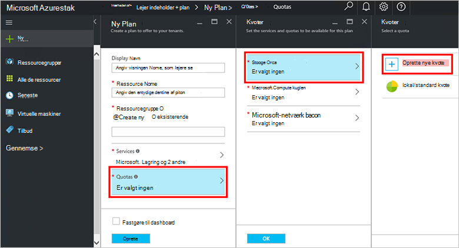

8.  Skriv et navn til kvoten, klik på **Kvote indstillinger**, angive kvote værdier og klikke på **OK**, og klik derefter på **Opret**.

    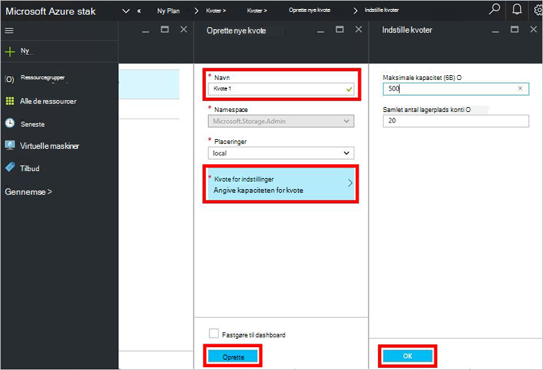

9. **Microsoft.Network (lokalt)**, og klik derefter enten vælge kvoten standard eller klik på **Opret ny kvote** for at tilpasse kvoten for.

    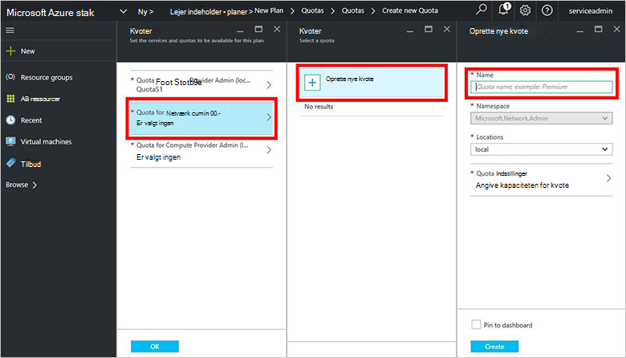

10. Skriv et navn til kvoten, klik på **Kvote indstillinger**, angive kvote værdier og klikke på **OK**, og klik derefter på **Opret**.

    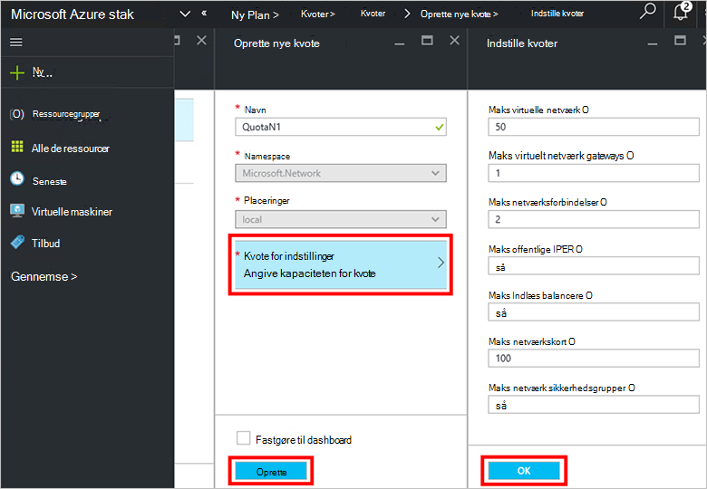

11. **Microsoft.Compute (lokalt)**, og klik derefter enten vælge kvoten standard eller klik på **Opret ny kvote** for at tilpasse kvoten for.

    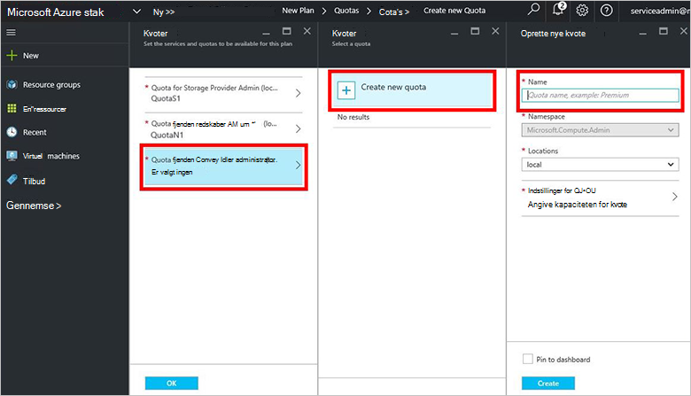

12.  Skriv et navn til kvoten, klik på **Kvote indstillinger**, angive kvote værdier og klikke på **OK**, og klik derefter på **Opret**.

    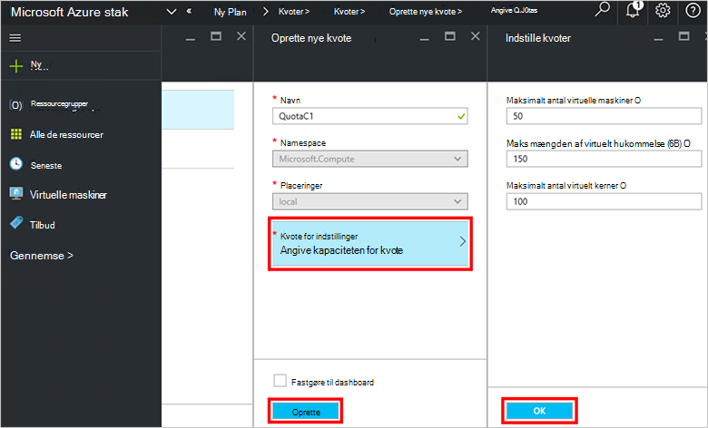

13. Klik på **OK**i bladet **kvoter** , og klik derefter på **Opret** for at oprette planen i bladet **Nye Plan** .

    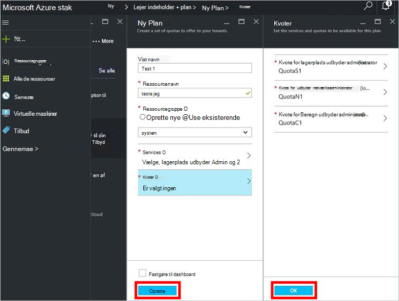

14. Klik på **alle de ressourcer**, for at få vist din nye plan, og derefter søge efter planen, og klikke på dens navn.

    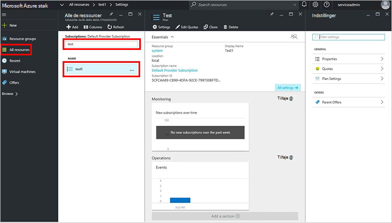

## Næste trin

[Oprette et tilbud](azure-stack-create-offer.md)
