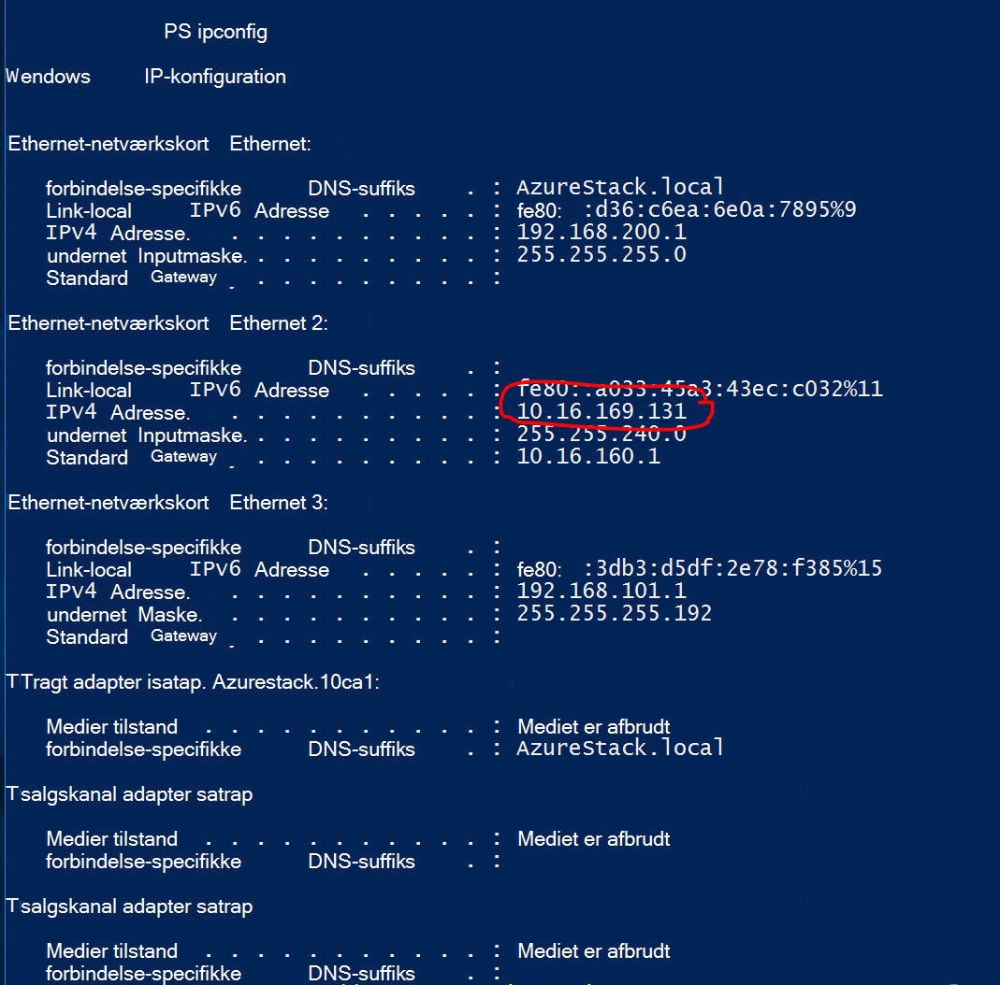

<properties
    pageTitle="Oprette et websted til websted VPN-forbindelse mellem to virtuelle netværk i forskellige Azure stak konceptet miljøer | Microsoft Azure"
    description="Trinvis fremgangsmåde, som tillader en skyen administrator for at oprette et websted til websted VPN-forbindelse mellem to en node Konceptet miljøer i TP2."
    services="azure-stack"
    documentationCenter=""
    authors="ScottNapolitan"
    manager="darmour"
    editor=""/>

<tags
    ms.service="azure-stack"
    ms.workload="na"
    ms.tgt_pltfrm="na"
    ms.devlang="na"
    ms.topic="get-started-article"
    ms.date="09/26/2016"
    ms.author="scottnap"/>

# Oprette et websted til websted VPN-forbindelse mellem to virtuelle netværk i forskellige Azure stak konceptet miljøer

## Oversigt

I denne artikel fører dig gennem trinnene til at oprette en-til-websted VPN-forbindelse mellem to virtuelle netværk i to separate Azure stak bevis-for-konceptet miljøer. Formålet med dette er så personer, der evaluerer til websted gateways forstå, hvordan du konfigurerer VPN-forbindelser mellem virtuelle netværk i to forskellige Azure stak installationer.  Gang med at gøre dette, får du en forstå, hvordan VPN Gateways fungerer Azure stablede.

>[AZURE.NOTE] Dette dokument gælder specifikt for Azure stak TP2 Konceptet.

### Forbindelse diagram

Følgende er et diagram, der viser, hvordan vores konfiguration skal se ud, når vi er færdig.

### Inden du går i gang

For at fuldføre denne konfiguration, skal du følgende elementer, så sørg for, at du har disse ting, før du går i gang.

-   To servere, der opfylder de Azure stak Konceptet hardwarekrav, der er defineret af [Azure stak forudsætninger for installation](azure-stack-deploy.md), og de andre forudsætninger, der er defineret af dokumentet.

-   Azure stak Technical Preview 2-installationspakken.

## Implementere Konceptet miljøer

Du vil installere to Azure stak Konceptet miljøer for at fuldføre denne konfiguration.

-   For hver Konceptet, som du installerer, kan du blot følge de installationsvejledning, der gennemgås i artiklen [Installere Azure stak Konceptet](azure-stack-run-powershell-script.md).
    Vi vil henvise til hver Konceptet miljø i dette dokument generisk som POC1 og POC2.

## Konfigurere kvoter for Beregn-, Netværks- og lagerplads

Du skal konfigurere kvoter for Beregn-, Netværks- og lagerplads, så disse tjenester kan knyttes til en Plan, og klik derefter et tilbud, der lejere kan abonnere på.

>[AZURE.NOTE] Du skal udføre disse trin for hver Azure stak Konceptet-miljø.

Oplevelse til at oprette kvoter for tjenester er ændret fra TP1. Trin til at oprette kvoter i TP2 kan findes på <http://aka.ms/mas-create-quotas>. Du kan acceptere standardindstillinger for alle kvote indstillinger for denne opgave.

## Oprette en Plan og tilbud

[Planer](azure-stack-key-features.md) er grupperinger af en eller flere tjenester. Du kan oprette planer til at tilbyde til din lejere som en udbyder. Også Abonner din lejere på dine tilbud til at bruge de planer og -tjenester, de indeholder.

>[AZURE.NOTE] Du skal udføre disse trin for hver Azure stak Konceptet-miljø.

1.  Først oprette en Plan. For at gøre dette, kan du følge trinnene i artiklen [Opret en Plan](azure-stack-create-plan.md) online.

2.  Oprette et tilbud, følge de trin, der er beskrevet i [oprette et tilbud Azure stablede](azure-stack-create-offer.md).

3.  Log på portalen som Lejeradministrator og [abonnere på de tilbud, du har oprettet] (azure-stak-abonnere-plan-klargøring-vm.md.

## Oprette netværksressourcer i Konceptet 1

Nu vil vi faktisk oprette de ressourcer, vi har brug for at angive vores konfiguration. I følgende trin illustreres hvad vi skal gøre. Disse instruktioner viser, hvordan du opretter ressourcer via portalen, men det samme kan gøres via PowerShell.

### Log på som en lejer

En tjenesteadministratoren kan logge på som en lejer at teste de planer, tilbud og abonnementer, der kan bruge deres lejere. Hvis du ikke allerede har et, [oprette en lejerkonto](azure-stack-add-new-user-aad.md) før du logger på.

### Oprette virtuelle netværk og VM undernet

1.  Log på med en lejerkonto.

2.  Klik på ikonet **Ny** i Azure-portalen.

     
3.  Vælg **netværk** i menuen Marketplace.

4.  Klik på det **virtuelle netværk** element i menuen.

5.  Klik på knappen **Opret** i bunden af bladet ressource beskrivelse. Angiv følgende værdier i de relevante felter i henhold til denne tabel.

  	| **Felt**             | **Værdi** |
  	|----------------------- | ------ |
  	| Navn                  |vnet-01 |
  	| Adresseområde         | 10.0.10.0/23 |
  	| Undernet navn           | undernet-01 |
  	| Undernet adresseområde  | 10.0.10.0/24 |

6.  Du bør se det abonnement, du har oprettet tidligere udfyldt i feltet **abonnement** .

7.  Til ressourcegruppe, kan du oprette en ny ressourcegruppe eller hvis du allerede har en, Vælg Brug eksisterende.

8.  Kontrollér standardplaceringen.

9.  Klik på knappen **Opret** .

### Oprette Gateway-undernet

1.  Åbn den virtuelle netværksressource, du lige har oprettet (Vnet-01) fra dashboardet.

2.  Vælg undernet på bladet indstillinger

3.  Klik på knappen **Gateway undernet** for at tilføje en Gateway-undernet til det virtuelle netværk.

     
4.  Navnet på undernettet er angivet til **GatewaySubnet** som standard.
    Gateway-undernet er speciel og skal have denne specifikke navn for at kunne fungere korrekt.

5.  Angiv **10.0.11.0/24**i feltet **adresseområde** .

6.  Klik på knappen **Opret** til at oprette gatewayen undernet.

### Oprette gatewayen virtuelt netværk

1.  Klik på ikonet **Ny** i portalen Azure.

    

2.  Vælg **netværk** i menuen Marketplace.

3.  Vælg **virtuelle netværksgateway** på listen over netværksressourcer.

4.  Gennemse beskrivelsen, og klik på **Opret**.

5.  Skriv **GW1**i feltet **navn** .

6.  Klik på det **virtuelle netværk** element for at vælge et virtuelt netværk.
    Vælg **Vnet-01** på listen.

7.  Klik på menupunktet **offentlige IP-adresse** . Klik på knappen Opret nyt, når Vælg offentlige IP-adresse blade åbnes.

8.  Skriv **GW1 PiP** i feltet **navn** , og klik på **Ok.**

9.  Den **Gateway type** bør have **VPN** valgt som standard. Bevar denne indstilling.

10. **VPN-type** skal have **rute-baserede** valgt som standard.
    Bevar denne indstilling.

11. Kontrollér **abonnement** og **placering** er korrekte. Du kan fastgøre ressourcen til Dashboard, hvis du ønsker. Klik på **Opret**.

### Oprette gatewayen lokale netværk

Den lokale netværksgateway ressource er lidt mærkelig ud i vores scenario.
Det er den samme ressource, som du finder i Azure, men i Azure det typisk er beregnet til at repræsentere en fysisk, lokal enhed, du vil bruge til at oprette forbindelse til gatewayen virtuelt netværk i Azure. I eksemplet er begge ender af forbindelsen faktisk virtuelt netværk gateways!

En måde at synes om dette mere generisk er, at lokale netværksgateway ressourcen altid er beregnet til at angive gatewayen remote i anden ende af forbindelsen. På grund af den måde, der blev udviklet af Konceptet, skal vi faktisk angive adressen på det eksterne netværkskort på NAT VM af de andre Konceptet som den offentlige IP-adresse gatewayen lokale netværk. Vi opretter derefter NAT tilknytninger på NAT VM at sikre, at begge ender er tilsluttet korrekt.

### Få IP-adressen på det eksterne netværkskort i NAT VM

1.  Logge på Azure stak fysisk maskinen til POC2.

2.  [Windows-tasten] + R for at åbne menuen **Kør** og skrive **mstsc** , og tryk på enter.

3.  Skriv navnet **MAS BGPNAT01** i feltet **Computer** , og klik på knappen **Opret forbindelse** .

4.  Klik på menuen Start, og højreklik på PowerShell, og vælg **Kør som Administrator**.

5.  Skriv **IPConfig/all**.

6.  Find den Ethernet-Adapter, der er forbundet til netværket lokalt, og notere den IPv4-adresse, der er bundet til det pågældende kort. Det er **10.16.167.195** i Mit miljø, men dit skal være noget andet.

7.  Registrere denne adresse. Dette er, hvad vi vil bruge som den offentlige IP-adresse på den lokale netværksgateway ressource vi oprette i POC1.

### Oprette lokale netværk Gateway ressourcen

1.  Logge på Azure stak fysisk maskinen til POC1.

2.  Skriv navnet, **MAS CON01** i feltet **Computer** , og klik på knappen **Opret forbindelse** .

3.  Klik på ikonet **Ny** i Azure-portalen.

    

4.  Vælg **netværk** i menuen Marketplace.

5.  Vælg **lokalt netværksgateway** på listen over ressourcer.

6.  Angiv **POC2 GW**i feltet **navn** .

7.  Vi kender ikke IP-adressen for vores andre Gateway endnu, men det er ok, fordi vi kan vende tilbage og ændre den senere. Nu skal du angive **10.16.167.195** i **feltet IP-adresse**.

8.  Angiv adresseområde af Vnet, som vi opretter i POC2 i feltet **Adresseområde** . Dette skal være **10.0.20.0/23** så Indtast den pågældende værdi.

9.  Kontrollér, at dit **abonnement**, **Ressourcegruppe** og **placering** er alle korrekte, og klik på **Opret**.

### Oprette forbindelse

1.  Klik på ikonet **Ny** i Azure-portalen.

     

2.  Vælg **netværk** i menuen Marketplace.

3.  Vælg **forbindelse** på listen over ressourcer.

4.  Vælg **websted-til-websted (IPSec)** som **forbindelsestype**i bladet **grundlæggende** indstillinger.

5.  Vælg det **abonnement**, **Ressourcegruppe** og **placering** , og klik på **Ok**.

6.  Vælg den **Virtuelle netværk gatewayen** (**GW1**) du oprettede tidligere i bladet **Indstillinger** .

7.  Vælg den **lokale** **Netværk gatewayen** (**POC2 GW**) du oprettede tidligere.

8.  Angiv **POC1 POC2**i feltet **Forbindelsesnavn** .

9.  Angiv **12345**i feltet **Delt nøgle (PSK)** . Klik på **Ok**.

### Oprette en VM

For at validere data, der er ude at rejse via VPN-forbindelsen, skal du FOS til at sende og modtage data i hver Konceptet. Lad os oprette en VM i POC1 nu, og Placer det på vores VM undernet i vores virtuelt netværk.

1. Klik på ikonet  **Ny** i portalen Azure.

     

2.  Vælg **virtuelle maskiner** i menuen Marketplace.

3.  Vælg **Windows Server 2012 R2 Datacenter** billedet på listen over virtuelt billeder.

4.  Skriv værdien **VM01**i feltet **navn** på bladet **grundlæggende funktioner** .

5.  Angiv en gyldig brugernavn og din adgangskode. Du skal bruge denne konto til at logge på VM, når den er blevet oprettet.

6.  Giver et **abonnement**, **Ressourcegruppe** og en **placering** , og klik derefter på **Ok**.

7.  Vælg en VM størrelse for denne forekomst bladet **størrelse** , og klik derefter på **Vælg**.

8.  Du kan Accepter standardindstillingerne, lige Sørg for, at netværket virtuel er markeret er **VNET-01** og undernettet er indstillet til **10.0.10.0/24**på bladet indstillinger. Klik på **Ok**.

9.  Gennemse indstillingerne på bladet **Oversigt** , og klik på **Ok**.

## Oprette netværksressourcer i Konceptet 2

### Log på som en lejer

En tjenesteadministratoren kan logge på som en lejer at teste de planer, tilbud og abonnementer, der kan bruge deres lejere. Hvis du ikke allerede har et, [oprette en lejerkonto](azure-stack-add-new-user-aad.md) før du logger på.

### Oprette virtuelle netværk og VM undernet

1. Log på med en lejerkonto.

2. Klik på ikonet  **Ny** i portalen Azure.

     

3.  Vælg **netværk** i menuen Marketplace.

4.  Klik på det **virtuelle netværk** element i menuen.

5.  Klik på knappen **Opret** i bunden af bladet ressource beskrivelse. Angiv følgende værdier for de relevante felter, der er angivet i tabellen nedenfor.

  	|**Felt**              |**Værdi** |
  	| ----------------------|----------|
  	| Navn                  | vnet-02 |
  	| Adresseområde         | 10.0.20.0/23 |
  	| Undernet navn           | undernet-02 |
  	| Undernet adresseområde  | 10.0.20.0/24 |

6.  Du bør se det abonnement, du har oprettet tidligere udfyldt i feltet **abonnement** .

7.  Til ressourcegruppe, kan du oprette en ny ressourcegruppe eller hvis du allerede har en, Vælg Brug eksisterende.

8.  Kontroller standard **placering**. Hvis du vil, kan du fastgøre det virtuelle netværk til Dashboard for nem adgang.

9.  Klik på knappen **Opret** .

### Oprette Gateway-undernet

1.  Åbn den virtuelle netværksressource, du har oprettet (**Vnet-02**) fra dashboardet.

2.  Vælg på bladet **Indstillinger** **undernet.**

3.  Klik på knappen **Gateway undernet** for at tilføje en Gateway-undernet til det virtuelle netværk.

     

4.  Navnet på undernettet er angivet til **GatewaySubnet** som standard.
    Gateway-undernet er speciel og skal have denne specifikke navn for at kunne fungere korrekt.

5.  Angiv **10.0.20.0/24**i feltet **adresseområde** .

6.  Klik på knappen **Opret** for at oprette gatewayen undernet.

### Oprette gatewayen virtuelt netværk

1. Klik på ikonet  **Ny** i Azure-portalen.

     

2.  Vælg **netværk** i menuen Marketplace.

3.  Vælg **virtuelle netværksgateway** på listen over netværksressourcer.

4.  Gennemse beskrivelsen, og klik på **Opret**.

5.  Skriv **GW2**i feltet **navn** .

6.  Klik på det **virtuelle netværk** element for at vælge et virtuelt netværk.
    Vælg **Vnet-02** på listen.

7.  Klik på menupunktet **offentlige IP-adresse** . Klik på knappen Opret nyt, når Vælg offentlige IP-adresse blade åbnes.

8.  Skriv **GW2 PiP** i feltet **navn** , og klik på **Ok.**

9.  Den **Gateway type** bør have **VPN** valgt som standard. Bevar denne indstilling.

10. **VPN-type** skal have **rute-baserede** valgt som standard.
    Bevar denne indstilling.

11. Kontrollér **abonnement** og **placering** er korrekte. Du kan fastgøre ressourcen til Dashboard, hvis du ønsker. Klik på **Opret**.

### Oprette gatewayen lokale netværk

#### Få IP-adressen på det eksterne netværkskort i NAT VM

1.  Logge på Azure stak fysisk maskinen til POC1.

2.  Tryk på og hold [Windows-tasten] + R for at åbne menuen **Kør** , og skriv **mstsc** , og tryk Angiv.

3.  Skriv navnet **MAS BGPNAT01** i feltet **Computer** , og klik på knappen **Opret forbindelse** .

4.  Klik på menuen Start, og højreklik på PowerShell, og vælg **Kør som Administrator**.

5.  Skriv **IPConfig/all**.

6.  Find den Ethernet-Adapter, der er forbundet til netværket lokalt, og notere den IPv4-adresse, der er bundet til det pågældende kort. I Mit miljø er det **10.16.169.131** , men dit skal være noget andet.

7.  Registrere denne adresse. Dette er, hvad vi senere bruges som den offentlige IP-adresse på den lokale netværksgateway ressource vi oprette i POC1.

#### Oprette lokale netværk Gateway ressourcen

1.  Logge på Azure stak fysisk maskinen til POC2.

2.  Skriv navnet **MAS CON01** i feltet **Computer** , og klik på knappen **Opret forbindelse** .

3. Klik på ikonet **Ny** i Azure-portalen.

     

4.  Vælg **netværk** i menuen Marketplace.

5.  Vælg **lokalt netværksgateway** på listen over ressourcer.

6.  Angiv **POC1 GW**i feltet **navn** .

7.  Vi skal nu den offentlige IP-adresse vi registreret til gatewayen virtuelle netværk i POC1. Angiv **10.16.169.131** i **feltet IP-adresse**.

8.  Angiv adresseområde **Vnet** 01 fra POC1 - **10.0.0.0/16**i feltet **Adresseområde** .

9.  Kontrollér, at dit **abonnement**, **Ressourcegruppe** og **placering** er alle korrekte, og klik på **Opret**.

## Oprette forbindelse

1. Klik på ikonet  **Ny** i Azure-portalen.

     

2.  Vælg **netværk** i menuen Marketplace.

3.  Vælg **forbindelse** på listen over ressourcer.

4.  Vælg **websted-til-websted (IPSec)** som **forbindelsestype**i bladet **grundlæggende** indstillinger.

5.  Vælg det **abonnement**, **Ressourcegruppe** og **placering** , og klik på **Ok**.

6.  Vælg den **Virtuelle netværk gatewayen** (**GW1**) du oprettede tidligere i bladet **Indstillinger** .

7.  Vælg den **lokale** **Netværk gatewayen** (**POC1 GW**) du oprettede tidligere.

8.  Angiv **POC2 POC1**i feltet **Forbindelsesnavn** .

9.  Angiv **12345**i feltet **Delt nøgle (PSK)** . Hvis du vælger en anden værdi, skal du huske, at den skal svare til værdien for delt nøgle, du har tildelt i POC1. Klik på **Ok**.

## Oprette en VM

Oprette en VM i POC1 nu, og Placer det på vores VM undernet i vores virtuelt netværk.

1.  Klik på ikonet **Ny** i portalen Azure.

     

2.  Vælg **virtuelle maskiner** i menuen Marketplace.

3.  Vælg **Windows Server 2012 R2 Datacenter** billedet på listen over virtuelt billeder.

4.  Skriv værdien **VM02**i feltet **navn** på bladet **grundlæggende funktioner** .

5.  Angiv en gyldig brugernavn og din adgangskode. Du skal bruge denne konto til at logge på VM, når den er blevet oprettet.

6.  Giver et **abonnement**, **Ressourcegruppe** og en **placering** , og klik derefter på **Ok**.

7.  Vælg en VM størrelse for denne forekomst bladet **størrelse** , og klik derefter på **Vælg**.

8.  Du kan Accepter standardindstillingerne, lige Sørg for, at netværket virtuel er markeret er **VNET-02** og undernettet er indstillet til **20.0.0.0/24**på bladet indstillinger. Klik på **Ok**.

9.  Gennemse indstillingerne på bladet **Oversigt** , og klik på **Ok**.

## Konfigurere NAT VM i hver Konceptet for gateway gennemgangen

Da Konceptet er udviklet til at være selvstændige og isolerede fra det netværk, som værten fysisk er installeret, "Eksterne" VIP netværket, der er tilsluttet gateways er ikke faktisk eksterne, men i stedet er skjult bag en router at gøre oversættelse (NAT). Router er faktisk en Windows Server VM (**MAS BGPNAT01**) kører Routing og Remote Access Services (RRAS) rolle i Konceptet infrastruktur. Vi har brug for til at konfigurere NAT på MAS BGPNAT01 VM til at oprette i begge ender til websted VPN-forbindelse.

>[AZURE.NOTE] Denne konfiguration er påkrævet for Konceptet-miljøer.

### Konfigurere NAT

Du skal følge disse trin i både Konceptet miljøer.

1.  Logge på Azure stak fysisk maskinen til POC1.

2.  Tryk på og hold [Windows-tasten] + R for at åbne menuen **Kør** , og skriv **mstsc** , og tryk Angiv.

3.  Skriv navnet **MAS BGPNAT01** i feltet **Computer** , og klik på knappen **Opret forbindelse** .

4.  Klik på menuen Start, og højreklik på PowerShell, og vælg **Kør som Administrator**.

5.  Skriv **IPConfig/all**.

6.  Find den Ethernet-Adapter, der er forbundet til netværket lokalt, og notere den IPv4-adresse, der er bundet til det pågældende kort. Det er **10.16.169.131** (med cirkel med rødt nedenfor) i Mit miljø, men dit skal være noget andet.

     

7.  Angiv følgende PowerShell-kommando for at angive, at den eksterne NAT-adresse til portene IKE-godkendelse. Husk at ændre IP-adressen til det, der svarer til dit miljø.

        Add-NetNatExternalAddress -NatName BGPNAT -IPAddress 10.16.169.131 PortStart 499 -PortEnd 501

8. Derefter skal du oprette en statisk NAT tilknytning for at tilknytte den eksterne adresse til Gateway offentlige IP-adresse for at tilknytte ISAKMP port 500 for fase 1 i IPSec-tunnel.

        Add-NetNatStaticMapping -NatName BGPNAT -Protocol UDP -ExternalIPAddress 10.16.169.131 -InternalIPAddress 192.168.102.1 -ExternalPort 500 -InternalPort 500

9.  Til sidst skal vi gør NAT gennemgangen som bruger port 4500 korrekt oprette den komplette IPEC tunnel over NAT-enheder.

         Add-NetNatStaticMapping -NatName BGPNAT -Protocol UDP -ExternalIPAddress 10.16.169.131 -InternalIPAddress 192.168.102.1 -ExternalPort 4500 -InternalPort 4500

10.  Gentag trin 1-9 i POC2.

## Test forbindelsen

Nu, hvor der er oprettet til websted forbindelse vi skal validere, kan vi kan få trafik der flyder gennem den. Denne opgave er enkel, som kun omfatter logge på en af de FOS, vi oprettede i enten Konceptet miljø og pinge VM vi oprettede i andet miljøet. Vi vil sikre dig, at vi pinge direkte IP-adresse (DIP)-adressen på VM på remote undernet, ikke VIP for at sikre, at vi sætter trafikken via forbindelsen til websted. For at gøre dette, skal vi vide, hvad adressen, der er i anden ende af vores forbindelse.

### Log på lejeren VM i POC1

1.  Logge på Azure stak fysisk maskinen til POC1, og Log på portalen ved hjælp af en lejerkonto.

3.  Klik på ikonet **virtuelle maskiner** i venstre navigationslinje.

4.  Find **VM01** , du oprettede tidligere i listen over FOS, og klik på den.

5. Klik på **Opret forbindelse**bladet til den virtuelle maskine.

     

6.  Åbn en kommandoprompt fra i VM, og skriv **IPConfig/all**.

7.  Find den **IPv4-adresse** i outputtet, og notere den. Dette er den adresse, du vil pinge fra POC2. Adressen, der er **10.0.10.4**i dette miljø, men i dit miljø, kan det være forskellige. Det skal dog falder inden for det **10.0.10.0/24** undernet, der tidligere blev oprettet.

### Log på lejeren VM i POC2

1.  Logge på Azure stak fysisk maskinen til POC2, og Log på portalen ved hjælp af en lejerkonto.

3.  Klik på ikonet **virtuelle maskiner** i venstre navigationslinje.

4.  Find **VM02** , du oprettede tidligere i listen over FOS, og klik på den.

5.  Klik på **Opret forbindelse**bladet til den virtuelle maskine.

     

6.  Åbn en kommandoprompt fra i VM, og skriv **IPConfig/all**.

7.  Du bør se en IPv4-adresse, der falder inden for 10.0.20.0/24. Adressen, der er 10.0.20.4 i min testmiljø, men din egen kan være forskellige.

8.  Nu vil hvor VM i POC2 vi pinge VM i POC1, gennem tunnelen. Hvis du vil gøre dette pinge vi DIP, vi har registreret fra VM01.
    I min øvelse dette er 10.0.10.4, men husk at pinge den adresse, du fandt i din øvelse. Du bør se et resultat, der ser sådan ud.

     

9.  Et svar fra den eksterne VM angiver en vellykket test! Du kan lukke vinduet VM forbinde eller, hvis du vil, kan du prøve at gøre nogle andre dataoverførsler for at teste forbindelsen (som en kopi af filen).

### Visning af dataoverførsel statistik via gateway-forbindelse

Hvis du gerne vil vide, hvor meget data der passerer gennem forbindelsen til websted, er disse oplysninger er tilgængelige i bladet forbindelse. Denne test er også en anden god metode til at bekræfte, at du lige har sendt ping faktisk gik via VPN-forbindelse.

1.  Mens stadig logget på **ClientVM** i POC2, Log på **Microsoft Azure stak Konceptet Portal** ved hjælp af din lejerkonto.

2.  Klik på menupunktet **Gennemse** , og vælg **forbindelser**.

3.  Klik på **POC2 POC1** forbindelsen på listen.

4.  Du kan se statistik for Data i og Data ud på bladet forbindelse. I billedet nedenfor vises nogle tal, der er større end bare ping vil tage højde for. Det skyldes, at vi har nogle filoverførsler. Du bør se nogle ikke er nul værdier der.

     
