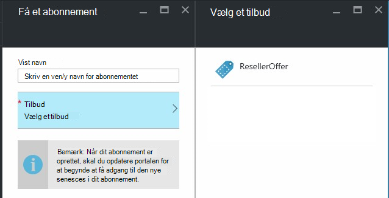

<properties
    pageTitle="Delegering tilbud Azure stablede | Microsoft Azure"
    description="Lær at flytte andre ansvarlig for oprettelse af tilbud og tilmelding brugere for dig."
    services="azure-stack"
    documentationCenter=""
    authors="AlfredoPizzirani"
    manager="byronr"
    editor=""/>

<tags
    ms.service="azure-stack"
    ms.workload="na"
    ms.tgt_pltfrm="na"
    ms.devlang="na"
    ms.topic="article"
    ms.date="10/07/2016"
    ms.author="alfredop"/>

#Delegering tilbud Azure stablede

Som tjenesteadministrator af en vil du ofte placere andre ansvarlig for oprettelse af tilbud og tilmelding brugere for dig. For eksempel kan dette ske, hvis du er en tjenesteudbyder og ønskede forhandlere til at tilmelde dig kunder og administrere dem på dine vegne. Det kan også ske i en virksomhed, hvis du er en del af en central IT-gruppe og vil divisioner eller datterselskaber til at tilmelde brugere uden din brugerinput.

Delegering hjælper dig med at med disse opgaver, så du kan oprette forbindelse til og administrere flere brugere, end du ville være mulighed for at gøre direkte. Følgende illustration viser ét niveau af delegering, men Azure stak understøtter flere niveauer. Delegeret udbydere kan også uddelegere til andre udbydere, op til fem niveauer.

Administratorer kan uddelegere oprettelse af tilbud og lejere til andre brugere ved hjælp af funktionen delegering.

##Roller og trinnene i delegering

For at forstå delegering, skal du huske, der er tre roller, der er involveret:

-   **Tjenesteadministratoren** administrerer Azure stak infrastrukturen, opretter en skabelon til tilbud og uddelegerer andre til at tilbyde for brugerne.

-   Delegeret brugerne kaldes **delegerede udbydere**. De kan tilhøre andre organisationer (såsom andre Azure Active Directory-lejere).

-   **Brugere** tilmelde sig tilbud og bruge dem til administration af deres arbejdsbelastninger, oprette FOS, lagring af data, osv.

Som vist i følgende illustration, er der to trin i at konfigurere delegering.

1.  Identificere delegeret udbydere. Gøre dette ved at abonnere et tilbud, der er baseret på en plan, der indeholder kun tjenesten abonnementer.
    Brugere, der Abonner på dette tilbud anskaffe nogle af de tjenesteadministratoren funktioner, herunder muligheden for at udvide tilbud, og log brugere til dem.

2.  Uddelegere et tilbud til delegeret udbyder. Dette tilbud fungerer som en skabelon til hvad provideren delegeret kan tilbyde. Provideren delegeret er nu kan du tage tilbuddet, Vælg et navn til den (men ikke ændre dens tjenester og kvoter), og Tilbyd kunder.

Hvis du vil fungere som delegeret udbydere, skal brugeren til at etablere en relation med den primære søgemaskine med andre ord, de skal bruge til at oprette et abonnement. I dette scenarie skal identificerer dette abonnement udbyderne delegeret som rettigheder til at præsentere tilbud på vegne af den primære søgemaskine.

Når der er oprettet i denne relation, kan systemadministratoren uddelegere et tilbud til delegeret udbyderen. Provideren delegeret er nu i stand til at tage tilbuddet, omdøbe den (men ikke ændre kernetemperatur), og Tilbyd sine kunders.

For at oprette en delegeret udbyder skal uddelegere et tilbud, og Bekræft, at brugere kan tilmelde sig den ved at udføre instruktionerne i de følgende afsnit.

##Konfigurere roller

For at få vist en delegeret udbyder på arbejdet, du har brug for flere Azure Active Directory-konti ud over administratorkontoen service. Hvis du ikke har dem, kan du oprette de to konti. Kontiene, der kan tilhøre en hvilken som helst AAD lejer. Vi vil henvise til dem som provideren delegeret (DP), og brugeren.

| **Rolle** | **Organisatoriske rettigheder** |
| -------------------- | ----------------------- |
|  Delegeret udbyder | Bruger |
| Bruger | Bruger |

##Identificere udbyderne delegeret

1.  Log på som tjenesteadministratoren.

2.  Oprette de tilbud, der gør det muligt for lejere at blive delegeret udbydere. Dette kræver, at du opretter en plan og et tilbud, der er baseret på den:

    en.  [Opret en plan](azure-stack-create-plan.md).
        Denne plan bør omfatte tjenesten abonnementer. I denne artikel bruge vi en plan, kaldet PlanForDelegation.

    b.  [Oprette et tilbud](azure-stack-create-offer.md) 
     baseret på denne plan. I denne artikel bruge vi et tilbud, kaldet OfferToDP.

    c.  Når oprettelsen af tilbuddet er fuldført, tilføje bruger-ID for provideren delegeret som en lejer til dette tilbud ved at klikke på     **abonnementer** &gt; **Tilføj** &gt; **Nyt lejer abonnement**.

  

> [AZURE.NOTE]Med alle Azure stak tilbud, du har mulighed for at fortælle tilbuddet offentlige og så brugerne tilmelde sig den, eller at beholde den private og har tjenesteadministratoren administrere tilmeldingen. Delegeret udbydere er normalt en lille gruppe, og du vil styre, hvem der er optaget til det, så beholde dette tilbud privat giver mening i de fleste tilfælde.

##Tjenesteadministrator opretter delegeret tilbuddet

Du har nu oprettet udbyderen delegeret. Næste trin er at oprette plan og tilbud, du vil uddelegere, og som kunderne skal bruge. Du skal definere dette tilbud, præcis, som du have kunderne til at se det, fordi provideren delegeret ikke vil kunne ændre planer og kvoter for den indeholder.

1.  Som tjenesteadministratoren, [Opret en plan](azure-stack-create-plan.md) eller [et tilbud](azure-stack-create-offer.md) baseret på den. I denne artikel er bruge vi et tilbud, kaldet DelegatedOffer.
> [AZURE.NOTE]Dette tilbud er ikke nødvendigt at offentliggøres. Det kan gøres offentlige Hvis du vælger, men i de fleste tilfælde kan du kun vil delegeret udbydere skal have adgang til den. Når du uddelegere et privat tilbud, som beskrevet i følgende trin, vil provideren delegeret have adgang til den.

2.  Uddelegere tilbuddet. Gå til DelegatedOffer, og på fanen Indstillinger skal du klikke på **Delegerede udbydere** &gt; **Tilføj**.

3.  Vælg provideren delegeret abonnement feltet rullelisten, og klik på **stedfortræderen**.

> 

##Delegeret udbyder tilpasser tilbuddet

Log på som delegeret udbyder og oprette et nyt tilbud, ved hjælp af delegeret tilbuddet som en skabelon.

1.  Klik på **nyt** &gt; **lejer indeholder + plan** &gt; **tilbyder**.

    

2.  Tildele et navn til tilbuddet. Her kan vi vælge ResellerOffer. Vælg delegeret tilbuddet basere det på, og klik derefter på **Opret**.
    
    

    >[AZURE.NOTE] Bemærk forskellen sammenlignet med tilbyder oprettelse af som erfarne af tjenesteadministratoren. Delegeret udbyder oprette ikke tilbuddet fra basis-planer og -tilføjelsesprogram planer; Hun kan kun vælge fra tilbud, der er blevet uddelegeret for hende, og du ikke vil foretage ændringer i dem..

3. Offentliggøre tilbuddet ved at klikke på **Gennemse** &gt; **tilbyder**, at tilbuddet, og klikke på **Skift tilstand**.

4. Provideren delegeret Fremviser disse tilbud via sin egen portal URL-adresse. Bemærk, at disse tilbud synlige kun via denne delegeret portal. Til at finde og ændre denne URL-adresse:

    en.  Klik på **Gennemse** &gt; **udbyder indstillinger** &gt; **portalen URL-adresse**.

    b.  Ændre udbyder-ID'ET, hvis du ønsker.

    c.  Kopiere portalen URL-adressen til et andet sted, som Notesblok.

    
<!-- -->
Du har nu fuldført oprettelse af et tilbud om delegeret som en delegeret udbyder. Log af som delegeret udbyder. Luk fanen browser, du har brugt.

##Tilmelde sig tilbuddet

1.  Gå til portalen delegeret i et nyt browservindue, URL-adresse, du har gemt i det forrige trin. Log på portalen som bruger. Bemærk: Du skal bruge portalen delegeret til dette trin. Delegeret tilbuddet kan ikke ses på anden måde.

2.  Klik på **Hent et abonnement**i dashboard. Der vises, vises kun de delegerede tilbud, der er oprettet af provideren delegeret for brugeren:

> 

Dette fuldfører processen med at tilbud delegering. Brugeren kan nu tilmelde dig til dette tilbud ved at få et abonnement til den.

##Flere lag delegering

Flere niveauer af stedfortræderfunktionen kan delegeret hos udbyderen for at uddelegere tilbuddet til andre enheder. Dette kan for eksempel oprettelse af dybere forhandler kanaler, den udbyder, administrere Azure stak uddelegerer et tilbud til en forhandler, der også delegerer til forhandler.
Azure stak understøtter op til fem niveauer af delegering.

For at oprette flere niveauer af tilbud delegering delegerer provideren delegeret tur. tilbuddet til den næste udbyder. Processen er det samme for provideren delegeret som den var for tjenesteadministratoren (se [tjenesteadministrator opretter delegeret tilbuddet](#service-admin-creates-the-delegated-offer)).

##Næste trin
[Klargøre en VM](azure-stack-provision-vm.md)
