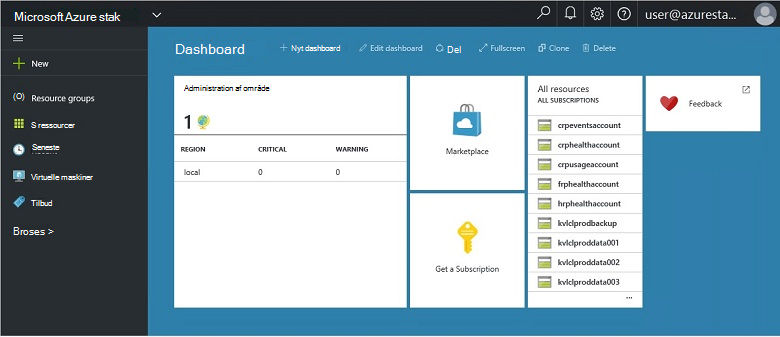
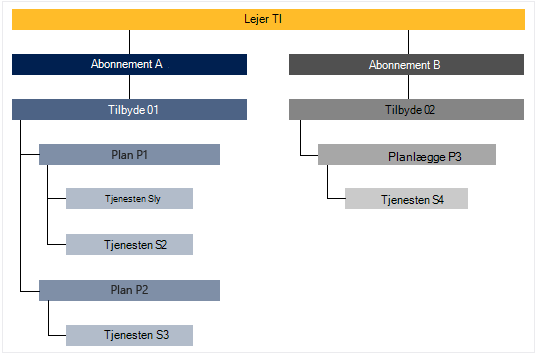

<properties
    pageTitle="De primære funktioner og begreber Azure stablede | Microsoft Azure"
    description="Få mere at vide om de vigtigste funktioner og begreber Azure stablede."
    services="azure-stack"
    documentationCenter=""
    authors="Heathl17"
    manager="byronr"
    editor=""/>

<tags
    ms.service="azure-stack"
    ms.workload="na"
    ms.tgt_pltfrm="na"
    ms.devlang="na"
    ms.topic="article"
    ms.date="10/25/2016"
    ms.author="helaw"/>

# De vigtigste funktioner og -koncepter Azure stablede

Hvis du er ny bruger af Microsoft Azure stak, vil disse vilkår og Funktionsbeskrivelse kan være nyttige.

## Personas

Der findes to varianter af brugere til Microsoft Azure stak, tjenesteadministratoren og lejer (kunde).

-  En **tjenesteadministratoren** kan konfigurere og administrere ressource udbydere, lejer tilbud, planer, tjenester, kvoter og priser.
-  En **lejer** får (eller køb) tjenester, der indeholder tjenesteadministratoren. Lejere kan klargøre, overvåge og administrere tjenester, de har abonneret på, som Web Apps, lager og virtuelle computere.

## Portal

De primære metoder til at arbejde med Microsoft Azure stak er portalen og PowerShell.

Portalen Microsoft Azure stak er en forekomst af portalen Azure, der kører på servere. Det er et websted, der giver en selvbetjening oplevelse til både tjenesteadministratorer og lejere rollebaseret adgangskontrol (RBAC) til ressourcer og skyen kapacitet, aktivere hurtig programmet og service udvikling og installation.

## Områder, tjenester, planer, tilbud og abonnementer

Azure stablede leveres services til lejere ved hjælp af områder, abonnementer, tilbud og planer. Lejere kan abonnere på flere tilbud. Tilbud kan have en eller flere planer, og plan kan have en eller flere tjenester.

Eksempel hierarki for en lejer abonnementer til tilbud, hver med varierende planer og tjenester.

### Områder
Azure stablede områder er et grundlæggende element i skala og administration.  En organisation muligvis flere områder med ressourcer, der er tilgængelige i hvert område.  Områder kan også være forskellige servicetilbud, der er tilgængelige.

### Tjenester

Microsoft Azure stak gør det muligt at levere en lang række tjenester og programmer, som virtuelle maskiner, SQL Server-databaser, SharePoint, Exchange og mere.

### Planer

Planer er grupperinger af en eller flere tjenester. Du kan oprette planer til at tilbyde til din lejere som en udbyder. Også Abonner din lejere på dine tilbud til at bruge de planer og -tjenester, de indeholder.

Hver tjeneste, der er føjet til en plan kan konfigureres med kvote indstillinger kan hjælpe dig med at administrere din skyen kapacitet. Kvoter kan indeholde begrænsninger som VM, RAM og CPU begrænsninger og anvendes per bruger abonnement. Kvoter kan skelnes mellem efter placering. En plan, der indeholder Beregn tjenester fra område A kan for eksempel har en kvote af to virtuelle maskiner, 4GB RAM og 10 CPU-kerner.

Når du skriver et tilbud, kan tjenesteadministratoren medtage **base planer**. Disse grundlæggende planer er som standard inkluderes, når en lejer abonnerer på, der tilbyder. Så snart en bruger abonnerer (og abonnementet er oprettet), har brugeren adgang til alle de ressource-udbydere, der er angivet i disse grundlæggende planer (med de tilsvarende kvoter).

Tjenesteadministratoren kan også indeholde **tilføjelsesprogram planer** i et tilbud. Tilføjelsesprogrammet planer medtages ikke som standard i abonnement. Tilføjelsesprogrammet planer er flere planer (kvoter), der er tilgængelige i et tilbud, der ejer af et abonnement kan føje til deres abonnementer.

### Tilbud

Tilbud er grupper af en eller flere planer, der udgør udbydere til lejere til at købe (abonnere på). For eksempel kan tilbyder Alpha indeholde Plan A (fra Region 1, der indeholder et sæt Beregn services) og planlægge B (i område 2, der indeholder et sæt af lager og netværk tjenester).

Et tilbud leveres med et sæt af grundlæggende planer, og tjenesteadministratorer kan oprette tilføjelsesprogram planer, som lejere kan føje til deres abonnement.

### Abonnementer

Et abonnement er, hvordan lejere købe dine tilbud. Et abonnement er en kombination af en lejer med et tilbud. En lejer kan have abonnementer til flere tilbud. Hvert abonnement gælder for kun én tilbud. En lejer abonnementer bestemme, hvilke planer/tjenester, de kan få adgang til.

Abonnementer hjælpe udbydere organisere adgang og brug af skyen ressourcer og -tjenester.

## Azure ressourcestyring

Ved hjælp af Azure Ressourcestyring, kan du arbejde med dine infrastruktur ressourcer i en skabelon baseret, declaritive model.   Den indeholder en enkelt grænseflade, som du kan bruge til at implementere, administrere og overvåge din løsningskomponenter, som virtuelle maskiner, lager konti, webapps og databaser. Få vist [Azure ressourcestyring oversigt](../azure-resource-manager/resource-group-overview.md)yderligere oplysninger og vejledning.

### Ressourcegrupper

Grupper er en samling af ressourcer, tjenester og programmer – og hver ressource har en type, som virtuelle maskiner, virtuelle netværk, offentlige IP-adresser, lagerplads konti, og websteder. Hver ressource skal være i en ressourcegruppe og så ressourcegrupper Hjælp logisk organisere ressourcer, som ved arbejdsbelastningen eller placering.

Her er nogle vigtige ting, du bør overveje, når du definerer en ressourcegruppe:

-   Hver ressource kan kun findes i én ressourcegruppe.

-   Du vil installere, opdatere og slette elementer i en ressourcegruppe sammen. Hvis en ressource, som en databaseserver, skal findes på en anden installation cyklus, skal den være i en anden ressourcegruppe.

-   Du kan tilføje eller fjerne en ressource til en ressourcegruppe når som helst.

-   Du kan flytte en ressource fra én ressourcegruppe til en anden gruppe.

-   En ressourcegruppe kan indeholde ressourcer, der er placeret i forskellige områder.

-   En ressourcegruppe kan bruges til at begrænse adgang til kontrol af administrative handlinger.

-   En ressource kan sammenkædes med en ressource i en anden ressourcegruppe, når de to ressourcer skal interagere med hinanden, men de kan ikke dele den samme livscyklus. For eksempel flere apps skal oprette forbindelse til en database, men denne database skal ikke opdateres eller slettes i den samme tempo som apps.

-   Microsoft Azure stablede administreres ressourcer som planer og tilbyder også i grupper.

-   Du kan geninstallere en ressourcegruppe.  Dette er nyttigt til test eller udvikling formål.  

### Azure ressourcestyring skabeloner

Med Azure Resource Manager, kan du oprette en simpel skabelon (i JSON-format), der definerer installation og konfiguration af dit program. Denne skabelon, der kendes som en skabelon til Azure ressourcestyring og giver en deklarativ måde til at definere installation. Ved hjælp af en skabelon, kan du gentagne gange installere dit program i hele app livscyklus og har tillid til dine ressourcer er installeret på en konsistent tilstand.

## Ressource udbydere (RPs) – netværk RP, beregne RP lagerplads RP

Ressource udbydere er webtjenester, der udgør grundlaget for alle Azure-baserede IaaS og PaaS tjenester. Azure ressourcestyring er afhængig af forskellige RPs til at give adgang til en værten services.

Der er tre primære RPs: netværk, lager og Beregn. Hver af disse RPs hjælper dig med at konfigurere og styre dens respektive ressourcer. Administratorer kan også tilføje nye brugerdefinerede ressource udbydere.

### Beregne RP

Den beregne ressource udbyder (Kapacitetsplanlægning) kan Azure stak lejere til at oprette deres egne virtuelle computere. Den indeholder også funktionalitet til tjenesteadministratoren til at installere og konfigurere ressource provideren til lejere. Kapacitetsplanlægning omfatter mulighed for at oprette virtuelle maskiner samt virtuelt filtypenavne. Tjenesten Virtual Machine lokalnummer hjælper med at give IaaS funktioner til Windows og Linux virtuelle computere.

### Netværk RP

Netværk ressource udbyder (NRP) leverer en række Software defineret netværk (SDN) og netværk funktionen Virtualization (NFV) funktioner for privat skyen. Disse funktioner er i overensstemmelse med Azure offentlige skyen så programskabeloner kan skrives én gang og installeret både i Azure offentlige skyen eller lokale Microsoft Azure stablen. Netværk RP giver dig mere detaljeret kontrolelement i netværk, metadata mærker, hurtigere konfiguration, hurtig og gentaget tilpasning og flere grænseflade til styring af (herunder PowerShell .NET SDK Node.JS SDK, og RESTEN-baseret API). Du kan bruge NRP til at oprette software Indlæs balancere, offentlige IP'er netværk sikkerhedsgrupper, virtuelt Network blandt andet.

### Lagerplads RP

Lagerplads RP leverer fire Azure-ensartet lagerplads tjenester: blob, tabel, kø og kontoadministration. Den indeholder også en lagerplads skytjeneste administration for at lette service provider administrationen af Azure-ensartet lagerplads tjenester. Azure-lager giver mulighed for at gemme og hente store mængder ustrukturerede data, som dokumenter og mediefiler med Azure BLOB og strukturerede NoSQL baseret data med Azure tabeller. Du kan finde flere oplysninger om Azure-lager, [Introduktion til Microsoft Azure-lager](../storage/storage-introduction.md).

#### BLOB-lager

BLOB storage gemmer et datasæt. En blob kan være en hvilken som helst type af tekst eller binære data, som et dokument, mediefil eller program installer. Tabellagring gemmer strukturerede datasæt. Tabellagring er en NoSQL nøgle-attribut-datalager, som giver mulighed for hurtig udvikling og hurtig adgang til store datamængder. Kø lagerplads indeholder pålidelig messaging til arbejdsprocesser og af kommunikation mellem komponenter i skytjenester.

Alle blob er organiseret under en objektbeholder. Beholdere giver også en god måde at tildele sikkerhedspolitikker til grupper af objekter. En lagerplads konto kan indeholde et vilkårligt antal beholdere, og en objektbeholder kan indeholde et vilkårligt antal BLOB op til 500 TB kapacitetsgrænsen på kontoen lagerplads. BLOB storage tilbud tre typer blob, blokere blob, tilføje BLOB og siden BLOB (diske). Bloker BLOB er optimeret til streaming og lagring af skyen objekter, og er et godt valg til lagring af dokumenter, mediefiler, sikkerhedskopier osv. Tilføje BLOB ligner Bloker blob, men er optimeret til tilføje handlinger. En Føj blob kan opdateres kun ved at tilføje en ny blok til slutningen. Tilføje BLOB er et godt valg for scenarier som logføring, hvor nye data skal skrives kun til slutningen af blob. Siden BLOB er optimeret til at repræsentere IaaS diske og understøttende tilfældige skriver og kan være op til 1 TB i størrelse. Et netværk med Azure virtuelt vedhæftet IaaS disken er en virtuel harddisk, der er gemt som en side blob.

#### Tabellagerplads

Tabellagring er Microsofts NoSQL nøgle/attribut store – den har et design uden skemaer, hvilket gør det adskiller sig fra traditionelle relationsdatabaser. Da data gemmer manglende skemaer, er det nemt at tilpasse dine data som behovet i dit program evolve. Tabellagring er nem at bruge, så udviklere kan oprette programmer hurtigt. Tabellagring er en nøgle-attribut butik, hvilket betyder, at hver værdi i en tabel er gemt med et indtastede egenskabsnavn. Egenskabsnavn kan bruges til filtrering og angive udvælgelseskriterier. En samling af egenskaber og deres værdier omfatter et objekt. Siden tabel lagerplads manglende skemaer, to objekter i den samme tabel kan indeholde forskellige samlinger af egenskaber, og disse egenskaber kan være forskellige datatyper. Du kan bruge Table storage til at gemme fleksible datasæt, som brugerdata for webprogrammer, adressekartoteker, enhedsoplysninger og enhver anden type metadata, der kræver, at din tjeneste. Du kan gemme et vilkårligt antal objekter i en tabel, og en lagerplads konto kan indeholde et vilkårligt antal tabeller, op til kapacitetsgrænsen til kontoen, lagerplads.

#### Kø lagerplads
Azure kø lagerplads indeholder skyen messaging mellem programkomponenter. Designe programmer til skala, Afkoblet programkomponenter ofte, så de kan skalere uafhængigt af hinanden. Kø lagerplads leverer asynkron messaging af kommunikation mellem programkomponenter, uanset om de kører i skyen, på skrivebordet, på en lokal server eller på en mobilenhed. Kø lagerplads understøtter også administration af asynkrone opgaver og opbygning af processen arbejdsgange.

## Rollebaseret adgangskontrol (RBAC)

Du kan bruge RBAC til at give adgang til autoriserede brugere, grupper og -tjenester ved at tildele dem roller i et abonnement, ressourcegruppe eller individuelle ressourceniveau. Hver rolle definerer det adgangsniveau, en bruger, gruppe eller tjeneste har over Microsoft Azure stak ressourcer.

Azure RBAC har tre grundlæggende roller, der gælder for alle ressourcetyper: ejer, bidragyder og læser. Ejeren har fuld adgang til alle de ressourcer, herunder ret til at stedfortræderadgang til andre. Bidragyder kan oprette og administrere alle typer Azure ressourcer, men kan ikke give adgang til andre. Læser kan kun få vist eksisterende Azure ressourcer. Resten af RBAC roller i Azure Tillad styring af bestemte Azure ressourcer. For eksempel rollen bidragyder virtuelt tillader oprettelse og administration af virtuelle maskiner, men ikke styring af det virtuelle netværk eller det undernet, som den virtuelle maskine opretter forbindelse til.

## Data om brug af

Microsoft Azure stak indsamler og samler Brugsdata på tværs af alle ressource udbydere til at levere en kortfattet rapport per bruger. Data kan være så enkelt som antal anvendte ressourcer, eller mere komplekse som individuelle ydeevne og skalering tællere. Data, der er tilgængelige via REST-API. Der er en Azure-ensartet lejer API samt udbyder og delegerede udbyder API'er til at hente Brugsdata på tværs af alle lejer abonnementer. Disse data kan bruges til at integrere med en ekstern værktøj eller tjeneste for fakturerings- eller kortejeren.

## Næste trin

[Installere Azure stak Technical Preview 2 (Konceptet)](azure-stack-deploy.md)
