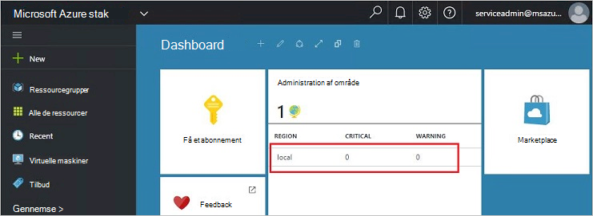
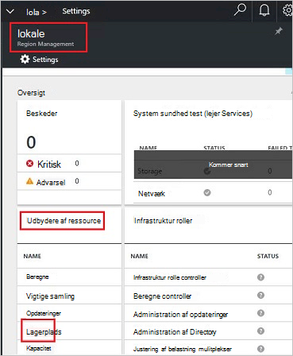
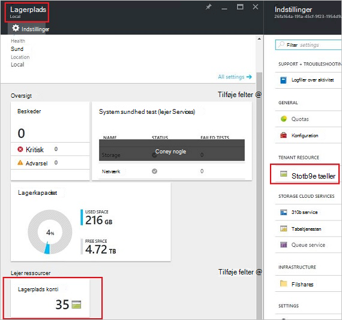
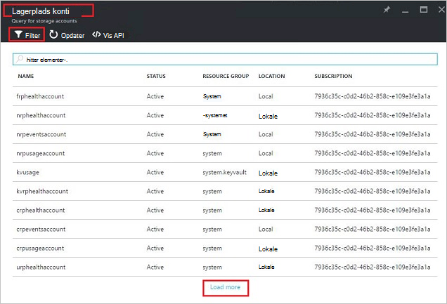
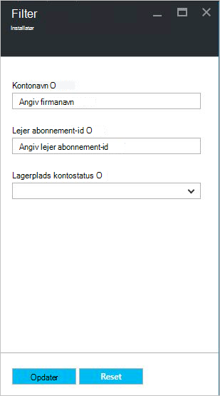
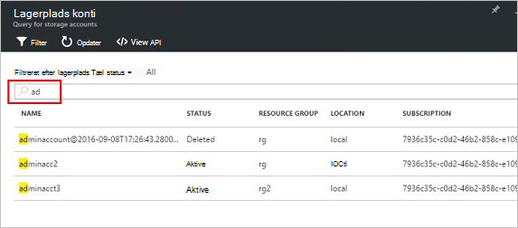
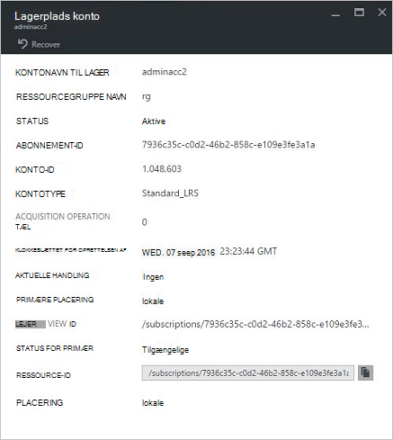
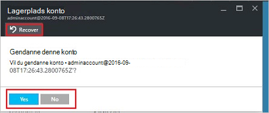
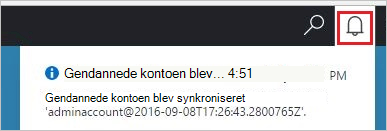
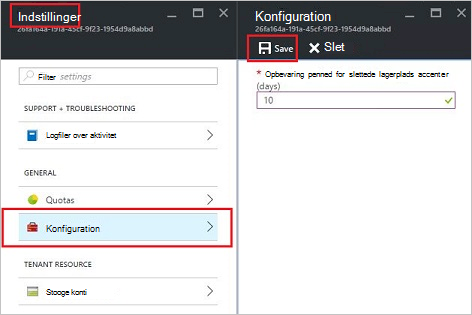

<properties
    pageTitle="Administrere Azure stak lagerplads konti | Microsoft Azure"
    description="Lær at finde og administrere, gendanne og frigøre Azure stak lagerplads konti"
    services="azure-stack"
    documentationCenter=""
    authors="AniAnirudh"
    manager="darmour"
    editor=""/>

<tags
    ms.service="azure-stack"
    ms.workload="na"
    ms.tgt_pltfrm="na"
    ms.devlang="na"
    ms.topic="get-started-article"
    ms.date="09/26/2016"
    ms.author="anirudha"/>

# <a name="manage-storage-accounts-in-azure-stack"></a>Administrere lager konti Azure stablede

Lær, hvordan du administrerer lager konti Azure stablede at finde og gendanne og frigøre lagerkapacitet baseret på virksomhedens behov.

## <a name="find-a-storage-account"></a>Finde en lagerplads konto

Listen over lagerplads konti i området, kan ses i Azure stak ved at:

1.  Gå til [https://portal.azurestack.local](https://portal.azurestack.local/)i en webbrowser.

2.  Log på portalen Azure stak som administrator (ved hjælp af de legitimationsoplysninger, du har angivet under installationen)

3.  Find **område management** liste på standarddashboardet til – og klik på det område, du vil udforske – for eksempel **(lokale**).

    

4.  Vælg **lagerplads** fra listen **Ressource udbydere** .

    

5.  Rul ned til fanen "Lagerplads konti" nu på bladet lagerplads ressource udbyder administrator – og klik på den.

    
    
    Den resulterende side er på listen over lagerplads konti i det pågældende område.

    

Som standard vises de første 10 konti. Du kan vælge at hente mere ved at klikke på "indlæse mere" link i bunden af listen <br>
ELLER <br>
Hvis du er interesseret i en bestemt lagerplads konto – kan du **filtrere og hente de relevante konti** kun.<br>

Filtrere for konti:

1. Klik på knappen filter øverst på bladet.

2. Det kan du angive **kontonavn**,  **abonnement-ID** eller **status** for at finjustere listen over lagerplads konti skal vises på bladet filter. Bruge dem efter behov.

3. Klik på Opdater. På listen skal opdatere i overensstemmelse hermed.

    

4. Rydde indstillingerne for at nulstille filteret – Klik på knappen filter, og Opdater.

Tekstfeltet Søg øverst på bladet lagerplads konti liste kan du markere teksten i listen over konti. Dette er praktisk i tilfælde, når den fulde navn eller -id ikke er tilgængelige.<br>
Du kan bruge fri tekst her til at finde den konto, du er interesseret i.




## <a name="look-at-account-details"></a>Se på kontooplysninger

Når du har fundet de konti, du er interesseret i at få vist, kan du klikke på den pågældende konto at få vist bestemte oplysninger. En ny blade åbnes med kontooplysninger som typen konto, oprettelsestidspunkt, placering osv.




## <a name="recover-a-deleted-account"></a>Gendanne en slettet konto

Du kan være i en situation, hvor du vil gendanne en slettet konto.<br>
I AzureStack er der en meget simpel måde at gøre dette.

1.  Gå gå til listen over konti lagerplads. [Se finde en lagerplads konto](#find-a-storage-account)

2.  Find den pågældende konto på listen. Du skal muligvis filtrere.

3.  Kontrollere 'Status' for kontoen. Skal der stå "slettet".

4.  Klik på den konto, der åbnes bladet konto detaljer.

5.  Find knappen "Gendan" oven på denne blade – og klik på den.

6.  Bekræfte ved at trykke på "Ja"

    

7.  At genoprettelsen er nu i processen... Vent til angivelse af, at det lykkedes for.
    Du kan også klikke på "klokkeikonet" øverst i portalen for at få vist status angivelser.

    

  Når kontoen gendannet er blevet synkroniseret, kan en gå tilbage til at bruge den.

### <a name="some-gotchas"></a>Nogle faktorer

- Kontoen slettede viser tilstand som "opbevaring af".

  Det betyder, at slettede kontoen har overskredet opbevaringsperioden og kan ikke gendannes længere.

- Kontoen slettede vises ikke i listen over konti.

  Det kan betyde, at den slettede konto er allerede blevet spildopsamlet. I dette tilfælde kan den ikke gendannes længere. Se "frigøre kapacitet" nedenfor.

## <a name="set-retention-period"></a>Angive opbevaringsperiode

Indstillingen af opbevaringsperiode kan en administrator for at angive et tidsrum i dage (mellem 0 og 9999 dage) som en hvilken som helst slettet konto potentielt kan gendannes. Opbevaringsperiode standard er indstillet til 15 dage. Konfigurer værdien til "0" betyder, at alle slettede konto bliver straks af opbevaring og markeret med henblik på at være periodiske Spildopsamling.

Ændre opbevaringsperiode –

1.  Gå til [https://portal.azurestack.local](https://portal.azurestack.local/)i en webbrowser.

2.  Log på portalen Azure stak som administrator (ved hjælp af de legitimationsoplysninger, du har angivet under installationen)

3.  Find **område management** liste på standarddashboardet til – og klik på det område, du vil udforske – for eksempel **(lokale**).

4.  Vælg **lagerplads** fra listen **Ressource udbydere** .

5.  Klik på ikonet Indstillinger øverst til at åbne bladet indstilling.

6.  Klik på konfiguration – opbevaringsperiode.

7.  Du kan redigere værdien og gemmer den.

 Denne værdi er umiddelbart effektive og afspejle på tværs af dit hele område.



## <a name="reclaim-capacity"></a>Frigøre kapacitet

En af effekterne side for at have en opbevaringsperiode er, at en slettet konto fortsætter med at bruge kapacitet, indtil det bliver af opbevaringsperioden. Nu som administrator, kan det være nødvendigt slettes en metode til at frigøre dette konti mellemrum selvom opbevaringsperioden endnu ikke er udløbet. I øjeblikket kan du bruge en cmdline til eksplicit tilsidesætte opbevaringsperioden og med det samme frigøre kapacitet. Gøre det –

1.  Hvis du har Azure-PowerShell installeret og konfigureret. Hvis den ikke skal du følge vejledningen her: for at installere den nyeste version af Azure PowerShell og knytte den til abonnementet Azure, se, [hvordan du installerer og konfigurerer Azure PowerShell](http://azure.microsoft.com/documentation/articles/powershell-install-configure/).
    Du kan finde flere oplysninger om Azure ressourcestyring-cmdletter i [Bruge PowerShell for Azure med Azure ressourcestyring](http://go.microsoft.com/fwlink/?LinkId=394767)

2.  Kør denne cmdlet:

    ```
    PS C:\\>; Clear-ACSStorageAccount -ResourceGroupName system
    -FarmName <your farmname>
    ```

> Få mere at vide i referere til [AzureStack powershell dokumentation](https://msdn.microsoft.com/library/mt637964.aspx)

> [AZURE.NOTE] Kører denne cmdlet sletter permanent kontoen og dens indhold. Det er ikke længere gendannes. Brug med omtanke.

