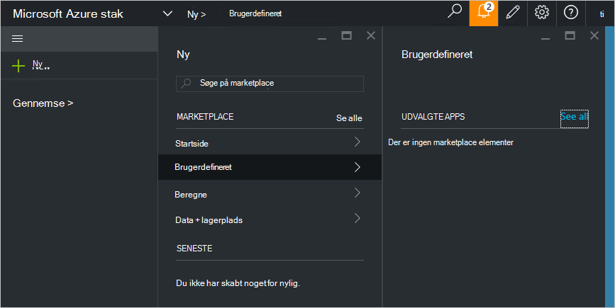

<properties
    pageTitle="Publicere et element i brugerdefineret marketplace Azure stablede (tjenesteadministratoren) | Microsoft Azure"
    description="Lær, hvordan du publicerer et brugerdefineret marketplace element Azure stablede som tjenesteadministrator af en."
    services="azure-stack"
    documentationCenter=""
    authors="rupisure"
    manager="byronr"
    editor=""/>

<tags
    ms.service="azure-stack"
    ms.workload="na"
    ms.tgt_pltfrm="na"
    ms.devlang="na"
    ms.topic="article"
    ms.date="09/26/2016"
    ms.author="rupisure"/>

# Azure stak Marketplace

På Marketplace er en samling af elementer, der er tilpasset til Azure stak, som tjenester, programmer og ressourcer. Det er det sted, hvor lejere kommer til at oprette nye ressourcer og implementere nye programmer. Administratorer kan tilføje brugerdefinerede elementer til Marketplace og lejere får vist dem det samme.

Klik på **Ny**for at åbne Marketplace.

På Marketplace opdateres hver fem minutter.

## Marketplace elementer

Hver Marketplace element har:

-   En Azure ressourcestyring skabelon til klargøring af ressource

-   Metadata, som strenge, ikoner og andre marketingmaterialer

-   Formateringsoplysninger elementet skal vises i portalen

Hvert element, der er publiceret til Marketplace bruger et format, kaldet pakken Azure galleriet (azpkg). Installation eller runtime ressourcer (som kode, zip-filer med softwaren eller virtuelt billeder) skal føjes til Azure stak separat, ikke som en del af det element, Marketplace. 

## Næste trin

[Oprette og publicere et element, der marketplace](azure-stack-create-and-publish-marketplace-item.md)
