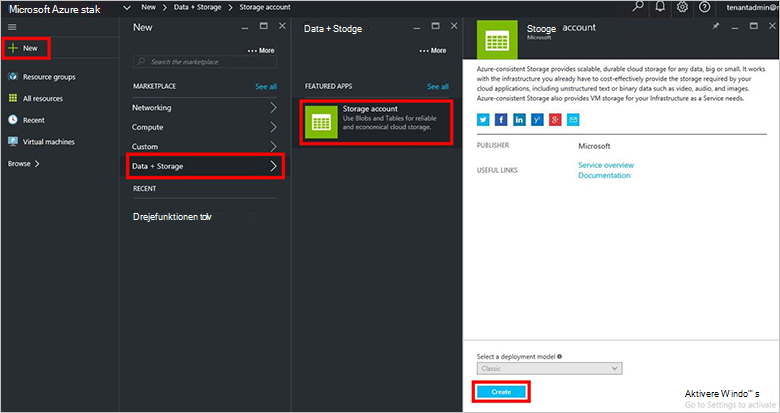

<properties
    pageTitle="Lagerplads konti i Azure stak | Microsoft Azure"
    description="Lær, hvordan du opretter en Azure stak lagerplads konto."
    services="azure-stack"
    documentationCenter=""
    authors="ErikjeMS"
    manager="byronr"
    editor=""/>

<tags
    ms.service="azure-stack"
    ms.workload="na"
    ms.tgt_pltfrm="na"
    ms.devlang="na"
    ms.topic="get-started-article"
    ms.date="09/26/2016"
    ms.author="erikje"/>

# Lagerplads konti Azure stablede

Lagerplads konti omfatter Blob og tabel tjenester og entydige navneområdet for din lagerplads dataobjekter. Dataene i din konto er kun tilgængelig for dig, kontoejeren lagerplads som standard.

1.  På computeren, Azure stak Konceptet, log på `https://portal.azurestack.local` som [administrator](azure-stack-connect-azure-stack.md#log-in-as-a-service-administrator), og klik derefter på **Ny** > **Data + lagerplads** > **lagerplads konto**.

    

2.  Skriv et navn til kontoen lagerplads i bladet **Opret lagerplads konto** . Oprette en ny **Ressourcegruppe**, eller Vælg et eksisterende dokument, og klik på **Opret** for at oprette kontoen lagerplads.

    

3. For at få vist din nye konto lagerplads, skal du klikke på **alle de ressourcer**, og derefter søge efter lagerplads kontoen og klikke på dens navn.

    
    
## Næste trin

[Bruge Azure ressourcestyring skabeloner](azure-stack-arm-templates.md)

[Få mere at vide om Azure lagerplads konti](../storage/storage-create-storage-account.md)

[Hente Azure stak Azure-ensartet lagerplads validering vejledning](http://aka.ms/azurestacktp1doc)
