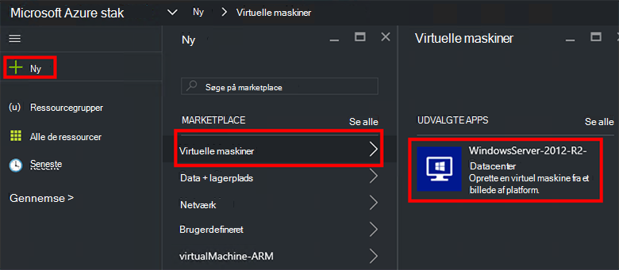
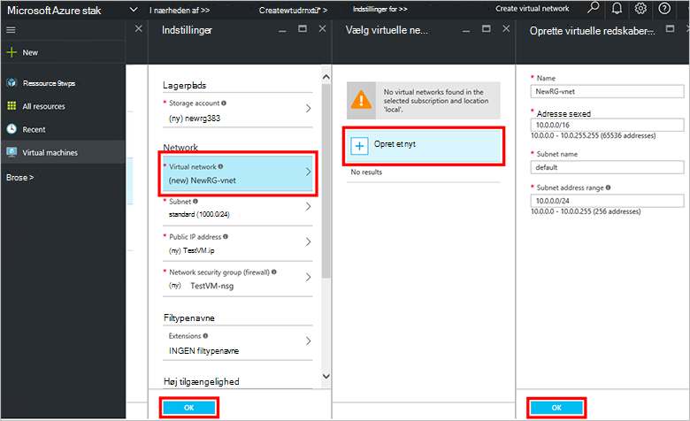
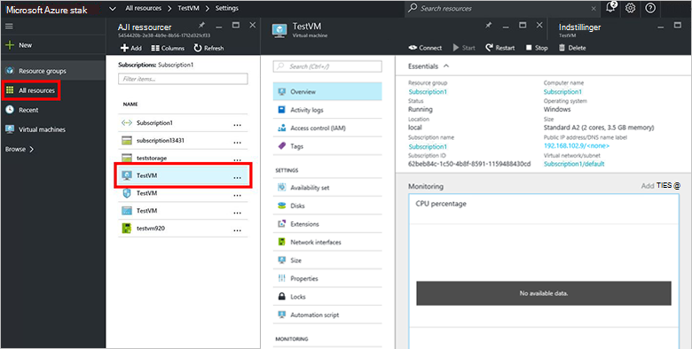

<properties
    pageTitle="Klargøre en VM Azure stablede (lejer) | Microsoft Azure"
    description="Lær, hvordan du klargør et VM Azure stablede som en lejer."
    services="azure-stack"
    documentationCenter=""
    authors="ErikjeMS"
    manager="byronr"
    editor=""/>

<tags
    ms.service="azure-stack"
    ms.workload="na"
    ms.tgt_pltfrm="na"
    ms.devlang="na"
    ms.topic="get-started-article"
    ms.date="10/12/2016"
    ms.author="erikje"/>

# Klargøre en virtuel maskine

Som administrator, kan du oprette virtuelle maskiner, hvis du vil evaluere ressourcer før tilbyder vedkommende i planer.

## Klargøre en virtuel maskine

1.  På computeren, Azure stak Konceptet, log på `https://portal.azurestack.local` som [administrator](azure-stack-connect-azure-stack.md#log-in-as-a-service-administrator), og klik derefter på **Ny** > **virtuelle maskiner** > **WindowsServer-2012-R2-Datacenter**.  

    

2.  Skriv et **navn**, **brugernavn**og **adgangskode**i bladet **grundlæggende funktioner** . Vælg **harddisk** **VM disk type**. Vælg et **abonnement**. Oprette en **ressourcegruppe**, eller Vælg et eksisterende dokument, og klik derefter på **OK**.  

3.  Klik på **A1 basis**i bladet **Vælg en størrelse** , og klik derefter på **Vælg**.  

4.  Klik på **virtuelle netværk**i bladet **Indstillinger** . Klik på **Opret ny**i bladet **Vælg virtuelt netværk** . Accepter alle standardværdier bladet **Opret virtuelt netværk** , og klik på **OK**. Klik på **OK**i bladet **Indstillinger** .

    

5.  Klik på **OK** for at oprette den virtuelle maskine i bladet **Oversigt** .  

6. For at få vist din nye virtuelle maskine, klik på **alle de ressourcer**, og derefter søge efter den virtuelle maskine og klikke på dens navn.

    

## Næste trin

[Lagerplads konti](azure-stack-provision-storage-account.md)
