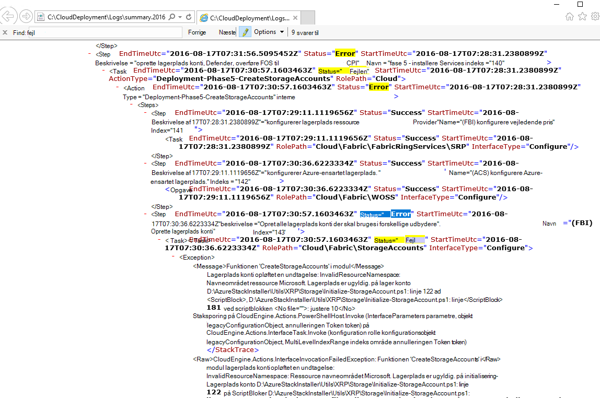
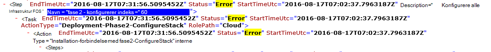

<properties
    pageTitle="Kør en installation fra en mislykkedes trin | Microsoft Azure"
    description="Hvis du får en fejl under installation, kan du forsøge følgende trin for at køre installationen fra hvor mislykkedes."
    services="azure-stack"
    documentationCenter=""
    authors="ErikjeMS"
    manager="byronr"
    editor=""/>

<tags
    ms.service="azure-stack"
    ms.workload="na"
    ms.tgt_pltfrm="na"
    ms.devlang="na"
    ms.topic="get-started-article"
    ms.date="09/26/2016"
    ms.author="erikje"/>
    
# Kør en installation fra en mislykkedes trin
  
Hvis du får en fejl under installation, kan du forsøge følgende trin for at køre installationen fra hvor mislykkedes.

## Finde fejlen

Noter om fejlen, specifikt den del, der kalder ud af, hvilket trin aktiveringen mislykkedes. For eksempel

**2016-08-17 00:30:57 fejl 1 > 1 > handling: Aktivering af trin 60.140.143 mislykkedes. Stoppe aktivering af handlingsplan.**

Dette er installation af trinnet, hvor du vil starte Kør af installationen.

## Finde flere detaljer ved fejl

Hvis du vil have flere oplysninger om fejlen, finde den tilknyttede **Oversigt. ÅÅÅÅ-MM-DD.tt.N.log.xml** i den **C:\CloudDeployment\Logs\* * mappe.
Søge efter strengen "Fejl", og følge den ned gennem output, indtil du ser en stor mængde ikke-XML-formateret tekst, der indeholder en fejlmeddelelse om (i dette afsnit ofte falder sammen med den sidste forekomst af strengen "Fejl"). Eksempel:

Du kan også bruge disse oplysninger til at registrere trinnet Kør, skal du følge "Indeks" tal fra den sidste fejl. I billedet ovenfor, kan du se (startende fra bunden): 143, 140 og derefter Hvis rulle op, kan du se 60:

Lægger alle sammen (nu oppefra og ned), skal åbne du 60.140.143, ligesom i PS console output til fejlen (som det ses i afsnittet "Finde fejl" ovenfor).

## Kør installationen på et bestemt trin

Nu hvor du har det trin, hvor installationen mislykkedes på, kan du forsøge a - Kør installationen fra trin.

> [AZURE.IMPORTANT] Følgende kommandoer skal køres af den korrekte bruger i forbindelse med fejlen, der er opstået. Hvis fejlen opstod før VÆRTEN blev føjet til domænet, kan du køre følgende som den lokale administratorkonto. Hvis fejlen opstod efter VÆRTEN blev føjet til domænet, kan du køre følgende som domæneadministrator (azurestack\azurestackadmin).

### Udføre kommandoen Aktiver EceAction

1. Importere fra en øgede PS konsol følgende moduler:

        Import-Module C:\CloudDeployment\CloudDeployment.psd1 -Force
        Import-Module C:\CloudDeployment\ECEngine\EnterpriseCloudEngine.psd1 -Force 

2. Derefter skal du udføre følgende kommando (eksempel fra et sted over anvendte her):

        Invoke-EceAction -RolePath Cloud -ActionType Deployment -Start 60.140.143 -Verbose

3.  Dette starter installationen fra det trin, der er identificeret ved Start parameteren - af kommandoen Aktiver EceAction

### Resultater af en - Kør /-Start

Uanset hvilken indstilling du vælger, skal installationen begynder igen starter fra den angivne - parameter.

1.  Hvis fejlen kan gendannes, fortsætter installationen gennem fuldførelse.

2.  Hvis installationen mislykkes igen, når...
    
    - på samme sted: fejlen er sandsynligvis ikke gendannes, og yderligere undersøgelse er påkrævet.

    - et nyt sted efter hvor den mislykkedes denne gang: Du kan forsøge samme fremgangsmåde for at få det i gang igen.

    - et nyt sted før hvor den mislykkedes denne gang: noget andet gik galt med et idempotent opkald, der kræver yderligere undersøgelse.

## Næste trin

[Oprette forbindelse til Azure stak](azure-stack-connect-azure-stack.md)

