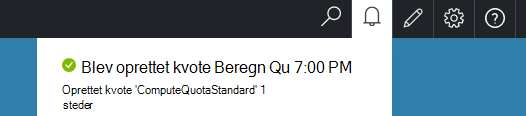

<properties
    pageTitle="Kvoter Azure stablede | Microsoft Azure"
    description="Administratorer angive kvoter for at begrænse den maksimale mængde ressourcer, som lejere har adgang til."
    services="azure-stack"
    documentationCenter=""
    authors="mattmcg"
    manager="byronr"
    editor=""/>

<tags
    ms.service="azure-stack"
    ms.workload="na"
    ms.tgt_pltfrm="na"
    ms.devlang="na"
    ms.topic="get-started-article"
    ms.date="09/26/2016"
    ms.author="mattmcg"/>

# Indstille kvoter Azure stablede

Kvoter definere grænserne for ressourcer, som en lejer abonnement kan klargøre eller forbruger. For eksempel kan en kvote tillade en lejer til at oprette op til fem FOS. Hvis du vil tilføje en tjeneste til en plan, skal administratoren konfigurere indstillingerne for kvote for den pågældende tjeneste.

Kvoter kan konfigureres efter tjeneste og efter placering, gør det muligt administratorer til at levere findelt kontrol over ressourceforbruget. Administratorer kan oprette en eller flere kvote ressourcer og knytte dem til planer, hvilket betyder, at de kan give opdelte tilbud til deres tjenester. Kvoter for en given tjeneste kan oprettes bladet **Ressource udbyder** administration for den pågældende tjeneste.

En lejer, som abonnerer på et tilbud, der indeholder flere planer kan bruge alle de ressourcer, der er tilgængelige i hver enkelt plan.

## Oprette en IaaS kvote

1.  Gå til [https://portal.azurestack.local](https://portal.azurestack.local/)i en browser.

    Log på portalen Azure stak som administrator (ved hjælp af de legitimationsoplysninger, som du angav under installationen).

2.  Vælg **Ny**, og vælg derefter **kvote**.

3.  Vælg den første tjeneste, du vil oprette en kvote. Følg disse trin for Beregn-, Netværks- og lagerplads tjenester for en IaaS kvote.
I dette eksempel skal oprette vi først en kvote for tjenesten beregn. Vælg **Microsoft.Compute.Admin** navneområdet på listen **Namespace** .

    > 

4.  Vælg det sted, hvor kvoten er defineret (for eksempel, 'lokal').

5.  Et **Kvote indstillinger** emne står der **angiver kapacitet lagerkvote**. Klik på elementet for at konfigurere indstillingerne for kvote.

6.  Under bladet **Indstille kvoter** , kan du se alle de Beregn de ressourcer, du kan konfigurere grænser. Hver type har en standardværdi, der er knyttet til den. Du kan ændre disse værdier, eller du kan vælge knappen **Ok** nederst i bladet til Accepter standardindstillingerne.

    > 

7.  Når du har konfigureret værdierne og har klikket på **Ok**, vises punktet **Kvote indstillinger** som **konfigureret**. Klik på **Ok** for at oprette **kvote for** ressourcen.

    Der vises en meddelelse, der angiver, at der oprettes kvote for ressourcen.

8.   Når sættet kvote er blevet oprettet, modtager du en anden meddelelse. Kvoten Beregn tjenesten er nu klar til at være knyttet til en plan. Gentag disse trin med Netværks- og -tjenester, og du er klar til at oprette en plan til IaaS!

    >   

## Beregne kvote typer

|**Type**                    |**Standardværdi**| **Beskrivelse**|
|--------------------------- | ------------------------------------|------------------------------------------------------------------|
|Maksimalt antal virtuelle maskiner   |50|Det maksimale antal virtuelle maskiner, der kan oprette et abonnement på denne placering. |
|Maksimalt antal virtuelt kerner              |100|Det maksimale antal kerner, der kan oprette et abonnement på denne placering (for eksempel en A3 VM har fire kerner).|
|Maks mængden af virtuelt hukommelse (GB)         |150|Den maksimale mængde RAM, der kan være klargjort i megabyte (for eksempel en A1 VM forbruger 1,75 GB RAM).|

> [AZURE.NOTE] Beregne kvoter ikke håndhæves i denne technical preview.

## Lagerplads kvote typer

|**Element**                           |**Standardværdi**   |**Beskrivelse**|
|---------------------------------- |------------------- |-----------------------------------------------------------|
|Maksimale kapacitet (GB)              |500                 |Samlede lagerkapacitet, der kan benyttes fra et abonnement på denne placering.|
|Samlet antal lagerplads konti   |20                  |Det maksimale antal lagerplads konti, der kan oprette et abonnement på denne placering.|

## Netværk kvote typer

|**Element**                                                   |**Standardværdi**   |**Beskrivelse**|
|----------------------------------------------------------| ------------------- |--------------------------------------------------------------------------------------------------------------------------------------------------------------------|
| Maks offentlige IP-adresser                         |50                  |Det maksimale antal offentlige IP-adresser, der kan oprette et abonnement på denne placering. |
| Maks virtuelle netværk                   |50                  |Det maksimale antal virtuelle netværk, der kan oprette et abonnement på denne placering. |
| Maks virtuelt netværk gateways           |1                   |Det maksimale antal virtuelt netværk gateways (VPN Gateways), som kan oprette et abonnement på denne placering. |
| Maks netværksforbindelser                |2                   |Det maksimale antal netværksforbindelser (punkt til punkt eller websted til websted), der kan oprette et abonnement på tværs af alle virtuelt netværk gateways på denne placering. |
| Maks Indlæs balancere                     |50                  |Det maksimale antal Indlæs balancere, der kan oprette et abonnement på denne placering. |
| Maks netværkskort                               |100                 |Det maksimale antal netværksgrænseflader, der kan oprette et abonnement på denne placering. |
| Maks netværk sikkerhedsgrupper            |50                  |Det maksimale antal netværk sikkerhedsgrupper, som kan oprette et abonnement på denne placering. |
