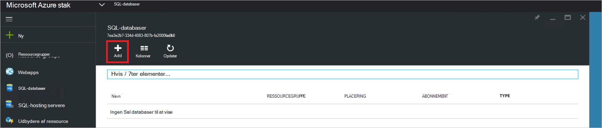

<properties
    pageTitle="Installere SQL Server ressource udbyder på Azure stak | Microsoft Azure"
    description="Detaljeret vejledning til at implementere en SQL Server ressource udbyder Adapter på Azure stablen."
    services="azure-stack"
    documentationCenter=""
    authors="Dumagar"
    manager="byronr"
    editor=""/>

<tags
    ms.service="multiple"
    ms.workload="na"
    ms.tgt_pltfrm="na"
    ms.devlang="na"
    ms.topic="article"
    ms.date="09/26/2016"
    ms.author="dumagar"/>

# Installere SQL Server ressource udbyder Adapter på Azure stak

> [AZURE.NOTE] Følgende oplysninger gælder kun for Azure stak TP1 installationer.

Bruge i denne artikel til at følge den detaljerede vejledning til konfiguration af SQL Server ressource udbyder Adapter på dokumentation for konceptet Azure stablen. Se [bruge SQL-databaser på Azure stak](azure-stack-sql-rp-deploy-short.md) at forstå ressource udbyder funktioner og arkitektur.

## Konfigurere trin, før du installerer

Før du installerer den ressource-udbyder, skal du:

- Har et standardbillede i Windows Server med .NET 3.5
- Deaktivere Internet Explorer (IE) udvidet sikkerhed
- Installere den nyeste version af Azure PowerShell

### Oprette et billede af Windows Server, herunder .NET 3.5

Hvis du har hentet Azure stak bit efter 2/23/2016, fordi base Windows Server 2012 R2 standardbilledet indeholder .NET 3.5 framework i denne overførsel og nyere, kan du springe dette trin.

Hvis du hentede, før 2/23/2016, skal du oprette en Windows Server 2012 R2 Datacenter Virtuelle med .NET 3.5 billede, og sæt er som standardbilledet i Platform billede-lager.

### Deaktivere IE forbedret sikkerhed og aktivere cookies

For at installere en ressource-udbyder, skal køre du PowerShell ISE Integrated Scripting miljø () som administrator, så skal du tillade cookies og JavaScript i Internet Explorer profilen du kan bruge til at logge på Azure Active Directory til både administrator- og logon.

**Forbedret sikkerhed for at deaktivere Internet Explorer:**

1. Log på Azure stak bevis af konceptet (konceptet) computeren som en AzureStack/administrator, og Åbn derefter Server Manager.

2. Deaktivere **Internet Explorer Enhanced Security Configuration** for både administratorer og brugere.

3. Log på virtuelt **ClientVM.AzureStack.local** som administrator, og Åbn derefter Server Manager.

4. Deaktivere **Internet Explorer Enhanced Security Configuration** for både administratorer og brugere.

**Aktivere cookies:**

1. På startskærmen i Windows, skal du klikke på **alle apps**, skal du klikke på **Tilbehør**, højreklik på **Internet Explorer**, peg på **flere**og klik derefter på **Kør som administrator**.

2. Hvis du bliver bedt om det, Markér **det anbefales at bruge sikkerhed**, og klik derefter på **OK**.

3. I Internet Explorer, skal du klikke på **værktøjer (tandhjulsikonet)** &gt; **Internetindstillinger** &gt; under fanen **beskyttelse af personlige oplysninger** .

4. Klik på **Avanceret**, Kontrollér, at begge **Acceptér** knapper er markeret, skal du klikke på **OK**, og klik derefter på **OK** igen.

5. Luk Internet Explorer, og genstart PowerShell ISE som administrator.

### Installere en Azure stak kompatible version af Azure PowerShell

1. Fjerne en eksisterende Azure PowerShell fra din klient VM.

2. Log på Azure stak Konceptet computeren som en AzureStack/administrator.

3. Ved hjælp af Fjernskrivebord, log på virtuelt **ClientVM.AzureStack.local** som administrator.

4. Åbn Kontrolpanel, skal du klikke på **Fjern et program** &gt; skal du klikke på **Azure PowerShell** &gt; skal du klikke på **Fjern**.

5. [Hent den nyeste Azure PowerShell, der understøtter Azure stak](http://aka.ms/azstackpsh) og installere den.

    Når du installerer PowerShell, kan du køre denne kontrol PowerShell-script for at sikre dig, at du kan oprette forbindelse til din Azure stak forekomst (en login webside skal vises).

## Bootstrap ressource udbyder installation PowerShell

1. Tilslut Azure stak Konceptet Fjernskrivebord til clientVm.AzureStack.Local og logge på som azurestack\\azurestackuser.

2. [Hent de SQLRP binære filer](http://aka.ms/massqlrprfrsh) fil. Du skal muligvis fjerne Internet download sikkerhed blok ved at højreklikke på filen, vælge **Egenskaber** og under fanen **Generelt** , aksemærker **Fjern blokering** **OK**. Dette bør forhindre 'Kunne ikke indlæses fil eller enhed' undtagelser, der er relateret til DeploymentTelemetry.dll og de efterfølgende sporing installation undtagelser.

3. Udtrække filerne til D:\\SQLRP.

4. Køre D:\\SQLRP\\Bootstrap.cmd filen som en administrator (azurestack\\administrator).

    Dette åbner filen Bootstrap.ps1 i PowerShell ISE.

5. Når vinduet PowerShell ISE fuldfører indlæsning, skal du klikke på afspilningsknappen, eller tryk på F5.

    

    To overordnede faner indlæses, hver indeholder alle scripts og filer, du vil installere provideren ressource.

## Forberede forudsætninger

Klik på fanen **Forberede forudsætninger for** at:

- Oprette kræves certifikater
- Overføre elementer til en konto til lagerplads på Azure stak
- Publicere galleriet elementer

### Oprette de krævede certifikater
Denne **Ny SslCert.ps1** script tilføjer den \_. AzureStack.local.pfx SSL-certifikat til D:\\SQLRP\\forudsætninger\\BlobStorage\\objektbeholder mappe. Certifikatet, der sikrer kommunikationen mellem provideren ressourcen og den lokale forekomst af Azure ressourcestyring.

1. Klik på fanen **Ny SslCert.ps1** under fanen **Forberede forudsætninger** overordnede og køre den.

2. Skriv en PFX adgangskode, der beskytter privat nøgle og **notere denne adgangskode**i prompten, der vises. Du skal bruge den senere.

### Overføre alle elementer til en konto til lagerplads på Azure stak

1. Klik på fanen **Overfør-Microsoft.Sql-RP.ps1** og køre den.

2. Skriv Azure stak service administratorlegitimationsoplysninger i dialogboksen Windows PowerShell legitimationsoplysninger anmodning.

3. Når du bliver bedt om Azure Active Directory-lejer ID, Skriv dit Azure Active Directory-lejer fuldstændige domænenavn: eksempelvis microsoftazurestack.onmicrosoft.com.

    Et pop op-vindue, der beder om legitimationsoplysninger.

    

    > [AZURE.TIP] Hvis pop op-vinduet ikke vises, skal du enten ikke har deaktiveret IE forbedret sikkerhed for at aktivere JavaScript på denne computer, og brugeren, eller du ikke har accepteret cookies i Internet Explorer. Se [konfigurere trin, før du installerer](#set-up-steps-before-you-deploy).

4. Skriv dine Azure stak Service Administratoroplysninger, og klik derefter på **Log på**.

### Publicere galleriet elementer til oprettelse af nyere ressource

Vælg fanen **Publicer GalleryPackages.ps1** og køre den. Dette script tilføjer to marketplace elementer til portalen Azure stak Konceptet marketplace, som du kan bruge til at udrulle databaseressourcer som marketplace elementer.

## Installere SQL Server ressource Provider VM

Nu hvor du har forberedt Azure stak konceptet med de nødvendige certifikater og marketplace elementer, kan du installere en SQL Server ressource-udbyder. Klik på fanen **installere SQL-provider** til:

   - Angive værdier i en JSON-fil, der refererer til installationsprocessen
   - Installere provideren ressource
   - Opdatere lokale DNS-Posterne
   - Registrere SQL Server ressource udbyder Adapter

### Angive værdier i JSON-fil

Klik på **Microsoft.Sqlprovider.Parameters.JSON**. Denne fil har parametre, der skal installeres korrekt til Azure stak skabelonen Azure ressourcestyring.

1. Udfyld de **tomme** parametre i JSON-filen:

    - Sørg for, at du giver dig **adminusername** og **adminpassword** til SQL ressource udbyder VM:

        

    - Sørg for, at du angive adgangskoden til parameteren **SetupPfxPassword** , du har foretaget noter i [forberede prequisites](#prepare-prerequisites) trin:

    

2. Klik på **Gem** for at gemme parameterfilen.

### Installere provideren ressource

1. Klik på fanen **Implementer-Microsoft.sql-provider.PS1** og køre scriptet.
2. Skriv navnet på din lejer i Azure Active Directory, når du bliver bedt om.
3. Sende dine Azure stak service Administratoroplysninger i pop op-vinduet.

Den fulde installation kan tage mellem 25 og 55 minutter på nogle meget udnyttet Azure stak POCs. De længste trin være filtypenavnet beskedteksten tilstand konfiguration (DTK) og udførelse af PowerShell, som er det sidste trin. Hver kan tage 10-25 minutter.

### Opdatere lokale DNS-Posterne

1. Klik på fanen **Register-Microsoft.SQL-fqdn.ps1** og køre scriptet.
2. Når du bliver bedt om Azure Active Directory-lejer ID, Indtast dit Azure Active Directory-lejer fuldstændige domænenavn: eksempelvis **microsoftazurestack.onmicrosoft.com**.

### Registrere provideren SQL RP ressource##

1. Klik på fanen **Register-Microsoft.SQL-provider.ps1** og køre scriptet.

2. Når du bliver bedt om legitimationsoplysninger, kan du bruge følgende værdier til brugernavn og din adgangskode:

   - **sqlRpUsername**
   - **sqlRpPassw0rd**

   > [AZURE.IMPORTANT] Dette er de *ordrette* værdier, du skal skrive, når du bliver bedt om legitimationsoplysninger. Disse er ikke pladsholdere. * *Kan *ikke* type ** username\password du har gemt i parameterfilen, før du anvender VM.

## Bekræfte den ved hjælp af portalen Azure stak installation

1. Log af ClientVM, og log på igen som **AzureStack\AzureStackUser**.

2. Klik på **Azure stak Konceptet Portal** på computeren, og log på portalen som tjeneste.

3. Kontrollér, at installationen er fuldført. Klik på **Gennemse** &gt; **Ressourcegrupper** &gt; skal du klikke på den ressourcegruppe, du har brugt (standard er **SQLRP**), og Sørg for, at essentials del af bladet (øverste halvdel) læser **installation lykkedes**.

      

4. Kontrollér, at registreringen lykkedes. Klik på **Gennemse** &gt; **ressource udbydere**, og se efter **SQL lokale**:

      

## Angive kapacitet til udbyderen SQL ressource ved at slutte den til en SQL server, der fungerer som vært

1. Log på portalen Azure stak Konceptet som en tjenesteadministrator

2. Klik på **ressourcen udbydere** &gt; **SQL lokale** &gt; **Gå til udbyder ressourcestyring** &gt; **servere** &gt; **tilføje**.

    Bladet **Vært for SQL-servere** er, hvor du kan oprette forbindelse SQL Server ressource-Provider til faktisk forekomster af SQL Server, der fungerer som provideren ressource backend-version.

    

3. Udfyld formularen med forbindelsesoplysningerne af SQL Server-forekomst. Som standard kaldet en forudkonfigurerede SQL Server "SQLRP" med administratornavn "systemadministratorens" og den adgangskode, du har fremhævet i parameteren "adminpassword" i parametrene JSON der kører på VM.

## Oprette din første SQL-Database for at teste din installation

1. Log på portalen Azure stak Konceptet som tjeneste.

2. Klik på **Gennemse** &gt; **SQL-databaser** &gt; **tilføje**
  

3. Udfyld formularen med database detaljer, herunder en **Servernavn**, **Server administrator logon**og **adgangskode** til en ny *virtuel server* i bladet **Nye Server** .

    

    Den virtuelle server er en kunstig konstruktion. Den kan knyttes ikke til selve SQL-serveren, men i stedet manifester gennem brugernavn i forbindelsesstrengen, som provideren ressource genererer i slutningen af denne proces. **Bemærk den adgangskode, du indtaster separat for den virtuelle server**. På portalen vises aldrig adgangskoden.

4. Du bliver bedt om at vælge en priser niveau for din database.

    

    Niveauer er ikke implementeret i denne version, men deres forbrug registreres ved Azure ressourcestyring som en metode til at vise den graduering, du kan oprette i kvote håndhævelse osv.

5. Sende formularen og vente på at fuldføre installationen.

6. Bemærk feltet "Forbindelsesstreng" i den resulterende blade. Du kan bruge denne streng i alle programmer, der kræver access SQL Server (for eksempel en web-app) i din Azure stak.

    

## Næste trin

Prøv andre [PaaS tjenester](azure-stack-tools-paas-services.md) som [MySQL Server ressource udbyder](azure-stack-mysql-rp-deploy-short.md) og [Web Apps ressource udbyder](azure-stack-webapps-deploy.md).
