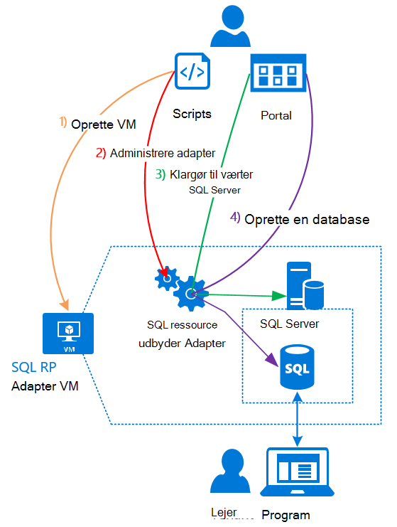

<properties
    pageTitle="Brug af SQL-databaser på Azure stak | Microsoft Azure"
    description="Få mere at vide, hvordan du kan installere SQL-databaser som en tjeneste på Azure stabling og de hurtige trin til at installere SQL Server ressource udbyder kortet."
    services="azure-stack"
    documentationCenter=""
    authors="Dumagar"
    manager="byronr"
    editor=""/>

<tags
    ms.service="multiple"
    ms.workload="na"
    ms.tgt_pltfrm="na"
    ms.devlang="na"
    ms.topic="article"
    ms.date="09/26/2016"
    ms.author="dumagar"/>

# Brug af SQL-databaser på Azure stak

> [AZURE.NOTE] Følgende oplysninger gælder kun for Azure stak TP1 installationer.

Bruge SQL Server ressource udbyder kortet til at fremvise SQL-databaser som en tjeneste af Azure stak. Når du har installeret provideren ressource, kan du og dine brugere oprette databaser til skyen oprindelig apps, websted, der er baseret på SQL og arbejdsbelastninger, som er baseret på SQL uden at klargøre en virtuel maskine (VM), der er vært SQL Server hver gang.

Fordi provideren ressource ikke har alle funktionerne i Azure SQL-Database under bevis for konceptet, begynder i denne artikel med en oversigt over ressource udbyder arkitekturen. Og får du en hurtig oversigt over trinnene til konfiguration af provideren ressource med links til flere trinnene i [Implementer SQL-Database ressource udbyder kortet på Azure stak Konceptet](azure-stack-sql-rp-deploy-long.md).

## SQL Server ressource udbyder adapter arkitektur
Ressource-udbyder tilbyder ikke alle databasen projektoversigter i Azure SQL-Database. For eksempel elastiske database grupper og muligheden for at ringe databasens ydeevne op og ned på farten er ikke tilgængelige. Ressource-provider understøtter dog den samme oprette, læse, opdatering og slette () handlinger, der findes i Azure SQL-Database.

Provideren ressource består af tre komponenter:

- **Feltet SQL ressource udbyder adapter VM**, hvilket omfatter ressource udbyder processen og servere, der er vært for SQL Server.
- **Provideren ressource selve**, som behandler klargøring anmodninger og viser databaseressourcer.
- **Servere, der vært for SQL Server**, der giver kapacitet til databaser.

I følgende grundlæggende diagram viser disse komponenter og de trin, du gennemgår, når du installerer provideren ressource, konfigurere en server, der er vært SQL Server, og derefter oprette en database.

## Hurtige trin til at udrulle provideren ressource
Følg disse trin, hvis du allerede kender, Azure stak. Hvis du vil have flere detaljer, klikke på hyperlinkene i hver sektion eller gå direkte til [Implementer SQL-Database ressource udbyder kortet på Azure stak Konceptet](azure-stack-sql-rp-deploy-long.md).

1.  Sørg for, at du har fuldført alle [konfigurere trin, før du installerer](azure-stack-sql-rp-deploy-long.md#set-up-steps-before-you-deploy) provideren ressource:

  - .NET 3.5 framework er allerede konfigureret i den grundlæggende Windows Server-afbildning. (Hvis du har hentet Azure stak bit efter 23 februar 2016, kan du springe dette trin).
  - [En version af Azure PowerShell, der er kompatibelt med Azure stak er installeret](http://aka.ms/azStackPsh).
  - I Internet Explorer sikkerhedsindstillingerne på ClientVM, [Internet Explorer øget sikkerhed er slået fra og cookies er aktiveret](azure-stack-sql-rp-deploy-long.md#Turn-off-IE-enhanced-security-and-enable-cookies).

2. [Hente filen SQL Server RP binære filer](http://aka.ms/massqlrprfrsh) og Udpak til ClientVM i din Azure stak Konceptet.

3. [Køre bootstrap.cmd og scripts](azure-stack-sql-rp-deploy-long.md#Bootstrap-the-resource-provider-deployment-PowerShell-and-Prepare-for-deployment).

    Et sæt af scripts, der er grupperet efter to overordnede faner, der er åben i PowerShell ISE Integrated Scripting miljø (). Køre alle de indlæste scripts i rækkefølge fra venstre mod højre i hver fane.

    1. Køre scripts i fanen **Forbered** fra venstre til højre for at:

        - Oprette et certifikat med jokertegn for at sikre kommunikationen mellem den ressource udbyder og Azure ressourcestyring.
        - Overføre certifikater og alle andre elementer til en lagerplads konto på Azure stablen.
        - Publicere galleriet pakker, så du kan installere SQL og ressourcer via galleriet.

        > [AZURE.IMPORTANT] Hvis et af scriptene hænger uden nogen indlysende årsag, når du har indsendt din Azure Active Directory-lejer, blokerer sikkerhedsindstillingerne muligvis en DLL-fil, der kræves at køre installationen. Se efter Microsoft.AzureStack.Deployment.Telemetry.Dll i mappen ressource udbyder for at løse dette problem ved, højreklikke på det, skal du klikke på **Egenskaber**, og markér derefter afkrydsningsfeltet **Fjern blokering** under fanen **Generelt** .

    1. Køre scripts i fanen **Implementer** fra venstre til højre for at:

        - [Implementer en VM](azure-stack-sql-rp-deploy-long.md#Deploy-the-SQL-Server-Resource-Provider-VM) , der er vært både ressource udbyder og SQL Server. Dette script refererer til en JSON parameterfil, som du vil opdatere med nogle værdier, før du kører scriptet.
        - [Registrere en lokal DNS-post](azure-stack-sql-rp-deploy-long.md#Update-the-local-DNS) , der er tilknyttet udbyderen ressource VM.
        - [Registrere udbyderen ressource](azure-stack-sql-rp-deploy-long.md#Register-the-SQL-RP-Resource-Provider) med lokale Azure Resource Manager.

        > [AZURE.IMPORTANT] Alle scripts forudsætter, at billedet af grundlæggende operativsystemet opfylder forudsætningerne (.NET 3.5 installeret, JavaScript og cookies er aktiveret på ClientVM og en kompatibel version af Azure PowerShell installeret). Hvis du får fejl, når du kører scripts, Kontrollér, at du opfyldt forudsætningerne.

6. [Opret forbindelse provideren ressource til en server, der er vært for SQL Server](#Provide-capacity-to-your-SQL-Resource-Provider-by-connecting-it-to-a-hosting-SQL-server) på portalen Azure stablen. Klik på **Gennemse** &gt; **ressource udbydere** &gt; **SQLRP** &gt; **Gå til udbyder ressourcestyring** &gt; **servere** &gt; **tilføje**.

    Brug "systemadministratorens" for brugernavn og den adgangskode, du brugte, da du installerede provideren ressource VM.

7. Installere en SQL-database i portalen Azure stak til [Test din nye SQL Server ressource udbyder](/azure-stack-sql-rp-deploy-long.md#create-your-first-sql-database-to-test-your-deployment). Klik på **Opret** &gt; **brugerdefineret** &gt; **SQL Server-Database**.

Dette bør få udbyderen SQL Server ressource op og køre i om 45 minutter (afhængigt af din hardware).
