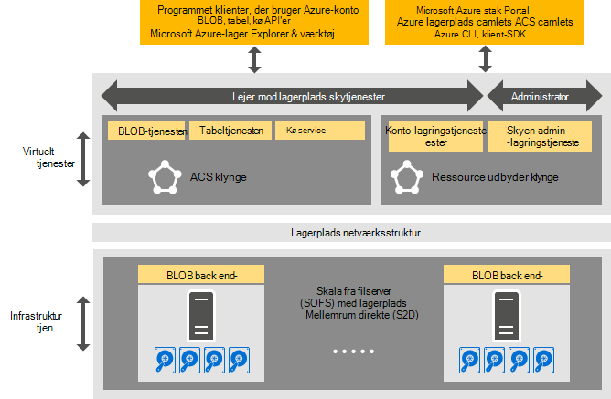

<properties
    pageTitle="Introduktion til Azure-ensartet lagerplads | Microsoft Azure"
    description="Få mere at vide om Azure-ensartet lagerplads"
    services="azure-stack"
    documentationCenter=""
    authors="AniAnirudh"
    manager="darmour"
    editor=""/>

<tags
    ms.service="azure-stack"
    ms.workload="na"
    ms.tgt_pltfrm="na"
    ms.devlang="na"
    ms.topic="get-started-article"
    ms.date="09/26/2016"
    ms.author="anirudha"/>

# Introduktion til Azure-ensartet lagerplads
Azure-ensartet lagerplads er mængde lagerplads skytjenester Microsoft Azure stablede. Azure-ensartet lagerplads indeholder blob, tabel, kø og konto-funktionen til dokumentstyring med Azure-ensartet semantik. Den indeholder også funktionaliteten, så administrator af en sky Administrer lagerplads tjenester. I denne artikel introducerer Azure-ensartet lager og i denne artikel beskrives, hvordan lagerplads skytjenester Azure stablede fint supplement omfattende [software brugerdefineret lagerplads funktioner i Windows Server 2016](https://blogs.technet.microsoft.com/windowsserver/2016/04/14/ten-reasons-youll-love-windows-server-2016-5-software-defined-storage/).

Azure-ensartet lagerplads leverer følgende generelle funktionskategorier:

- **BLOB**: BLOB skal blokere BLOB og tilføje BLOB med   [ensartet Azure blob](https://msdn.microsoft.com/library/azure/dd179355.aspx#Anchor_1) 
   funktionsmåde

- **Tabeller**: objekter, partitioner og andre egenskaber for tabel med   [Azure-ensartet tabel](https://msdn.microsoft.com/library/azure/dd179355.aspx#Anchor_3) 
   funktionsmåde

- **Køer**: stabil og fast meddelelser og køer med   [Azure-ensartet kø](https://msdn.microsoft.com/library/azure/dd179355.aspx#Anchor_2) 
   funktionsmåde

- **Konti**: lagerplads konto ressourcestyring med   [Azure-ensartet konto](https://azure.microsoft.com/documentation/articles/storage-create-storage-account/) 
   funktionsmåde for generelle lagerplads konti klargjort via [Azure ressourcestyring implementeringsmodel](https://azure.microsoft.com/documentation/articles/resource-manager-deployment-model/)

- **Administration**: Administration af lejer ned og Azure-ensartede lagerplads internt lager tjenester (gennemgås i andre artikler)

## Azure-ensartet lagerplads arkitektur

Figur 1. Azure-ensartet lagerplads: løsning visning

## Azure-ensartet lagerplads virtualiseret tjenester og klynger

I Azure-ensartet lagerplads arkitektur virtualiseret alle lejer eller administrator-tilgængelige lagerplads tjenester. Det vil sige, at de kører i service provider-administreret, meget tilgængelige FOS baseret på [Hyper-V](https://technet.microsoft.com/library/dn765471.aspx) funktionalitet i [Windows Server 2016](http://www.microsoft.com/server-cloud/products/windows-server-2016/).
Selvom FOS er meget tilgængelige baseret på [Windows Server-Failoverklyngedannelse](https://technet.microsoft.com/library/dn765474.aspx) teknologi, er Azure-ensartet lagerplads virtualiseret tjenesterne selv gæst grupperet, meget tilgængelige tjenester, der er baseret på [Azure Service strukturen teknologi](http://azure.microsoft.com/campaigns/service-fabric/).

Azure-ensartet lagerplads anvender to Service-strukturen klynger i en stak Azure-installation.
Tjenesten Storage ressource Provider er installeret på en tjeneste-strukturen klynge ("RP klynge"), der også deles af andre finde grundlæggende ressource udbydertjenester. Resten af opbevaring virtualiseret sti datatjenester – herunder Blob, tabel og kø services – er hostes på en anden tjeneste strukturen klynge ("Azure-ensartet lagerplads klynge").

## BLOB-tjenesten og software brugerdefineret lager

Blob service tilbage slutter på den anden side kører direkte på noderne [Skala fra filserver](https://technet.microsoft.com/library/hh831349.aspx) klynge. Løsningsarkitektur Azure stak skala fra filserver er baseret på den [Lagerplads mellemrum direkte](https://technet.microsoft.com/library/mt126109.aspx)-baseret, deles sekundær klynge. Figur 1 viser de vigtigste Azure-ensartet lagerplads Komponenttjenester og deres fordelt implementeringsmodel. Når du ser i diagrammet, er Azure-ensartet lagerplads kædet sammen med eksisterende software brugerdefineret storage-funktioner i Windows Server 2016. Der kræves til Azure-ensartet lager ud over kravene Windows Server platform ikke speciel hardware.

## Lagerplads Farm

Lagerplads Farm er en samling af lagerplads infrastruktur, ressourcer og back end-tjenester, der sammen tjenesteydelser lejer ned og administrator med adgang via Azure-ensartet lager i en stak Azure-installation. Nærmere betegnet kan omfatter lagerplads Farm følgende:

- Lagerplads hardware (for eksempel skala fra filserver noder, diske)

- Lagerplads strukturen ressourcer (for eksempel, små og mellemstore virksomheder aktier)

- Lagerplads beslægtede Service strukturerede services (for eksempel Blob slutpunkt service fra Azure-ensartet lagerplads klynge)

- Lagerplads-relaterede tjenester, der kører på skala fra filserver noder (for eksempel tjenesten Blob)

## IaaS og PaaS lagerplads brugsscenarier

Azure-ensartet lagerplads siden blob, som Azure, indeholder de virtuelle disk i alle infrastruktur som en tjeneste (IaaS) forbrug scenarier:

- Oprette en VM ved hjælp af brugerdefinerede OS disken i en side blob

- Oprette en VM ved hjælp af brugerdefinerede OS billedet i en side blob

- Oprette en VM ved hjælp af et Azure Marketplace-billede i en ny side blob

- Oprette en VM ved hjælp af en tom disk i en ny side blob

Azure-ensartet lagerplads Bloker blob, tilføje blob, køer, på samme måde for platformen som en tjeneste (PaaS) scenarier, og tabeller fungerer som i Azure.

## Brugerroller

Azure-ensartet lagerplads er værdifulde for to brugerroller:

- Programmet ejere, herunder udviklere og enterprise IT. De har ikke længere at opretholde eller installere to versioner af et program og scripts, udføre kørslen samme på tværs af en sky, som offentlige og en hostet/private sky i et datacenter. Azure-ensartet lagerplads indeholder lagerplads tjenester via REST-API, SDK, cmdlet og Azure stak portal.

- Tjenesteudbydere, herunder enterprise IT, der installere og administrere Microsoft Azure stak-baserede, multiprofiler storage skytjenester.

## Næste trin

- [Azure-ensartet lagerplads: forskelle og overvejelser i forbindelse med] (azure-stak-acs-forskelle-tp2.md)
