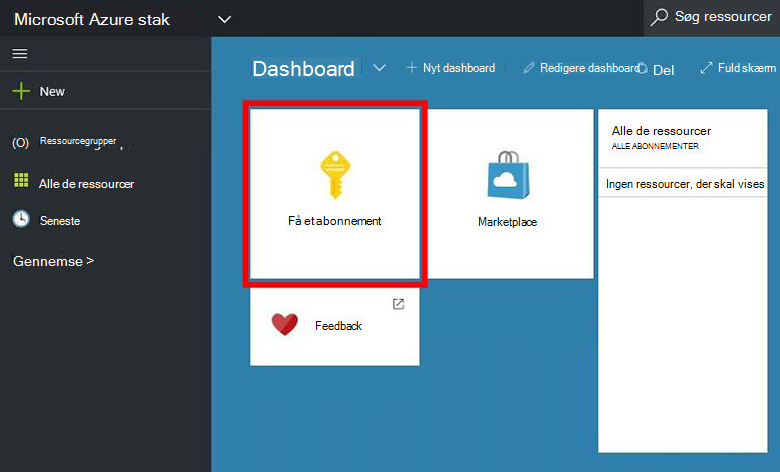
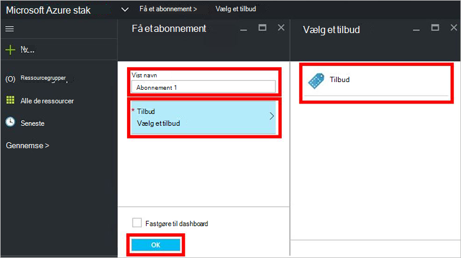
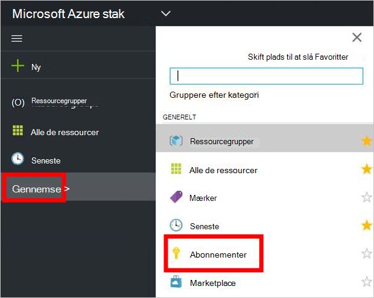

<properties
    pageTitle="Abonnere på et tilbud og derefter klargøre en VM Azure stablede (lejer) | Microsoft Azure"
    description="Lær, hvordan du abonnerer på et tilbud, og derefter klargøre en VM Azure stablede som en lejer."
    services="azure-stack"
    documentationCenter=""
    authors="ErikjeMS"
    manager="byronr"
    editor=""/>

<tags
    ms.service="azure-stack"
    ms.workload="na"
    ms.tgt_pltfrm="na"
    ms.devlang="na"
    ms.topic="get-started-article"
    ms.date="09/26/2016"
    ms.author="erikje"/>

# Abonnere på et tilbud

Nu, hvor du har [oprettet et tilbud](azure-stack-create-offer.md), kan du teste, at din lejere kan oprette et abonnement.

1.  På computeren, Azure stak Konceptet, log på `https://portal.azurestack.local` som [en lejer](azure-stack-connect-azure-stack.md#log-in-as-a-tenant) og klikke på **Hent et abonnement**.

    

2.  Skriv et navn til dit abonnement i feltet **Vist navn** , skal du klikke på **tilbyder**, skal du klikke på et af tilbud i bladet **Vælg et tilbud** , og klik derefter på **Opret**.

    

4.  For at få vist det abonnement, du har oprettet, klik på **Gennemse**, klik på **abonnementer**, og klik derefter på dit nye abonnement.  

    

Når du abonnerer på et tilbud, opdatere portalen for at se, hvilke tjenester der er en del af det nye abonnement.

## Næste trin

[Klargøre en virtuel maskine](azure-stack-provision-vm.md)
