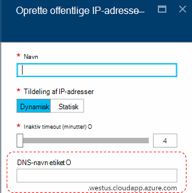
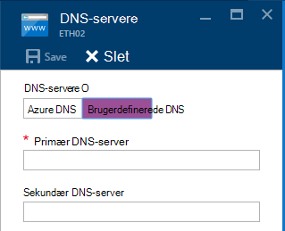
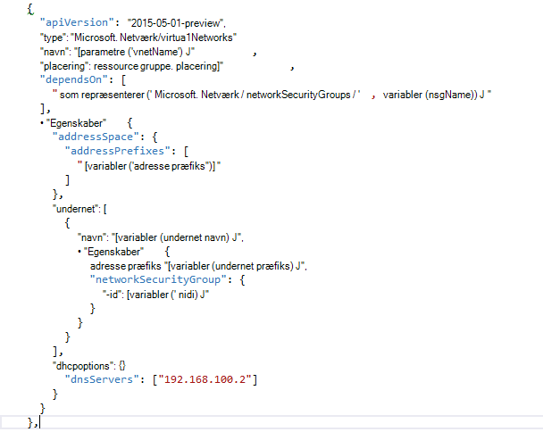

<properties
    pageTitle="Forstå DNS i Azure stak TP2 | Microsoft Azure"
    description="Forstå nye DNS-funktioner og egenskaber i Azure stak TP2"
    services="azure-stack"
    documentationCenter=""
    authors="ScottNapolitan"
    manager="darmour"
    editor=""/>

<tags
    ms.service="azure-stack"
    ms.workload="na"
    ms.tgt_pltfrm="na"
    ms.devlang="na"
    ms.topic="get-started-article"
    ms.date="09/26/2016"
    ms.author="scottnap"/>

# Introduktion til IDN'er til Azure stak
================================

IDN'er er en ny funktion i teknologi Preview 2 til Azure stak, som gør det muligt at fortolke eksterne DNS-navne (såsom http://www.bing.com).
Det gør det også muligt at registrere interne virtuelt netværksnavne. Gør det, kan du løse FOS på det samme virtuelle netværk ved navn i stedet for IP-adresse, uden at skulle angive brugerdefinerede DNS-server poster.

Det er noget, der altid er der i Azure, men nu den er tilgængelig i Windows Server 2016 og Azure stak for.

Hvad gør IDN'er?
------------------

Med IDN'er Azure stablede får du følgende funktioner, uden at skulle angive brugerdefinerede DNS-server poster.

-   Delt DNS-navneoversættelse for lejer arbejdsmængder.

-   Autoritative DNS service for navneoversættelse og DNS-registrering i det virtuelle netværk lejer.

-   Recursive DNS service for opløsningen på internettet navne fra lejer FOS. Lejere ikke længere skal bruge til at angive brugerdefinerede DNS-poster for at finde internetnavne (for eksempel www.bing.com).

Du kan stadig få dine egne DNS og bruge brugerdefinerede DNS-servere, hvis du vil have. Men nu, hvis du vil kunne løse Internet DNS brugernavne og kunne oprette forbindelse til andre virtuelle maskiner i det samme virtuelle netværk, skal du ikke angive noget, og det kun fungerer.

Hvad gør IDN'er ikke?
---------------------

Hvilke IDN'er tillader dig at gøre ikke er at oprette en DNS-post til et navn, der kan være løst fra uden for det virtuelle netværk.

I Azure har du mulighed for at angive en etiket til DNS-navn, som kan knyttes til en offentlig IP-adresse. Du kan vælge etiketten (præfiks), men Azure vælger suffiks, der er baseret på det område, hvor du opretter den offentlige IP-adresse.

I billedet ovenfor opretter Azure en "En" post i DNS for etiketten DNS-navn, der er angivet under zone **westus.cloudapp.azure.com**. Skriv en fuldt kvalificeret domæne navn (fulde Domænenavn), som kan løses fra et vilkårligt sted på det offentlige Internet præfikset og suffikset sammen.

I TP2 understøtter Azure stak kun IDN'er for interne navneregistrering, så det ikke gøre følgende.

-   Oprette en DNS-post under en eksisterende hostet DNS zone (for eksempel azurestack.local).

-   Oprette en DNS-zone (såsom Contoso.com).

-   Oprette en post under din egen brugerdefinerede DNS-zone.

-   Understøtte køb af domænenavne.

Ændringer i DNS fra Azure stak TP1
-----------------------------------

I teknologi Preview 1 (TP1) versionen af Azure stak skulle angive brugerdefinerede DNS-servere, hvis du vil kunne løse hosts via navn i stedet for IP-adresse. Det betyder, at hvis du vil oprette et virtuelt netværk eller et VM, havde du til at levere mindst én DNS-server-post. For miljø TP1 Konceptet mente dette at indtaste IP-adresse på Konceptet strukturen DNS-server, nemlig 192.168.200.2.

Hvis du har oprettet en VM via portalen, skulle du Vælg **Custom DNS** i virtuelt netværk eller ethernet-adapter indstillinger.

I TP2, du kan vælge Azure DNS og behøver ikke at angive brugerdefinerede DNS-server poster.

Hvis du har oprettet en VM via en skabelon med dit eget billede, du havde tilføje egenskaben **DHCPOptions** og DNS-server Hvis du vil have DNS navneoversættelse til at arbejde. Følgende billede viser, hvad det så ud.

I TP2 behøver du ikke længere Foretag disse ændringer til dine VM skabeloner at give dine FOS til at fortolke navne på internettet. De skal blot fungerer.