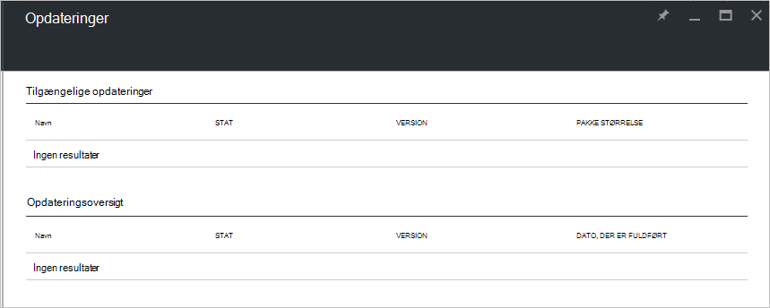

<properties
    pageTitle="Opdateringer Azure stablede | Microsoft Azure"
    description="Få mere at vide om opdateringer til Azure stablede"
    services="azure-stack"
    documentationCenter=""
    authors="HeathL17"
    manager="byronr"
    editor=""/>

<tags
    ms.service="azure-stack"
    ms.workload="na"
    ms.tgt_pltfrm="na"
    ms.devlang="na"
    ms.topic="article"
    ms.date="09/26/2016"
    ms.author="Helaw"/>

# Administration af opdateringer i Azure stak
Technical Preview 2 introducerer en forhåndsvisning af grænsefladen til administration af Azure stak opdateringer.  I dette emne, skal du gå til noden opdateringer.  

## Opdateringer blade
1.  Klik på **Gennemse** for at få adgang til bladet opdateringer, og klik derefter på **opdateringer**.

2.  Klik på den **lokale** placering.

3.  Du kan få vist et skærmbillede fra listen over tilgængelige opdateringer og opdateringsoversigt.  I Technical Preview 2 bliver ingen opdateringer tilgængelig til installation.  

    

## Næste trin
- [Forstå Azure stak Konceptet arkitektur](azure-stack-architecture.md)      
- [Forstå forudsætninger for installation](azure-stack-deploy.md)
- [Installere Azure stak](azure-stack-run-powershell-script.md)
 
    
  

  

