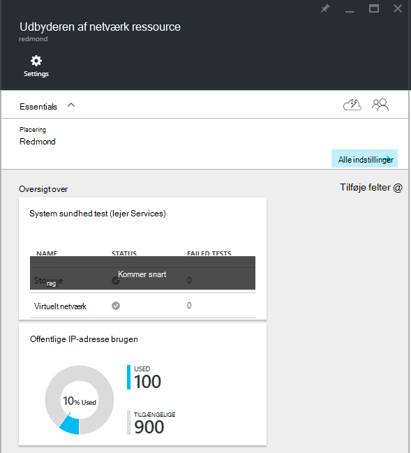
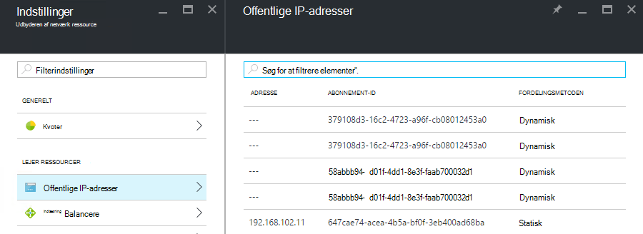

<properties
    pageTitle="Få vist offentlige IP-adresse forbrug i TP2 | Microsoft Azure"
    description="Administratorer kan få vist forbrug af offentlige IP-adresser i et område"
    services="azure-stack"
    documentationCenter=""
    authors="ScottNapolitan"
    manager="darmour"
    editor=""/>

<tags
    ms.service="azure-stack"
    ms.workload="na"
    ms.tgt_pltfrm="na"
    ms.devlang="na"
    ms.topic="get-started-article"
    ms.date="09/26/2016"
    ms.author="scottnap"/>

# Få vist offentlige IP-adresse forbrug i Azure stak TP2

Som tjenesteadministrator af en, kan du få vist antallet af offentlige IP-adresser, der er allokeret til lejere, antallet af offentlige IP-adresser, der er stadig tilgængelig for tildelingen, og procentdelen af den offentlige IP-adresser, der har fået tildelt i den nye placering.

Feltet **Offentlige IP-adresse brugen** viser det samlede antal offentlige IP-adresser, der har brugt på tværs af alle offentlige IP-adresse grupper på strukturen, uanset om de er blevet brugt til lejer IaaS VM forekomster, strukturerede infrastrukturservices eller offentlige IP-adresse ressourcer, der eksplicit er oprettet af lejere.

Formålet med dette felt er at give Azure stak administratorer en følelse af det samlede antal offentlige IP-adresser, der har brugt på denne placering. Dette hjælper med at finde ud af, om de er at løbe tør for denne ressource administratorer.

Menupunktet **Offentlige IP-adresser** under **lejer ressourcer** vises kun de offentlige IP-adresser, der er blevet *oprettet eksplicit af lejere*bladet **Indstillinger** . Som f.eks antallet af **bruges** offentlige IP-adresser på den **Offentlige IP-adresse brugen** af flisen altid er forskellig fra (større end) til nummeret på den **Offentlige IP-adresser** flise under **lejer ressourcer**.

## Få vist den offentlige IP-adresse brugen oplysninger

Sådan får du vist det samlede antal offentlige IP-adresser, der er brugt i området:

1.  Klik på **Gennemse**i portalen Azure stak, og klik på **Ressourcen udbydere**.

2.  På listen over **Ressource udbydere**, Vælg **Udbyder netværksadministrator ressource**.

3.  Alternativt kan du klikke på **Gennemse | Placeringer** , og vælg den placering, du vil have vist på listen. Vælg derefter **Ressource udbyder netværksadministrator**på feltet **Ressource-udbydere** .

4.  Bladet **Netværk ressource udbyder** landing viser den **Offentlige IP-adresse brugen** flise i sektionen **Overview** .

Husk på, **bruges** tallet repræsenterer antallet af offentlige IP-adresser fra alle offentlige IP-adresse grupper i den nye placering, der er tildelt. **Tilgængelige** tallet repræsenterer antallet af offentlige IP-adresser fra alle offentlige IP-adresse adresse grupper, der ikke har fået tildelt og stadig være tilgængelige. **% Brugt** tallet repræsenterer antallet af anvendte eller tildelte adresser som en procentdel af det samlede antal offentlige IP-adresser i alle offentlige IP-adresse adresse grupper i den nye placering.

## Få vist de offentlige IP-adresser, der er oprettet af lejer-abonnementer

Gå til bladet **Indstillinger** på **Ressource udbyder netværksadministrator**for at få vist en liste over offentlige IP-adresser, der eksplicit er oprettet af lejer abonnementer i et bestemt område, og vælg derefter **Offentlige IP-adresser**.

Du oplever måske, at nogle offentlige IP-adresser, der har fået tildelt dynamisk vises på listen, men ikke har en adresse, der er knyttet til dem endnu. Dette skyldes, at den adresseressource er blevet oprettet i udbyderen af ressource det netværk, men ikke i den netværkscontroller endnu.

Netværkscontroller tildeler ikke en adresse til denne ressource, indtil det rent faktisk er bundet til en brugergrænseflade, et netværkskort (NIC), belastningsjustering eller et virtuelt netværksgateway. Når den offentlige IP-adresse er bundet til en brugergrænseflade, netværkscontroller tildeler en IP-adresse til den, og det vises i feltet **adresse** .

## Få vist den offentlige IP-adresse oplysninger oversigtstabel

Der findes en række forskellige tilfælde, hvor offentlige IP-adresser er tildelt, der bestemmer, om adressen, der skal vises i en liste eller et andet.

| **Offentlige IP-adresse tildeling sag** | **Vises i oversigt over anvendelse** | **Vises på listen over lejer offentlige IP-adresser** |
| ------------------------------------- | ----------------------------| ---------------------------------------------- |
| Dynamisk offentlige IP-adresse endnu ikke er tildelt til en NIC eller indlæse belastningsjusteringstjenesten (midlertidige) | Nej | Ja |
| Dynamisk offentlige IP-adresse tildelt til en NIC eller indlæse belastningsjusteringstjenesten. | Ja | Ja |
| Statisk offentlige IP-adresse tildelt til en lejer NIC eller indlæse belastningsjusteringstjenesten. | Ja | Ja |
| Statisk offentlige IP-adresse tildelt til en strukturen infrastruktur tjenesteslutpunkt. | Ja | Nej |
| Offentlige IP-adresse implicit oprettet efter IaaS VM forekomster og bruges til udgående NAT på det virtuelle netværk. Disse er oprettet i baggrunden, når en lejer opretter en forekomst af VM, så FOS kan sende oplysninger til internettet. | Ja | Nej |
