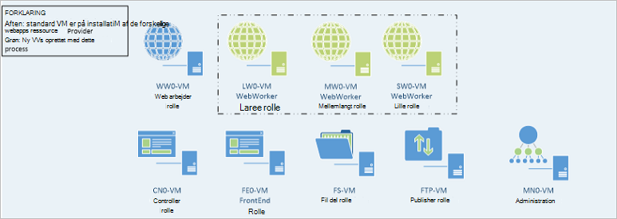

<properties
    pageTitle="Webapps at føje flere Web arbejder roller | Microsoft Azure"
    description="Detaljeret vejledning til skalering Azure stak Web App"
    services="azure-stack"
    documentationCenter=""
    authors="kathm"
    manager="slinehan"
    editor=""/>

<tags
    ms.service="azure-stack"
    ms.workload="app-service"
    ms.tgt_pltfrm="na"
    ms.devlang="na"
    ms.topic="article"
    ms.date="09/26/2016"
    ms.author="kathm"/>

#   <a name="web-apps-adding-more-web-worker-roles"></a>Web Apps: Tilføje flere web arbejder roller

> [AZURE.NOTE] Følgende oplysninger gælder kun for Azure stak TP1 installationer.

Dette dokument indeholder oplysninger om, hvordan skalere online web arbejder roller. Den indeholder trin til oprettelse af yderligere web arbejder roller for at understøtte web apps tilbud af enhver størrelse.

Azure stak understøtter gratis og delte web app-installationer. Hvis du vil tilføje andre typer, skal du tilføje flere web arbejder roller.

Hvis du ikke er sikker på, at det er installeret med Web Apps standardinstallation, kan du gennemse yderligere oplysninger [her](azure-stack-webapps-overview.md).

Følgende trin er påkrævet for at skala web arbejder roller:

1.  [Oprette en ny virtuel maskine](#step-1-create-a-new-vm-to-support-the-new-instance-size)

2.  [Konfigurere den virtuelle maskine](#step-2-configure-the-virtual-machine)

3.  [Konfigurere rollen web arbejder i portalen Azure stak](#step-3-configure-the-web-worker-role-in-the-azure-stack-portal)

4.  [Konfigurere app service-planer](#step-4-configure-app-service-plans)

##<a name="step-1-create-a-new-vm-to-support-the-new-instance-size"></a>Trin 1: Oprette en ny VM at understøtte den nye forekomst størrelse

Oprette en virtuel maskine, som beskrevet i [denne artikel](azure-stack-provision-vm.md), at sikre, at der er foretaget følgende valg:

 - Brugernavn og din adgangskode: giver det samme brugernavn og adgangskode, du angav, da du installerede Web Apps.

 - Abonnement: Brug standard udbyder abonnementet.

 - Ressourcegruppe: Vælg **AppService-Local**.

> [AZURE.NOTE]Gemme de virtuelle maskiner for arbejder roller i samme ressourcegruppe som Web Apps programmet installeres til. (Dette er anbefales i denne udgave).

##<a name="step-2-configure-the-virtual-machine"></a>Trin 2: Konfigurer den virtuelle maskine

Når installationen er fuldført, er følgende konfiguration kræves for at understøtte rollen web arbejder:

1.  Åbn Server Manager på værtsmaskinen, og klik på **værktøjer** &gt; **HyperV Manager**.

2.  Oprette forbindelse ved hjælp af RDP Remote Desktop Protocol () til den nye virtuelle maskine, du oprettede i trin 1. Navnet på serveren, der er placeret i ruden Oversigt, når hver VM er markeret.

3.  Åbn PowerShell ved at klikke på knappen **Start** og skrive PowerShell. Højreklik på **PowerShell.exe**, og vælg **Kør som administrator** for at åbne PowerShell i administratortilstand.

4.  Kopiér og Indsæt hver af følgende kommandoer (én ad gangen) til PowerShell-vinduet, og tryk på enter:

    ```netsh advfirewall firewall set rule group="File and Printer Sharing" new enable=Yes```
    ```netsh advfirewall firewall set rule group="Windows Management Instrumentation (WMI)" new enable=yes```
    ```reg add HKLM\\SOFTWARE\\Microsoft\\Windows\\CurrentVersion\\Policies\\system /v LocalAccountTokenFilterPolicy /t REG\_DWORD /d 1 /f```

5.  Genstart den virtuelle maskine.

> [AZURE.NOTE]Bemærk: Dette er minimumskravene til Web Apps. De er standardindstillingerne for Windows 2012 R2 billedet inkluderet med Azure stablen. Vejledningen har fået til fremtidig brug, og til dem, der bruger et andet billede.

##<a name="step-3-configure-the-web-worker-role-in-the-azure-stack-portal"></a>Trin 3: Konfigurere rollen web arbejder i portalen Azure stak

1.  Åbn portalen som tjenesteadministratoren på **ClientVM**.

2.  Gå til **ressource udbydere** &gt; **WEBAPP-LOCAL**.

    
 
3.  Klik på **Gå til udbyder ressourcestyring**.

4.  Klik på **roller**.

    
 
5.  Klik på **Tilføj rolle forekomst**.

6.  Klik på det **niveau** , du vil installere den nye forekomst til (lille, medium, stor eller delt).

    
 
7.  Konfigurere følgende:
 - Servernavn: Angive IP-adressen på den server, du oprettede tidligere (i punkt 1).
 - Rolletype: Web arbejder.
 - Arbejder niveau: Matches klasse størrelse, der er markeret.

8. Klik på **OK.**

9. Log på CN0 VM, og Åbn **Web skyen Management MMC**.

10. Gå til **Web skyen** &gt; **administrerede servere**.

11. Klik på det servernavn, du lige har installeret. Gennemse statuskolonnen, og vente på at flytte til næste trin, indtil status er "Klar".

    

##<a name="step-4-configure-app-service-plans"></a>Trin 4: Konfigurere app service-planer

> [AZURE.NOTE]App tjenesteplanerne skal gemmes i separate ressourcegrupper i den aktuelle udgave af Web Apps. Oprette en ressourcegruppe for hver størrelse af WebApp, og Placer programmet planer i deres relevante ressourcegrupper.

1.  Log på portalen på ClientVM.

2.  Gå til **nye** &gt; **internettet og Mobile**.

3.  Vælg den WebApp, du gerne vil installere.

4.  Angiv oplysninger til WebApp, og vælg derefter **AppService Plan / placering**.

-   Klik på **Opret et nyt**.

-   Oprette din nye model, hvis du vælger det tilsvarende priser niveau for plan.

> [AZURE.NOTE]Du kan oprette flere planer, mens du er på denne blade. Før du installerer, dog sikre, at du har valgt den relevante plan.

Følgende viser et eksempel på de forskellige planer, der er tilgængelige:    

##<a name="final-web-app-service-vm-configuration"></a>Endelige online VM tjenestekonfiguration

Billedet nedenfor giver en visning af miljøet, når du har skaleret web arbejder roller. Grøn elementerne repræsenterer de nye rolle tilføjelser.
    
