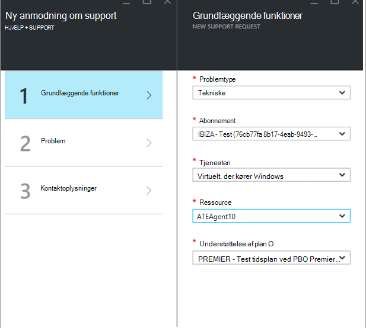
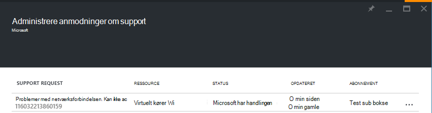

<properties
     pageTitle="Sådan oprettes en Azure supportanmodning | Microsoft Azure"
     description="Sådan oprettes en Azure supportanmodning."
     services="Azure Supportability"
     documentationCenter=""
     authors="ganganarayanan"
     manager="scotthit"
     editor=""/>

<tags
     ms.service="azure-supportability"
     ms.workload="na"
     ms.tgt_pltfrm="na"
     ms.devlang="na"
     ms.topic="article"
     ms.date="10/25/2016"
     ms.author="gangan"/>

# Sådan oprettes en Azure supportanmodning

## Oversigt
Azure kunder kan oprette og administrere anmodninger om support i portalen Azure, [https://portal.azure.com](https://portal.azure.com).
>[AZURE.NOTE] Portalen Azure for Tyskland er [https://portal.microsoftazure.de](https://portal.microsoftazure.de) og Azure government portalen til den er [https://portal.azure.us](https://portal.azure.us).

Baseret på kundefeedback har vi opdateret support anmodning oplevelse til at fokusere på tre primære mål:

- **Streamlined**: reducere Klik og blade til at få sendt en supportanmodning enkle trin.
- **Integreret**: Når du fejlfinding af et problem med en Azure ressource, det er nemt at åbne en supportanmodning for den pågældende ressource uden at overflytte kontekst.
- **Effektivt**: Indsaml de vigtige oplysninger, din support engineering skal effektivt kan løse dit problem.

## Kom godt i gang
Du kan oprette en anmodning om support i den øverste navigationsmenu eller direkte fra en ressource blade.

**Fra den øverste navigationslinje**

**Fra en ressource blade**

## Grundlæggende funktioner
Første trin i processen support anmodning indsamler grundlæggende oplysninger om dit problem og din supportplan.

Lad os kaste et eksempel: du modstående tekniske problemer med din virtuelle maskine og har mistanke om et problem med netværksforbindelsen.
Sådan markeres tjenesten ("virtuelle maskine kører Windows") og ressourcen (navnet på din virtuelle maskine) i det første trin i guiden starter processen med at få hjælp til dette problem.

>[AZURE.NOTE] Azure indeholder ubegrænset support til abonnement management (ting som fakturering, kvote justeringer og konto overførsler). Få teknisk support, du har brug for en plan for support. [Få mere at vide om understøttelse af planer](https://azure.microsoft.com/support/plans).

## Problem
Det andet trin i guiden indsamler yderligere oplysninger om problemet. Give nøjagtige detaljer i dette trin giver os mulighed for at omdirigere din sag til den bedste supporttekniker for problemet og til at starte diagnosticering problemet så tidligt som muligt.

Fortsætter med det virtuelle maskine connectivity eksempel fra ovenfor, du ville udfylder denne formular til at angive et problem med netværksforbindelsen, og du vil angive yderligere oplysninger om problemet, herunder det anslåede tidspunkt, når du oplever problemet.

## Relateret hjælp
For nogle af de problemer, vi giver dig links til relaterede Hjælp for at foretage fejlfinding af problemet. Hvis de anbefalede dokumenter ikke hjælper, kan du fortsætte gennem processen til at oprette en anmodning om support.

## Kontaktoplysninger
Det sidste trin i guiden bekræfter dine kontaktoplysninger, så vi kan se, hvordan du kan kontakte dig.

Afhængigt af alvorlighed af dit problem, kan du blive bedt om at angive, hvis du vil have os til at kontakte dig under arbejdstid, eller hvis du foretrækker svar 24 x 7, hvilket betyder, at vi kan kontakte dig når som helst.

## Administrere anmodninger om support
Når du opretter supportanmodning, kan du få vist oplysninger fra siden **Administrere understøtter anmodninger** .

**Fra den øverste navigationslinje**

Du kan få vist alle anmodninger om support og deres status på siden **Administrer anmodninger om support** .

Vælg supportanmodning at få vist oplysninger, herunder alvor og den forventede tid, det tager for en supporttekniker svare.

Hvis du vil ændre alvorlighed af anmodningen, skal du klikke på **Business virkning** -feltet. I det foregående eksempel er anmodningen i øjeblikket indstillet til alvorlighed C.

Klik på feltet viser dig på listen over severities, kan du tildele til en åben supportanmodning.

>[AZURE.NOTE] Niveauet klassifikation afhænger af din plan for support. [Få mere at vide om understøttelse af planer](https://azure.microsoft.com/support/plans).

## Feedback
Vi er altid åbne feedback og forslag! Kan du sende os din [forslag](https://feedback.azure.com/forums/266794-support-feedback). Desuden kan du deltage med os via [Twitter-](https://twitter.com/azuresupport) eller [MSDN-foraene](https://social.msdn.microsoft.com/Forums/azure).

## Lær mere
[Azure Support ofte stillede spørgsmål](https://azure.microsoft.com/support/faq)
