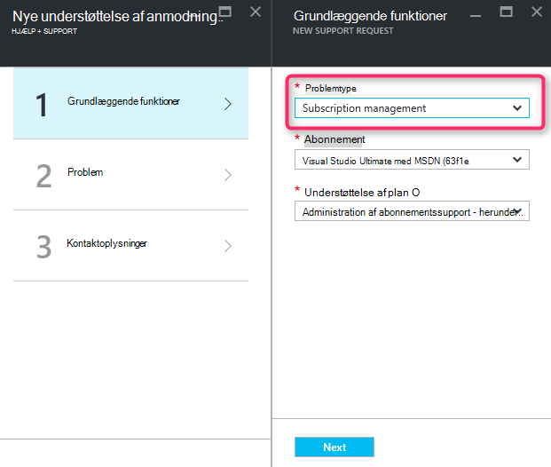
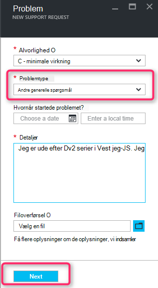
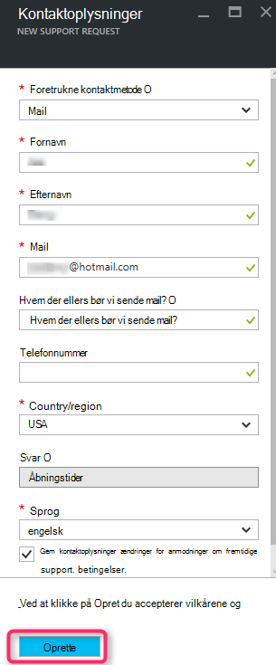

<properties
     pageTitle="SKU serie tilgængelig | Microsoft Azure"
     description="Nogle SKU serie er ikke tilgængelig for det markerede abonnement til dette område."
     services="Azure Supportability"
     documentationCenter=""
     authors="ganganarayanan"
     manager="scotthit"
     editor=""/>

<tags
     ms.service="azure-supportability"
     ms.workload="na"
     ms.tgt_pltfrm="na"
     ms.devlang="na"
     ms.topic="article"
     ms.date="08/12/2016"
     ms.author="gangan"/>

# SKU serie ikke tilgængelig

I nogle områder er visse lagerenheder ikke automatisk tilgængelige på nye abonnementer.  Dette kan opstå, når [mere effektiv lagerenheder introduceres i et område](https://azure.microsoft.com/updates/announcing-new-dv2-series-virtual-machine-size/) og popularitets af ældre SKU afviser.
Meddelelsen "*nogle SKU serie er ikke tilgængelige for det markerede abonnement for dette region*" vises, når du opretter en supportanmodning at øge Beregn core kvote.

Du kan gennemse SKU tilgængelighed på siden [Azure services efter område](https://azure.microsoft.com/regions/#services) . 

For at anmode om adgang til en anden SKU, der er blevet begrænset fra dit abonnement, skal du oprette en "Abonnement Management" supportanmodning.

- Vælg problemtype som "Abonnement Management" på siden grundlæggende, og klik på "Næste".

- Vælg problemtypen som "Andre generelle spørgsmål", og Angiv det nøjagtige område og den SKU, du kan ikke se på siden Problem.
Dette hjælper med at fremskynde supportprocessen.

- Angiv oplysninger om kontakter på siden oplysninger om kontakt og klikke på "Opret".

## Feedback
Vi er altid åbne feedback og forslag! Send os din [forslag](https://feedback.azure.com/forums/266794-support-feedback). Desuden kan du deltage med os via [Twitter-](https://twitter.com/azuresupport) eller [MSDN-foraene](https://social.msdn.microsoft.com/Forums/azure).

## Lær mere
[Azure Support ofte stillede spørgsmål](https://azure.microsoft.com/support/faq)
