<properties
    pageTitle="Genoprette data fra en anden DPM server i den ekstra samling af legitimationsoplysninger | Microsoft Azure"
    description="Gendanne de data, du har beskyttet til en samling af legitimationsoplysninger Azure sikkerhedskopi fra en hvilken som helst DPM-server, der er givet i licens til denne samling af legitimationsoplysninger."
    services="backup"
    documentationCenter=""
    authors="nkolli1"
    manager="shreeshd"
    editor=""/>

<tags
    ms.service="backup"
    ms.workload="storage-backup-recovery"
    ms.tgt_pltfrm="na"
    ms.devlang="na"
    ms.topic="article"
    ms.date="08/08/2016"
    ms.author="giridham;jimpark;trinadhk;markgal"/>

# Genoprette data fra en anden DPM server i den ekstra samling af legitimationsoplysninger
Nu kan du gendanne de data, du har beskyttet til en samling af legitimationsoplysninger Azure sikkerhedskopi fra en hvilken som helst DPM-server, der er givet i licens til denne samling af legitimationsoplysninger. Fremgangsmåde til at gøre det er helt integreret i administrationskonsollen DPM og svarer til de andre gendannelse arbejdsprocesser.

For at genoprette data fra en anden DPM server i den ekstra samling af legitimationsoplysninger skal du bruge [System Center Data Protection Manager UR7](https://support.microsoft.com/en-us/kb/3065246) og den [nyeste version af Azure sikkerhedskopiering agent](http://aka.ms/azurebackup_agent).

## Genoprette data fra en anden DPM-Server
Gendanne data fra en anden DPM server:

1. Klik på **' Tilføj eksterne DPM'** fra fanen **gendannelse** i DPM management console (på øverst til venstre i skærmbilledet).

    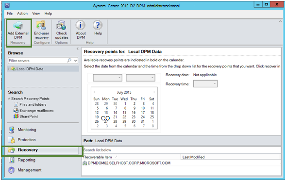

2. Ny **samling legitimationsoplysninger** hentes fra den samling, der er knyttet til den **DPM server** , hvor dataene gendannes, vælge DPM-serveren på listen over DPM servere, der er registreret med den ekstra samling af legitimationsoplysninger og angive det **kryptering adgangskoden** , der er knyttet til DPM-serveren er gendannes, hvis data.

    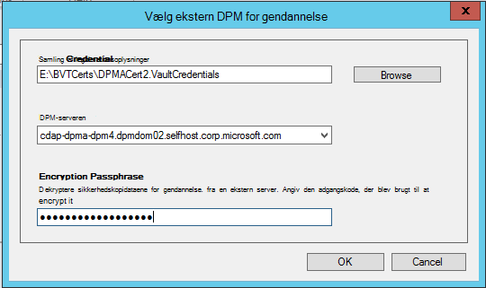

    >[AZURE.NOTE] Kun DPM servere, der er knyttet til den samme samling af legitimationsoplysninger registrering kan gendanne hinandens data.

    Når eksterne DPM-serveren er blevet tilføjet, kan du gennemse data fra eksterne DPM server og lokale DPM server fra fanen **gendannelse** .

3. Gennemse tilgængelige listen over fremstilling servere, der er beskyttet af eksterne DPM-serveren, og vælg den relevante datakilde.

    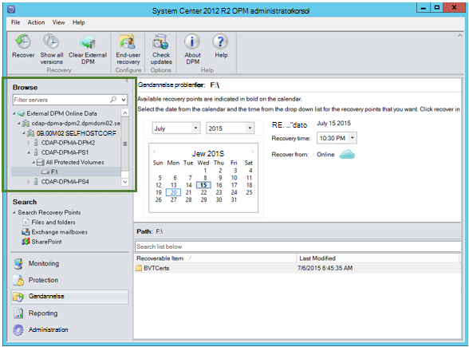

4. Vælg **måned og år** fra **gendannelse punkter** Rul ned, Vælg den ønskede **gendannelse dato** for oprettelse gendannelsespunkt, og vælg **gendannelse tid**.

    En liste over filer og mapper vises i den nederste rude, som kan findes og gendannes til en hvilken som helst placering.

    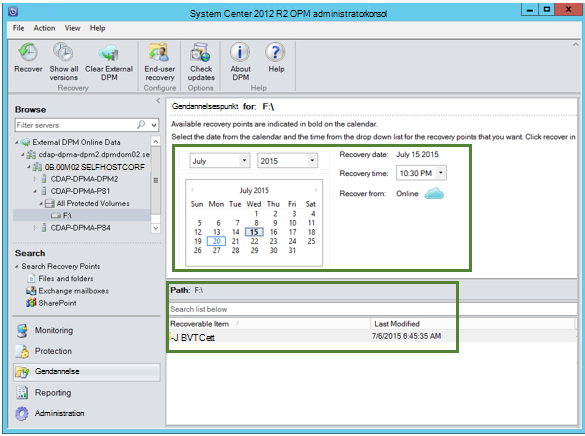

5. Højreklik på det ønskede element, og klik på **Gendan**.

    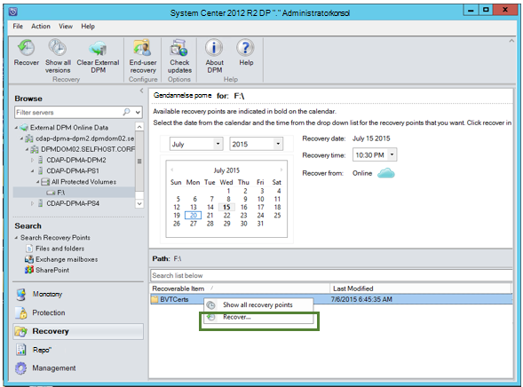

6. Gennemse den **Gendan markeringen**. Bekræft dataene og klokkeslættet for sikkerhedskopien gendannes, samt den kilde, hvorfra sikkerhedskopien blev oprettet. Hvis markeringen er forkert, skal du klikke på **Annuller** for at gå tilbage til gendannelse tab for at markere relevante gendannelsespunkt. Hvis markeringen er korrekt, skal du klikke på **Næste**.

    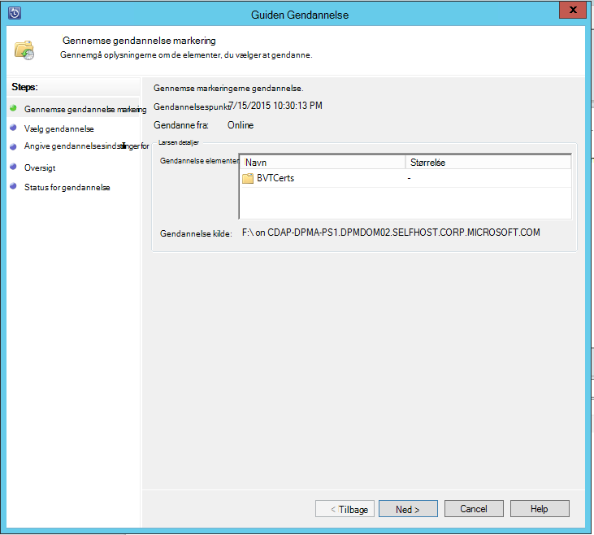

7. Vælg **Gendan til en anden placering**. **Gå** til den korrekte placering for at genoprettelsen.

    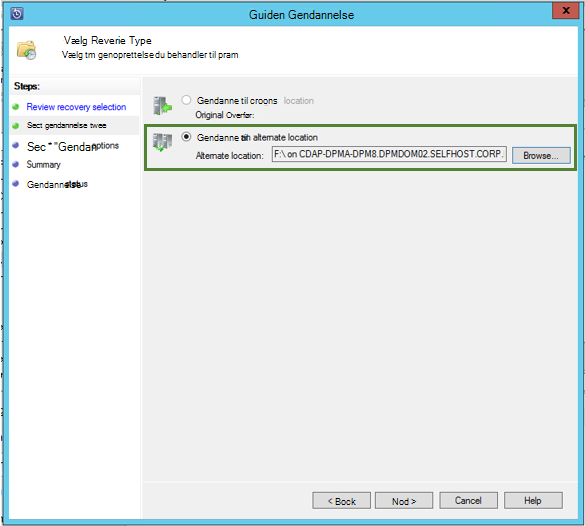

8. Vælg den indstilling, der er relateret til **oprette kopi**, **Spring**eller **Overskriv**.
    - **Opret kopi** opretter en kopi af filen i tilfælde af, at der er en konflikt navn.
    - **Spring over** springer gendanne filen, i tilfælde af, at der er en konflikt navn.
    - **Overskriv** overskrive den eksisterende kopiere på den placering, der er angivet i tilfælde af en konflikt navn.

    Vælg den relevante indstilling for at **gendanne sikkerhed**. Du kan anvende sikkerhedsindstillingerne for den pågældende computer, hvor dataene gendannes eller sikkerhedsindstillingerne, der var gældende for produktet på det tidspunkt punktet Genoprettelsen blev oprettet.

    Angiv, om der sendes en **meddelelse** , når at genoprettelsen er fuldført.

    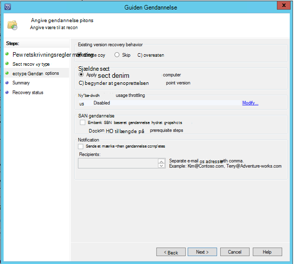

9. Skærmbilledet **Oversigt** viser de indstillinger, der er valgt hidtil. Når du klikker på **'Gendan'**, vil blive gendannet dataene i den relevante lokal placering.

    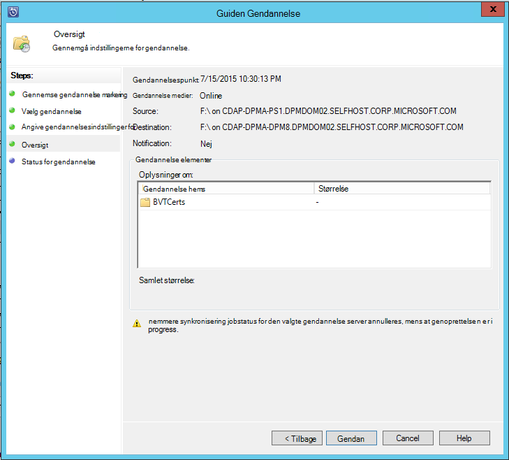

    >[AZURE.NOTE] Gendannelse jobbet kan overvåges under fanen **overvågnings** i DPM-serveren.

    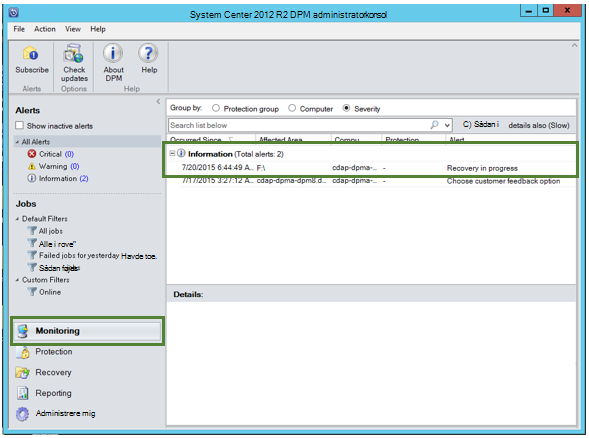

10. Du kan klikke på **Ryd eksterne DPM** under fanen **gendannelse** af DPM serveren for at fjerne visningen af eksterne DPM-serveren.

    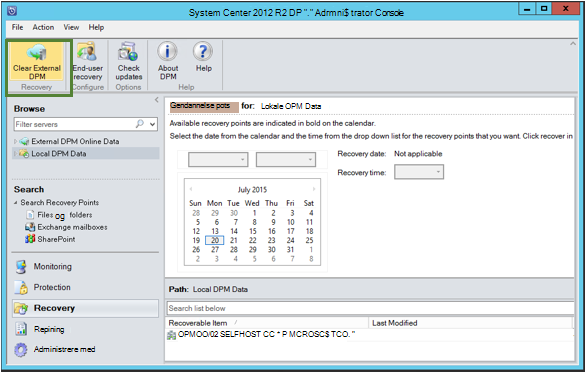

## Fejlfinding i forbindelse med
|Nej. |  Fejlmeddelelse | Trin til fejlfinding |
| :-------------: |:-------------| :-----|
|1.|        Denne server er ikke registreret til den samling, der er angivet af samling legitimationsoplysninger.|  **Årsag:** Denne fejl vises, når den samling legitimationsoplysninger fil er markeret ikke som tilhører den ekstra samling af legitimationsoplysninger er knyttet til DPM server som at genoprettelsen forsøges.   **Opløsning:** Hent filen samling legitimationsoplysninger fra den ekstra samling af legitimationsoplysninger, der er registreret DPM-serveren.|
|2.|        Enten genoprettelige dataene er ikke tilgængelig eller den valgte server er ikke en DPM-server.|   **Årsag:** Der er ingen andre DPM servere med DPM 2012 R2 UR7 registreret til den ekstra samling af legitimationsoplysninger, eller DPM serverne med DPM 2012 R2 UR7 der endnu ikke overført metadata, eller den valgte server er ikke DPM server (også kendt Windows Server eller Windows-klienten).   **Opløsning:** Hvis der er andre DPM servere, der er registreret til den ekstra samling af legitimationsoplysninger skal sikre SCDPM 2012 R2 UR7 og seneste Azure sikkerhedskopien agent er installeret.  Hvis der er andre DPM servere, der er registreret til den ekstra samling af legitimationsoplysninger med DPM 2012 R2 UR7 skal vente på en dag efter installationen af UR7 til at starte gendannelsen. Natlig jobbet overfører metadataene for alle de tidligere beskyttet sikkerhedskopier til skyen. Dataene, der vil være tilgængelige for gendannelse.|
|3.|        Ingen anden DPM server er registreret til denne samling af legitimationsoplysninger.|   **Årsag:** Der er ingen andre DPM servere med DPM 2012 R2 UR7 eller nyere, der er registreret til den samling af legitimationsoplysninger, der gøres forsøg at genoprettelsen. **Opløsning:** Hvis der er andre DPM servere, der er registreret til den ekstra samling af legitimationsoplysninger skal sikre SCDPM 2012 R2 UR7 og seneste Azure sikkerhedskopien agent er installeret. Hvis der er andre DPM servere, der er registreret til den ekstra samling af legitimationsoplysninger med DPM 2012 R2 UR7 skal vente på en dag efter installationen af UR7 til at starte gendannelsen. Natlig jobbet overfører metadataene for alle de tidligere beskyttet sikkerhedskopier til skyen. Dataene, der vil være tilgængelige for gendannelse.|
|4.|        Den kryptering adgangskoden leveres overens ikke stemmer med adgangskode, der er knyttet til følgende server:**<server name>**|  **Årsag:** Den kryptering adgangskoden er anvendt til kryptering af data fra DPM serverens data, der gendannes stemmer ikke overens med den kryptering adgangskoden, der er angivet. Agenten er dekryptere dataene. Derfor mislykkes at genoprettelsen. **Opløsning:** Angiv den nøjagtige samme kryptering adgangskoden er knyttet til DPM-serveren er gendannes, hvis data.|

## Ofte stillede spørgsmål:
1. **Hvorfor kan jeg tilføje en ekstern DPM server fra en anden DPM server efter installationen af UR7 og seneste Azure Backup agent?**

    A) for de eksisterende DPM servere med datakilder, der er beskyttet til skyen (ved hjælp af en opdateringspakke tidligere end opdatere opdateringspakke 7), er det nødvendigt at vente mindst én dag efter installationen af UR7 og seneste Azure Backup agent for at begynde at *tilføje eksterne DPM-serveren*. Det er nødvendigt at overføre metadataene i grupperne DPM beskyttelse til Azure. Dette sker, første gang gennem et natlig job.

2. **Hvad er den minimumversion af Azure Backup agent behov?**

    A) den Azure sikkerhedskopi agent minimumversion at aktivere denne funktion er 2.0.8719.0.  Azure sikkerhedskopi agent version kan bekræftes ved at gå til Kontrolpanel **>** elementer i alle Kontrolpanel **>** programmer og funktioner **>** Microsoft Azure Services betroet. Hvis versionen er mindre end 2.0.8719.0, kan du hente den [nyeste version af Azure sikkerhedskopi agent](https://go.microsoft.com/fwLink/?LinkID=288905) og installere.

    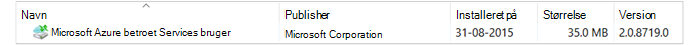

## Næste trin:
• [Azure sikkerhedskopiering ofte stillede spørgsmål](backup-azure-backup-faq.md)
