<properties
    pageTitle="Gendanne virtuelle maskiner fra sikkerhedskopi Azure portalen | Microsoft Azure"
    description="Gendanne en Azure virtuelt fra et gendannelsespunkt Azure portalen"
    services="backup"
    documentationCenter=""
    authors="markgalioto"
    manager="cfreeman"
    editor=""
    keywords="gendanne sikkerhedskopi; Sådan gendannes; gendannelsespunkt;"/>

<tags
    ms.service="backup"
    ms.workload="storage-backup-recovery"
    ms.tgt_pltfrm="na"
    ms.devlang="na"
    ms.topic="article"
    ms.date="08/10/2016"
    ms.author="trinadhk; jimpark;"/>

# Bruge Azure portal til at gendanne virtuelle maskiner

> [AZURE.SELECTOR]
- [Gendanne FOS i klassisk portal](backup-azure-restore-vms.md)
- [Gendanne FOS Azure-portalen](backup-azure-arm-restore-vms.md)

Beskytte dine data ved at tage snapshots af dine data med definerede intervaller. Disse snapshots kaldes gendannelse punkter, og de er gemt i gendannelse services vaults. Hvis, eller når det er nødvendigt at reparere eller genopbygge en VM, kan du gendanne VM fra enhver af de gemte gendannelse punkter. Når du gendanner et gendannelsespunkt, kan du vende tilbage eller gendanne VM til tilstanden, når punktet Genoprettelsen blev ført. I denne artiklen beskrives, hvordan du gendanner en VM.

> [AZURE.NOTE] Azure har to installation modeller til oprettelse og arbejde med ressourcer: [ressourcestyring og klassisk](../resource-manager-deployment-model.md). I denne artikel indeholder oplysninger og procedurer for at gendanne FOS installeres ved hjælp af Ressourcestyring modellen.

## Gendanne et gendannelsespunkt

1. Log på [Azure-portalen](http://portal.azure.com/)

2. Klik på **Gennemse** , og skriv **Gendannelsestjenester**i listen over tjenester, menuen Azure. Listen over tjenester justeres til hvad du skriver. Når du ser **gendannelse Services vaults**, skal du vælge den.

    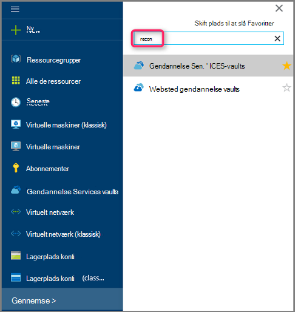

    På listen over vaults i abonnement vises.

    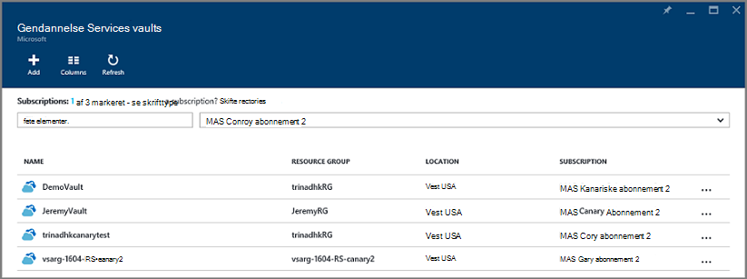

3. Vælg den samling, der er knyttet til den VM, du vil gendanne, på listen. Når du klikker på samling af legitimationsoplysninger, åbnes dens dashboard.

    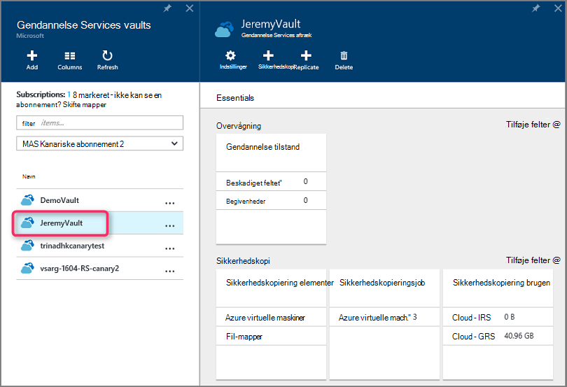

4. Nu hvor du er i dashboardet samling af legitimationsoplysninger. Side om side skal du klikke på **virtuelle Azure-computere** for at få vist de VM'er, der er knyttet til samling af legitimationsoplysninger på **Sikkerhedskopi elementer** .

    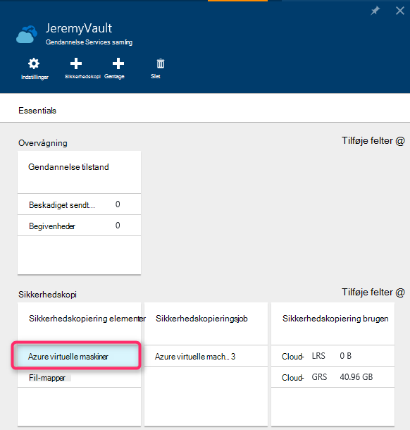

    Bladet **Sikkerhedskopi elementer** åbnes og viser listen over Azure virtuelle computere.

    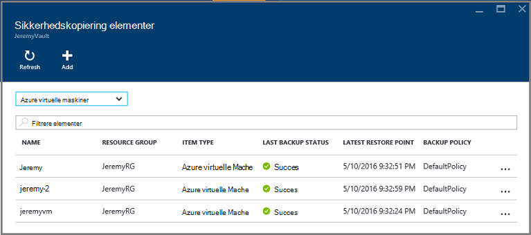

5. Vælg en VM til at åbne dashboard på listen. Dashboardet VM åbnes til området overvågnings, som indeholder feltet Gendan punkter.

    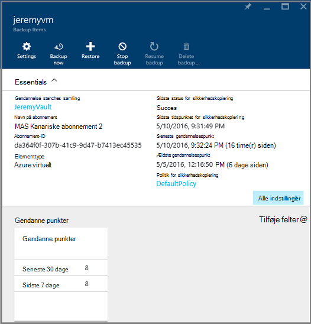

6. Klik på **Gendan** i menuen VM dashboard

    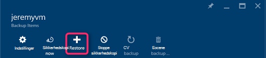

    Bladet Gendan åbnes.

    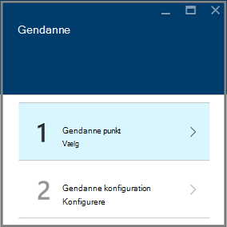

7. Klik på bladet **gendanne** **gendanne punkt** for at åbne bladet **Vælg gendanne punkt** .

    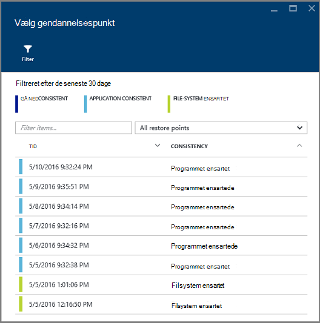

    Dialogboksen vises som standard alle gendannelsespunkter fra de seneste 30 dage. Brug **Filter** til at ændre tidsintervallet for gendannelsespunkter vises. Som standard vises alle konsistens Gendan interessante. Redigere **alle gendanne punkter** filter for at vælge en bestemt konsistens over gendannelsespunkter. Du kan finde flere oplysninger om de forskellige typer gendannelse punkt, se forklaring af [dataenes konsistens](./backup-azure-vms-introduction.md#data-consistency).  
    - Vælg **Gendan punkt konsistens** fra denne liste:
        - Ned ensartet gendannelsespunkter
        - Programmet ensartet gendannelsespunkter
        - Arkivere system ensartet gendannelsespunkter
        - Alle gendanne punkter.  

8. Vælg et gendannelsespunkt, og klik på **OK**.

    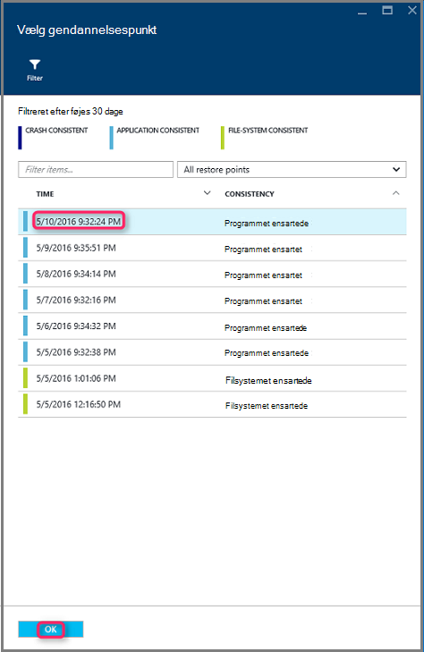

    Bladet **gendanne** viser punktet Gendan er angivet.

    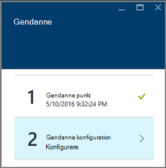

9. På bladet **gendanne** åbnes **gendanne konfiguration** automatisk, når gendannelsespunkt er angivet.

    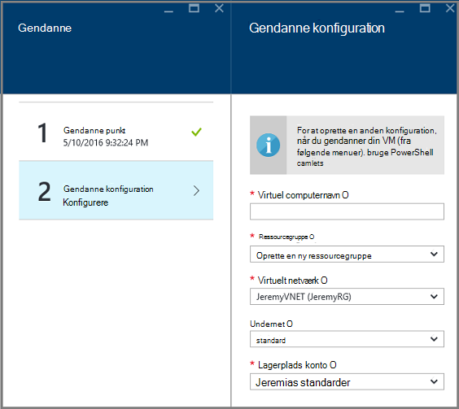

## Vælge en VM gendannelse af konfiguration

Nu, hvor du har valgt gendannelsespunkt, skal du vælge en konfiguration for gendannelsen VM. Dine valg til konfiguration af gendannede VM er at bruge: Azure portal eller PowerShell.

> [AZURE.NOTE] Portal indeholder en indstilling for hurtig oprettelse til gendannede VM. Hvis du vil tilpasse VM konfigurationen af den to-be gendannede VM, bruge PowerShell til at gendanne en sikkerhedskopi af diske og knytte dem til valg af VM konfigurationen af. Se [gendannelse af en VM med særlige netværkskonfigurationer](#restoring-vms-with-special-network-configurations).

1. Hvis du ikke allerede er der, gå til bladet **gendanne** . Sørg for en **gendanne punkt** er valgt, og klik på **Gendan konfiguration** for at åbne bladet **gendannelse konfiguration** .

    

2. Angiv bladet **gendanne konfiguration** eller Vælg værdier for hver af følgende felter:
    - **Virtuelt navn** - Angiv et navn til VM. Navnet skal være entydige for den ressourcegruppe (for en ressourcestyring installeret VM) eller en skybaseret tjeneste (for en klassisk VM). Du kan ikke erstatte den virtuelle maskine, hvis den findes allerede i abonnementet.
    - **Ressourcegruppe** – Brug en eksisterende ressourcegruppe, eller Opret en ny. Hvis du gendanner en klassisk VM, kan du bruge dette felt til at angive navnet på en ny tjeneste i skyen. Hvis du opretter en ny ressource gruppe/skybaseret tjeneste, skal navnet være globalt entydigt. Typisk navnet på skyen tjenesten er knyttet til en offentligt URL-adresse - for eksempel: [cloudservice]. cloudapp.net. Hvis du forsøger at bruge et navn til skyen ressource gruppe/skybaseret tjeneste, der er allerede blevet brugt, tildeler Azure ressource/skytjenesten, det samme navn som VM. Azure viser ressource grupper/skytjenester og FOS ikke er knyttet til en hvilken som helst forbindelse grupper. Se, [hvordan du overfører fra forbindelse grupper til et internationale virtuelt netværk (VNet)](../virtual-network/virtual-networks-migrate-to-regional-vnet.md)kan finde flere oplysninger.
    - **Virtuelt netværk** - Vælg det virtuelle netværk (VNET), når du opretter VM. Feltet indeholder alle VNETs, der er knyttet til abonnementet. Ressourcegruppe VM vises i parenteser.
    - **Undernet** - Hvis VNET har undernet, det første undernet er valgt som standard. Hvis der er flere undernet, skal du vælge det ønskede undernet.
    - **Lagerplads konto** – denne menu viser lagerplads konti på samme placering, som samling af legitimationsoplysninger gendannelsestjenester. Når du vælger en lagerplads-konto, Vælg en konto, der deler samme placering, som samling af legitimationsoplysninger gendannelsestjenester. Lagerplads konti, der er Zone overflødige understøttes ikke. Hvis der ikke er nogen lagerplads konti med samme placering, som samling af legitimationsoplysninger gendannelsestjenester, skal du oprette én før du starter gendannelsen. Kontoen lagerplads gentagelse type er nævnt i parenteser.

    > [AZURE.NOTE] Hvis du gendanner en ressourcestyring installeret VM, skal du identificere et virtuelt netværk (VNET). Et virtuelt netværk (VNET) er valgfrit for en klassisk VM.

3. Klik på **OK** for at færdiggøre Gendan konfigurationen bladet **gendanne konfiguration** .

4. Klik på **Gendan** for at udløse gendannelsen bladet **gendanne** .

    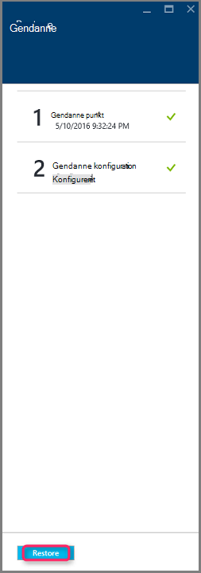

## Registrere gendannelsen

Når du udløse gendannelsen, opretter tjenesten sikkerhedskopiering af en sag til at spore gendannelsen. Tjenesten sikkerhedskopi også opretter og midlertidigt viser meddelelsen i meddelelsesområdet på portalen. Hvis du ikke kan se meddelelsen, kan du altid klikke på ikonet meddelelser for at få vist dine meddelelser.

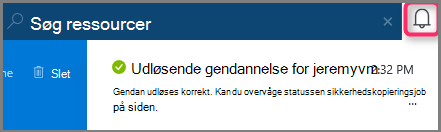

Til at få vist handlingen, mens det behandler eller få vist, når det er fuldført, skal du åbne listen sikkerhedskopi sager.

1. Klik på **Gennemse** , og skriv **Gendannelsestjenester**i listen over tjenester, menuen Azure. Listen over tjenester justeres til hvad du skriver. Når du ser **gendannelse Services vaults**, skal du vælge den.

    

    På listen over vaults i abonnement vises.

    

2. Vælg den samling, der er knyttet til den VM, du har gendannet på listen. Når du klikker på samling af legitimationsoplysninger, åbnes dens dashboard.

3. Side om side skal du klikke på **virtuelle Azure-computere** for at få vist de job, der er knyttet til samling af legitimationsoplysninger i dashboardet samling af legitimationsoplysninger for **Sikkerhedskopiering af sager** .

    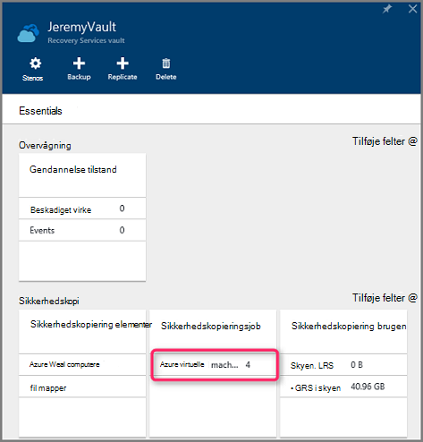

    Bladet **Sikkerhedskopi job** åbnes og viser en liste over job.

    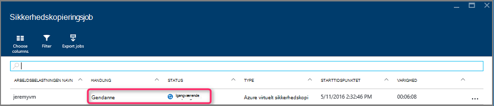

## Gendanne FOS med særlige netværkskonfigurationer
Det er muligt at sikkerhedskopiere og gendanne FOS med følgende netværkskonfigurationer af speciel. Disse konfigurationer kræver dog visse særlige overvejelser, når du går gennem gendannelsen.

- FOS under justering af belastning (interne og eksterne)
- FOS med flere reserveret IP'er
- FOS med flere netværkskort

>[AZURE.IMPORTANT] Når du opretter den særlige netværkskonfiguration for FOS, skal du bruge PowerShell til at oprette FOS fra diskene gendannet.

For at genoprette fuldt virtuelle maskiner efter gendannelse til disk, skal du følge disse trin:

1. Gendanne diskene fra en gendannelse services samling, ved hjælp af [PowerShell](../backup-azure-vms-automation.md#restore-an-azure-vm)

2. Oprette VM konfigurationen kræves til justering af belastning / flere NIC/multiplum reserveret IP-adresse ved hjælp af PowerShell-cmdletter og brug dem for at oprette VM af ønsket konfiguration.
    - Oprette VM i skybaseret tjeneste med [interne justering af belastning](https://azure.microsoft.com/documentation/articles/load-balancer-internal-getstarted/)
    - Oprette VM at oprette forbindelse til [via justering af belastning internettet] (https://azure.microsoft.com/en-us/documentation/articles/load-balancer-internet-getstarted/)
    - Oprette VM med [flere netværkskort](https://azure.microsoft.com/documentation/articles/virtual-networks-multiple-nics/)
    - Oprette VM med [flere reserveret IP'er](https://azure.microsoft.com/documentation/articles/virtual-networks-reserved-public-ip/)

## Næste trin
Nu, hvor du kan gendanne dine FOS, skal du se artiklen for at få oplysninger om fejlfinding på almindelige fejl med FOS. Se også i artiklen om administration af opgaver med din FOS.

- [Foretage fejlfinding af Logonfejl](backup-azure-vms-troubleshoot.md#restore)
- [Administrere virtuelle maskiner](backup-azure-manage-vms.md)
