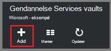
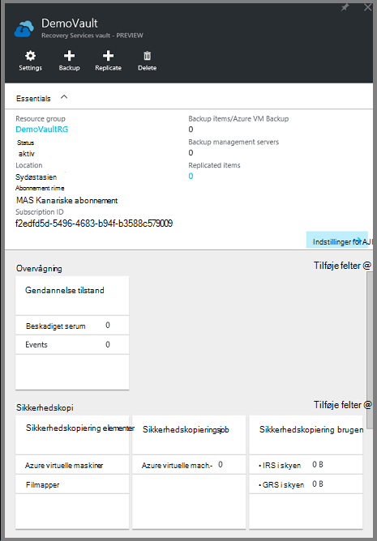
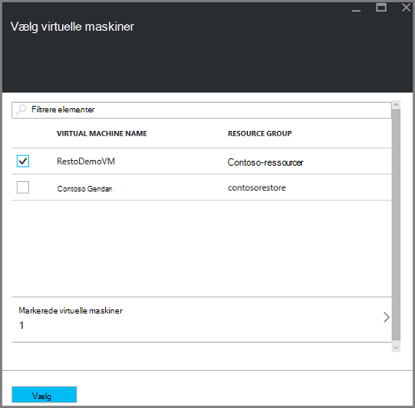
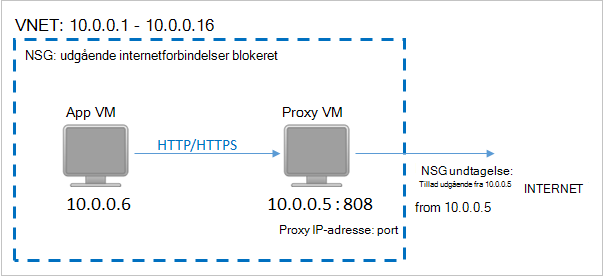
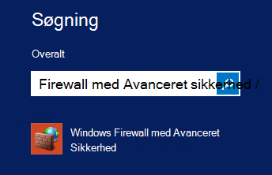

<properties
    pageTitle="Forberede dit miljø til at sikkerhedskopiere ressourcestyring installeret virtuelle maskiner | Microsoft Azure"
    description="Sørg for, at dit miljø er parat til at sikkerhedskopiere virtuelle maskiner i Azure"
    services="backup"
    documentationCenter=""
    authors="markgalioto"
    manager="cfreeman"
    editor=""
    keywords="sikkerhedskopier. sikkerhedskopiere;"/>

<tags
    ms.service="backup"
    ms.workload="storage-backup-recovery"
    ms.tgt_pltfrm="na"
    ms.devlang="na"
    ms.topic="article"
    ms.date="08/21/2016"
    ms.author="trinadhk; jimpark; markgal;"/>


# <a name="prepare-your-environment-to-back-up-resource-manager-deployed-virtual-machines"></a>Forberede dit miljø til at sikkerhedskopiere ressourcestyring installeret virtuelle maskiner

> [AZURE.SELECTOR]
- [Ressourcestyring model](backup-azure-arm-vms-prepare.md)
- [Klassisk model](backup-azure-vms-prepare.md)

Denne artikel indeholder trin til at forberede dit miljø til at sikkerhedskopiere en ressourcestyring installeret virtuelt (VM). De trin, der vises i procedurer bruge Azure-portalen.  

Tjenesten Azure sikkerhedskopi har to typer af vaults (sikkerhedskopiere vaults og gendannelse services vaults) til at beskytte din FOS til. En ekstra samling beskytter FOS installeres ved hjælp af implementeringsmodel klassisk. En samling af tjenester legitimationsoplysninger gendannelse beskytter **både klassisk installeret eller Ressourcestyring installeret FOS** . Du skal bruge en samling af legitimationsoplysninger gendannelse Services til at beskytte en ressourcestyring installeret VM.

>[AZURE.NOTE] Azure har to installation modeller til oprettelse og arbejde med ressourcer: [ressourcestyring og klassisk](../resource-manager-deployment-model.md). Du kan finde oplysninger om at arbejde med klassisk implementeringsmodel FOS i [forberede dit miljø til at sikkerhedskopiere Azure virtuelle maskiner](backup-azure-vms-prepare.md) .

Før du kan beskytte eller sikkerhedskopiere en ressourcestyring installeret VM (virtual machine), skal du kontrollere disse forudsætninger findes:

- Opret en gendannelse services samling (eller Identificer en eksisterende gendannelse services samling) *på samme placering, som din VM*.
- Vælge et scenarie, definere politikken sikkerhedskopiering og definere elementer til at beskytte.
- Kontrollere installationen af VM Agent på virtuelt.
- Kontrollere netværksforbindelsen

Hvis du kender disse betingelser, der allerede findes i dit miljø derefter gå videre til den [sikkerhedskopiere din FOS artikel](backup-azure-vms.md). Hvis du vil konfigurere, eller se, en af disse forudsætninger fører dig gennem trinnene til at forberede den nødvendige program i denne artikel.


## <a name="limitations-when-backing-up-and-restoring-a-vm"></a>Begrænsninger, når sikkerhedskopiere og gendanne en VM

Før du forberede dit miljø, skal du forstå begrænsningerne.

- Sikkerhedskopiere virtuelle maskiner med mere end 16 datadisce understøttes ikke.
- Sikkerhedskopiere virtuelle maskiner med en reserverede IP-adresse og ingen defineret slutpunkt understøttes ikke.
- Sikkerhedskopi af Linux virtuelle maskiner med Docker lokalnummer understøttes ikke. 
- Sikkerhedskopiere data omfatter ikke tilsluttet netværksdrev knyttet til VM. 
- Erstatte en eksisterende virtuelt under gendannelse understøttes ikke. Hvis du forsøger at gendanne VM, når VM findes, mislykkes gendannelsen.
- Tværs område sikkerhedskopiering og gendannelse understøttes ikke.
- Du kan sikkerhedskopiere virtuelle maskiner i alle offentlige områder af Azure (se [tjekliste](https://azure.microsoft.com/regions/#services) over understøttede områder). Hvis det område, du søger efter, er ikke-understøttede i dag, vises den ikke på rullelisten under oprettelse af samling af legitimationsoplysninger.
- Du kan sikkerhedskopiere virtuelle maskiner kun for Vælg operativsystemversioner:
  - **Linux**: Azure sikkerhedskopi understøtter [en liste over salgsdistributioner, der er godkendt af Azure](../virtual-machines/virtual-machines-linux-endorsed-distros.md) undtagen Core OS Linux.  Andre Flyt-dine-ejer-distribuerede Linux-versioner kan også arbejde som VM agent er tilgængelig på den virtuelle maskine og understøttelse af Python findes.
  - **Windows Server**: versioner, der er ældre end Windows Server 2008 R2 understøttes ikke.
- Gendanne et domænenavn fra domænecontrolleren understøttes (DC) VM, der er en del af en multi-DC konfiguration kun via PowerShell. Få mere at vide om [gendannelse af en multi-DC domænenavn fra domænecontrolleren](backup-azure-restore-vms.md#restoring-domain-controller-vms).
- Gendannelse af virtuelle maskiner, der har særlige følgende netværkskonfigurationer understøttes kun via PowerShell. VM'er, der er oprettet ved hjælp af arbejdsprocessen for Gendan i Brugergrænsefladen vil ikke have disse netværkskonfigurationer, når gendannelsen er fuldført. For at få mere for at vide, skal du se [Gendanne FOS med særlige netværkskonfigurationer](backup-azure-restore-vms.md#restoring-vms-with-special-netwrok-configurations).
  - Virtuelle maskiner under indlæsning belastningsjusteringstjenesten konfiguration (interne og eksterne)
  - Virtuelle maskiner med flere reserveret IP-adresser
  - Virtuelle maskiner med flere netværkskort

## <a name="create-a-recovery-services-vault-for-a-vm"></a>Oprette en gendannelse services samling af legitimationsoplysninger for et VM

En samling af gendannelse services legitimationsoplysninger er en enhed, der gemmer sikkerhedskopiering og gendannelse punkter, der er oprettet med tiden. Gendannelse services samling indeholder også de ekstra politikker, der er knyttet til de beskyttede virtuelle maskiner.

Sådan oprettes en gendannelse services samling af legitimationsoplysninger:

1. Log på [Azure-portalen](https://portal.azure.com/).

2. Klik på **Gennemse** , og skriv **Gendannelsestjenester**på listen over ressourcer, i menuen Hub. Når du begynder at skrive, på listen filtrerer baseret på dit input. Klik på **tjenester til genoprettelse samling**.

     <br/>

    På listen over tjenester til genoprettelse vaults vises.

3. Klik på **Tilføj**i menuen **gendannelse Services vaults** .

    

    Gendannelse Services samling blade åbnes, beder dig om at angive et **navn**, **abonnement**, **ressourcegruppe**og **placering**.

    

4. Angiv et fuldt navn til at identificere samling af legitimationsoplysninger for **navn**. Navnet skal være entydige for Azure abonnementet. Skriv et navn, der indeholder mellem 2 og 50 tegn. Det skal starte med et bogstav og kan indeholde kun bogstaver, tal og bindestreger.

5. Klik på **abonnement** for at se den tilgængelige liste over abonnementer. Hvis du ikke er sikker på, hvilket abonnement, der skal bruges, brug standarden (eller forslag) abonnement. Der vil være flere valgmuligheder, kun, hvis din virksomhedskonto er knyttet til flere Azure abonnementer.

6. **Ressourcegruppe** for at se den tilgængelige liste over grupper, eller klik på **Ny** for at oprette en ny ressourcegruppe. Se [Oversigt over Azure ressourcestyring](../azure-resource-manager/resource-group-overview.md) detaljerede oplysninger om grupper

7. Klik på **placering** for at vælge det geografiske område for samling af legitimationsoplysninger. Samling af legitimationsoplysninger **skal** være i samme område som de virtuelle maskiner, som du vil beskytte.

    >[AZURE.IMPORTANT] Hvis du er usikker på det sted, hvor din VM findes, Luk af samling oprettelse af dialogboksen, og gå til listen over virtuelle maskiner i portalen. Hvis du har virtuelle maskiner i flere områder, skal du oprette en samling af legitimationsoplysninger gendannelsestjenester i hvert område. Oprette samling af legitimationsoplysninger i den første placering før du skifter til den næste lokalitet. Der er ingen grund til at angive lagerplads konti for at gemme sikkerhedskopidataene – samling af legitimationsoplysninger gendannelse Services og tjenesten Azure sikkerhedskopiering håndtere dette automatisk.

8. Klik på **Opret**. Det kan tage et øjeblik, før den gendannelse Services samling af legitimationsoplysninger skal oprettes. Overvåge status meddelelserne i området øverst til højre på portalen. Når din samling af legitimationsoplysninger er oprettet, vises det på listen over tjenester til genoprettelse vaults.

    

    Nu hvor du har oprettet din samling, lære at angive lagerplads gentagelse.

## <a name="set-storage-replication"></a>Angive lagerplads gentagelse

Replikering datalager kan du vælge mellem geografisk overflødige lager og lokalt overflødige lagerplads. Som standard har din samling geografisk overflødige lagerplads. Lad indstillingen være angivet til geografisk overflødige lagerplads, hvis dette er den primære sikkerhedskopi. Vælg lokalt overflødige lagerplads, hvis du ønsker en billigere indstilling, der ikke er helt som robust. Få mere at vide om [geografisk overflødige](../storage/storage-redundancy.md#geo-redundant-storage) og [lokalt overflødige](../storage/storage-redundancy.md#locally-redundant-storage) indstillinger for lagring i [Azure-lager gentagelse oversigt](../storage/storage-redundancy.md).

Sådan redigerer du indstillingen lagerplads gentagelse:

1. Vælg din samling af legitimationsoplysninger til at åbne dashboardet samling af legitimationsoplysninger og bladet indstillinger. Hvis bladet **Indstillinger** ikke åbnes, skal du klikke på **alle indstillinger** i dashboardet samling af legitimationsoplysninger.

2. Bladet **Indstillinger** , klik på **Sikkerhedskopiér infrastruktur** > **Sikkerhedskopi konfiguration** til at åbne bladet **Sikkerhedskopi konfiguration** . Vælg gentagelse datalager til din samling på bladet **Sikkerhedskopi konfiguration** .

    

    Når du har valgt indstillingen lagerplads for dit samling, er du klar til at knytte VM til samling af legitimationsoplysninger. For at starte tilknytningen, skal du finde og registrere Azure virtuelle computere.


## <a name="select-a-backup-goal-set-policy-and-define-items-to-protect"></a>Vælg et ekstra mål, angive politik og definere elementer til at beskytte

Kør processen til registrering for at sikre, at alle nye virtuelle maskiner, der er føjet til abonnementet identificeres, før du registrerer en VM med en samling af legitimationsoplysninger. Processen forespørgsler Azure til listen over virtuelle maskiner i abonnementet, sammen med yderligere oplysninger som navnet på skyen tjenesten og området. På portalen Azure refererer scenarie til hvad du skal sætte i gendannelse services samling. Politikken er planen for hvor ofte og hvornår gendannelse punkter er taget. Politik indeholder også opbevaring området for de gendannelse punkter.

1. Hvis du allerede har en gendannelse Services samling åben, kan du gå videre til trin 2. Hvis du ikke har en gendannelse Services samling, der er åben, men er i portalen Azure, i menuen Hub, klik på **Gennemse**.

  - Skriv **Gendannelsestjenester**på listen over ressourcer.
  - Når du begynder at skrive, på listen filtrerer baseret på dit input. Når du ser **gendannelse Services vaults**, kan du klikke på den.

     <br/>

    På listen over tjenester til genoprettelse vaults vises.
  - På listen over tjenester til genoprettelse vaults, Vælg en samling af legitimationsoplysninger.

    Det valgte samling dashboard åbnes.

    

2. Klik på **sikkerhedskopi** for at åbne bladet sikkerhedskopi i menuen samling dashboard.

    

    Når bladet åbnes, skal søger tjenesten sikkerhedskopi efter en hvilken som helst nye FOS i abonnement.

    

3. Klik på **Sikkerhedskopiér mål** for at åbne bladet sikkerhedskopi mål bladet sikkerhedskopi.

    

4. Bladet sikkerhedskopiering mål Indstil **, kører arbejdsbelastningen** til Azure og **Hvad vil du gerne sikkerhedskopi** til virtuel maskine, klik derefter på **OK**.

    Bladet sikkerhedskopi mål lukker og åbner bladet sikkerhedskopi politik.

    

5. Vælg den sikkerhedskopiering politik, du vil anvende på samling af legitimationsoplysninger og klikke på **OK**på bladet sikkerhedskopi politik.

    

    Oplysninger om standardpolitikken vises detaljerne. Hvis du vil oprette en ny politik, skal du vælge **Opret ny** i menuen ned. I rullemenuen også giver mulighed for at skifte den tid, når snapshot sættes til 7 PM. Yderligere oplysninger om definere en politik for en sikkerhedskopi, du [definerer en politik for sikkerhedskopiering](backup-azure-vms-first-look-arm.md#defining-a-backup-policy). Når du klikker på **OK**, er sikkerhedskopiering politikken knyttet til samling af legitimationsoplysninger.

    Vælg dernæst FOS skal knyttes til samling af legitimationsoplysninger.

6. Vælg de virtuelle maskiner knytte til den angivne politik, og klik på **Vælg**.

    

    Hvis du ikke kan se den ønskede VM, kan du kontrollere, at den findes i den samme Azure placering som samling af legitimationsoplysninger gendannelsestjenester.

7. Nu, hvor du har defineret alle indstillinger for samling i bladet sikkerhedskopi skal du klikke på **Aktivér sikkerhedskopi** nederst på siden. Dette installerer politikken på samling af legitimationsoplysninger og FOS.

    

Den næste fase i forberedelse installerer VM Agent, eller at sikre, at VM Agent er installeret.


## <a name="install-the-vm-agent-on-the-virtual-machine"></a>Installere VM Agent på den virtuelle maskine

Azure VM Agent skal være installeret på en Azure virtuel maskine til filtypenavnet sikkerhedskopi til at arbejde. Hvis din VM blev oprettet ud fra galleriet Azure, derefter findes VM Agent allerede på den virtuelle maskine. Disse oplysninger er oplyst for de situationer, hvor du befinder dig *ikke* ved hjælp af en VM oprettet fra galleriet Azure - for eksempel du har overført et VM fra en lokal datacenter. I så fald skal VM Agent være installeret for at beskytte den virtuelle maskine.

Få mere at vide om [VM Agent](https://go.microsoft.com/fwLink/?LinkID=390493&clcid=0x409) og [hvordan du installerer VM Agent](../virtual-machines/virtual-machines-windows-classic-manage-extensions.md).

Hvis du har problemer med at sikkerhedskopiere Azure VM, kan du kontrollere, at Azure VM Agent korrekt er installeret på den virtuelle maskine (se tabellen nedenfor). Hvis du har oprettet en brugerdefineret VM, er [sikre, at afkrydsningsfeltet **Installer VM Agent** er markeret](../virtual-machines/virtual-machines-windows-classic-agents-and-extensions.md) , før den virtuelle maskine klargjort.

Den følgende tabel indeholder flere oplysninger om VM Agent til Windows og Linux FOS.

| **Handling** | **Windows** | **Linux** |
| --- | --- | --- |
| Installere VM Agent | <li>Hent og Installer [agent MSI](http://go.microsoft.com/fwlink/?LinkID=394789&clcid=0x409). Du skal have administratorrettigheder for at fuldføre installationen. <li>[Opdatere egenskaben VM](http://blogs.msdn.com/b/mast/archive/2014/04/08/install-the-vm-agent-on-an-existing-azure-vm.aspx) til at angive, at agenten er installeret. | <li> Du kan installere den nyeste version [Linux agent](https://github.com/Azure/WALinuxAgent) fra GitHub. Du skal have administratorrettigheder for at fuldføre installationen. <li> [Opdatere egenskaben VM](http://blogs.msdn.com/b/mast/archive/2014/04/08/install-the-vm-agent-on-an-existing-azure-vm.aspx) til at angive, at agenten er installeret. |
| Opdatere VM Agent | Opdatere VM Agent er så enkelt som geninstallere [VM Agent binære filer](http://go.microsoft.com/fwlink/?LinkID=394789&clcid=0x409). <br>Sørg for, at ingen sikkerhedskopieringen kører, mens VM agent opdateres. | Følg vejledningen i [opdatere Linux VM Agent ](../virtual-machines-linux-update-agent.md). <br>Sørg for, at ingen sikkerhedskopieringen kører, mens VM Agent opdateres. |
| Validere VM Agent-installation | <li>Gå til mappen *C:\WindowsAzure\Packages* i Azure VM. <li>Du skal finde filen WaAppAgent.exe Præsenter.<li> Højreklik på filen, gå til **Egenskaber**, og vælg derefter fanen **Detaljer** . Feltet produktversion skal være 2.6.1198.718 eller nyere. | I/T. |


### <a name="backup-extension"></a>Sikkerhedskopiering lokalnummer

Når VM Agent er installeret på den virtuelle maskine, installeres tjenesten Azure sikkerhedskopiering filtypenavnet sikkerhedskopiering til VM Agent. Tjenesten Azure sikkerhedskopiering opgraderer problemfrit og programrettelser filtypenavnet sikkerhedskopiering.

Filtypenavnet sikkerhedskopiering er installeret af tjenesten sikkerhedskopi, uanset om VM kører. En igangværende VM indeholder den største mulighed for at få et ensartet programmet gendannelsespunkt. Tjenesten Azure sikkerhedskopi stadig dog sikkerhedskopiere VM, selvom den er slået fra, og filtypenavnet blev ikke installeret. Dette kaldes Offline VM. I dette tilfælde bliver punktet gendannelse *nedbrud ensartet*.


## <a name="network-connectivity"></a>Netværksforbindelsen

For at administrere VM snapshots, filtypenavnet sikkerhedskopien skal have forbindelse til Azure offentlige IP-adresser. Den virtuelle maskine HTTP anmoder om timeout uden den rette forbindelse til internettet, og sikkerhedskopieringen mislykkes. Hvis din installation har adgangsbegrænsninger sted (via et netværk sikkerhedsgruppe (NSG), for eksempel), vælg derefter en af disse muligheder for at give en Ryd sti til sikkerhedskopiering trafik:

- [Områder, der Whitelist Azure datacenter IP](http://www.microsoft.com/en-us/download/details.aspx?id=41653) - artiklen vejledning på hvordan til whitelist IP-adresser.
- Installere en HTTP-proxy-server til dirigere trafik.

Når du beslutter, hvilken indstilling du skal bruge, er kompromiser mellem administration, detaljeret kontrolelement og omkostninger.

|Indstillingen|Fordele|Ulemper|
|------|----------|-------------|
|Whitelist IP-adresseområder| Ingen yderligere omkostninger.<br><br>Brug cmdlet'en <i>Set-AzureNetworkSecurityRule</i> for at åbne access i en NSG. | Kompleks til at administrere som den påvirkede IP-intervaller ændrer sig med tiden.<br><br>Giver adgang til hele Azure og ikke blot lager.|
|HTTP-proxy| Detaljeret kontrolelement i proxyen over lagerplads URL-adresser, der er tilladt.<br>Enkelt punkt Internet adgang til FOS.<br>Ikke underlagt Azure IP-adresse ændres.| Yderligere omkostninger for at køre en VM med proxysoftwaren.|

### <a name="whitelist-the-azure-datacenter-ip-ranges"></a>Whitelist Azure datacenter IP-områder

Til whitelist se Azure datacenter IP-intervaller, skal du [Azure websted](http://www.microsoft.com/en-us/download/details.aspx?id=41653) for at få mere at vide under IP-intervaller og instruktioner.

### <a name="using-an-http-proxy-for-vm-backups"></a>Ved hjælp af en HTTP-proxy til VM sikkerhedskopier
Når sikkerhedskopiering af en VM, sender VM sikkerhedskopiering filtypenavnet øjebliksbillede management kommandoerne til Azure-lager ved hjælp af en HTTPS-API. Distribuere sikkerhedskopiering lokalnummer trafik via HTTP-proxy, da det er den eneste komponent, der er konfigureret til adgang til det offentlige Internet.

>[AZURE.NOTE] Der er ingen anbefalinger til den proxysoftware, der skal bruges. Sørg for, at du vælger en proxy, der er kompatibelt med konfigurationstrinnene nedenfor.

Eksempel på billedet nedenfor viser tre konfigurationstrinnene, der er nødvendige for at bruge en HTTP-proxy:

- App VM dirigerer alle HTTP-trafik for offentlige internettet via Proxy VM.
- Proxy VM kan indgående trafik fra FOS i det virtuelle netværk.
- Det netværk sikkerhed gruppe (NSG) med navnet NSF låsning skal have en sikkerhed regel tillader udgående Internettrafik fra Proxy VM.



Hvis du vil bruge en HTTP-proxy til at kommunikere til det offentlige Internet, skal du følge disse trin:

#### <a name="step-1-configure-outgoing-network-connections"></a>Trin 1. Konfigurere udgående netværksforbindelser

###### <a name="for-windows-machines"></a>Til Windows-computere
Dette vil konfigurere proxy serverkonfiguration for lokale System-konto.

1. Hente [PsExec](https://technet.microsoft.com/sysinternals/bb897553)
2. Kør følgende kommando fra øgede prompt,

     ```
     psexec -i -s "c:\Program Files\Internet Explorer\iexplore.exe"
     ```
     Internet explorer-vinduet, åbnes.
3. Gå til Funktioner -> Internetindstillinger -> forbindelser -> LAN-indstillinger.
4. Kontrollér proxyindstillingerne for systemkonto. Angiv IP-Proxy og port.
5. Luk Internet Explorer.

Dette vil oprette en hele computeren proxykonfiguration, og der skal bruges til alle udgående HTTP/HTTPS-trafik.

Hvis du har konfigureret en proxyserver på en aktuelle brugerkonto (ikke en lokal systemkonto), kan du bruge følgende script til at anvende dem på SYSTEMACCOUNT:

```
   $obj = Get-ItemProperty -Path Registry::”HKEY_CURRENT_USER\Software\Microsoft\Windows\CurrentVersion\Internet Settings\Connections"
   Set-ItemProperty -Path Registry::”HKEY_USERS\S-1-5-18\Software\Microsoft\Windows\CurrentVersion\Internet Settings\Connections" -Name DefaultConnectionSettings -Value $obj.DefaultConnectionSettings
   Set-ItemProperty -Path Registry::”HKEY_USERS\S-1-5-18\Software\Microsoft\Windows\CurrentVersion\Internet Settings\Connections" -Name SavedLegacySettings -Value $obj.SavedLegacySettings
   $obj = Get-ItemProperty -Path Registry::”HKEY_CURRENT_USER\Software\Microsoft\Windows\CurrentVersion\Internet Settings"
   Set-ItemProperty -Path Registry::”HKEY_USERS\S-1-5-18\Software\Microsoft\Windows\CurrentVersion\Internet Settings" -Name ProxyEnable -Value $obj.ProxyEnable
   Set-ItemProperty -Path Registry::”HKEY_USERS\S-1-5-18\Software\Microsoft\Windows\CurrentVersion\Internet Settings" -Name Proxyserver -Value $obj.Proxyserver
```

>[AZURE.NOTE] Hvis du ser "(407) Proxygodkendelse kræves" i proxy server log, kan du kontrollere din godkendelse er konfigureret korrekt.

######<a name="for-linux-machines"></a>For Linux-computere

Tilføj følgende linje til den ```/etc/environment``` fil:

```
http_proxy=http://<proxy IP>:<proxy port>
```

Tilføj følgende linjer til den ```/etc/waagent.conf``` fil:

```
HttpProxy.Host=<proxy IP>
HttpProxy.Port=<proxy port>
```

#### <a name="step-2-allow-incoming-connections-on-the-proxy-server"></a>Trin 2. Tillad indgående forbindelser på proxyserveren:

1. Åbn Windows Firewall på proxy-server. Den nemmeste måde at få adgang til firewallen er at søge efter Windows Firewall med Avanceret sikkerhed.

    

2. Højreklik på **Indgående regler** i dialogboksen Windows Firewall, og klik på **Ny regel …**.

    

3. Vælg indstillingen **brugerdefineret** **Regeltype** **Indgående guiden Ny regel**, og klik på **Næste**.
4. På siden for at vælge **programnavn**, klik på **Alle programmer** , og klik på **Næste**.

5. Angiv følgende oplysninger på siden **protokol og porte** og klikke på **Næste**:

    

    - Vælg *TCP* *Protocol* type
    - vælge *Specifikke porte*for *lokal port* , i feltet nedenfor angive den ```<Proxy Port>``` , der er blevet konfigureret.
    - Vælg *Alle porte* for *Remote port*

    Klik på hele vejen til slutningen for resten af guiden, og Navngiv denne regel.

#### <a name="step-3-add-an-exception-rule-to-the-nsg"></a>Trin 3. Føje en undtagelsesregel til NSG:

Skriv følgende kommando i kommandoprompten en Azure PowerShell:

Følgende kommando føjer en undtagelse til NSG. Denne undtagelse tillader TCP-trafik fra en hvilken som helst port på 10.0.0.5 til en hvilken som helst internetadresse på port 80 (HTTP) eller 443 (HTTPS). Hvis du har brug for en bestemt port i offentlige internettet, skal du tilføje porten til den ```-DestinationPortRange``` samt.

```
Get-AzureNetworkSecurityGroup -Name "NSG-lockdown" |
Set-AzureNetworkSecurityRule -Name "allow-proxy " -Action Allow -Protocol TCP -Type Outbound -Priority 200 -SourceAddressPrefix "10.0.0.5/32" -SourcePortRange "*" -DestinationAddressPrefix Internet -DestinationPortRange "80-443"
```


*Disse trin bruge specifikke navne og værdier i dette eksempel. Brug navne og værdier til installation, når du angiver, eller klippe og indsætte oplysninger i din kode.*


Nu hvor du ved, at du har forbindelse til netværket, er du klar til at sikkerhedskopiere dine VM. Se [sikkerhedskopiere ressourcestyring installeret FOS](backup-azure-arm-vms.md).

## <a name="questions"></a>Har du spørgsmål?
Hvis du har spørgsmål, eller hvis der er en funktion, som du gerne vil se inkluderet, [sende feedback til os](http://aka.ms/azurebackup_feedback).

## <a name="next-steps"></a>Næste trin
Nu hvor du har forberedt dit miljø til at sikkerhedskopiere dine VM, er det næste logiske trin til at oprette en sikkerhedskopi. Planlægge artikel indeholder flere oplysninger om sikkerhedskopiering af FOS.

- [Sikkerhedskopiere virtuelle maskiner](backup-azure-vms.md)
- [Planlægge infrastrukturen VM sikkerhedskopiering](backup-azure-vms-introduction.md)
- [Administrere virtuel machine-sikkerhedskopiering](backup-azure-manage-vms.md)
