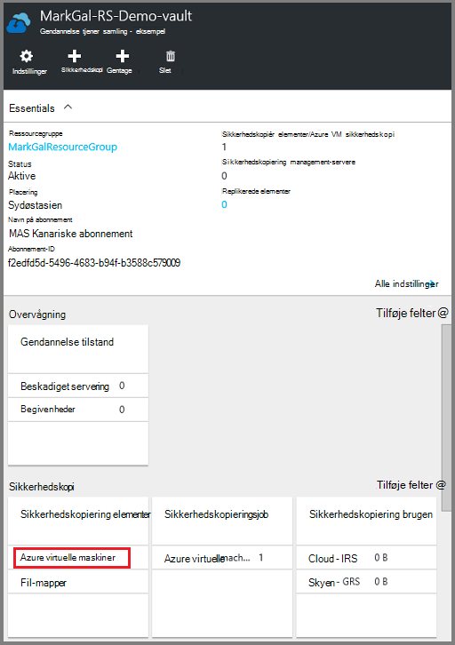
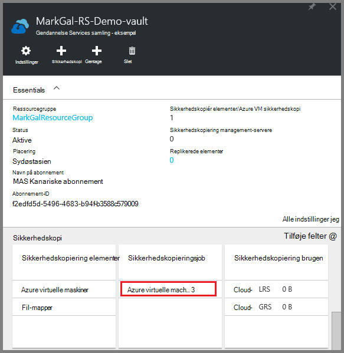

<properties
    pageTitle="Sikkerhedskopiere Azure FOS til en samling af legitimationsoplysninger gendannelse Services | Microsoft Azure"
    description="Opdag, Registrer og sikkerhedskopiere Azure virtuelle maskiner til en gendannelse services samling med disse procedurer til Azure virtuelt sikkerhedskopi."
    services="backup"
    documentationCenter=""
    authors="markgalioto"
    manager="cfreeman"
    editor=""
    keywords="virtuelt sikkerhedskopi; sikkerhedskopiere virtuelt; Sikkerhedskopiering og genoprettelse efter nedbrud; arm vm sikkerhedskopi"/>

<tags
    ms.service="backup"
    ms.workload="storage-backup-recovery"
    ms.tgt_pltfrm="na"
    ms.devlang="na"
    ms.topic="article"
    ms.date="07/29/2016"
    ms.author="trinadhk; jimpark; markgal;"/>

# Sikkerhedskopiere Azure FOS til en samling af legitimationsoplysninger gendannelse

> [AZURE.SELECTOR]
- [Sikkerhedskopiere FOS til gendannelse Services samling](backup-azure-arm-vms.md)
- [Sikkerhedskopiere FOS til sikkerhedskopi samling](backup-azure-vms.md)

Denne artikel indeholder fremgangsmåden til at sikkerhedskopiere Azure FOS (både ressourceleder, der udrulles og klassisk installeret) til en samling af legitimationsoplysninger gendannelsestjenester. Størstedelen af arbejde for sikkerhedskopiering af FOS går til forberedelse. Før du kan sikkerhedskopiere eller beskytte en VM, skal du udføre [forudsætninger](backup-azure-arm-vms-prepare.md) for at forberede dit miljø til at beskytte din FOS til. Når du har udført forudsætningerne, kan du starte feltet Sikkerhedskopiér operator, der skal tage snapshot af din VM.

>[AZURE.NOTE] Azure har to installation modeller til oprettelse og arbejde med ressourcer: [ressourcestyring og klassisk](../resource-manager-deployment-model.md). Du kan beskytte ressourcestyring installeret FOS og klassisk FOS med gendannelse Services vaults. Se [sikkerhedskopiere Azure virtuelle maskiner](backup-azure-vms.md) få mere at vide om at arbejde med klassisk implementeringsmodel FOS.

Se artiklerne på [Planlægning infrastrukturen VM sikkerhedskopiering i Azure](backup-azure-vms-introduction.md) og [Azure virtuelle maskiner](https://azure.microsoft.com/documentation/services/virtual-machines/)kan finde flere oplysninger.

## Udløser bag en sag

Feltet Sikkerhedskopiér politik, der er knyttet til samling gendannelse Services definerer, hvor ofte og hvornår sikkerhedskopieringen kører. Som standard er den første planlagte sikkerhedskopiering indledende sikkerhedskopien. Før den første sikkerhedskopi forekommer, viser Status for den sidste sikkerhedskopiering på bladet **Sikkerhedskopieringsjob** som **Advarsel (indledende sikkerhedskopi afventer)**.

Medmindre sikkerhedskopien indledende forfalder til at starte snart, anbefales det, at du kører **Sikkerhedskopier nu**. Følgende procedure starter fra dashboardet samling af legitimationsoplysninger. Denne procedure fungerer for at køre den indledende sikkerhedskopiering, når du har fuldført alle forudsætninger. Denne fremgangsmåde er ikke tilgængelig, hvis den indledende sikkerhedskopiering er allerede blevet kørt. Politikken tilknyttede Sikkerhedskopiering bestemmer den næste sikkerhedskopiering.  

For at køre den indledende sikkerhedskopiering:

1. På dashboardet til samling i feltet **sikkerhedskopi** , skal du klikke på **virtuelle Azure-computere**.  
    

    Bladet **Sikkerhedskopi elementer** åbnes.

2. Højreklik på den samling, du vil sikkerhedskopiere bladet **Sikkerhedskopi elementer** , og klik på **Opret sikkerhedskopi nu**.

    

    Sikkerhedskopi jobbet udløses.  

    

3. For at få vist, at din indledende sikkerhedskopi er afsluttet på dashboardet til samling i feltet **Sikkerhedskopieringsjob** , skal du klikke på **Azure virtuelle computere**.

    

    Bladet sikkerhedskopi job åbnes.

4. Du kan se status for alle job i bladet **sikkerhedskopi job** .

    

    >[AZURE.NOTE] Som en del af sikkerhedskopieringen udsteder tjenesten Azure sikkerhedskopiering en kommando til filtypenavnet sikkerhedskopiering i hver virtual machine til at rydde alle skriver og tage et ensartet øjebliksbillede.

    Når sikkerhedskopieringen er fuldført, er status *fuldført*.

## Foretage fejlfinding af Logonfejl
Hvis du støder på problemer under sikkerhedskopiering af din virtuelle maskine, skal du se [artiklen om fejlfinding VM](backup-azure-vms-troubleshoot.md) for at få hjælp.

## Næste trin

Nu hvor du har beskyttet din VM, se følgende artikler til administration af flere opgaver du kan gøre med din FOS, og hvordan du kan gendanne FOS.

- [Administrere og overvåge virtuelle maskiner](backup-azure-manage-vms.md)
- [Gendanne virtuelle maskiner](backup-azure-arm-restore-vms.md)
