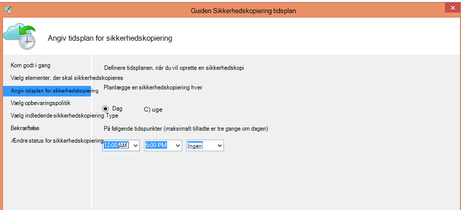
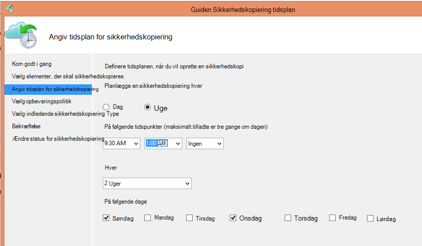
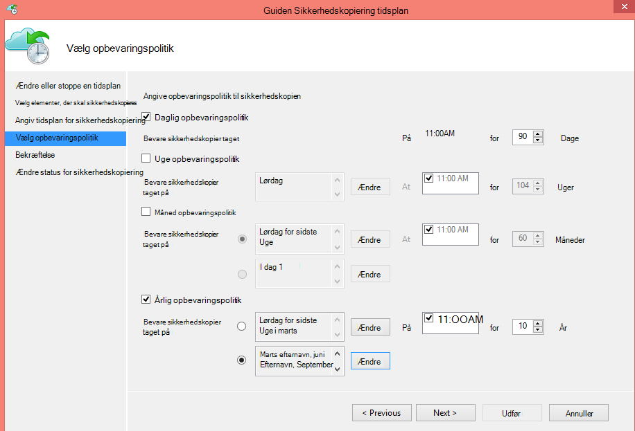
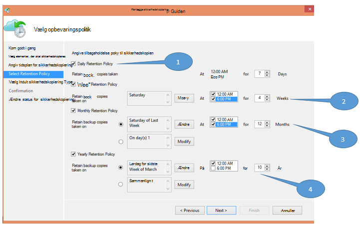
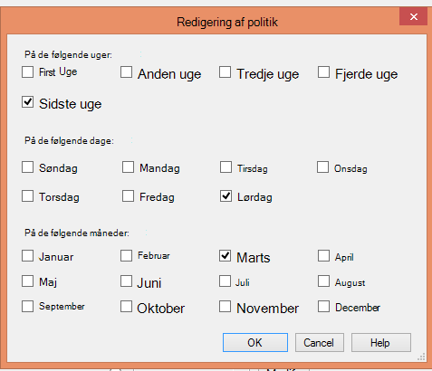

<properties
   pageTitle="Bruge Azure sikkerhedskopi til at erstatte infrastrukturen bånd | Microsoft Azure"
   description="Få mere at vide, hvordan Azure sikkerhedskopiering giver synes godt om båndet semantik som gør det muligt at sikkerhedskopiere og gendanne data i Azure"
   services="backup"
   documentationCenter=""
   authors="trinadhk"
   manager="vijayts"
   editor=""/>
<tags
   ms.service="backup"
   ms.devlang="na"
   ms.topic="article"
   ms.tgt_pltfrm="na"
   ms.workload="storage-backup-recovery"
   ms.date="09/27/2016"
   ms.author="jimpark;trinadhk;markgal"/>

# Bruge Azure sikkerhedskopi til at erstatte infrastrukturen bånd

Azure sikkerhedskopierings- og System Center Data Protection Manager kunder kan:

- Sikkerhedskopiere data i tidsplaner der bedst passer til virksomhedens behov.
- Bevare de sikkerhedskopierede data i længere
- Kontrollér Azure, der er en del af deres langsigtede opbevaring skal (i stedet for bånd).

Denne artikel forklares, hvordan kunder kan aktivere sikkerhedskopiering og opbevaringspolitikker. Kunder, der bruger bånd du forholder dig til deres lang-sigt-opbevaring skal nu har en effektiv og rentabel alternativ med tilgængeligheden af denne funktion. Funktionen er aktiveret i den nyeste version af Azure sikkerhedskopien (som kan findes [her](http://aka.ms/azurebackup_agent)). System Center DPM kunder skal opdatere til, i det mindste DPM 2012 R2 UR5 før du bruger DPM med Azure sikkerhedskopi-tjenesten.

## Hvad er planen sikkerhedskopi?
Tidsplanen for sikkerhedskopiering angiver hyppigheden for sikkerhedskopieringen. Indstillingerne på følgende skærmbillede angiver f.eks, at der tages sikkerhedskopier dagligt ved 6 pm og midnat.

Kunder kan også planlægge en ugentlig sikkerhedskopi. Indstillingerne på følgende skærmbillede angiver f.eks, at sikkerhedskopiering der tages alle alternative søndag og onsdag på 9:30 og 1:00 AM.

## Hvad er opbevaringspolitikken?
Opbevaringspolitikken angiver den varighed, som sikkerhedskopien skal gemmes. I stedet for blot angiver en "flad politik" for alle sikkerhedskopiering punkter, kan kunder angive forskellige opbevaringspolitikker baseret på, når sikkerhedskopieringen er taget. For eksempel bevares sikkerhedskopiering punktet taget dagligt, der fungerer som en funktionel gendannelsespunkt, for 90 dage. Sikkerhedskopiering punktet taget i slutningen af hvert kvartal til revision bevares i en længere varighed.

Det samlede antal "opbevaring punkter", der er angivet i denne politik er 90 (daglige peger) + 40 (én hvert kvartal i ti år) = 130.

## Eksempel – sammensætte begge

1. **Daglig opbevaringspolitik**: sikkerhedskopier taget dagligt er gemt i syv dage.
2. **Ugentlig opbevaringspolitik**: sikkerhedskopier taget hver dag på midnat og 6 PM lørdag bevares i fire uger
3. **Månedlig opbevaringspolitik**: sikkerhedskopier taget på midnat og 6 pm på den sidste lørdag i hver måned bevares for 12 måneder
4. **Årlig opbevaringspolitik**: sikkerhedskopier, der tages ved midnat på den sidste lørdag i hver marts bevares i ti år

Det samlede antal "opbevaring punkter" (punkter som en kunde kan gendanne data) i det foregående diagram er beregnes på følgende måde:

- to peger om dagen i syv dage = 14 gendannelse punkter
- to peger om ugen til fire uger = 8 gendannelse punkter
- to peger månedsbasis for 12 måneder = 24 gendannelse punkter
- et punkt om året per 10 år = 10 gendannelse peger

Det samlede antal gendannelse punkter er 56.

> [AZURE.NOTE] Azure sikkerhedskopi har ikke en begrænsning på antal gendannelse punkter.

## Avanceret konfiguration
Ved at klikke på **Rediger** i den forrige skærm, har kunder yderligere fleksibilitet, når du angiver tidsplaner for opbevaring.

## Næste trin
Du kan finde flere oplysninger om sikkerhedskopiering af Azure i:

- [Introduktion til Azure sikkerhedskopi](backup-introduction-to-azure-backup.md)
- [Prøv Azure sikkerhedskopiere](backup-try-azure-backup-in-10-mins.md)
