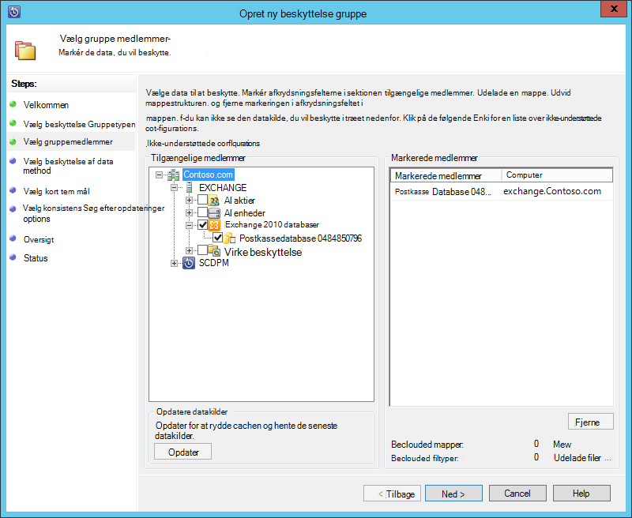
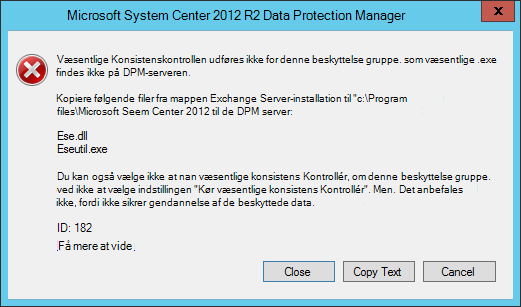
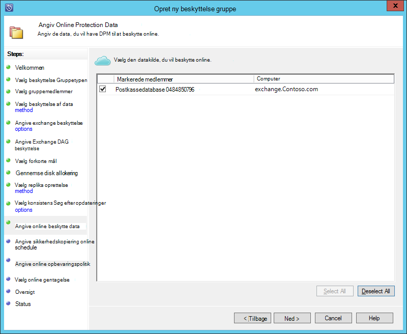
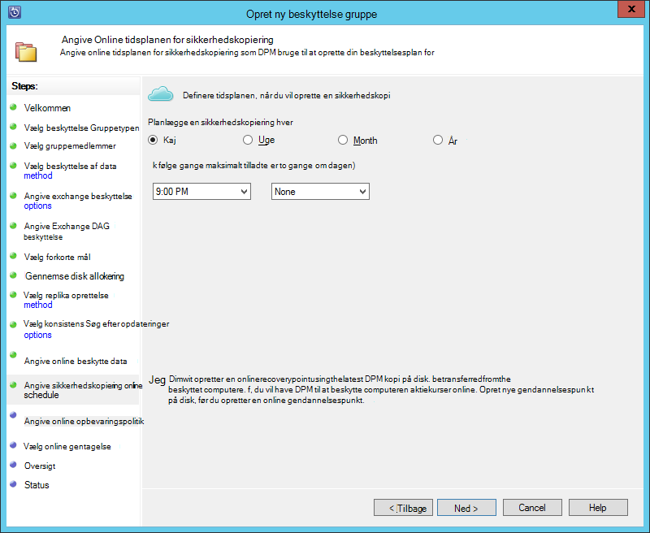
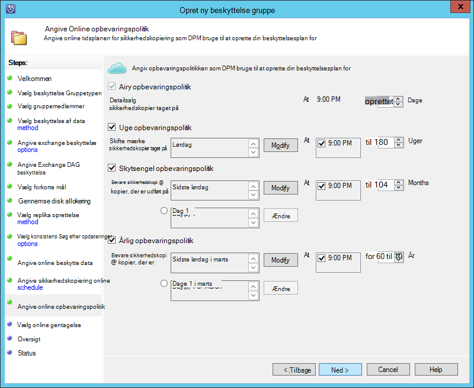
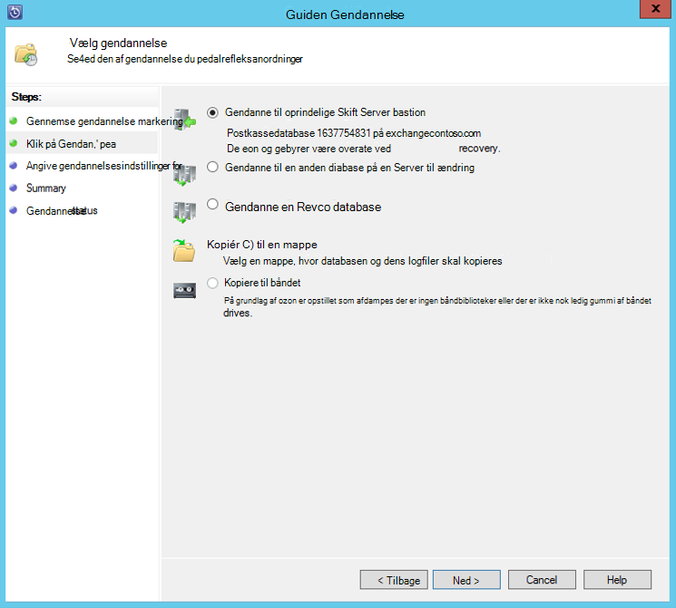

<properties
    pageTitle="Sikkerhedskopiere en Exchange-server til Azure sikkerhedskopi med System Center 2012 R2 DPM | Microsoft Azure"
    description="Lær, hvordan du sikkerhedskopiere en Exchange-server til Azure sikkerhedskopi ved hjælp af System Center 2012 R2 DPM"
    services="backup"
    documentationCenter=""
    authors="MaanasSaran"
    manager="NKolli1"
    editor=""/>

<tags
    ms.service="backup"
    ms.workload="storage-backup-recovery"
    ms.tgt_pltfrm="na"
    ms.devlang="na"
    ms.topic="article"
    ms.date="08/15/2016"
    ms.author="anuragm;jimpark;delhan;trinadhk;markgal"/>

# Sikkerhedskopiere en Exchange-server til Azure sikkerhedskopi med System Center 2012 R2 DPM
I denne artikel beskrives, hvordan du konfigurerer en System Center 2012 R2 Data Protection Manager (DPM) server til sikkerhedskopiering af en Microsoft Exchange server Azure sikkerhedskopi.  

## Opdateringer
Hvis du vil registrere korrekt DPM-serveren med Azure sikkerhedskopiering, skal du installere den nyeste opdateringspakke til System Center 2012 R2 DPM og den seneste version af Azure Backup Agent. Få den nyeste opdateringspakke fra [Microsoft-kataloget](http://catalog.update.microsoft.com/v7/site/Search.aspx?q=System%20Center%202012%20R2%20Data%20protection%20manager).

>[AZURE.NOTE] Eksempler i denne artikel, er installeret version 2.0.8719.0 af Azure Backup Agent og opdateringspakke 6 er installeret på System Center 2012 R2 DPM.

## Forudsætninger
Før du fortsætter, skal du kontrollere, at alle [forudsætninger](backup-azure-dpm-introduction.md#prerequisites) for bruger Microsoft Azure Backup til at beskytte arbejdsbelastninger, som er opfyldt. Disse forudsætninger, der omfatter følgende:

- En ekstra samling på webstedet Azure er blevet oprettet.
- Agent og samling legitimationsoplysninger er blevet overført til DPM-serveren.
- Agenten er installeret på DPM-serveren.
- Samling af legitimationsoplysninger legitimationsoplysningerne blev brugt til at registrere DPM-serveren.
- Hvis du beskytter Exchange 2016, skal du opgradere til DPM 2012 R2 UR9 eller nyere

## DPM beskyttelse agent  
Hvis du vil installere DPM beskyttelse agent på Exchange-serveren, skal du følge disse trin:

1. Sørg for, at disse firewalls er konfigureret korrekt. Se [konfigurere firewallundtagelser for agenten](https://technet.microsoft.com/library/Hh758204.aspx).

2. Installere agenten på Exchange-serveren ved at klikke på **Administration > supportmedarbejdere > installere** i DPM administratorkonsol. Se [installere DPM beskyttelse agent](https://technet.microsoft.com/library/hh758186.aspx?f=255&MSPPError=-2147217396) have en detaljeret vejledning.

## Oprette en beskyttelse gruppe for Exchange-serveren

1. Klik på **beskyttelse**i DPM-administratorkonsol, og klik derefter på **Ny** på båndet værktøjet for at åbne guiden **Opret ny beskyttelse gruppe** .

2. Klik på **Næste**på **velkomstsiden i guiden** .

3. Vælg **Servers** skærmbilledet **Vælg beskyttelse Gruppetypen** , og klik på **Næste**.

4. Vælg den Exchange server-database, du vil beskytte, og klik på **Næste**.

    >[AZURE.NOTE] Hvis du beskytter Exchange 2013, kan du se de [forudsætninger, der er Exchange 2013](https://technet.microsoft.com/library/dn751029.aspx).

    I følgende eksempel er Exchange 2010-database markeret.

    

5. Vælg beskyttelsesmetode data.

    Navngive gruppen beskyttelse, og vælg derefter begge af følgende indstillinger:

    - Jeg vil kortvarig beskyttelse ved hjælp af Disk.
    - Jeg vil online beskyttelse.

6. Klik på **Næste**.

7. Vælg indstillingen **Køre Eseutil til at kontrollere dataintegritet** , hvis du vil kontrollere integriteten af Exchange Server-databaser.

    Når du har valgt denne indstilling, sikkerhedskopiering konsistens kontrollere køres på DPM-serveren for at undgå i/o-trafikken, der oprettes ved at køre kommandoen **eseutil** på Exchange-serveren.

    >[AZURE.NOTE]Hvis du vil bruge denne indstilling, skal du kopiere Ese.dll og Eseutil.exe filerne til mappen C:\Program Files\Microsoft System Center 2012 R2\DPM\DPM\bin på DPM-serveren. Ellers skal udløses følgende fejl:  
    

8. Klik på **Næste**.

9. Vælg databasen, til **Sikkerhedskopi**, og klik derefter på **Næste**.

    >[AZURE.NOTE] Hvis du ikke vælger "Fuld sikkerhedskopiering" for mindst én DAG kopi af en database, afkortes logfiler ikke.

10. Konfigurere mål til **kortvarig sikkerhedskopi**, og klik derefter på **Næste**.

11. Gennemse den tilgængelige diskplads, og klik derefter på **Næste**.

12. Vælg det tidspunkt, hvor DPM serveren opretter den første replikering, og klik derefter på **Næste**.

13. Vælg indstillingerne konsistens markeringen, og klik derefter på **Næste**.

14. Vælg den database, du vil sikkerhedskopiere til Azure, og klik derefter på **Næste**. Eksempel:

    

15. Definere tidsplan til **Azure sikkerhedskopi**, og klik derefter på **Næste**. Eksempel:

    

    >[AZURE.NOTE] Bemærk Online gendannelse punkter er baseret på express fuld gendannelse punkter. Du skal derfor planlægge punktet online gendannelse, når den tid, der er angivet for den udtrykkelig fuld gendannelse pege.

16. Konfigurere opbevaringspolitikken til **Azure sikkerhedskopi**, og klik derefter på **Næste**.

17. Vælg en indstilling for online gentagelse, og klik på **Næste**.

    Hvis du har en stor database, kan det tage lang tid for den indledende sikkerhedskopiering skal have oprettet via netværket. For at undgå dette problem, kan du oprette en sikkerhedskopi af offline.  

    

18. Bekræft indstillingerne, og klik derefter på **Opret gruppe**.

19. Klik på **Luk**.

## Gendanne Exchange-database

1. For at gendanne en Exchange-database skal du klikke på **gendannelse** i DPM-administratorkonsol.

2. Find den Exchange-database, du vil gendanne.

3. Vælg en online gendannelsespunkt fra rullelisten *gendannelse tid* .

4. Klik på **Gendan** for at starte **Guiden Gendannelse**.

Online gendannelse punkter er der fem typer af gendannelse:

- **Genoprettes til Exchange Server plads:** Dataene kan gendannes til den oprindelige Exchange-server.
- **Gendanne til en anden database på en Exchange-Server:** Dataene genoprettes til en anden database på en anden Exchange-server.
- **Gendanne til en gendannelse Database:** Dataene bliver gendannet, til en Exchange gendannelse Database (RDB).
- **Kopi i en netværksmappe:** Dataene, der vil blive gendannet i en netværksmappe.
- **Kopi på bånd:** Hvis du har et båndbibliotek eller et separat bånddrev vedhæftet og konfigureret på DPM-serveren, kopieres gendannelsespunkt til et gratis bånd.

    

## Næste trin

- [Azure sikkerhedskopiering ofte stillede spørgsmål](backup-azure-backup-faq.md)
