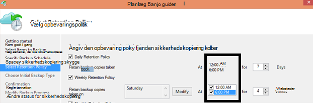

<properties
   pageTitle="Azure sikkerhedskopiering ofte stillede spørgsmål om | Microsoft Azure"
   description="Svar på ofte stillede spørgsmål om tjenesten sikkerhedskopiering, sikkerhedskopiering agent, sikkerhedskopiering og opbevaring, gendannelse, sikkerhed og andre almindelige spørgsmål om sikkerhedskopiering og genoprettelse efter nedbrud."
   services="backup"
   documentationCenter=""
   authors="markgalioto"
   manager="jwhit"
   editor=""
   keywords="Sikkerhedskopiering og genoprettelse efter nedbrud; Sikkerhedskopiering service"/>

<tags
   ms.service="backup"
   ms.workload="storage-backup-recovery"
     ms.tgt_pltfrm="na"
     ms.devlang="na"
     ms.topic="get-started-article"
     ms.date="10/21/2016"
     ms.author="trinadhk; giridham; arunak; markgal; jimpark;"/>

# <a name="azure-backup-service--faq"></a>Azure sikkerhedskopi service-ofte stillede spørgsmål


I denne artikel er en liste over ofte stillede spørgsmål (og de respektive svar) om tjenesten Azure sikkerhedskopi. Vores community svar hurtigt, og hvis et spørgsmål er ofte stillede, vi tilføje den i denne artikel. Svar på spørgsmål typisk Giv reference eller supportoplysninger. Du kan stille spørgsmål om Azure sikkerhedskopi i afsnittet Disqus i denne artikel eller en relateret artikel. Du kan også sende spørgsmål om tjenesten Azure sikkerhedskopi i [diskussionsforum](https://social.msdn.microsoft.com/forums/azure/home?forum=windowsazureonlinebackup).


## <a name="what-is-the-list-of-supported-operating-systems-from-which-i-can-back-up-to-azure-using-azure-backup-br"></a>Hvad er på listen over understøttede operativsystemer, som jeg kan sikkerhedskopiere til Azure Azure sikkerhedskopiering? <br/>
Følgende liste over operativsystemer understøttes Azure sikkerhedskopiering til filmappe sikkerhedskopi, programmet sikkerhedskopi ved hjælp af Azure Server til sikkerhedskopiering og SCDPM.

| Operativsystem        | Platform           | SKU  |
| :------------- |-------------| :-----|
| Windows 8 og seneste SPs      | 64-bit | Enterprise, Pro |
| Windows 7 og seneste SPs      | 64-bit | Ultimate, Enterprise, Professional, Home Premium, Home Basic, Starter |
| Windows 8.1 og seneste SPs | 64-bit      |    Enterprise, Pro |
| Windows 10      | 64-bit | Enterprise, Pro, Home |
|Windows Server 2012 R2 og seneste SPs| 64-bit| Som standard, Datacenter, Foundation|
|Windows Server 2012 og seneste SPs|    64-bit| Datacenter, Foundation, som er Standard|
|Windows Storage Server 2012 R2 og seneste SPs  |64-bit|    Som standard, arbejdsgruppe|
|Windows Storage Server 2012 og seneste SPs |64-bit |Som standard, arbejdsgruppe
|Windows Server 2012 R2 og seneste SPs  |64-bit|    Væsentlige|
|Windows Server 2008 R2 SP1 |64-bit|    Som standard, Enterprise, Datacenter, Foundation|
|Windows Server 2008 SP2    |64-bit|    Som standard, Enterprise, Datacenter, Foundation|

Til Azure VM sikkerhedskopi

- **Linux**: Azure sikkerhedskopi understøtter [en liste over salgsdistributioner, der er godkendt af Azure](../virtual-machines/virtual-machines-linux-endorsed-distros.md) undtagen Core OS Linux.  Andre Flyt-dine-ejer-distribuerede Linux-versioner kan også arbejde som VM agent er tilgængelig på den virtuelle maskine og understøttelse af Python findes.
- **Windows Server**: versioner, der er ældre end Windows Server 2008 R2 understøttes ikke.

## <a name="where-can-i-download-the-latest-azure-backup-agent-br"></a>Hvor kan jeg hente den nyeste version Azure sikkerhedskopi agent? <br/>
Du kan hente den nyeste version agent for sikkerhedskopiering af Windows Server, System Center DPM eller Windows-klient fra [her](http://aka.ms/azurebackup_agent). Hvis du vil sikkerhedskopiere en virtuel maskine, skal du bruge den VM Agent (som automatisk installerer det korrekte filtypenavn). VM Agent findes allerede på virtuelle maskiner, der er oprettet ud fra galleriet Azure.

## <a name="which-version-of-scdpm-server-is-supported-br"></a>Hvilken version af SCDPM server er understøttet? <br/>
Vi anbefaler, at du installerer den [nyeste version](http://aka.ms/azurebackup_agent) Azure sikkerhedskopi agent på den nyeste opdateringspakke af SCDPM (UR11 og August 2016)

## <a name="when-configuring-the-azure-backup-agent-i-am-prompted-to-enter-the-vault-credentials-do-vault-credentials-expire"></a>Når du konfigurerer Azure Backup agent, bliver jeg bedt om at angive legitimationsoplysningerne, der samling. Samling af legitimationsoplysninger legitimationsoplysninger udløber?
Ja, samling legitimationsoplysninger udløber efter 48 timer. Hvis filen udløber, log på portalen Azure og hente samling legitimationsoplysninger filer fra din samling.

## <a name="is-there-any-limit-on-the-number-of-vaults-that-can-be-created-in-each-azure-subscription-br"></a>Er der en grænse på antallet vaults, der kan oprettes i hver Azure-abonnement? <br/>
Ja. Du kan oprette 25 sikkerhedskopiering vaults per abonnement og September 2016. Du kan oprette op til 25 gendannelse Services vaults hver understøttede område i Azure sikkerhedskopi per abonnement. Hvis du har brug for flere vaults, derefter oprette et nyt abonnement.

## <a name="are-there-any-limits-on-the-number-of-serversmachines-that-can-be-registered-against-each-vault-br"></a>Er der nogen begrænsninger på antallet af servere/computere, der kan være registreret mod hver samling? <br/>
Ja, kan du registrere op til 50 maskiner hver samling. Til Azure IaaS virtuelle maskiner er grænsen 200 FOS hver samling. Hvis du vil registrere flere computere skal du oprette en ny samling af legitimationsoplysninger.

## <a name="how-do-i-register-my-server-to-another-datacenterbr"></a>Hvordan registrerer jeg serveren til en anden datacenter?<br/>
Sikkerhedskopidata der sendes til den samling af legitimationsoplysninger som det er registreret datacenter. Den nemmeste måde at ændre datacenteret er at fjerne agenten og geninstallere agenten og registrere til en ny samling af legitimationsoplysninger, der hører til ønskede datacenter.

## <a name="what-happens-if-i-rename-a-windows-server-that-is-backing-up-data-to-azurebr"></a>Hvad sker der, hvis jeg omdøber et Windows server, der sikkerhedskopiering af data til Azure?<br/>
Når du omdøber en server, stoppes alle er konfigureret i øjeblikket sikkerhedskopier.
Du har brug for til at registrere det nye navn på serveren, med sikkerhedskopi samling af legitimationsoplysninger. Når du opretter en ny registrering, er den første sikkerhedskopiering en fuld sikkerhedskopi, og ikke en trinvis sikkerhedskopiering. Hvis du har brug at gendanne data, der var tidligere sikkerhedskopieret til samling med det gamle servernavn, kan du gendanne dataene ved hjælp af [**en anden server**](backup-azure-restore-windows-server.md#recover-to-an-alternate-machine) i guiden **Gendan Data** .

## <a name="what-types-of-drives-can-i-backup-files-and-folders-from-br"></a>Hvilke typer drev kan jeg sikkerhedskopiering af filer og mapper fra? <br/>
Det følgende sæt af drev/enheder kan ikke få adgang sikkerhedskopiering:

- Flytbare medier: Drevet skal rapportere som en fast skal bruges en ekstra element kilde.
- Skrivebeskyttet enheder: lydstyrken skal kunne skrives til lydstyrke tjenesten Øjebliksbillede (VSS) til funktionen.
- Offline enheder: Lydstyrken skal være online for VSS til funktionen.
- Netværksshare: lydstyrken skal være lokale til serveren for at blive sikkerhedskopieret sikkerhedskopiering online.
- BitLocker beskyttede enheder: lydstyrken skal låses, før kan ske, at sikkerhedskopieringen.
- Filen System identifikation: NTFS er det eneste filsystem understøttes i forbindelse med denne version af tjenesten for sikkerhedskopiering.

## <a name="what-file-and-folder-types-can-i-back-up-from-my-serverbr"></a>Hvilke typer af filer og mapper kan jeg sikkerhedskopiere fra serveren?<br/>
Følgende typer understøttes:

- Krypteret
- Komprimeret
- Sparse
- Komprimeret + Sparse
- Hårde Links: Ikke understøttes, ignoreret
- Genfortolkningspunkt: Ikke understøttes, ignoreret
- Krypteret + komprimeret: Ikke understøttes, ignoreret
- Krypteret + Sparse: Ikke understøttes, ignoreret
- Komprimeret Stream: Ikke understøttes, ignoreret
- Sparse Stream: Ikke understøttes, ignoreret

## <a name="whats-the-minimum-size-requirement-for-the-cache-folder-br"></a>Hvad er minimumstørrelse for cachemappen? <br/>
Størrelsen af cachemappen bestemmer mængden data, som du sikkerhedskopierer. Cache-mappen skal være 5% af plads til lagring af data.

## <a name="if-my-organization-has-one-vault-how-can-i-isolate-one-servers-data-from-another-server-when-restoring-databr"></a>Hvis organisationen har en samling, hvordan kan jeg isolere én server-data fra en anden server Når du gendanner data?<br/>
Alle servere, der er registreret til den samme samling af legitimationsoplysninger kan gendanne de data, der er sikkerhedskopieret af andre servere *, der bruger den samme adgangskode*. Hvis du har servere, sikkerhedskopiere data, du vil isolere fra andre servere i organisationen, skal du bruge en dedikeret adgangskoden for disse servere. Hr-afdeling servere kan for eksempel bruge én kryptering adgangskoden, accounting servere, en anden og lagerplads servere en tredjepartsforhandler.

## <a name="can-i-migrate-my-backup-data-or-vault-between-subscriptions-br"></a>Kan jeg "overføre" min sikkerhedskopidata eller samling mellem abonnementer på? <br/>
Nej. Samling af legitimationsoplysninger oprettes på et abonnementsniveau og kan ikke være tildelt til et andet abonnement, når den er oprettet.

## <a name="does-the-azure-backup-agent-work-on-a-server-that-uses-windows-server-2012-deduplication-br"></a>Fungerer Azure Backup Agent på en server, der bruger Windows Server 2012 deduplication? <br/>
Ja. Agenttjenesten konverterer deduplicated dataene til normal data, når den forbereder sikkerhedskopieringen. Det derefter optimerer dataene til sikkerhedskopi, krypterer dataene og derefter sender de krypterede data til tjenesten for sikkerhedskopiering.

## <a name="if-i-cancel-a-backup-job-once-it-has-started-is-the-transferred-backup-data-deleted-br"></a>Hvis jeg annullerer en sikkerhedskopi, når den er startet, overførte sikkerhedskopidataene slettes? <br/>
Nej. Den ekstra samling af legitimationsoplysninger gemmer den sikkerhedskopierede data, der havde overført op til sted, hvor annulleringen. Azure sikkerhedskopi bruges en kontrolpunkt metode til at tilføje nogle gange kontrolpunkter til sikkerhedskopidataene under sikkerhedskopieringen. Fordi der er kontrolpunkter i backup-data, kan den næste sikkerhedskopieringen validere integriteten af filerne. Næste sikkerhedskopien udløste ville være trinvise over de data, der havde sikkerhedskopieret tidligere. En trinvis sikkerhedskopiering giver bedre udnyttelse af båndbredde, så du ikke behøver at overføre flere gange, de samme data.

I tilfælde af Azure VM sikkerhedskopi, når jobbet er annulleret, overførte data ignoreres og nyt sikkerhedskopi overfører trinvise data fra tidligere vellykket sikkerhedskopieringsjob.

## <a name="why-am-i-seeing-the-warning-azure-backups-have-not-been-configured-for-this-server-even-though-i-had-scheduled-regular-backups-previously-br"></a>Hvorfor får jeg vist advarslen "Azure sikkerhedskopier ikke er konfigureret for denne server", selvom jeg havde planlagt regelmæssige sikkerhedskopier tidligere? <br/>
Der opstår en advarsel, når indstillingerne for sikkerhedskopiering tidsplan, der er gemt på den lokale server ikke er den samme som de indstillinger, der er gemt i den ekstra samling af legitimationsoplysninger. Når serveren eller indstillingerne er genoprettet til en god tilstand, kan de ekstra tidsplaner mister synkronisering. Hvis du modtager denne advarsel, [omkonfigurere politikken sikkerhedskopiering](backup-azure-manage-windows-server.md) og derefter **Køre Sikkerhedskopiér nu** for at synkronisere den lokale server med Azure.

## <a name="what-firewall-rules-should-be-configured-for-azure-backup-br"></a>Hvilke regler skal konfigureres til Azure sikkerhedskopi firewall? <br/>
Problemfri beskyttelse af data på-lokale-til-Azure og arbejdsbelastningen til Azure anbefales det, du har givet din firewall til at kommunikere med følgende URL-adresser:

- www.msftncsi.com
- \*. Microsoft.com
- \*. WindowsAzure.com
- \*. microsoftonline.com
- \*. windows.net

##<a name="can-i-install-the-azure-backup-agent-on-an-azure-vm-already-backed-by-the-azure-backup-service-using-the-vm-extension-br"></a>Kan jeg installere Azure Backup agent på en Azure VM allerede sikkerhedskopien af Azure sikkerhedskopi tjenesten ved hjælp af filtypenavnet VM? <br/>
Absolut. Azure sikkerhedskopi indeholder sikkerhedskopiering VM på elementniveau til Azure FOS ved hjælp af filtypenavnet VM. Du kan installere Azure Backup agent på en gæst Windows OS til at beskytte filer og mapper på denne gæst OS.

## <a name="can-i-install-the-azure-backup-agent-on-an-azure-vm-to-back-up-files-and-folders-present-on-temporary-storage-provided-by-the-azure-vm-br"></a>Kan jeg installere Azure Backup agent på en Azure VM til at sikkerhedskopiere filer og mapper, der findes på midlertidige fra Azure VM? <br/>
Du kan installere Azure Backup agent på gæst Windows-Operativsystemet og sikkerhedskopiere filer og mapper til midlertidigt lager. Men vær opmærksom på, at sikkerhedskopier mislykkes, når der sletning midlertidige data. Også, hvis midlertidige dataene er blevet slettet, du kan kun gendannes til permanente lager.

## <a name="i-have-installed-azure-backup-agent-to-protect-my-files-and-folders-can-i-now-install-scdpm-to-work-with-azure-backup-agent-to-protect-on-premises-applicationvm-workloads-to-azure-br"></a>Jeg har installeret Azure Backup agent for at beskytte mine filer og mapper. Kan jeg nu installere SCDPM til at arbejde med Azure Backup agent til at beskytte lokale programmet/VM arbejdsbelastninger til Azure? <br/>
Hvis du vil bruge Azure sikkerhedskopi med SCDPM, er det anbefales at installere SCDPM først og derefter kun for at installere Azure Backup agent. Dette sikrer nem integration af Azure Backup agent med SCDPM og giver mulighed for at beskytte filer/mapper, arbejdsbelastninger og FOS til Azure, direkte fra administrationskonsollen af SCDPM. Installere SCDPM efter installationen af Azure sikkerhedskopi er agent til formål, der er nævnt ovenfor ikke anbefales eller understøttes.

## <a name="what-is-the-length-of-file-path-that-can-be-specified-as-part-of-azure-backup-policy-using-azure-backup-agent-br"></a>Hvad er længden af filsti, der kan angives som en del af Azure sikkerhedskopi politik ved hjælp af Azure Backup agent? <br/>  
Azure Backup agent er afhængig af NTFS. Den [filepath længde specifikation er begrænset af Windows-API](https://msdn.microsoft.com/library/aa365247.aspx#fully_qualified_vs._relative_paths). I tilfælde af sikkerhedskopiering af filer med filens stilængde, der er større end dem, der er angivet af Windows-API, kan kunder vælge at sikkerhedskopiere den overordnede mappe eller drevet af sikkerhedskopifilerne.  

## <a name="what-characters-are-allowed-in-file-path-of-azure-backup-policy-using-azure-backup-agent-br"></a>Hvilke tegn er tilladt i filstien til Azure sikkerhedskopi politik ved hjælp af Azure Backup agent? <br>  
 Azure Backup agent er afhængig af NTFS. Det gør det muligt for [NTFS understøttes tegn](https://msdn.microsoft.com/library/aa365247.aspx#naming_conventions) som en del af filen specifikation.  

## <a name="can-i-use-azure-backup-server-to-create-a-bare-metal-recovery-bmr-backup-for-a-physical-server-br"></a>Kan jeg bruge Azure Backup Server til at oprette en sikkerhedskopi af formatet Bare Metal gendannelse (BMR) til en fysisk server? <br/>
Ja.

## <a name="can-i-configure-the-backup-service-to-send-mail-if-a-backup-job-fails-br"></a>Kan jeg konfigurere tjenesten sikkerhedskopi for at sende mail, hvis en sikkerhedskopi af enheder mislykkes? <br/>
Ja, tjenesten sikkerhedskopi har flere begivenhed-baserede beskeder, der kan bruges med et PowerShell-script. Se [påmindelser](backup-azure-manage-vms.md#alert-notifications) for en fuld beskrivelse

## <a name="is-there-a-limit-on-the-size-of-each-data-source-being-backed-up-br"></a>Er der en grænse på størrelsen af hver datakilde, der sikkerhedskopieres? <br/>
Mens på samling niveau der er ingen grænse på mængden data, du kan forsøge at, Azure sikkerhedskopiering angive en begrænsning (for alle praktiske formål disse begrænsninger der er meget høj) på maksimumstørrelsen for datakilden. Fra og med August 2015 er datakilden maksimumstørrelsen for de understøttede operativsystemer:

|S.No | Operativsystem |  Maksimumstørrelsen for datakilde |
| :-------------: |:-------------| :-----|
|1| Windows Server 2012 eller derover| 54400 GB|
|2| Windows 8 eller nyere| 54400 GB|
|3| Windows Server 2008, Windows Server 2008 R2 | 1700 GB|
|4| Windows 7 | 1700 GB|

Den følgende tabel beskrives det, hvordan hver kilde datastørrelse bestemmes.

|   Datakilde  |   Detaljer |
| :-------------: |:-------------|
|Lydstyrken |Mængden data blive sikkerhedskopieret fra en enkelt lydstyrken for en server eller klient maskine|
|Hyper-V virtuelt | Summen af data fra de virtuelle harddiske på den virtuelle maskine sikkerhedskopieres|
|Microsoft SQL Server-database | Størrelsen af enkelt SQL-databasestørrelse sikkerhedskopieres |
|Microsoft SharePoint |Summen af indhold og konfigurationsindstillinger databaser i en SharePoint-farm sikkerhedskopieres|
|Microsoft Exchange |Summen af alle Exchange-databaser i en Exchange-server, der sikkerhedskopieres|
|BMR/systemets tilstand |Hver enkelt kopi af BMR eller system tilstand på den computer, der sikkerhedskopieres|

## <a name="are-there-limits-on-the-number-of-times-a-backup-job-can-be-scheduled-per-daybr"></a>Er der begrænsninger på antallet gange en sikkerhedskopi kan planlægges dagen?<br/>
Ja, du kan køre sikkerhedskopieringsjob på Windows Server eller Windows-klient op til tre gange / dag. Du kan køre sikkerhedskopieringsjob på System Center DPM op til to gange om dagen. Du kan køre et sikkerhedskopieringsjob for IaaS FOS en gang om dagen.

## <a name="is-there-a-difference-between-the-scheduling-policy-for-dpm-and-windows-server-ie-on-windows-server-without-dpm-br"></a>Er der en forskel mellem politikken planlægning for DPM og Windows Server (det vil sige på Windows Server uden DPM)? <br/>
Ja. Bruger DPM, kan du angive dagligt, ugentligt, månedlige og årlige tidsplaner. Windows Server (uden DPM) kan du angive kun daglige og ugentlige tidsplaner.

## <a name="is-there-a-difference-between-the-retention-policy-for-dpm-and-windows-serverclient-ie-on-windows-server-without-dpmbr"></a>Er der en forskel mellem opbevaringspolitikken for DPM og Windows Server/client (det vil sige på Windows Server uden DPM)?<br/>
Ingen, begge DPM og Windows Server/client har dagligt, ugentligt, månedligt og årlige opbevaringspolitikker.

## <a name="can-i-configure-my-retention-policies-selectively--ie-configure-weekly-and-daily-but-not-yearly-and-monthlybr"></a>Kan jeg konfigurere mit opbevaring politikker selektivt – det vil sige konfigurere ugentligt og dagligt, men ikke årligt og månedlig?<br/>
Ja, Azure sikkerhedskopi opbevaring strukturen kan du få fuld fleksibilitet i definere opbevaringspolitikken ud fra dine behov.

## <a name="can-i-schedule-a-backup-at-6pm-and-specify-retention-policies-at-a-different-timebr"></a>Kan jeg "planlægge en sikkerhedskopi" til 6 pm og angive "opbevaringspolitikker" på et andet tidspunkt?<br/>
Nej. Opbevaringspolitikker kan kun anvendes på sikkerhedskopien punkter. Opbevaringspolitikken er angivet for sikkerhedskopier taget på 12 am og pm 6 i det følgende billede. <br/>


<br/>

## <a name="is-an-incremental-copy-transferred-for-the-retention-policies-scheduled-br"></a>En trinvist kopi overføres til de opbevaringspolitikker, der er planlagt? <br/>
Nej, trinvis kopien sendes baseret på det tidspunkt, der er nævnt på siden tidsplanen for sikkerhedskopiering. De punkter, der kan blive bevaret bestemmes ud fra opbevaringspolitikken.

## <a name="if-a-backup-is-retained-for-a-long-duration-does-it-take-more-time-to-recover-an-older-data-point-br"></a>Hvis en sikkerhedskopi bevares for en lang varighed, tager det mere tid til at gendanne en ældre datapunkt? <br/>
 Nej – tid til at gendanne den ældste eller den nyeste punkt er det samme. Hvert gendannelsespunkt fungerer som en fuld punkt.

## <a name="if-each-recovery-point-is-like-a-full-point-does-it-impact-the-total-billable-backup-storagebr"></a>Hvis hvert gendannelsespunkt er som en fuld punkt, påvirker det den samlede fakturerbare ekstra lagerplads?<br/>
Typisk langsigtede opbevaring punkt produkter Gem sikkerhedskopidata som fuld punkter. Den fulde peger er lagerplads *ineffektiv* , men det er nemmere og hurtigere at gendanne. Trinvis Kopier er lagerplads *effektiv* , men kræver, at du gendanne en kæde af data, der påvirker din gendannelse tid. Azure sikkerhedskopi lagerplads arkitektur giver dig bedst fra begge verdens ved lagring af data for hurtig gendanner optimalt og tildeling lav lagerplads omkostninger. Denne metode til lagring af data sikrer, at din indgangs- og udgangspunkt båndbredde anvendes effektivt. Både mængden datalagring og det klokkeslæt, der er behov for at gendanne dataene, der bevares på et minimum. Få mere at vide mere om hvordan [trinvise sikkerhedskopier](https://azure.microsoft.com/blog/microsoft-azure-backup-save-on-long-term-storage/) gemme er effektive.

## <a name="is-there-a-limit-on-the-number-of-recovery-points-that-can-be-createdbr"></a>Er der en grænse på antallet gendannelse punkter, der kan oprettes?<br/>
Nej. Vi har udelukket begrænsninger på gendannelse punkter. Du kan oprette så mange gendannelse points, som du ønsker.

## <a name="why-is-the-amount-of-data-transferred-in-backup-not-equal-to-the-amount-of-data-i-backed-upbr"></a>Hvorfor overføres mængden af data i sikkerhedskopi ikke lig med mængden data jeg sikkerhedskopieret?<br/>
 Alle de data, der er sikkerhedskopieret fra Azure Backup Agent eller SCDPM eller Azure Backup Server, komprimeres og krypteret før overføres. Når komprimering og kryptering anvendes, er dataene i den ekstra samling af legitimationsoplysninger 30-40% mindre.

## <a name="is-there-a-way-to-adjust-the-amount-of-bandwidth-used-by-the-backup-servicebr"></a>Er der en metode til at justere mængden båndbredde, der bruges af tjenesten sikkerhedskopi?<br/>
 Ja, skal du bruge indstillingen **Skift egenskaber** i Backup Agent til at justere båndbredde. Justere mængden båndbredde og de klokkeslæt, når du bruger båndbredden. Se [Netværk (throttling)](../backup-configure-vault.md#enable-network-throttling), kan finde flere oplysninger.

## <a name="my-internet-bandwidth-is-limited-for-the-amount-of-data-i-need-to-back-up-is-there-a-way-i-can-move-data-to-a-certain-location-with-a-large-network-pipe-and-push-that-data-into-azure-br"></a>Min internetbåndbredde er begrænset for de data, jeg skal bruge til at sikkerhedskopiere. Er der en måde, jeg kan flytte data til en bestemt placering med et stort netværk pipe og push disse data til Azure? <br/>
Du kan sikkerhedskopiere data til Azure via standard online sikkerhedskopieringen, eller du kan bruge tjenesten Azure Importér/Eksportér til at overføre data for at blob storage i Azure. Der findes ingen andre måder for at få ekstra dato til Azure-lager. Oplysninger om, hvordan du bruger tjenesten Azure Importér/Eksportér med Azure sikkerhedskopi, skal du se artiklen [Offline sikkerhedskopi arbejdsproces](backup-azure-backup-import-export.md) .

## <a name="how-many-recoveries-can-i-perform-on-the-data-that-is-backed-up-to-azurebr"></a>Hvor mange regresbeløb kan jeg udføre på de data, der er sikkerhedskopieret til Azure?<br/>
Der er ingen grænse på antallet tilbagebetalinger fra Azure sikkerhedskopi.

## <a name="do-i-have-to-pay-for-the-egress-traffic-from-azure-data-center-during-recoveriesbr"></a>Skal jeg betale for udgangspunkt trafik fra Azure datacenter under regresbeløb?<br/>
 Nej. Din regresbeløb er gratis, og du betaler ikke for udgangspunkt trafikken.

## <a name="is-the-data-sent-to-azure-encrypted-br"></a>Sendes dataene til Azure krypteret? <br/>
Ja. Data er krypteret på den lokale klient/server/SCDPM maskine, ved hjælp af AES256 og data, der sendes via en sikker HTTPS-kæde.

## <a name="is-the-backup-data-on-azure-encrypted-as-wellbr"></a>Er der sikkerhedskopidataene på Azure krypteret samt?<br/>
 Ja. De data, der er sendt til Azure forbliver krypteret (i resten). Microsoft dekryptere ikke sikkerhedskopidataene når som helst. Azure VM sikkerhedskopi Azure sikkerhedskopiering er afhængig af kryptering af den virtuelle maskine det vil sige Hvis din VM er krypteret med Azure Disk kryptering eller nogle andre krypteringsteknologi, Azure Sikkerhedskopiering bruger, at kryptering til at sikre dine data.

## <a name="what-is-the-minimum-length-of-encryption-key-used-to-encrypt-backup-data-br"></a>Hvad er minimumlængden for krypteringsnøglen til at kryptere sikkerhedskopidata? <br/>
 Krypteringsnøglen skal være mindst 16 tegn.

## <a name="what-happens-if-i-misplace-the-encryption-key-can-i-recover-the-data-or-can-microsoft-recover-the-data-br"></a>Hvad sker der, hvis jeg havde forlagt krypteringsnøglen? Kan jeg gendanne dataene (eller) kan gendanne Microsoft dataene? <br/>
Tasten bruges til at kryptere sikkerhedskopidataene findes kun på kunden. Microsoft bevare ikke en kopi i Azure og har ikke adgang til nøglen. Hvis kunden misplaces tasten, gendanne ikke Microsoft sikkerhedskopidataene.

## <a name="how-do-i-change-the-cache-location-specified-for-the-azure-backup-agentbr"></a>Hvordan kan jeg ændre placeringen af cachen angivet for Azure Backup agent?<br/>
 Gå sekventielt gennem listen punkttegn nedenfor for at ændre placeringen af cachen.
- Stoppe sikkerhedskopi-program ved at udføre følgende kommando i en kommandoprompt:

  ```PS C:\> Net stop obengine```

- Flyt ikke filerne. I stedet kopiere mappen cache plads til et andet drev med tilstrækkelig plads. Den oprindelige cache plads kan fjernes efter bekræftelse af sikkerhedskopier af arbejder med den nye cache plads.

- Opdater følgende poster i registreringsdatabasen med stien til den nye cache mellemrum mappe.<br/>

|Sti til registreringsdatabasen | Nøgle i registreringsdatabasen | Værdi |
| ------ | ------- | ------|
| `HKEY_LOCAL_MACHINE\SOFTWARE\Microsoft\Windows Azure Backup\Config` | ScratchLocation | *Ny cachemappeplacering* |
| `HKEY_LOCAL_MACHINE\SOFTWARE\Microsoft\Windows Azure Backup\Config\CloudBackupProvider` | ScratchLocation | *Ny cachemappeplacering* |

- Genstart sikkerhedskopi-program ved at udføre følgende kommando i en kommandoprompt:

  ```PS C:\> Net start obengine```

  Når sikkerhedskopiering oprettelse er gennemført i den nye cacheplacering, kan du fjerne den oprindelige cache-mappe.

## <a name="where-can-i-put-the-cache-folder-for-the-azure-backup-agent-to-work-as-expectedbr"></a>Hvor kan jeg placerede cache-mappen til Azure Backup Agent fungerer som forventet?<br/>
På følgende placeringer for cache-mappen anbefales ikke:

- Netværk del eller flytbare medier: cache-mappen skal være lokale på serveren, der skal sikkerhedskopiere sikkerhedskopiering online. Netværksplaceringer eller flytbare medier, som USB-drev understøttes ikke.
- Offline enheder: Cache-mappen skal være online for forventede sikkerhedskopi ved hjælp af Azure Backup Agent.

## <a name="are-there-any-attributes-of-the-cache-folder-that-are-not-supportedbr"></a>Er der en hvilken som helst attributter cache-mappe, der ikke understøttes?<br/>
 Følgende attributter eller deres kombinationer understøttes ikke for cache-mappe:

- Krypteret
- Deaktivere dubleret
- Komprimeret
- Sparse
- Genfortolkningspunkt

Det anbefales, at hverken cache-mappe eller metadata, der har Virtuelle attributter over for forventede kan fungere Azure Backup agent.
