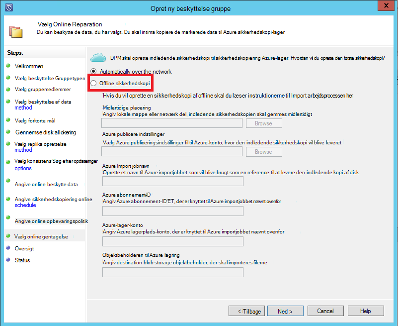
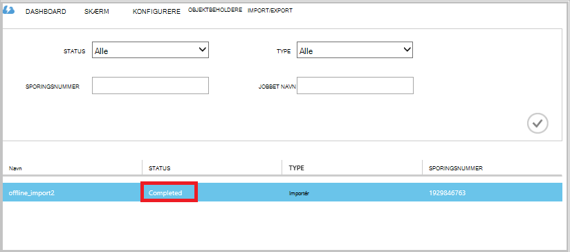

<properties
   pageTitle="Azure sikkerhedskopi - Offline sikkerhedskopiering eller indledende forhåndsudfyldning ved hjælp af tjenesten Azure Importér/Eksportér | Microsoft Azure"
   description="Få mere at vide, hvordan Azure sikkerhedskopi gør det muligt at sende data fra det netværk, ved hjælp af tjenesten Azure Importér/Eksportér. Denne artikel forklares offline forhåndsudfyldning af de indledende sikkerhedskopierede data ved hjælp af tjenesten Azure Importer eksporter."
   services="backup"
   documentationCenter=""
   authors="saurabhsensharma"
   manager="shivamg"
   editor=""/>
<tags
   ms.service="backup"
   ms.devlang="na"
   ms.topic="article"
   ms.tgt_pltfrm="na"
   ms.workload="storage-backup-recovery"
   ms.date="08/16/2016"
   ms.author="jimpark;saurabhsensharma;nkolli;trinadhk"/>

# Offline-sikkerhedskopi arbejdsproces i Azure sikkerhedskopiering
Azure sikkerhedskopi har flere indbyggede effektiviteten, gemmer netværk og storage omkostninger under de indledende fuld sikkerhedskopiering af data til Azure. Indledende fuld sikkerhedskopier typisk overføre store datamængder og kræver flere netværksbåndbredde, når der sammenlignes med efterfølgende sikkerhedskopier, overføre kun deltaer/incrementals. Azure sikkerhedskopi komprimerer de indledende sikkerhedskopier. Gennem processen med at offline forhåndsudfyldning kan Azure sikkerhedskopiering diske bruges til at overføre komprimeret indledende sikkerhedskopidataene offline til Azure.  

Offline-forhåndsudfyldning processen med Azure sikkerhedskopi er tæt integreret med [Azure Importér/Eksportér tjeneste](../storage/storage-import-export-service.md) , der gør det muligt at overføre data til Azure ved hjælp af diske. Hvis du har TB (TBs) indledende sikkerhedskopidata, der skal overføres via et netværk høj ventetid med lav båndbredde, kan du bruge offline forhåndsudfyldning arbejdsprocessen til at levere den indledende sikkerhedskopi på en eller flere harddiske til en Azure datacenter. I denne artikel indeholder en oversigt over de trin, igennem arbejdsprocessen.

## Oversigt

Det er nemt at overføre dine data offline til Azure ved hjælp af diske med mulighed offline forhåndsudfyldning af Azure sikkerhedskopierings- og Azure Importér/Eksportér. I stedet for overførsel af den indledende fuldstændig kopi via netværket, skrives backup-data til en *arrangere placering*. Når feltet Kopiér til den midlertidige placering er fuldført ved hjælp af værktøjet Azure Importér/Eksportér, skrives disse data til et eller flere SATA drev, afhængigt af mængden data. Disse drev leveres til sidst til det nærmeste Azure datacenter.

[August 2016 opdatere af Azure sikkerhedskopi (og senere)](http://go.microsoft.com/fwlink/?LinkID=229525) indeholder *værktøjet til Azure Disk forberedelse*, med navnet AzureOfflineBackupDiskPrep,:

   - Hjælper dig med at forberede dine drev til Azure Import ved hjælp af værktøjet Azure Importér/Eksportér.
   - Opretter automatisk et job til Azure Import for tjenesten Azure Importér/Eksportér på [Azure klassisk portal](https://manage.windowsazure.com) i modsætning til oprettelse af det samme med ældre versioner af Azure sikkerhedskopi manuelt.

Når overførslen af backup-data til Azure er fuldført, Azure sikkerhedskopiering kopierer backup-data til den ekstra samling af legitimationsoplysninger og trinvise sikkerhedskopier planlægges.

  > [AZURE.NOTE] For at bruge værktøjet til Azure Disk forberedelse af skal du sikre dig, at du har installeret opdateringen August 2016 af Azure sikkerhedskopi (eller nyere), og Udfør alle trin i arbejdsproces med den. Hvis du bruger en ældre version af Azure sikkerhedskopi, kan du forberede SATA drev ved hjælp af værktøjet Azure Importér/Eksportér som beskrevet i afsnit senere i denne artikel.

## Forudsætninger

- [Blive fortrolig med arbejdsprocessen Azure Importér/Eksportér](../storage/storage-import-export-service.md).
- Inden du starter arbejdsprocessen, sikre følgende:
    - En samling af legitimationsoplysninger Azure sikkerhedskopi er blevet oprettet.
    - Samling af legitimationsoplysninger legitimationsoplysninger, der er hentet.
    - Azure Backup agent er blevet installeret på Windows Server/Windows-klient eller System Center Data Protection Manager server, og computeren er registreret med Azure sikkerhedskopi samling.
- [Hente indstillingerne Azure publicere fil](https://manage.windowsazure.com/publishsettings) på den computer, hvorfra du vil placere sikkerhedskopien af dine data.
- Forberede en midlertidig placering, som kan være et netværksshare eller ekstra drev på computeren. Den midlertidige placering er midlertidige lager og bruges midlertidigt under denne arbejdsproces. Sørg for, at den midlertidige placering har tilstrækkelig diskplads til at holde din indledende kopi. Hvis du forsøger at sikre, at sikkerhedskopiering af en 500 GB filserver, er det midlertidige område for eksempel mindst 500 GB. (Et mindre beløb bruges på grund af komprimering).
- Sørg for, at du bruger en understøttet drev. Kun 3,5 SATA II/III harddiske understøttes til brug sammen med tjenesten Importér/Eksportér. Harddiske, der er større end 8 TB understøttes ikke. Du kan vedhæfte en SATA II/III disk eksternt til de fleste computere ved hjælp af en SATA II/III USB-adapter. Dokumentationen Azure Importér/Eksportér for det seneste sæt af drev, der understøtter tjenesten.
- Aktivere BitLocker på den computer, som SATA drev writer er forbundet.
- [Hente værktøjet Azure Importér/Eksportér](http://go.microsoft.com/fwlink/?LinkID=301900&clcid=0x409) til den computer, hvor SATA drive writer er forbundet. Dette trin er ikke påkrævet, hvis du har downloadet og installeret August 2016 opdateringen af Azure sikkerhedskopi (eller nyere).

## Arbejdsproces
Oplysningerne i dette afsnit kan du udføre offline sikkerhedskopi arbejdsprocessen, så dataene kan leveret til en Azure datacenter og overføres til Azure-lager. Hvis du har spørgsmål om tjenesten Importér eller aspekter af processen, i dokumentationen [Importér service oversigt](../storage/storage-import-export-service.md) refereres til tidligere.

### Påbegynd offline sikkerhedskopi

1. Når du planlægger en sikkerhedskopi, kan du se følgende skærmbillede (i Windows Server, Windows-klient eller System Center Data Protection Manager).

    

    Her er de tilsvarende skærmen i System Center Data Protection Manager:  
    

    Beskrivelse af input er som følger:

    - **Midlertidige placering**: den midlertidige lagerplacering, indledende sikkerhedskopien er skrevet. Det kan være på et netværksshare eller en lokal computer. Hvis den kopi computer og kildecomputer er forskellige, anbefaler vi, at du angiver den fulde netværksstien til den midlertidige placering.
    - **Azure Import jobnavn**: det entydige navn ved Importér hvilke Azure service og Azure sikkerhedskopi spore overførsel af data, der sendes på diske til Azure.
    - **Azure publiceringsindstillinger**: en XML-fil, der indeholder oplysninger om profilen abonnement. Den indeholder også sikre legitimationsoplysninger, der er knyttet til dit abonnement. Du kan [hente filen](https://manage.windowsazure.com/publishsettings). Angiv den lokale sti til filen Publicer indstillinger.
    - **Azure abonnement-ID**: feltet Azure abonnement-ID for det abonnement, hvor du vil starte kørslen Azure Import. Hvis du har flere Azure abonnementer, kan du bruge ID'ET for det abonnement, du vil knytte til importjobbet.
    - **Azure lagerplads konto**: Klassisk type lagerplads kontoen i det medfølgende Azure abonnement, der er knyttet til Azure Importér jobbet.
    - **Azure-objektbeholder til lagring**: navnet på blob storage destination i kontoen Azure-lager, hvor dette job dataene er importeret.

    > [AZURE.NOTE] Hvis du har registreret din server til en samling af legitimationsoplysninger Azure gendannelse Services fra [Azure portal](https://portal.azure.com) for dine sikkerhedskopier og der ikke findes på et abonnement til skyen løsning CSP'EN (Provider), kan du stadig oprette en klassisk type lagerplads konto fra Azure-portalen og bruge den til offline-sikkerhedskopi arbejdsprocessen.

    Gemme alle disse oplysninger, fordi du har brug at angive det igen i følge trin. Kun den *midlertidige placering* er påkrævet, hvis du har brugt værktøjet til Azure Disk forberedelse af til at forberede diskene.    

2. Fuldføre arbejdsprocessen, og vælg derefter **Sikkerhedskopiér nu** i Azure sikkerhedskopiering management console at starte offline-sikkerhedskopi. Den første sikkerhedskopi skrives til det midlertidige område som en del af dette trin.

    

    For at fuldføre tilsvarende arbejdsprocessen i System Center Data Protection Manager skal du højreklikke på **Gruppen beskyttelse**og derefter vælge indstillingen **Opret gendannelse datamærke** . Du derefter vælge indstillingen **Online Protection** .

    

    Når handlingen afsluttes, skal er den midlertidige placering klar til at bruges til disk forberedelse.

    

### Forberede en SATA drev og oprette et job til Azure Import ved hjælp af værktøjet til Azure Disk forberedelse af
Værktøjet til Azure Disk forberedelse af findes i installationen directory af gendannelse Services agent (August 2016 opdatere og senere) i følgende sti.

   *\Microsoft* *Azure* *Gendannelse* *Services* * Agent\Utils\*

1. Gå til bibliotek, og Kopiér mappen **AzureOfflineBackupDiskPrep** til en kopi computer, hvor drevene, der skal være forberedt tilsluttes. Gøre følgende med hensyn til kopi computeren:

      - Kopiér computer kan få adgang til den midlertidige placering for offline-forhåndsudfyldning arbejdsprocessen ved hjælp af samme netværksstien, der er angivet i arbejdsprocessen **starte offline sikkerhedskopi** .

      - BitLocker er aktiveret på computeren.

      - Computeren, kan få adgang til portalen Azure.

      Hvis det er nødvendigt, kan kopi computeren være den samme som kilde.

2. Åbn en kommandoprompt på computeren, kopi med Azure Disk forberedelse værktøjet directory som den aktuelle mappe, og køre følgende kommando:

      *.\AzureOfflineBackupDiskPrep.exe* s: <*Midlertidige Placeringsstien*> [p: <*stien til PublishSettingsFile*>]

| Parameter | Beskrivelse
|-------------|-------------|
|s: <*Midlertidige Placeringsstien*> | Obligatorisk input, der bruges til at give stien til den midlertidige placering, som du har angivet i arbejdsprocessen **starte offline sikkerhedskopi** . |
|p: <*stien til PublishSettingsFile*> | Valgfrit input, der bruges til at give stien til filen **Azure publiceringsindstillinger** , som du har angivet i arbejdsprocessen **starte offline sikkerhedskopi** . |

> [AZURE.NOTE] Den &lt;stien til PublishSettingFile&gt; værdi er obligatorisk, når den kopi computer og kildecomputer er forskellige.

Når du kører kommandoen, som værktøjet markeringen af kørslen Azure Importér, der svarer til de drev, skal være forberedt. Hvis der kun en enkelt import sag er knyttet til den angivne midlertidige placering, ser du et skærmbillede som det, der følger efter.

     
3. Angiv drev brevet uden efterstillede kolon for den tilsluttede disk, du vil forberede overførsel til Azure. Angiv bekræftelse af formateringen af drevet, når du bliver bedt om.

Værktøjet begynder derefter at forberede disken med sikkerhedskopidataene. Du skal muligvis vedhæfte flere diske, når du bliver bedt om værktøjet, i tilfælde af den angivne disk ikke har tilstrækkelig plads til sikkerhedskopidataene.  

I slutningen af vellykket udførelse af værktøjet, er en eller flere diske, som du angav klargøres til forsendelse til Azure. Desuden oprettes et job til import af med det navn, du har angivet under arbejdsprocessen **starte offline sikkerhedskopi** på Azure klassisk-portalen. Til sidst skal vises i værktøjet leveringsadresse til det Azure datacenter, hvor diskene mangler at blive sendt og linket til at finde kørslen Importér på portalen Azure klassisk.

    
4. Afsende disk, der den adresse, der bruges af værktøjet og beholde sporingsnummer til fremtidig brug. 
5. Når du går til det link, værktøjet vises, kan du se kontoen Azure-lager, du angav i arbejdsprocessen **starte offline sikkerhedskopi** . Her kan du se kørslen nyoprettede import under **IMPORTÉR/EKSPORTÉR** for kontoen lagerplads.

    
6. Klik på **FORSENDELSES oplysninger** nederst på siden for at opdatere dine kontaktoplysninger, som vist på følgende skærmbillede. Microsoft bruger denne oplysninger til at levere diskoverfladerne tilbage til dig, når importjobbet er fuldført.

    
7. Angiv leveringsoplysninger på det næste skærmbillede. Angiv oplysningerne **Levering Carrier** og **Sporing af tal** , der svarer til de diske, der er leveret til Azure datacenter.

    

### Fuldføre arbejdsprocessen
Når importjobbet afsluttes, skal findes indledende sikkerhedskopidata i kontoen lagerplads. Agent for gendannelsestjenester og derefter Kopier indholdet af dataene fra denne konto til sikkerhedskopi samling eller gendannelsestjenester vault, afhængigt af hvad der er relevant. I det næste planlagte sikkerhedskopiering tidspunkt udfører Azure Backup agent den trinvise sikkerhedskopiering over den indledende sikkerhedskopi.

> [AZURE.NOTE] De følgende afsnit gælder for brugere af tidligere versioner af Azure sikkerhedskopi som ikke har adgang til værktøjet til Azure Disk forberedelse af.

### Forberede en SATA drev

1. Hente [Microsoft Azure Importér/Eksportér værktøj](http://go.microsoft.com/fwlink/?linkid=301900&clcid=0x409) til kopi computer. Sørg for, at den midlertidige placering er tilgængelig fra den computer, hvor du planlægger at køre den næste række kommandoer. Hvis det er nødvendigt, kan kopi computeren være den samme som kilde.

2. Udpakke filen WAImportExport.zip. Køre værktøjet WAImportExport, formaterer SATA-drev, skriver sikkerhedskopidataene til SATA-drev og krypterer den. Før du køre følgende kommando, kan du sikre dig, at BitLocker er aktiveret på computeren.  

    *.\WAImportExport.exe PrepImport /j: <* JournalFile*> .jrn /id: <*session-id-*> /sk: <*StorageAccountKey*> /BlobType:**PageBlob* * /t: <*TargetDriveLetter*>/formatere / kryptere /srcdir: <*arrangere placering*> /dstdir: <*DestinationBlobVirtualDirectory*>/*

    > [AZURE.NOTE] Hvis du har installeret opdateringen August 2016 af Azure sikkerhedskopi (eller nyere), skal du sikre, at den midlertidige placering, du har angivet er den samme som den, på skærmbilledet **Sikkerhedskopiér nu** og indeholder AIB og Base Blob-filer.

| Parameter | Beskrivelse
|-------------|-------------|
| /j: <*JournalFile*>| Stien til journalfilen. Hvert drev skal have ét journal-fil. Journalfilen må ikke være på drevet, mål. Filtypenavnet journal .jrn og der oprettes som en del af kører denne kommando.|
|/id: <*Session-id*> | Session-ID'ET identificerer en kopi session. Det bruges til at sikre nøjagtige gendannelse af en session med afbrudt kopi. Filer, der kopieres i en session med kopi gemmes i en mappe med navnet efter session-ID på drevet, mål.|
| /SK: <*StorageAccountKey*> | Kontonøgle for kontoen lagerplads, at dataene er importeret. Tasten skal være den samme som den blev angivet under oprettelse af gruppe af sikkerhedskopiering politik/beskyttelse.|
| / BlobType | Typen af blob. Denne arbejdsproces lykkes kun, hvis **PageBlob** er angivet. Dette er ikke standardindstillingen og skal nævnes i denne kommando. |
|/ t: <*TargetDriveLetter*> | Bogstavet uden efterstillede kolon af target harddisken for den aktuelle kopi session.|
|/ format | Muligheden for at formatere drevet. Angive denne parameter, når drevet, skal være formateret; Ellers skal du udelade den. Før værktøjet formaterer drevet, beder om en bekræftelse fra konsollen. For at skjule bekræftelsen, skal du angive parameteren /silentmode.|
|/ kryptere | Muligheden for at kryptere drevet. Angiv denne parameter, når drevet endnu ikke er krypteret med BitLocker og skal krypteres af værktøjet. Hvis drevet, der allerede er krypteret med BitLocker, udelader denne parameter, angiver parameteren /bk, og giv den eksisterende BitLocker-nøgle. Hvis du angiver parameteren/format, skal du også angive den / kryptere parameter. |
|/srcdir: <*SourceDirectory*> | Den kildemappe, der indeholder filer, der skal kopieres til den destinationsadresse-drev. Sørg for, at navnet på den angivne mappe har en fuld i stedet for relativ sti.|
|/dstdir: <*DestinationBlobVirtualDirectory*> | Stien til den virtuelle destinationsmappen i kontoen Azure-lager. Sørg for at bruge gyldige objektbeholder navne, når du angiver destination virtuelle mapper eller BLOB. Husk på, at objektbeholder navne skal skrives med småt.  I denne beholder navnet skal være den, du har angivet under oprettelse af gruppe af sikkerhedskopiering politik/beskyttelse.|

  > [AZURE.NOTE] Der oprettes en journal-fil i mappen WAImportExport, der registrerer hele oplysninger af arbejdsprocessen. Du skal bruge denne fil, når du opretter et job til import i portalen Azure.

  

### Oprette et job til import i portalen Azure
1. Gå til kontoen lagerplads på [Azure klassisk portalen](https://manage.windowsazure.com/), klik på **Importér/Eksportér**, og derefter **Oprette Job til Import** i opgaveruden.

    

2. I trin 1 i guiden skal du angive, at du har forberedt harddisken og at du har den drev journal-fil, der er tilgængelige.
3. Angiv kontaktoplysningerne for den person, der er ansvarlig for denne job til import i trin 2 i guiden.
4. I trin 3 skal du overføre drev journal-filer, som du hentede i forrige afsnit.
5. Angiv et beskrivende navn til importjobbet, du har angivet under oprettelse af gruppe af sikkerhedskopiering politik/beskyttelse i trin 4. Det navn, du angiver kan indeholde kun små bogstaver, tal, bindestreger, og understregningstegn, skal starte med et bogstav og må ikke indeholde mellemrum. Det navn, du vælger bruges til at registrere dine sager, mens de er i gang, og når de er udført.
6. Vælg derefter dit datacenter område på listen. Området datacenter angiver det datacenter og den adresse, skal du leverer din pakke.

    

7. Vælg din returnerede carrier på listen i trin 5, og Angiv dine carrier konto tal. Microsoft bruger denne konto til at levere dine drev tilbage til dig, når import tingene er fuldført.

8. Afsende disken, og Angiv sporingsnummer for at spore status for overførslen. Når der modtages disken i datacenteret, det er kopieret til kontoen lagerplads, og status er opdateret.

    

### Fuldføre arbejdsprocessen
Når de indledende sikkerhedskopierede data er tilgængelige for din konto lagerplads, tjenester til Microsoft Azure genoprettelse agent kopierer indholdet af dataene fra denne konto til samling af legitimationsoplysninger sikkerhedskopiering eller gendannelse Services samling, der er relevant. I det næste tidsplan tidspunktet for sikkerhedskopiering udfører Azure Backup agent den trinvise sikkerhedskopiering over den indledende sikkerhedskopi.

## Næste trin
- Spørgsmål på Azure Importér/Eksportér arbejdsproces, du referere til [Brug tjenesten Microsoft Azure Importér/Eksportér til at overføre data til Blob-lager](../storage/storage-import-export-service.md).
- Se afsnittet offline sikkerhedskopi af den Azure sikkerhedskopiering [ofte stillede spørgsmål om](backup-azure-backup-faq.md) spørgsmål om arbejdsprocessen.
