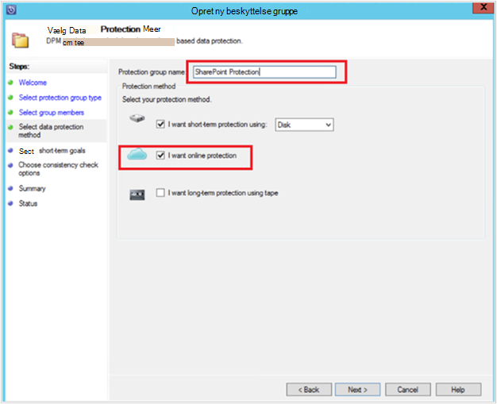
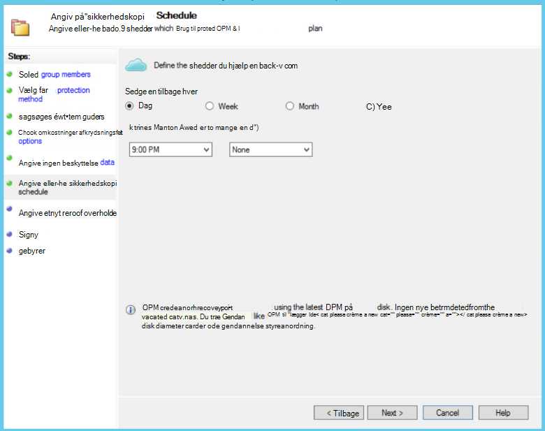

<properties
    pageTitle="DPM/Azure sikkerhedskopi server beskyttelse af en SharePoint-farm til Azure | Microsoft Azure"
    description="I denne artikel indeholder en oversigt over sikkerhedskopiering af DPM/Azure server beskyttelse af en SharePoint-farm til Azure"
    services="backup"
    documentationCenter=""
    authors="adigan"
    manager="Nkolli1"
    editor=""/>

<tags
    ms.service="backup"
    ms.workload="storage-backup-recovery"
    ms.tgt_pltfrm="na"
    ms.devlang="na"
    ms.topic="article"
    ms.date="09/29/2016"
    ms.author="adigan;giridham;jimpark;trinadhk;markgal"/>

# Sikkerhedskopiere en SharePoint-farm til Azure
Du sikkerhedskopiering af en SharePoint-farm til Microsoft Azure ved hjælp af System Center Data Protection Manager (DPM) på samme måde, som du sikkerhedskopierer andre datakilder. Azure sikkerhedskopi giver fleksibilitet i tidsplanen for sikkerhedskopiering til at oprette dagligt, ugentligt, månedligt eller årligt sikkerhedskopi peger og giver dig opbevaring politikindstillinger for forskellige sikkerhedskopiering punkter. DPM giver mulighed for at gemme lokale diskkopier til hurtig gendannelse tid målsætninger (RTO) og gemme kopier, der skal Azure for økonomisk, langsigtede opbevaring.

## SharePoint understøttede versioner og relaterede beskyttelse scenarier
Azure sikkerhedskopi for DPM understøtter følgende scenarier:

| Arbejdsbelastning | Version | SharePoint-installationen | DPM installationstype | DPM - System Center 2012 R2 | Beskyttelse og gendannelse |
| -------- | ------- | --------------------- | ------------------- | --------------------------- | ----------------------- |
| SharePoint | SharePoint 2013, SharePoint 2010, SharePoint 2007, SharePoint 3.0 | SharePoint installeret som en fysisk server eller Hyper-V/VMware virtuelt   --------------   SQL AlwaysOn | Fysisk server eller en lokal Hyper-V virtuelt | Understøtter sikkerhedskopi til Azure fra opdateringspakke 5 | Beskytte mulighed for gendannelse af SharePoint-Farm: gendannelse farm, database og fil eller et listeelement fra disk gendannelse punkter.  Farm og database gendannelse fra Azure gendannelse punkter. |

## Før du starter
Der er et par ting, du har brug for at bekræfte, inden du sikkerhedskopierer en SharePoint-farm til Azure.

### Forudsætninger
Før du fortsætter, skal du kontrollere, at du har opfyldt alle [forudsætninger for ved hjælp af Microsoft Azure sikkerhedskopiering](backup-azure-dpm-introduction.md#prerequisites) for at beskytte arbejdsmængder. Nogle opgaver til forudsætninger, der omfatter: oprette en sikkerhedskopi samling, samling legitimationsoplysninger hentes, installere Azure Backup Agent og registrere DPM/Azure Backup Server med samling af legitimationsoplysninger.

### DPM agent
DPM agent skal være installeret på den server, der kører SharePoint, servere, der kører SQL Server og alle andre servere, der er en del af SharePoint-farmen. Du kan finde flere oplysninger om, hvordan du konfigurerer beskyttelse agent [Konfiguration Protection Agent](https://technet.microsoft.com/library/hh758034(v=sc.12).aspx).  Den eneste undtagelse er, at du installerer agenten kun på en enkelt webserver front-end (WFE). DPM skal agent på én WFE server kun skal fungere som indgangspunkt for beskyttelse.

### SharePoint-farm
For hver 10 millioner elementer i farmen, skal der være mindst 2 GB plads på enheden, hvor mappen DPM er placeret. Her er påkrævet til oprettelse af kataloget. For DPM gendanne bestemte elementer (grupper af websteder, websteder, lister, dokumentbiblioteker, mapper, separate dokumenter og listeelementer), opretter generering af kataloget en liste over de URL-adresser, der er indeholdt i hver indholdsdatabase. Du kan få vist listen over URL-adresser i ruden genoprettelig element i området **gendannelse** opgave i DPM administratorkonsol.

### SQL Server
DPM kører som en LocalSystem. Hvis du vil sikkerhedskopiere SQL Server-databaser, skal DPM systemadministrator rettigheder for den pågældende konto til den server, der kører SQL Server. Angiv NT AUTHORITY\SYSTEM til *systemadministrator* på den server, der kører SQL Server, før du sikkerhedskopiere den.

Hvis SharePoint-farm har SQL Server-databaser, der er konfigureret med SQL Server aliasser, skal du installere komponenter til SQL Server-klienten på front end-webserver, der kan beskytte DPM.

### SharePoint Server
Mens ydeevnen afhænger af mange faktorer som størrelsen på SharePoint-farm, som generelle retningslinjer kan én DPM server beskytte en 25 TB SharePoint-farm.

### DPM opdateringspakke 5
Hvis du vil begynde beskyttelse af en SharePoint-farm til Azure, skal du installere DPM opdateringspakke 5 eller nyere. Opdateringspakke 5 giver mulighed for at beskytte en SharePoint-farm til Azure, hvis farmen er konfigureret ved hjælp af SQL AlwaysOn.
Yderligere oplysninger finder du læse blogindlægget, der introducerer [DPM opdateringspakke 5]( http://blogs.technet.com/b/dpm/archive/2015/02/11/update-rollup-5-for-system-center-2012-r2-data-protection-manager-is-now-available.aspx)

### Dette understøttes ikke
- DPM, der beskytter en SharePoint-farm beskytter ikke søgeindeks eller program service databaser. Du skal konfigurere beskyttelsen af disse databaser separat.
- DPM giver ikke sikkerhedskopi af SharePoint SQL Server-databaser, der er hostet på serveren (SOFS) skala fra filshares.

## Konfigurere SharePoint-beskyttelse
Før du kan bruge DPM for at beskytte SharePoint, skal du konfigurere SharePoint VSS Writer tjenesten (WSS Writer) ved hjælp af **ConfigureSharePoint.exe**.

Du kan finde **ConfigureSharePoint.exe** i mappen [DPM installationssti] \bin på front end-serveren. Dette værktøj indeholder beskyttelse agent med legitimationsoplysningerne til SharePoint-farmen. Du kører den på en enkelt WFE-server. Hvis du har flere WFE servere, skal du vælge kun, når du konfigurerer en beskyttelse gruppe.

### Konfigurere tjenesten SharePoint VSS Writer
1. Gå til [DPM installationsplacering] \bin\ på WFE serveren, fra en kommandoprompt
2. Angiv ConfigureSharePoint - EnableSharePointProtection.
3. Angiv legitimationsoplysninger for administrator i farmen. Denne konto skal være medlem af den lokale administratorgruppe på WFE-serveren. Hvis farmadministratoren ikke er en lokal administrator give følgende tilladelser på serveren WFE:
  - Give den WSS_Admin_WPG administratorgruppe fulde kontrol til mappen DPM (% Program Files%\Microsoft databeskyttelse Manager\DPM).
  - Tildel WSS_Admin_WPG gruppe læseadgang til registreringsdatabasenøglen DPM (HKEY_LOCAL_MACHINE\SOFTWARE\Microsoft\Microsoft Data Protection Manager).

>[AZURE.NOTE] Du skal køre ConfigureSharePoint.exe igen, når der er en ændring i SharePoint-farm administratorrettigheder.

## Sikkerhedskopiere en SharePoint-farm ved hjælp af DPM
Når du har konfigureret DPM og SharePoint-farm, som beskrevet tidligere, kan være beskyttet SharePoint af DPM.

### Beskytte en SharePoint-farm
1. Klik på **Ny**under fanen **beskyttelse** af DPM-administratorkonsol.
    

2. Vælg **Servers**på siden **Vælg beskyttelse Gruppetypen** i guiden **Opret ny gruppe beskyttelse** , og klik derefter på **Næste**.

    

3. Markér afkrydsningsfeltet for den SharePoint-server, du vil beskytte, og klik på **Næste**på skærmbilledet **Vælg gruppemedlemmer** .

    

    >[AZURE.NOTE] Med den DPM agent er installeret, kan du se server i guiden. DPM viser også dens struktur. Fordi du har kørt ConfigureSharePoint.exe, DPM kommunikerer med tjenesten SharePoint VSS Writer og dens tilsvarende SQL Server-databaser og genkender SharePoint-farm strukturen, de tilknyttede indholdsdatabaser og de tilsvarende elementer.

4. Angiv navnet på **Gruppen beskyttelse**på siden **Vælg Data beskyttelsesmetode** , og vælg din foretrukne *metoder til beskyttelse*. Klik på **Næste**.

    

    >[AZURE.NOTE] Beskyttelsesmetode disk hjælper med at opfylde korte gendannelse tid mål. Azure er en økonomisk, langsigtede beskyttelse destination sammenlignet med bånd. Du kan finde flere oplysninger, se [Brug Azure sikkerhedskopi erstatte infrastrukturen bånd](https://azure.microsoft.com/documentation/articles/backup-azure-backup-cloud-as-tape/)

5. Vælg din foretrukne **opbevaring område** på siden **Angiv Short-Term mål** og identificere, når du vil sikkerhedskopier skal udføres.

    

    >[AZURE.NOTE] Da gendannelse er oftest kræves til data, som er mindre end 5 dage gamle, vi markeret datasættet opbevaring af fem dage på disken og sikres, at sikkerhedskopieringen der sker under ikke-produktiv timer, i dette eksempel.

6. Gennemse lagerplads puljen diskplads allokeret for gruppen beskyttelse, og klik derefter på **Næste**.

7. For hver gruppe med beskyttelse tildeler DPM diskplads for at lagre og administrere replikaer. På dette tidspunkt skal DPM oprette en kopi af de markerede data. Angiv, hvordan og hvornår du vil den replika, der er oprettet, og klik derefter på **Næste**.

    

    >[AZURE.NOTE] For at sikre dig, at netværkstrafik ikke sker, skal du vælge et tidsrum uden for fremstilling timer.

8. DPM sikrer dataintegritet ved at udføre konsistens Kontroller af replikaen. Der findes to forskellige indstillinger. Du kan angive en tidsplan for at køre konsistens kontrol, eller DPM kan køre konsistens Kontroller automatisk på replikaen, når det bliver inkonsekvent. Vælg den ønskede indstilling, og klik derefter på **Næste**.

    

9. Vælg den SharePoint-farm, du vil beskytte, og klik derefter på **Næste**på siden **Angiv Online Protection-Data** .

    

10. Vælg din foretrukne tidsplan på siden **Angiv Online sikkerhedskopi tidsplan** , og klik derefter på **Næste**.

    

    >[AZURE.NOTE] DPM leverer maksimalt to daglige sikkerhedskopier til Azure på forskellige tidspunkter. Azure sikkerhedskopi kan også kontrollere mængden af WAN båndbredde, der kan bruges til sikkerhedskopier i top og belastet ved hjælp af [Azure sikkerhedskopi netværk (throttling)](https://azure.microsoft.com/en-in/documentation/articles/backup-configure-vault/#enable-network-throttling).

11. Afhængigt af tidsplanen for sikkerhedskopiering, du har valgt, på siden **Angiv Online opbevaringspolitik** skal du vælge opbevaringspolitikken for dagligt, ugentligt, månedlige og årlige sikkerhedskopiering punkter.

    

    >[AZURE.NOTE] DPM bruger et bedstefar-far-søn opbevaring farveskema, hvor der kan vælges en anden opbevaringspolitik for forskellige sikkerhedskopiering tidspunkter.

12. Svarer til disk, en indledende reference punkt kopi skal oprettes i Azure. Vælg den ønskede indstilling til at oprette en indledende sikkerhedskopi til Azure, og klik derefter på **Næste**.

    

13. Gennemse de valgte indstillinger på siden **Oversigt** , og klik derefter på **Opret gruppe**. Du får vist meddelelsen succes efter gruppen beskyttelse er blevet oprettet.

    

## Gendanne et SharePoint-element fra disk ved hjælp af DPM
I eksemplet nedenfor *gendanne SharePoint-element* utilsigtet er slettet og skal gendannes.

1. Åbn **DPM administratorkonsol**. Alle SharePoint-farme, der er beskyttet af DPM vises under fanen **beskyttelse** .

    

2. Hvis du vil begynde at gendanne elementet, Vælg fanen **gendannelse** .

    

3. Du kan søge SharePoint efter *gendanne SharePoint-element* ved hjælp af et jokertegn-baserede søgning i et område med gendannelse punkt.

    

4. Vælg den relevante gendannelsespunkt i søgeresultaterne, skal du højreklikke på elementet og derefter vælge **Gendan**.

5. Du kan også gå gennem forskellige gendannelse punkter og vælge en database eller et element til at gendanne. Vælg **dato > gendannelse tid**, og vælg derefter den korrekte **Database > SharePoint-farm > gendannelsespunkt > element**.

    

6. Højreklik på elementet, og vælg derefter **Gendan** til at åbne **Guiden Gendannelse**. Klik på **Næste**.

    

7. Vælg typen gendannelse, du vil udføre, og klik derefter på **Næste**.

    

    >[AZURE.NOTE] Markering af **Gendan til oprindelig** i eksemplet genopretter elementet til den oprindelige SharePoint-websted.

8. Vælg den **Genoprettelsen** , du vil bruge.
    - Vælg **Gendan uden at bruge en gendannelse farm** , hvis SharePoint-farmen ikke er ændret, og er den samme som punktet gendannelse, gendannes.
    - Vælg **Gendan ved hjælp af en gendannelse farm** , hvis SharePoint-farm er ændret siden punktet Genoprettelsen blev oprettet.

    

9. Giver en midlertidig placering af SQL Server-forekomst for at gendanne databasen midlertidigt, og Angiv en midlertidig filshare på DPM-serveren og den server, der kører SharePoint for at gendanne elementet.

    

    DPM vedhæfter indholdsdatabase, der vært for SharePoint-elementet til den midlertidige SQL Server-forekomst. Indholdsdatabase, DPM-serveren genopretter elementet og placerer den på den midlertidige filplacering på DPM-serveren. Det gendannede element, som findes på den midlertidige placering på serveren, DPM nu skal eksporteres til den midlertidige placering på SharePoint-farmen.

    

10. Vælg **Angiv gendannelsesindstillinger**, og anvende sikkerhedsindstillinger for på SharePoint-farm, eller Anvend sikkerhedsindstillingerne for gendannelsespunkt. Klik på **Næste**.

    

    >[AZURE.NOTE] Du kan vælge at begrænse båndbredden netværk. Derved minimeres betydning for fremstilling serveren under fremstilling timer.

11. Gennemgå oversigtsoplysningerne, og klik derefter på **Gendan** for at begynde at gendanne filen.

    

12. Vælg fanen **overvågnings** i **DPM administratorkonsol** for at få vist **Status** for at genoprettelsen.

    

    >[AZURE.NOTE] Filen er nu gendannet. Du kan opdatere SharePoint-webstedet for at kontrollere den gendannede fil.

## Gendanne en SharePoint-database fra Azure ved hjælp af DPM

1. Hvis du vil gendanne en indholdsdatabase til SharePoint, gennemse forskellige gendannelse punkter (som vist tidligere), og vælg punktet gendannelse, du vil gendanne.

    

2. Dobbeltklik på SharePoint gendannelse punktet for at få vist de tilgængelige SharePoint-katalog oplysninger.

    > [AZURE.NOTE] Da SharePoint-farmen er beskyttet for langsigtede opbevaring i Azure, findes ingen katalogoplysninger (metadata) på DPM-serveren. Når en punkt-in-time SharePoint indholdsdatabase skal gendannes, skal du som et resultat for en katalogside SharePoint-farm igen.

3. Klik på **for en katalogside igen**.

    

    Statusvinduet **Skyen Recatalog** åbnes.

    

    Når udarbejdelse af liste er fuldført, ændres status til *Success*. Klik på **Luk**.

    

4. Klik på det SharePoint-objekt, der vises i under fanen DPM **gendannelse** at få den indholdsdatabase struktur. Højreklik på elementet, og klik derefter på **Gendan**.

    

5. På dette tidspunkt Følg [gendannelse trinnene tidligere i denne artikel](#restore-a-sharepoint-item-from-disk-using-dpm) for at gendanne en indholdsdatabase til SharePoint fra disk.

## Ofte stillede spørgsmål
Sp: hvilke versioner af DPM understøtter SQL Server 2014 og SQL 2012 (SP2)? 
SV: DPM 2012 R2 med opdateringspakke 4 understøtter begge metoder.

Sp: kan jeg gendanne en SharePoint-element til den oprindelige placering, hvis SharePoint er konfigureret ved hjælp af SQL AlwaysOn (med beskyttelse på disk)? 
SV: Ja, kan gendannes elementet til den oprindelige SharePoint-websted.

Sp: kan jeg gendanne en SharePoint-database til den oprindelige placering, hvis SharePoint er konfigureret ved hjælp af SQL AlwaysOn? 
SV: da SharePoint databaser er konfigureret i SQL AlwaysOn, kan de kan ikke redigeres, medmindre gruppen tilgængelighed fjernes. Som et resultat kan ikke DPM gendanne en database til den oprindelige placering. Du kan gendanne en SQL Server-database til en anden forekomst af SQL Server.

## Næste trin
- Lær mere om DPM beskyttelse af SharePoint - se [Video serie - DPM beskyttelse af SharePoint](http://channel9.msdn.com/Series/Azure-Backup/Microsoft-SCDPM-Protection-of-SharePoint-1-of-2-How-to-create-a-SharePoint-Protection-Group)
- Gennemse [Produktbemærkninger til System Center 2012 - beskyttelse datastyring](https://technet.microsoft.com/library/jj860415.aspx)
- Gennemse [Produktbemærkninger til Data Protection Manager i System Center 2012 SP1](https://technet.microsoft.com/library/jj860394.aspx)
