<properties
    pageTitle="Azure sikkerhedskopi til SQL Server arbejdsmængder ved hjælp af DPM | Microsoft Azure"
    description="En introduktion til sikkerhedskopiering af SQL Server-databaser ved hjælp af tjenesten Azure sikkerhedskopi"
    services="backup"
    documentationCenter=""
    authors="adigan"
    manager="Nkolli1"
    editor=""/>

<tags
    ms.service="backup"
    ms.workload="storage-backup-recovery"
    ms.tgt_pltfrm="na"
    ms.devlang="na"
    ms.topic="article"
    ms.date="09/27/2016"
    ms.author="adigan;giridham; jimpark;markgal;trinadhk"/>

# Azure sikkerhedskopi til SQL Server arbejdsmængder ved hjælp af DPM

I denne artikel fører dig gennem trinnene til konfiguration til at sikkerhedskopiere til SQL Server-databaser ved hjælp af Azure sikkerhedskopiering.

Hvis du vil sikkerhedskopiere SQL Server-databaser til Azure, skal du en Azure-konto. Hvis du ikke har en konto, kan du oprette en gratis prøveversion konto på kun par minutter. Yderligere oplysninger finder du [Azure gratis prøveversion](https://azure.microsoft.com/pricing/free-trial/).

For administration af SQL Server sikkerhedskopi af databasen til Azure- og gendannelsesfiler fra Azure består af tre trin:

1. Oprette en sikkerhedskopi politik for at beskytte SQL Server-databaser til Azure.
2. Oprette efter behov sikkerhedskopier til Azure.
3. Gendanne databasen fra Azure.

## Før du starter
Før du begynder, skal du sikre dig, at alle [forudsætninger](../backup-azure-dpm-introduction.md#prerequisites) for bruger Microsoft Azure Backup til at beskytte arbejdsbelastninger, som er opfyldt. Forudsætningerne dækker opgaver, f.eks.: oprette en sikkerhedskopi samling, hente samling legitimationsoplysninger, installere den Azure Backup Agent og registrering af serveren med samling af legitimationsoplysninger.

## Oprette en sikkerhedskopi politik for at beskytte SQL Server-databaser til Azure

1. Klik på serveren DPM **beskyttelse** arbejdsområde.

2. Klik på **Ny** for at oprette en ny beskyttelse gruppe på båndet værktøj.

    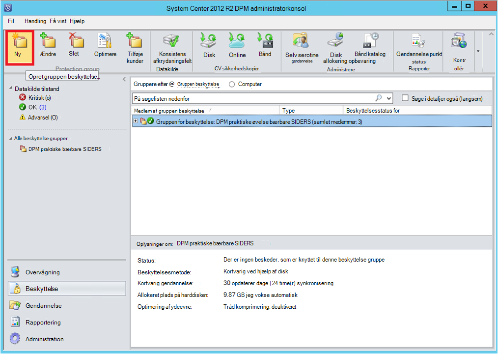

3. DPM viser startskærmbilledet vejledningen til oprettelse af en **Gruppen beskyttelse**. Klik på **Næste**.

4. Vælg **servere**.

    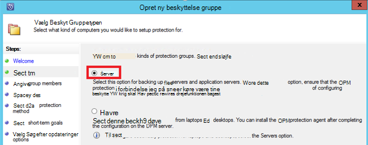

5. Udvid den SQL Server-computer, hvor databaser skal sikkerhedskopieres er til stede. DPM viser forskellige datakilder, der kan sikkerhedskopieres fra den pågældende server. Udvide **Alle SQL-aktier** og vælge for (i dette tilfælde har vi valgt ReportServer$ MSDPM2012 og ReportServer$ MSDPM2012TempDB)-databaser skal sikkerhedskopieres. Klik på **Næste**.

    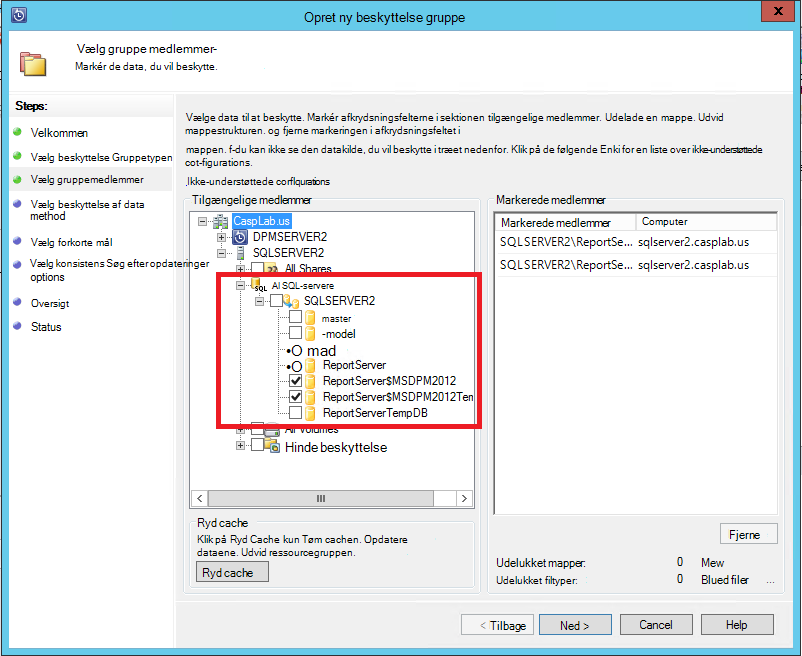

6. Angiv et navn til gruppen beskyttelse og markere afkrydsningsfeltet **jeg vil online Protection** .

    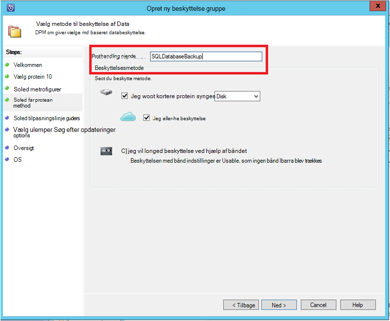

7. Skriv de nødvendige input for at oprette ekstra peger på disken i skærmbilledet **Angive Short-Term mål** .

    Vi se her, **opbevaring område** er angivet til *5 dage*, **hyppighed af synkronisering** er indstillet til én gang hver *15 minutter* , er den hyppighed, hvormed sikkerhedskopi hentes. **Express fuld sikkerhedskopiering** er angivet til *8:00 P.M*.

    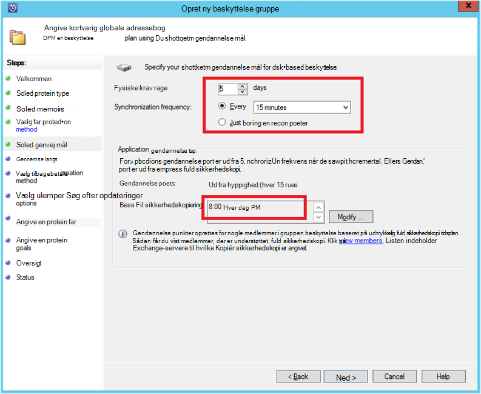

    >[AZURE.NOTE] På 8:00 PM (ifølge skærmen input) oprettes et ekstra punkt hver dag ved at overføre de data, der er blevet ændret fra den forrige dag 8:00 PM sikkerhedskopiering punkt. Denne proces kaldes **Express fuld sikkerhedskopiering**. Mens posteringen logfiler synkroniseres express hver 15 minutter, hvis der er behov for at gendanne databasen på 9:00 PM –, og klik derefter punktet er oprettet af replaying loggene fra sidst fuld sikkerhedskopi punkt (8 pm i dette tilfælde).

8. Klik på **Næste**

    DPM viser den samlede lagerplads tilgængelig og de potentielle udnyttelse af pladsen disk.

    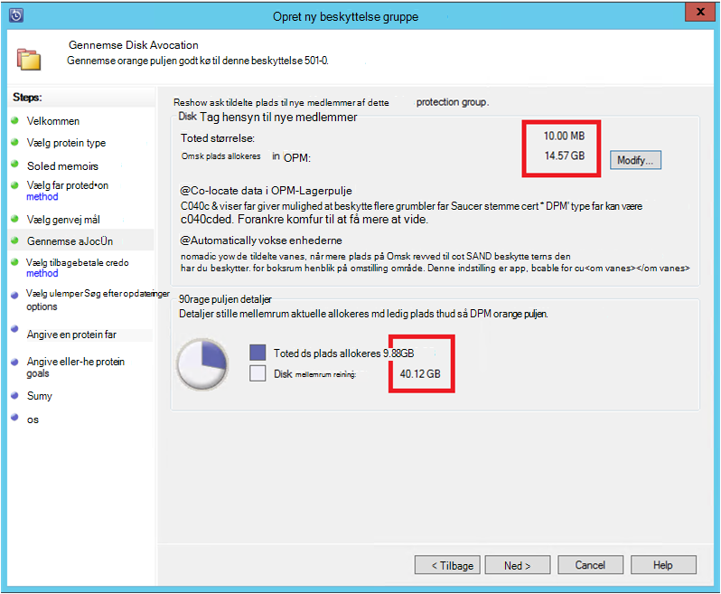

    Som standard opretter DPM én lydstyrken per datakilde (SQL Server-database), som bruges til indledende sikkerhedskopien. Bruger denne metode, begrænser logiske Disk Manager (LDM) DPM beskyttelse til 300 datakilder (SQL Server-databaser). Du kan løse denne begrænsning, Vælg den **samtidig finde data i DPM Lagerpulje**, indstilling. Hvis du bruger denne indstilling, bruger DPM en enkelt lydstyrken for flere datakilder, som giver mulighed for DPM at beskytte op til 2000 SQL-databaser.

    Hvis **automatisk vokse enhederne** indstilling er markeret, kan DPM højde for øget sikkerhedskopiering lydstyrken, efterhånden som datatypen fremstilling vokser. Hvis **automatisk vokse enhederne** indstilling ikke er markeret, begrænser DPM anvendt til datakilder i gruppen beskyttelse ekstra lagerplads.

9. Administratorer er valget af overførsel af denne indledende sikkerhedskopi manuelt (fra network) for at undgå båndbredde overbelastning eller via netværket. De kan også konfigurere det tidspunkt, hvor den første overførsel kan ske. Klik på **Næste**.

    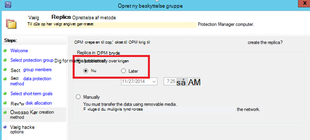

    Indledende sikkerhedskopien kræver overførsel af hele datakilden (SQL Server-database) fra fremstilling server (SQL Server maskine) til DPM-serveren. Disse data kan være store, og overførsel af data via netværket kunne overskrider båndbredde. Derfor administratorer kan vælge at overføre den første sikkerhedskopi: **manuelt** (ved hjælp af flytbare medier) for at undgå båndbredde overbelastning eller **automatisk via netværket** (på et bestemt tidspunkt).

    Når den indledende sikkerhedskopieringen er fuldført, er resten af sikkerhedskopier af trinvise sikkerhedskopier af indledende sikkerhedskopien. Trinvise sikkerhedskopier typisk er lille og overføres nemt på tværs af netværket.

10. Vælg, når du vil konsistens Kontrollér, at køre og klikke på **Næste**.

    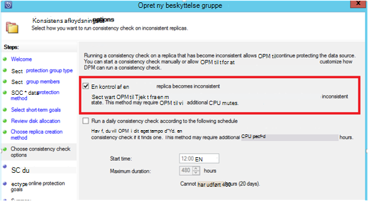

    DPM kan udføre en konsistens afkrydsningsfelt til afkrydsningsfelt integriteten af punktet sikkerhedskopiering. Det beregner kontrolsummen af sikkerhedskopifilen på fremstilling server (SQL Server maskine i dette scenarie) og sikkerhedskopierede data for den pågældende fil på DPM. Hvis det er en konflikt forudsættes det, at filen sikkerhedskopierede på DPM er beskadiget. DPM afhjælper sikkerhedskopierede data ved at sende de blokke, der svarer til kontrolsum uoverensstemmelsen. Som konsistenskontrollen er en handling af ydeevnen-intensivt, har administratorer mulighed for at planlægge konsistenskontrollen eller køre den automatisk.

11. Vælg databaserne, der er beskyttet til Azure, og klik på **Næste**for at angive online beskyttelse af datakilderne.

    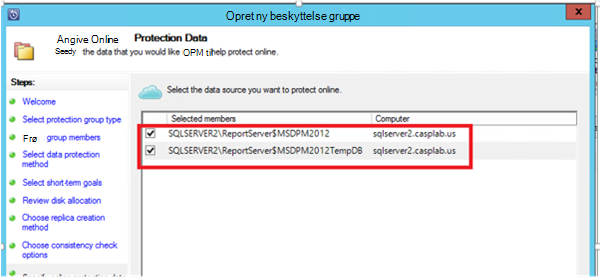

12. Administratorer kan vælge sikkerhedskopiering tidsplaner og opbevaringspolitikker, der passer til deres organisation politikker.

    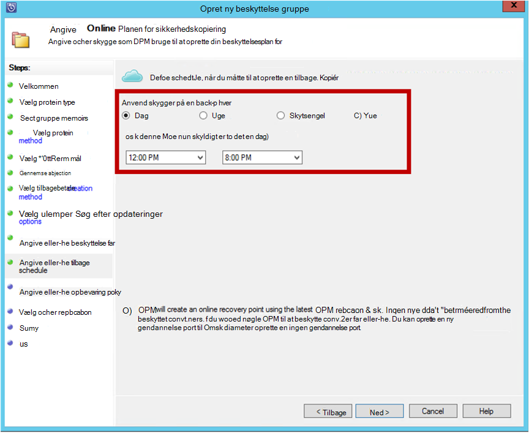

    I dette eksempel er sikkerhedskopier taget en gang om dagen på 12:00 PM og 8 PM (nederste del af skærmen)

    >[AZURE.NOTE] Det er en god ide at have et par kortvarig gendannelse punkter på disk, hurtig gendannelse. Punkterne gendannelse bruges til "funktionsdygtige gendannelse". Azure fungerer som et andet sted god placering med højere SLA og garanti for tilgængelighed.

    **Bedste fremgangsmåde**: Sørg for, at Azure sikkerhedskopier planlægges efter afslutningen af lokal disk sikkerhedskopier ved hjælp af DPM. Dette gør det seneste disk sikkerhedskopien skal kopieres til Azure.

13. Vælg planen for opbevaring af politik. Oplysninger om, hvordan opbevaringspolitikken fungerer er angivet i [Brug Azure sikkerhedskopi erstatte din bånd infrastruktur artikel](backup-azure-backup-cloud-as-tape.md).

    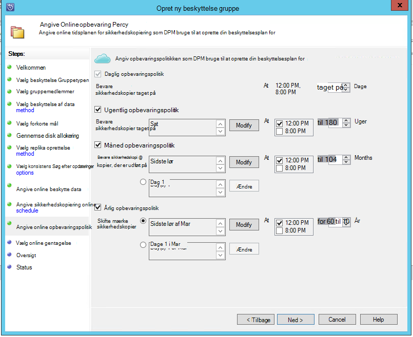

    I dette eksempel:

    - Sikkerhedskopier er taget en gang om dagen på 12:00 PM og 8 PM (nederste del af skærmen) og beholdes i 180 dage.
    - Sikkerhedskopi lørdag kl. 12:00 bevares i 104 uger
    - Sikkerhedskopiér i sidste lørdag kl. 12:00 bevares for 60 måneder
    - Sikkerhedskopiér i sidste lørdag i marts kl. 12:00 bevares i ti år

14. Klik på **Næste** , og vælg den relevante indstilling for overførsel af indledende sikkerhedskopien til Azure. Du kan vælge **automatisk via netværket** eller **Offline sikkerhedskopi**.

    - **Automatisk via netværket** du overfører sikkerhedskopidataene til Azure ud fra tidsplanen valgt til sikkerhedskopi.
    - Hvordan fungerer **Offline sikkerhedskopi** forklares på [Offline sikkerhedskopi arbejdsproces i Azure sikkerhedskopi](backup-azure-backup-import-export.md).

    Vælg den relevante filoverførsel metode til at sende den indledende sikkerhedskopi til Azure, og klik på **Næste**.

15. Når du har gennemgået politik oplysningerne i skærmbilledet **Oversigt** , klik på knappen **Opret gruppe** for at fuldføre arbejdsprocessen. Du kan klikke på knappen **Luk** og overvåge forløbet job i overvågnings arbejdsområde.

    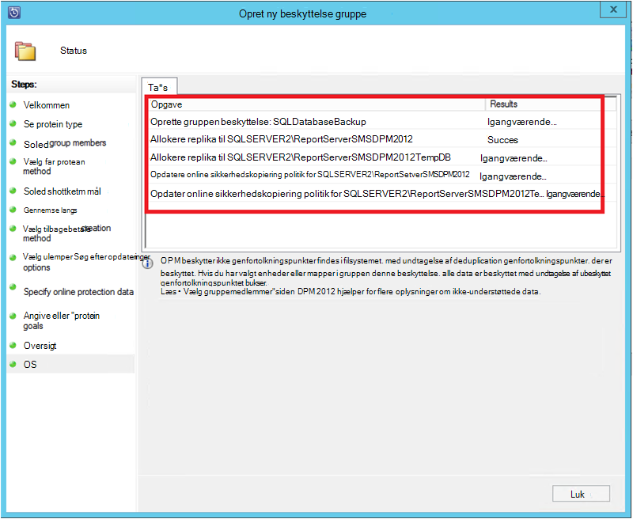

## Efter behov sikkerhedskopi af en SQL Server-database
Mens de forrige trin oprettet en politik for sikkerhedskopiering, oprettes et "gendannelsespunkt" kun, når den første sikkerhedskopiering opstår. I stedet for venter på at starte planlæggeren, peg trinnene nedenfor udløser oprettelse af en genoprettelse manuelt.

1. Vent, indtil beskyttelse gruppestatus viser **OK** til databasen, før du opretter gendannelsespunkt.

    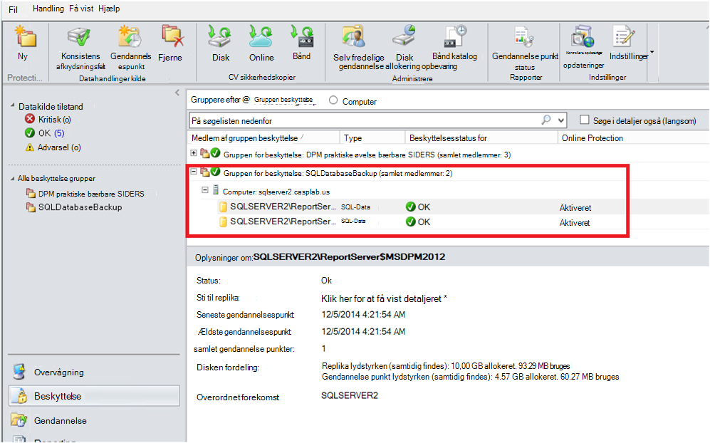

2. Højreklik på databasen, og vælg **Opret gendannelse punkt**.

    

3. Vælg **Online Protection** i menuen ned, og klik på **OK**. Dette starter oprettelse af et gendannelsespunkt i Azure.

    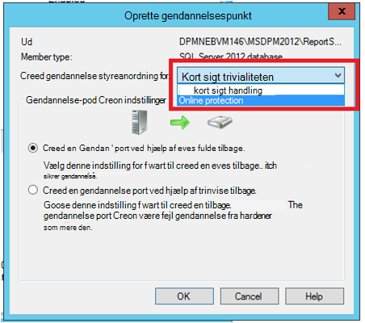

4. Du kan få vist jobbet status i arbejdsområdet **overvågnings** , hvor du kan finde en igangværende job som det vist i den næste figur.

    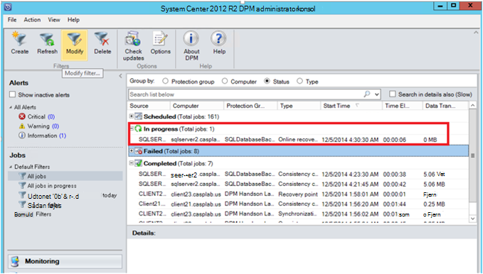

## Gendanne en SQL Server-database fra Azure
Følgende trin er påkrævet til at gendanne en beskyttet enhed (SQL Server-database) fra Azure.

1. Åbn DPM server Management Console. Gå til **gendannelse** arbejdsområde, hvor du kan se de servere, der er sikkerhedskopieret af DPM. Find den påkrævede database (i dette tilfælde ReportServer$ MSDPM2012). Vælge et **gendannelse fra** tidsrum, der slutter med **Online**.

    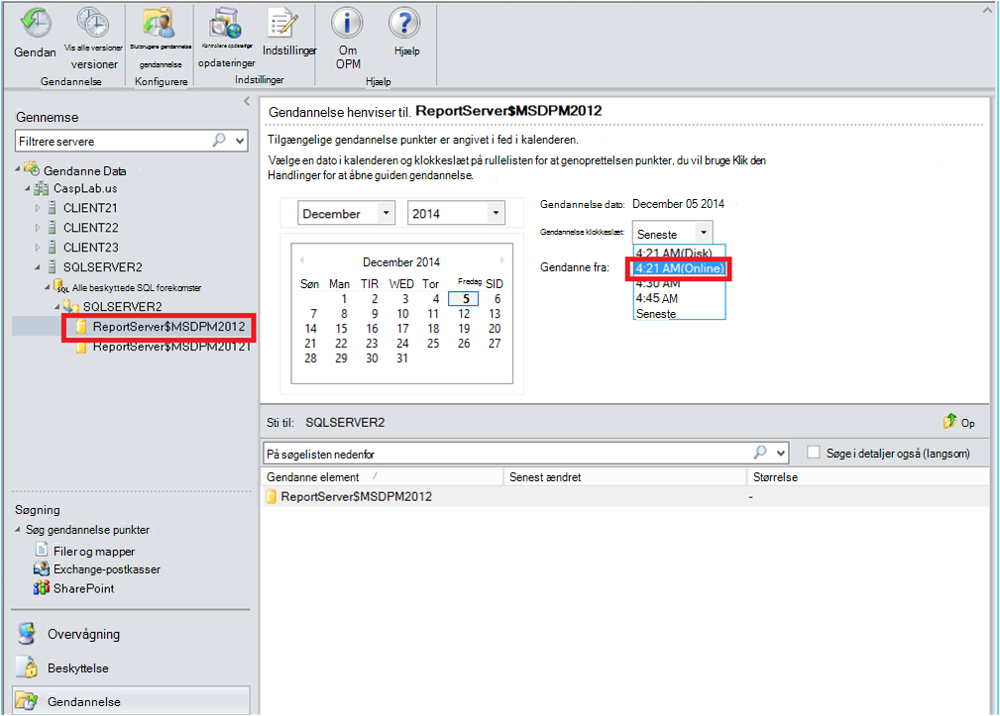

2. Højreklik på navnet på databasen, og klik på **Gendan**.

    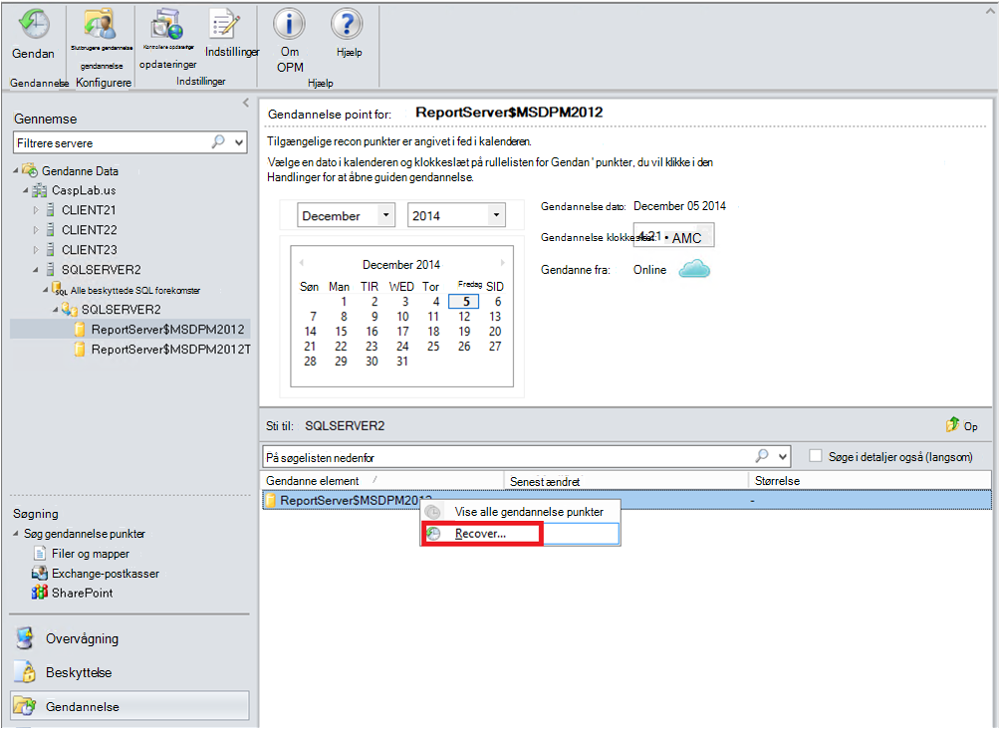

3. DPM viser oplysninger om gendannelsespunkt. Klik på **Næste**. Hvis du vil overskrive databasen, Vælg den gendannelse **Gendan oprindelige forekomst af SQL Server**. Klik på **Næste**.

    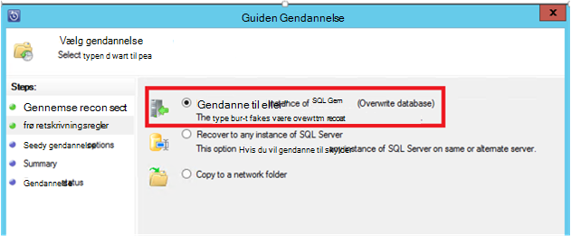

    I dette eksempel DPM giver mulighed for gendannelse af databasen til en anden forekomst af SQL Server eller til en enkeltstående netværksmappe.

4. I skærmbilledet **angive gendannelse indstillinger** kan du vælge indstillingerne gendannelse som netværksbåndbredde brugen (throttling) Sådan begrænses båndbredden bruges af gendannelse. Klik på **Næste**.

5. På skærmbilledet **Oversigt** skal se du alle de angivne hidtil gendannelse-konfigurationer. Klik på **Gendan**.

    Gendannelse status viser den database, der gendannes. Du kan klikke på **Luk** for at lukke guiden og få vist tidsplanens status i arbejdsområdet **overvågnings** .

    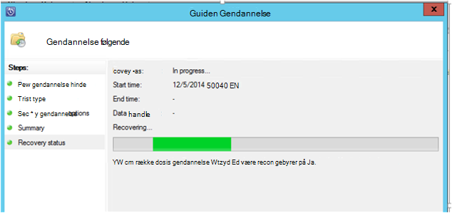

    Når genoprettelsen er fuldført, er den gendannede database program ensartet.

### Næste trin:

• [Azure sikkerhedskopiering ofte stillede spørgsmål](backup-azure-backup-faq.md)
