<properties
   pageTitle="Slette en samling af legitimationsoplysninger Azure sikkerhedskopi | Microsoft Azure"
   description="Sådan slettes en samling af legitimationsoplysninger Azure sikkerhedskopi. Fejlfinding, hvorfor du ikke kan slette en sikkerhedskopi samling af legitimationsoplysninger. "
   services="service-name"
   documentationCenter="dev-center-name"
   authors="markgalioto"
   manager="cfreeman"
   editor=""/>

<tags
   ms.service="backup"
   ms.devlang="na"
   ms.topic="article"
   ms.tgt_pltfrm="na"
   ms.workload="storage-backup-recovery"
   ms.date="08/29/2016"
   ms.author="markgal;trinadhk"/>

# Slette en samling af legitimationsoplysninger Azure sikkerhedskopi

Tjenesten Azure sikkerhedskopi har to typer af vaults - samling af legitimationsoplysninger sikkerhedskopiering og gendannelse Services samling. Sikkerhedskopi samling fulgte første. Derefter kom gendannelse Services samling til at understøtte de udvidede ressourcestyring installationer. På grund af de udvidede egenskaber og de oplysninger om afhængigheder, der skal være gemt i samling af legitimationsoplysninger, kan det virke sværere end den skal være at slette en samling af legitimationsoplysninger gendannelsestjenester.

|**Installationstype**|**Portal**|**Samling af legitimationsoplysninger navn**|
|--------------|----------|---------|
|Klassisk|Klassisk|Sikkerhedskopiering samling|
|Ressourcestyring|Azure|Gendannelse Services samling|

> [AZURE.NOTE] Sikkerhedskopiering vaults kan ikke beskytte ressourcestyring installeret løsninger. Du kan dog bruge en samling af legitimationsoplysninger gendannelse Services til at beskytte traditionelt udløst servere og FOS.  

I denne artikel vil vi bruge ordet, samling, til at referere til formularen generisk af sikkerhedskopi samling eller gendannelse Services samling. Vi bruger formelle navn, sikkerhedskopi samling eller gendannelse Services samling, når det er nødvendigt at skelne mellem vaults.

## Slette en samling af legitimationsoplysninger gendannelse

Slette en samling af legitimationsoplysninger gendannelse Services er en proces i et-trins - *fået samling af legitimationsoplysninger ikke indeholder nogen ressourcer*. Før du kan slette en samling af legitimationsoplysninger gendannelsestjenester, skal du fjerne eller slette alle ressourcer i samling af legitimationsoplysninger. Hvis du forsøger at slette en samling af legitimationsoplysninger, der indeholder ressourcer, får du en fejl som følgende billede.

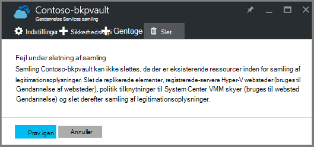  

Indtil du har fjernet ressourcer fra samling af legitimationsoplysninger, giver klikke på **forsøg igen** den samme fejl. Hvis du er fastlåst ved denne fejlmeddelelse, klik på **Annuller** , og følg trinnene nedenfor for at slette ressourcerne i samling af legitimationsoplysninger gendannelsestjenester.

### Fjerne elementer fra en samling, hvordan du beskytter en VM

Hvis du allerede har den gendannelse Services samling af legitimationsoplysninger åbne, gå til det andet trin.

1.  Åbn Azure-portalen, og Åbn den samling, du vil slette fra dashboardet.

    Hvis du ikke har den gendannelse Services samling af legitimationsoplysninger fastgjort til dashboardet i menuen Hub, skal du klikke på **Flere tjenester** , og skriv **Gendannelsestjenester**i på listen over ressourcer. Når du begynder at skrive, filtrene liste baseret på dit input. Klik på **tjenester til genoprettelse vaults**.

    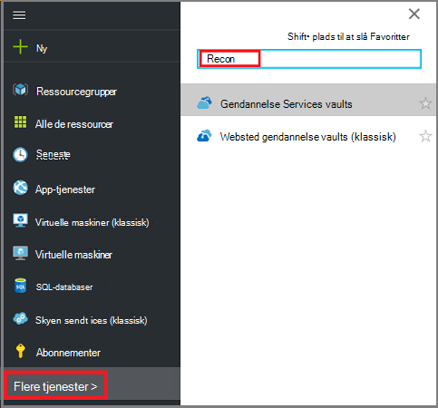  

    På listen over tjenester til genoprettelse vaults vises. Vælg den samling, du vil slette, på listen.

    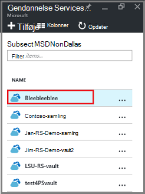

2. Se på ruden **Essentials** i visningen samling af legitimationsoplysninger. Hvis du vil slette en samling af legitimationsoplysninger, kan du ikke de beskyttede elementer. Hvis du får vist et andet tal end nul, under **Sikkerhedskopiering af elementer** eller **styring af sikkerhedskopi-servere**, skal du fjerne disse elementer, før du kan slette samling af legitimationsoplysninger.

    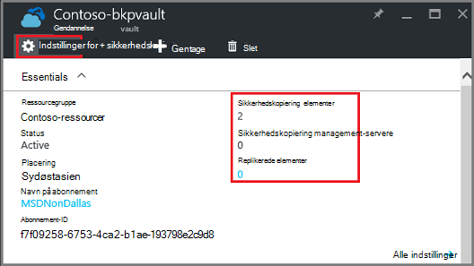

    FOS og filer/mapper betragtes som sikkerhedskopi elementer og vises i området **Sikkerhedskopiering af elementer** i ruden Essentials. En DPM server er angivet i området **Sikkerhedskopi Management Server** i ruden Essentials. **Replikeres elementer** , der gælder for tjenesten Azure gendannelse af websteder.

3. For at begynde at fjerne de beskyttede elementer fra samling af legitimationsoplysninger skal du finde elementer i samling af legitimationsoplysninger. Klik på **Indstillinger**i dashboardet samling, og klik **sikkerhedskopi elementer** for at åbne blade.

    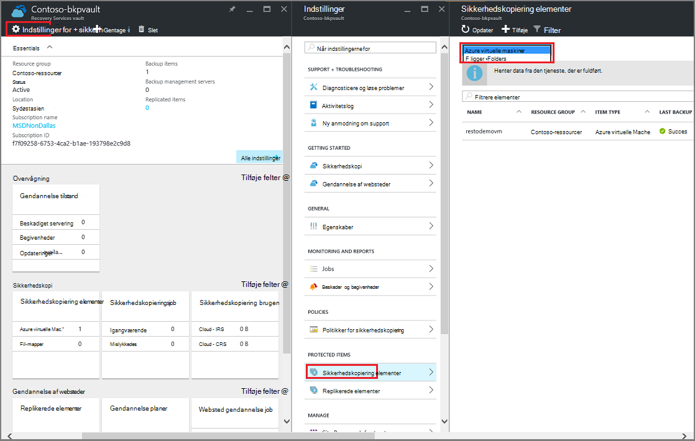

    Bladet **Sikkerhedskopi elementer** har separate lister, baseret på den elementtype: virtuelle Azure-computere eller filmapper (se billede). Listen elementtype vist er virtuelle Azure-computere. Vælg **Arkiver mapper** på rullemenuen for at få vist listen over elementer, arkiver mapper i samling af legitimationsoplysninger.

4. Før du kan slette et element fra samling beskytte en VM, skal du stoppe elementets sikkerhedskopieringsjob og slette de gendannelsesdata. Følg disse trin for hvert element på samling af legitimationsoplysninger:

    en. Højreklik på elementet på bladet **Sikkerhedskopiering elementer** , og vælg **Stop sikkerhedskopi**i genvejsmenuen.

    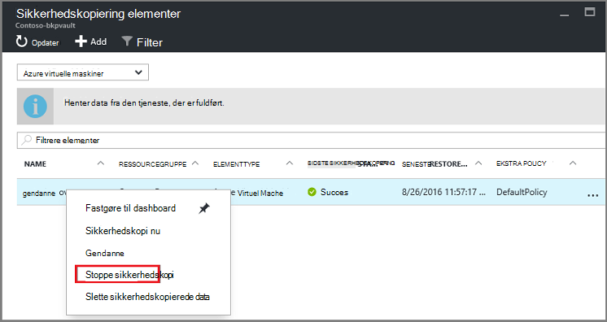

    Stoppe sikkerhedskopi blade åbnes.

    b. Vælg **Slet sikkerhedskopidataene** fra menuen **Vælg en indstilling** på bladet **Stoppe sikkerhedskopiering** > Skriv navnet på elementet > og klikke på **Stop sikkerhedskopi**.

      Skriv navnet på elementet for at bekræfte, at du vil slette den. Knappen **Stop sikkerhedskopi** aktiveres ikke, før du har bekræftet elementet til stop. Hvis du ikke kan se dialogboksen for at skrive navnet på sikkerhedskopien element, har du valgt indstillingen **Bevar sikkerhedskopidataene** .

    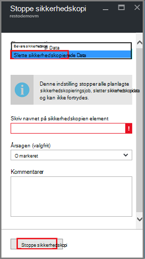

      Du kan eventuelt angive en årsag, hvorfor du vil slette dataene, og tilføje kommentarer. Når du klikker på **Stop sikkerhedskopi**, Tillad kørslen Slet at fuldføre før du forsøger at slette samling af legitimationsoplysninger. Kontrollere de Azure meddelelser for at bekræfte, at opgaven er afsluttet, .  
   Når jobbet er fuldført, modtager du en meddelelse om sikkerhedskopieringen stoppede og de sikkerhedskopierede data er blevet slettet for det pågældende element.

    c. Klik på **Opdater** for at få vist de resterende elementer i samling af legitimationsoplysninger efter sletning af et element på listen i menuen **Sikkerhedskopi elementer** .

      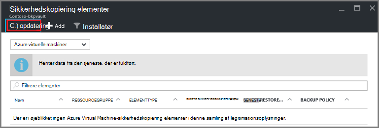

      Når der er ingen elementer på listen, Rul til ruden **Essentials** i bladet sikkerhedskopi samling af legitimationsoplysninger. Der ikke bør være en hvilken som helst **sikkerhedskopi elementer**, **styring af sikkerhedskopi-servere**eller **replikeret elementer** vises. Hvis elementer stadig vises i samling af legitimationsoplysninger, skal du vende tilbage til trin 3 ovenfor og vælge en anden type elementlisten.  

5. Når der er ingen flere elementer på værktøjslinjen samling, kan du klikke på **Slet**.

    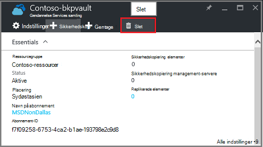

6. Klik på **Ja**, når du bliver bedt om at bekræfte, at du vil slette samling af legitimationsoplysninger.

    Samling af legitimationsoplysninger slettes, og portalen vender tilbage til menuen **Ny** tjeneste.

## Hvad nu, hvis jeg ikke længere sikkerhedskopieringen, men bevares dataene?

Hvis du ikke længere sikkerhedskopieringen, men ved et uheld *bevares* dataene, skal du slette sikkerhedskopidataene før du kan slette samling af legitimationsoplysninger. Sådan sletter du sikkerhedskopidataene:

1. Højreklik på elementet på bladet **Sikkerhedskopiering elementer** , og klik på genvejsmenuen **slette sikkerhedskopidataene**.

    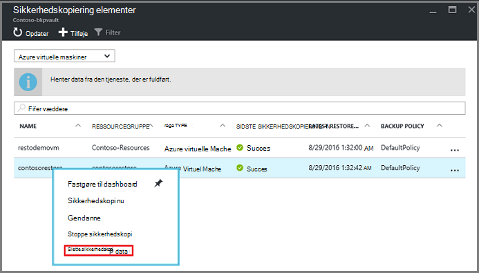

    Bladet **Slette sikkerhedskopiering af Data** åbnes.

2. Skriv navnet på elementet bladet **Slette Backup-Data** , og klik på **Slet**.

    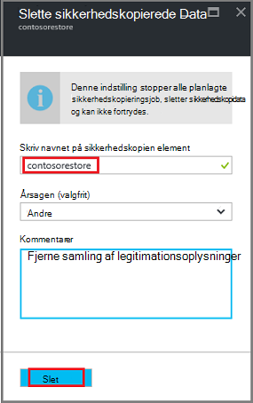

    Når du har slettet dataene, kan du gå til trin 4c ovenfor, og fortsætte med at.

## Slette en samling af legitimationsoplysninger bruges til at beskytte en DPM-server

Før du kan slette en samling af legitimationsoplysninger bruges til at beskytte en DPM-server, skal du Fjern eventuelle gendannelse point, der er oprettet, og derefter fjerne registreringen serveren fra samling af legitimationsoplysninger.

Sådan sletter du de data, der er knyttet til en beskyttelse gruppe:

1. I DPM-administratorkonsol, klik på **beskyttelse**, Vælg gruppen, beskyttelse, Markér gruppemedlem beskyttelse og i værktøjet båndet skal du klikke på **Fjern**. Du skal vælge medlemmet til knappen **Fjern** vises i værktøjet båndet. I eksemplet er medlemmet **dummyvm9**. Hvis der er flere medlemmer i gruppen beskyttelse skal du holde Ctrl-tasten til at vælge flere medlemmer.

    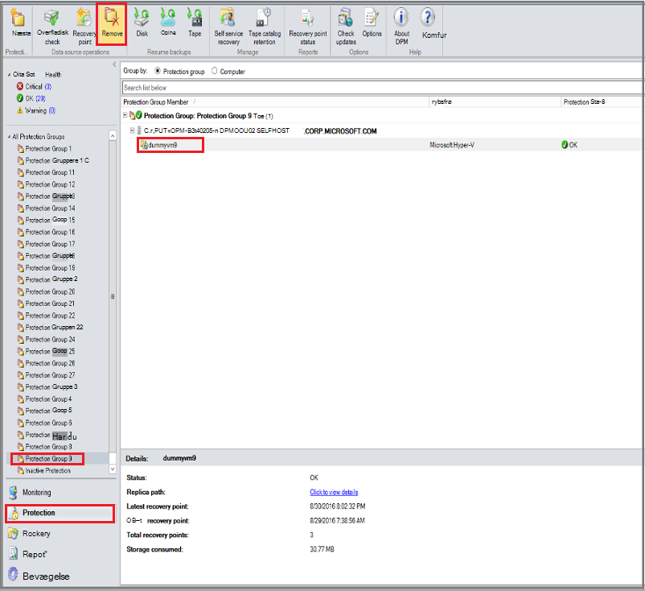

    Dialogboksen **Stop beskyttelse** åbnes.

2. Vælg **Slet beskyttet data**i dialogboksen **Stop beskyttelse** , og klik på **Stop beskyttelse**.

    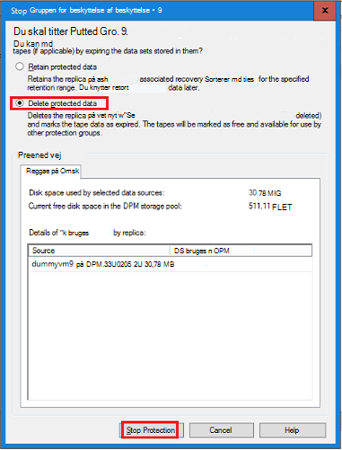

    Du vil ikke beholde beskyttede data, fordi du har brug at fjerne samling af legitimationsoplysninger for at slette den. Afhængigt af hvor mange gendannelse punkter, og hvor meget data er i gruppen beskyttelse, kan det tage et vilkårligt sted fra et par sekunder til et par minutter at slette dataene. Dialogboksen **Stop beskyttelse** viser status, når jobbet er fuldført.

    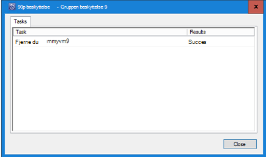

3. Fortsæt med denne proces for alle medlemmer i alle beskyttelse grupper.

    Du skal fjerne alle beskyttede data samt beskyttelse rullelisten.

4. Efter sletning alle medlemmer fra gruppen beskyttelse skal du skifte til portalen Azure. Åbn dashboardet samling, og Sørg for, at der er ingen **Sikkerhedskopi elementer**, **styring af sikkerhedskopi-servere**eller **replikeret elementer**. Klik på **Slet**på værktøjslinjen samling af legitimationsoplysninger.

    

    Hvis der er registreret til samling af legitimationsoplysninger sikkerhedskopi management servere, kan du ikke slette samling af legitimationsoplysninger, selvom der er ingen data i samling af legitimationsoplysninger. Hvis du tanker du har slettet de sikkerhedskopi management servere, der er knyttet til samling af legitimationsoplysninger, men der er stadig vises i ruden **Essentials** -servere, kan du se [finde de sikkerhedskopi management servere, der er registreret til samling af legitimationsoplysninger](backup-azure-delete-vault.md#find-the-backup-management-servers-registered-to-the-vault).

5. Klik på **Ja**, når du bliver bedt om at bekræfte, at du vil slette samling af legitimationsoplysninger.

    Samling af legitimationsoplysninger slettes, og portalen vender tilbage til menuen **Ny** tjeneste.

## Slette en samling af legitimationsoplysninger bruges til at beskytte en fremstilling server

Før du kan slette en samling af legitimationsoplysninger bruges til at beskytte en fremstilling server, skal du slette eller fjerne registreringen af serveren fra samling af legitimationsoplysninger.

Sådan slettes den fremstilling server, der er knyttet til samling af legitimationsoplysninger:

1. Åbn dashboardet samling af legitimationsoplysninger i portalen Azure, og klik på **Indstillinger** > **Sikkerhedskopi infrastruktur** > **Fremstilling servere**.

    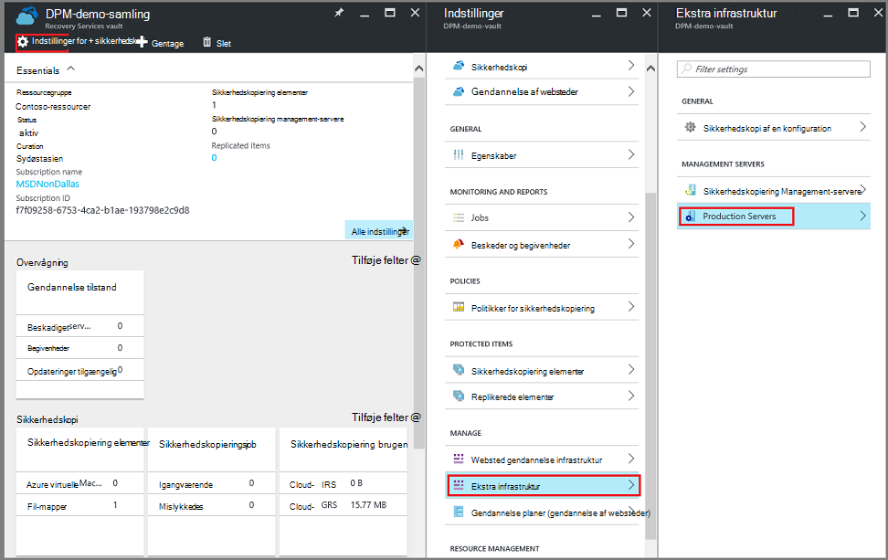

    Bladet **Fremstilling servere** åbnes og viser en liste over alle fremstilling servere i samling af legitimationsoplysninger.

    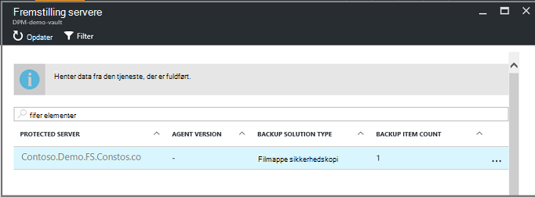

2. Højreklik på serveren på bladet **Fremstilling servere** , og klik på **Slet**.

    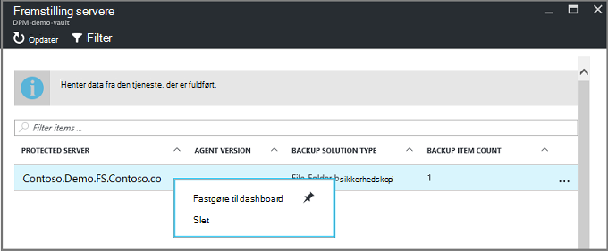

    Bladet **slette** åbnes.

    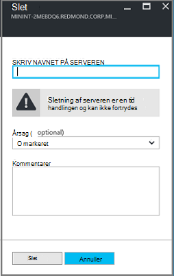

3. Bekræft navnet på serveren, slette, og klik på **Slet**på bladet **slette** . Korrekt skal du angive navnet på serveren for at aktivere knappen **Slet** .

    Når samling af legitimationsoplysninger er blevet slettet, modtager du en meddelelse om samling af legitimationsoplysninger er blevet slettet. Når du har slettet alle servere i samling af legitimationsoplysninger, Rul tilbage til ruden Essentials i dashboardet samling af legitimationsoplysninger.

4. Sørg for, at der er ingen **Sikkerhedskopi elementer**, **styring af sikkerhedskopi-servere**eller **replikeret elementer**i dashboardet samling af legitimationsoplysninger. Klik på **Slet**på værktøjslinjen samling af legitimationsoplysninger.

5. Klik på **Ja**, når du bliver bedt om at bekræfte, at du vil slette samling af legitimationsoplysninger.

    Samling af legitimationsoplysninger slettes, og portalen vender tilbage til menuen **Ny** tjeneste.

## Slette en sikkerhedskopi samling

Følgende instruktioner bruges til at slette en sikkerhedskopi samling af legitimationsoplysninger i portalen klassisk. En sikkerhedskopi samling og gendannelse Services samling er den samme: før du kan slette samling af legitimationsoplysninger, slette elementer og bevares data.

1. Åbn klassisk-portalen.

2. Vælg den samling, du vil slette, på listen over sikkerhedskopiering vaults.

    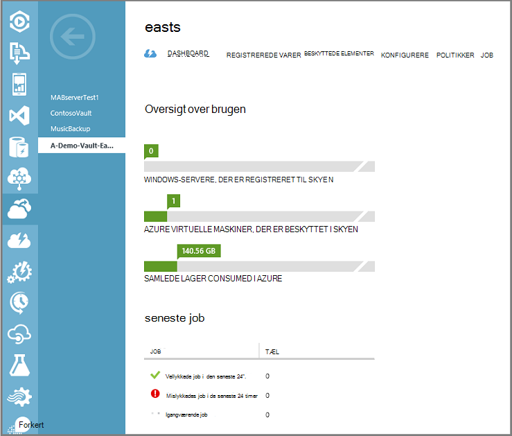

    Dashboardet samling åbnes. Se på antallet af Windows-servere og/eller Azure virtuelle maskiner, der er knyttet til samling af legitimationsoplysninger. Se også på den samlede lagerplads consumed i Azure. Du skal holde op med en hvilken som helst sikkerhedskopieringsjob og slette eksisterende data, før du sletter samling af legitimationsoplysninger.

3. Klik på fanen **Elementer, der er beskyttet** , og klik derefter på **Stop beskyttelse**

    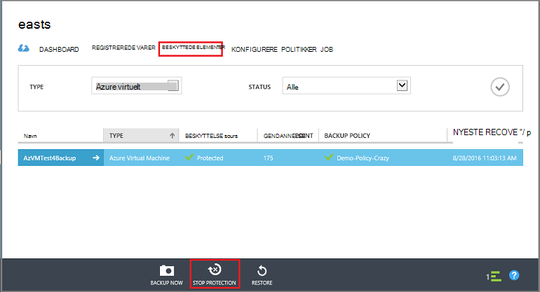

    Dialogboksen **Stop beskyttelse af 'din samling'** vises.

4. I dialogboksen **Stop beskyttelse af 'din samling'** kontrollere **slette tilknyttede sikkerhedskopidata** og klikke på .  
   Du kan eventuelt vælge en årsag til at stoppe beskyttelse, og giv en kommentar.

    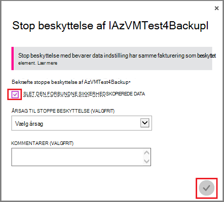

    Når du sletter elementer i samling af legitimationsoplysninger, vil samling af legitimationsoplysninger være tom.

    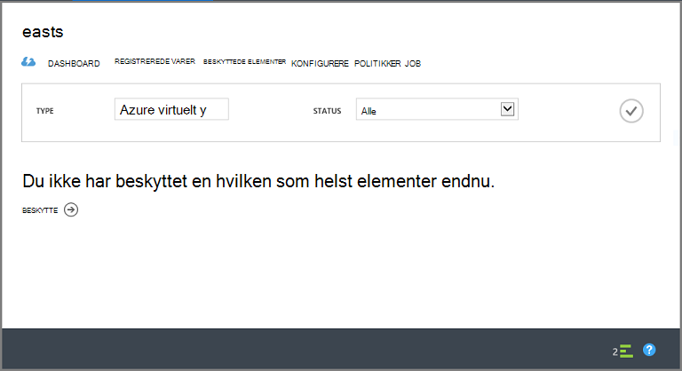

5. Klik på **Registered elementer**på listen over faner. Markér elementet, og på **fjernelse af registrering**for hvert element, der er registreret i samling af legitimationsoplysninger.

    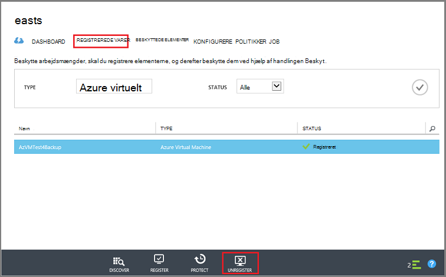

6. Klik på **Dashboard** for at åbne denne fane på listen over faner. Kontroller, der er ingen registrerede servere eller Azure virtuelle maskiner, der er beskyttet i skyen. Du skal også kontrollere der er ingen data i lagerplads. Klik på **Slet** for at slette samling af legitimationsoplysninger.

    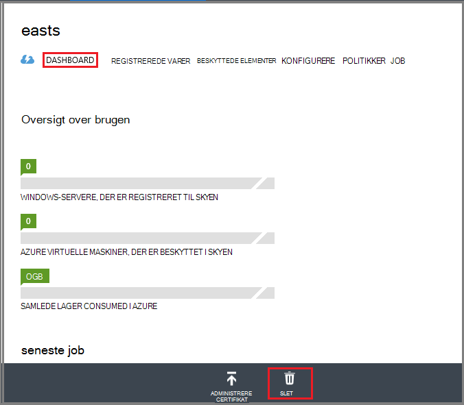

    Slette sikkerhedskopi samling bekræftelsessiden åbnes. Vælg en indstilling, hvorfor du sletter samling af legitimationsoplysninger, og klik på .  

    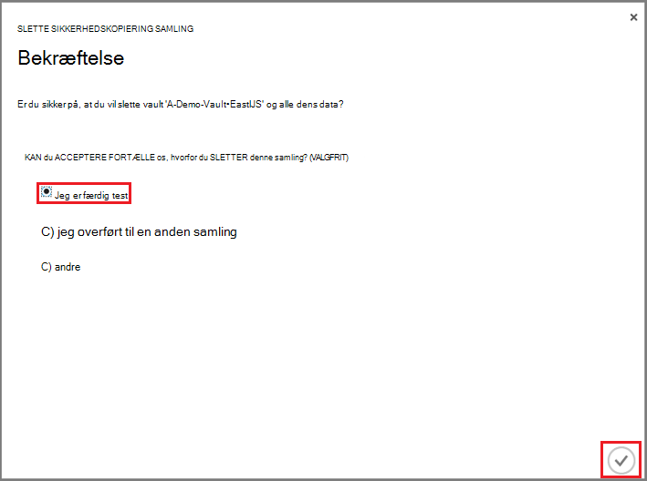

    Samling af legitimationsoplysninger slettes, og du vender tilbage til klassisk portalen dashboard.

### Finde de sikkerhedskopi Management-servere, der er registreret til samling af legitimationsoplysninger

Hvis du har flere servere, der er registreret til en samling af legitimationsoplysninger, kan det være svært at huske dem. At se de servere, der er registreret til samling af legitimationsoplysninger og slette dem:

1. Åbn dashboardet samling af legitimationsoplysninger.

2. Klik på **Indstillinger** for at åbne blade i ruden **Essentials** .

    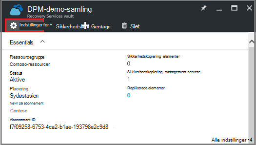

3. Klik på **Sikkerhedskopiér infrastruktur** **Indstillinger blade**.

4. Klik på **Styring af sikkerhedskopi-servere**på bladet **Sikkerhedskopi infrastruktur** . Styring af sikkerhedskopi-servere blade åbnes.

    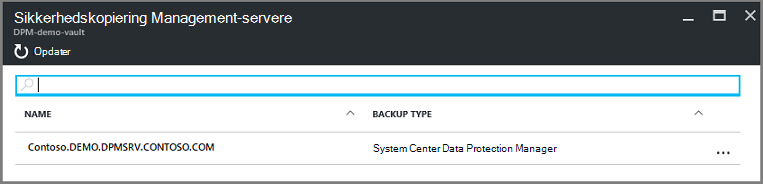

5. Slette en server fra listen, højreklik på navnet på serveren, og klik derefter på **Slet**.
    Bladet **slette** åbnes.

6. Angiv navnet på serveren på bladet **slette** . Hvis det er et langt navn, kan du kopiere og indsætte det på listen over styring af sikkerhedskopi-servere. Klik derefter på **Slet**.  
