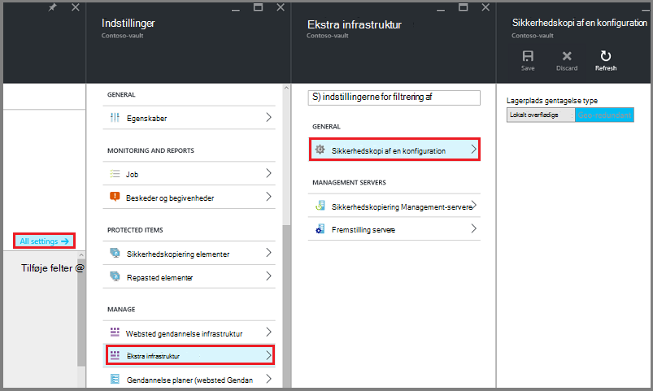

<properties
    pageTitle="Introduktion til Azure DPM sikkerhedskopi | Microsoft Azure"
    description="En introduktion til sikkerhedskopiering af DPM servere ved hjælp af tjenesten Azure sikkerhedskopi"
    services="backup"
    documentationCenter=""
    authors="Nkolli1"
    manager="shreeshd"
    editor=""
    keywords="System Center Data Protection Manager, beskyttelse datastyring, dpm sikkerhedskopi"/>

<tags
    ms.service="backup"
    ms.workload="storage-backup-recovery"
    ms.tgt_pltfrm="na"
    ms.devlang="na"
    ms.topic="article"
    ms.date="08/08/2016"
    ms.author="trinadhk;giridham;jimpark;markgal;adigan"/>

# Forberede at sikkerhedskopiere arbejdsbelastninger til Azure med DPM

> [AZURE.SELECTOR]
- [Server til Azure sikkerhedskopiering](backup-azure-microsoft-azure-backup.md)
- [SCDPM](backup-azure-dpm-introduction.md)
- [Azure Backup Server (klassisk)](backup-azure-microsoft-azure-backup-classic.md)
- [SCDPM (klassisk)](backup-azure-dpm-introduction-classic.md)

Denne artikel indeholder en introduktion til brug af Microsoft Azure Backup til at beskytte dine System Center Data Protection Manager (DPM) servere og arbejdsmængder. Ved at læse den, skal du forstår:

- Hvordan fungerer Azure DPM server sikkerhedskopi
- Forudsætninger for at opnå en jævn sikkerhedskopiering oplevelse
- Typisk fejl og hvordan du kan løse dem.
- Understøttede scenarier

> [AZURE.NOTE] Azure har to installation modeller til oprettelse og arbejde med ressourcer: [ressourcestyring og klassisk](../resource-manager-deployment-model.md). I denne artikel indeholder oplysninger og procedurer for at gendanne FOS installeres ved hjælp af Ressourcestyring modellen.

System Center DPM sikkerhedskopierer filer og programmet data. Data, der er sikkerhedskopieret til DPM kan være gemt på båndet, på disk, eller sikkerhedskopieret til Azure med Microsoft Azure sikkerhedskopiering. DPM skal arbejde sammen med Azure sikkerhedskopiering på følgende måde:

- **DPM installeres som en fysisk server eller en lokal virtuel maskine** – Hvis DPM installeres som en fysisk server eller en lokal Hyper-V virtuelt, kan du sikkerhedskopiere dataene til en samling af legitimationsoplysninger gendannelse Services ud over disk og bånd sikkerhedskopiering.
- **DPM installeres som en Azure virtuelt** – fra System Center 2012 R2 med Update 3 DPM kan installeres som en Azure virtuelt. Hvis DPM installeres som en Azure virtuelt, kan du sikkerhedskopiere dataene til Azure diske knyttet til den DPM Azure virtuelle maskine, eller du kan aflaste lagring af data ved at kopiere den op til en samling af legitimationsoplysninger gendannelsestjenester.

## Hvorfor Sikkerhedskopiér fra DPM til Azure?

Business fordelene ved at bruge Azure sikkerhedskopi til at sikkerhedskopiere DPM servere omfatter:

- Til lokale DPM installation, kan du bruge Azure som et alternativ til langsigtede installation på båndet.
- Til DPM installationer i Azure, Azure sikkerhedskopien kan du offload lagerplads fra Azure disken, så du kan skalere op ved at gemme ældre data i gendannelse Services samling og nye data på disken.

## Forudsætninger
Forberede Azure sikkerhedskopi til at sikkerhedskopiere DPM data på følgende måde:

1. **Opret en samling af legitimationsoplysninger gendannelsestjenester** – oprette en samling af legitimationsoplysninger i Azure portal.
2. **Hent samling legitimationsoplysninger** – Hent de legitimationsoplysninger, som du kan bruge til at registrere DPM serveren for at gendannelse Services samling.
3. **Installer Azure Backup Agent** – fra Azure sikkerhedskopi, skal du installere agenten på hver DPM-server.
4. **Registrere serveren** – Registrer DPM serveren for at gendannelse Services samling.

### 1. Opret en gendannelse services samling
Sådan oprettes en gendannelse services samling af legitimationsoplysninger:

1. Log på [Azure-portalen](https://portal.azure.com/).

2. Klik på **Gennemse** , og skriv **Gendannelsestjenester**på listen over ressourcer, i menuen Hub. Når du begynder at skrive, på listen filtrerer baseret på dit input. Klik på **tjenester til genoprettelse samling**.

    

    På listen over tjenester til genoprettelse vaults vises.

3. Klik på **Tilføj**i menuen **gendannelse Services vaults** .

    

    Gendannelse Services samling blade åbnes, beder dig om at angive et **navn**, **abonnement**, **ressourcegruppe**og **placering**.

    

4. Angiv et fuldt navn til at identificere samling af legitimationsoplysninger for **navn**. Navnet skal være entydige for Azure abonnementet. Skriv et navn, der indeholder mellem 2 og 50 tegn. Det skal starte med et bogstav og kan indeholde kun bogstaver, tal og bindestreger.

5. Klik på **abonnement** for at se den tilgængelige liste over abonnementer. Hvis du ikke er sikker på, hvilket abonnement, der skal bruges, brug standarden (eller forslag) abonnement. Der vil være flere valgmuligheder, kun, hvis din virksomhedskonto er knyttet til flere Azure abonnementer.

6. **Ressourcegruppe** for at se den tilgængelige liste over grupper, eller klik på **Ny** for at oprette en ny ressourcegruppe. Se [Oversigt over Azure ressourcestyring](../azure-resource-manager/resource-group-overview.md) detaljerede oplysninger om grupper

7. Klik på **placering** for at vælge det geografiske område for samling af legitimationsoplysninger.

8. Klik på **Opret**. Det kan tage et øjeblik, før den gendannelse Services samling af legitimationsoplysninger skal oprettes. Overvåge status meddelelserne i området øverst til højre på portalen.
Når din samling af legitimationsoplysninger er oprettet, åbnes den i portalen.

### Angive lagerplads gentagelse

Replikering datalager kan du vælge mellem geografisk overflødige lager og lokalt overflødige lagerplads. Som standard har din samling geografisk overflødige lagerplads. Lad indstillingen være angivet til geografisk overflødige lagerplads, hvis dette er den primære sikkerhedskopi. Vælg lokalt overflødige lagerplads, hvis du ønsker en billigere indstilling, der ikke er helt som robust. Få mere at vide om [geografisk overflødige](../storage/storage-redundancy.md#geo-redundant-storage) og [lokalt overflødige](../storage/storage-redundancy.md#locally-redundant-storage) indstillinger for lagring i [Azure-lager gentagelse oversigt](../storage/storage-redundancy.md).

Sådan redigerer du indstillingen lagerplads gentagelse:

1. Vælg din samling af legitimationsoplysninger til at åbne dashboardet samling af legitimationsoplysninger og bladet indstillinger. Hvis bladet **Indstillinger** ikke åbnes, skal du klikke på **alle indstillinger** i dashboardet samling af legitimationsoplysninger.

2. Bladet **Indstillinger** , klik på **Sikkerhedskopiér infrastruktur** > **Sikkerhedskopi konfiguration** til at åbne bladet **Sikkerhedskopi konfiguration** . Vælg gentagelse datalager til din samling på bladet **Sikkerhedskopi konfiguration** .

    

    Når du har valgt indstillingen lagerplads for dit samling, er du klar til at knytte VM til samling af legitimationsoplysninger. For at starte tilknytningen, skal du finde og registrere Azure virtuelle computere.

### 2. samling legitimationsoplysninger hentes

Filen samling legitimationsoplysninger er et certifikat, der genereres af portalen for hver ekstra samling. På portalen overfører derefter offentlig nøgle til Access ACS (Control Service). Privat nøgle for certifikatet, er gjort tilgængelig for brugeren som en del af arbejdsprocessen, som er angivet som input i arbejdsprocessen maskine registrering. Dette godkender computer for at sende backup-data til en identificerede samling i tjenesten Azure sikkerhedskopiering.

Samling af legitimationsoplysninger legitimationsoplysninger bruges kun under registrering arbejdsprocessen. Det er brugerens ansvaret for at sikre, at filen samling legitimationsoplysninger ikke er er blevet kompromitteret. Hvis den falder i hænder af enhver uautoriseret-bruger, kan filen samling legitimationsoplysninger bruges til at registrere andre computere mod den samme samling af legitimationsoplysninger. Blive dog som sikkerhedskopidataene er krypteret med en adgangskode, som hører til kunden, eksisterende sikkerhedskopierede data kan ikke afsløret. For at reducere disse bekymringer er samling legitimationsoplysningerne angivet til at udløbe i 48hrs. Du kan hente samling legitimationsoplysninger for en gendannelse services en hvilken som helst antal gange –, men kun den seneste samling legitimationsoplysninger fil er gældende under registrering arbejdsprocessen.

Filen samling legitimationsoplysninger hentes via en sikker kanal fra Azure-portalen. Tjenesten Azure sikkerhedskopi ikke kendskab til den private nøgle for certifikatet, og den private nøgle bevares ikke i portalen eller tjenesten. Brug følgende trin til at hente filen samling legitimationsoplysninger til en lokal computer.

1. Log på [Azure-portalen](https://portal.azure.com/).

2. Åbn gendannelse Services samling, som du vil registrere DPM computer.

3. Indstillinger for blade åbnes som standard. Hvis den er lukket, kan du klikke på **Indstillinger** på samling dashboard til at åbne bladet indstillinger. Klik på **Egenskaber**i indstillinger blade.

    

4. Klik på **Hent** under **Sikkerhedskopiering af legitimationsoplysninger**på siden Egenskaber. På portalen genererer filen samling legitimationsoplysninger, der er gjort tilgængelig til hentning.

    

På portalen genererer en samling af legitimationsoplysninger legitimationsoplysninger ved hjælp af en kombination af samling navn og den aktuelle dato. Klik på **Gem** for at hente samling legitimationsoplysningerne til den lokale konto overførsler mappe, eller Vælg Gem som i menuen Gem til at angive en placering til samling legitimationsoplysninger. Det kan tage op til et minut for den fil, der genereres.

### Bemærk!
- Sørg for, at samling legitimationsoplysninger filen er gemt på en placering, som kan åbnes fra din computer. Hvis den er gemt i en fil del/små og mellemstore virksomheder, søge efter adgangstilladelserne.
- Filen samling legitimationsoplysninger bruges kun under registrering arbejdsprocessen.
- Filen samling legitimationsoplysninger udløber efter 48hrs og kan hentes fra portalen.

### 3. Installer Backup Agent

Når du har oprettet samling af legitimationsoplysninger Azure sikkerhedskopi, skal være installeret en agent på hver af dine Windows-computere (Windows Server, Windows-klienten, System Center Data Protection Manager server eller servercomputeren Azure sikkerhedskopi), der gør det muligt for sikkerhedskopiering af data og programmer til Azure.

1. Åbn gendannelse Services samling, som du vil registrere DPM computer.

2. Indstillinger for blade åbnes som standard. Hvis den er lukket, klikke på **Indstillinger** for at åbne bladet indstillinger. Klik på **Egenskaber**i indstillinger blade.

    

3. Klik på **Hent** under **Azure Backup Agent**på siden Indstillinger.

    

   Når agenten er downloadet, skal du dobbeltklikke på MARSAgentInstaller.exe for at starte installationen af Azure Backup agent. Vælg mappen og arbejdsområ mappe, der kræves til agenten. Den angivne cacheplacering skal have ledig plads, som er mindst 5% af sikkerhedskopidataene.

4.  Hvis du bruger en proxyserver til at oprette forbindelse til internettet, på skærmbilledet **konfiguration af Proxy** skal du angive proxy server oplysninger. Hvis du bruger en godkendt proxy, angive brugernavn og en adgangskode oplysninger i dette skærmbillede.

5.  Azure Backup agent installeres .NET Framework 4.5 og Windows PowerShell (hvis det ikke er tilgængelige allerede) for at fuldføre installationen.

6.  Når agenten er installeret, **Luk** vinduet.

    

7. Klik på **Online**til at **registrere DPM-serveren** til samling i under fanen **rollestyring** . Vælg derefter **registrere**. Konfigurationsguiden registrere, åbnes.

8. Hvis du bruger en proxyserver til at oprette forbindelse til internettet, på skærmbilledet **konfiguration af Proxy** skal du angive proxy server oplysninger. Hvis du bruger en godkendt proxy, angive brugernavn og en adgangskode oplysninger i dette skærmbillede.

    

9. Gå til på skærmbilledet samling legitimationsoplysninger, og vælg filen samling legitimationsoplysninger som tidligere er blevet hentet.

    

    Filen samling legitimationsoplysninger gælder kun for 48 timer (efter at det er hentet fra portalen). Hvis du støder på en hvilken som helst fejl i dette skærmbillede (eksempelvis "samling legitimationsoplysninger angivne fil er udløbet"), log på Azure portalen og download samling legitimationsoplysningerne filen igen.

    Sørg for, at filen samling legitimationsoplysninger er tilgængelig på en placering, som kan åbnes ved at installationsprogrammet. Hvis du støder på få adgang til relaterede fejl, kopiere samling legitimationsoplysninger fil til en midlertidig placering på denne computer, og prøv igen.

    Hvis du støder på en ugyldig samling legitimationsoplysninger fejl (eksempelvis "ugyldige samling legitimationsoplysninger leveres") filen er beskadiget, eller der ikke har de seneste legitimationsoplysninger er knyttet til tjenesten gendannelse. Prøv derefter igen efter overførslen af en ny samling legitimationsoplysninger fil fra portalen. Denne fejl kan typisk ses, hvis brugeren klikker på indstillingen **Hent samling legitimationsoplysninger** i portalen Azure hurtigt efter hinanden. I dette tilfælde er kun den anden samling legitimationsoplysninger fil gyldig.

10. Du kan styre brugen af netværksbåndbredde under arbejde og ikke-arbejdstid, på skærmbilledet **(Throttling) indstilling** skal kan du angive begrænsninger for brugen af båndbredde og definere arbejdet og ikke arbejde timer.

    

11. Gå til den mappe, hvor de filer, der er hentet fra Azure midlertidigt skal gemmes midlertidigt på skærmbilledet **Gendannelse ved hjælp af indstillingen** .

    

12. På skærmbilledet **krypteringsindstilling** kan du oprette en adgangskode eller angive en adgangskode (mindst 16 tegn). Husk at gemme adgangskoden på et sikkert sted.

    

    > [AZURE.WARNING] Hvis adgangskoden er mistet eller glemt; Microsoft kan hjælpe med at gendanne sikkerhedskopidataene. Slutbrugerens ejer kryptering adgangskoden, og Microsoft har ikke indsigt i den adgangskode, der bruges af slutbrugeren. Gem filen i et sikkert sted, som det er nødvendigt under genoprettelse.

13. Når du klikker på knappen **Registrer** , maskinen er registreret til samling af legitimationsoplysninger, og du er nu klar til at starte Sikkerhedskopiering op til Microsoft Azure.

14. Når du bruger Data Protection Manager, kan du ændre de indstillinger, der er angivet under registrering arbejdsprocessen ved at klikke på indstillingen **Konfigurer** ved at vælge **Online** under **fanen** .

## Krav (og begrænsninger)

- DPM kan køre som en fysisk server eller en Hyper-V virtuel maskine, der er installeret på System Center 2012 SP1 eller System Center 2012 R2. Det kan også køre som en Azure virtuelt kører på System Center 2012 R2 med mindst DPM 2012 R2 opdateringspakke 3 eller en Windows virtuel maskine i VMWare, der kører på System Center 2012 R2 med mindst opdateringspakke 5.
- Hvis du kører DPM med System Center 2012 SP1 skal du installere opdateringen Brug 2 op til System Center Data Protection Manager SP1. Dette er påkrævet, før du kan installere Azure Backup Agent.
- DPM-serveren skal have Windows PowerShell og .net Framework 4.5 installeret.
- DPM kan sikkerhedskopiere arbejdsbelastninger, som de fleste til Azure sikkerhedskopi. En komplet liste over hvad er understøttet, se understøtter Azure sikkerhedskopien elementerne nedenfor.
- Data gemt i Azure sikkerhedskopi kan ikke gendannes med indstillingen "kopi på bånd".
- Du skal bruge en Azure-konto med funktionen Azure sikkerhedskopi er aktiveret. Hvis du ikke har en konto, kan du oprette en gratis prøveversion konto på blot et par minutter. Læs mere om [Azure sikkerhedskopi priser](https://azure.microsoft.com/pricing/details/backup/).
- Azure sikkerhedskopiering kræver Azure Backup Agent skal være installeret på de servere, du vil sikkerhedskopiere. Hver server skal have mindst 5% af størrelsen på de data, der sikkerhedskopieres, tilgængelig som lokale gratis lagerplads. For eksempel kræver sikkerhedskopiere 100 GB af data et minimum af 5 GB ledig plads på arbejdsområ placering.
- Data gemmes i Azure samling lagerplads. Der er ingen grænse for mængden data, du kan tilbage til en sikkerhedskopi af Azure vault, men størrelsen på en datakilde (for eksempel en virtuel computer eller database) må overstige 54400 GB.

Disse filtyper understøttes til tilbage til Azure:

- Krypteret (kun fuld sikkerhedskopier)
- Komprimeret (trinvise sikkerhedskopier understøttes)
- Sparse (trinvise sikkerhedskopier understøttes)
- Komprimeret og sparse (behandlet som Sparse)

Og det er ikke-understøttede:

- Servere på store og små bogstaver filsystemet understøttes ikke.
- Hårde links (sprunget over)
- Genfortolkningspunkter punkter (sprunget over)
- Krypteret og komprimeret (sprunget over)
- Krypteret og sparse (ignoreret)
- Komprimeret værdistrøm
- Sparse værdistrøm

>[AZURE.NOTE] Fra i System Center 2012 DPM med SP1 og derefter kan du sikkerhedskopiere op arbejdsbelastninger, som er beskyttet af DPM til Azure ved hjælp af Microsoft Azure sikkerhedskopiering.
