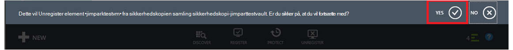

<properties
    pageTitle="Administrere og overvåge Azure virtuel machine-sikkerhedskopiering | Microsoft Azure"
    description="Lær at administrere og overvåge en Azure virtuel machine-sikkerhedskopiering"
    services="backup"
    documentationCenter=""
    authors="trinadhk"
    manager="shreeshd"
    editor=""/>

<tags
    ms.service="backup"
    ms.workload="storage-backup-recovery"
    ms.tgt_pltfrm="na"
    ms.devlang="na"
    ms.topic="article"
    ms.date="08/31/2016"
    ms.author="trinadhk; jimpark; markgal;"/>

# <a name="manage-and-monitor-azure-virtual-machine-backups"></a>Administrere og overvåge Azure virtuel machine-sikkerhedskopiering

> [AZURE.SELECTOR]
- [Administrere Azure VM sikkerhedskopier](backup-azure-manage-vms.md)
- [Administrere klassisk VM sikkerhedskopier](backup-azure-manage-vms-classic.md)

I denne artikel indeholder oplysninger om almindelige administration og overvågning opgaver til modellen Klassisk virtuelle maskiner beskyttet i Azure.  

>[AZURE.NOTE] Azure har to installation modeller til oprettelse og arbejde med ressourcer: [ressourcestyring og klassisk](../resource-manager-deployment-model.md). Du kan finde oplysninger om at arbejde med klassisk implementeringsmodel FOS i [forberede dit miljø til at sikkerhedskopiere Azure virtuelle maskiner](backup-azure-vms-prepare.md) .

## <a name="manage-protected-virtual-machines"></a>Administrere beskyttet virtuelle maskiner

Sådan administreres beskyttet virtuelle maskiner:

1. Klik på fanen **Beskyttet elementer** for at få vist og administrere indstillinger for sikkerhedskopiering for en virtuel maskine.

2. Klik på navnet på et beskyttet element for at se fanen **Detaljer om sikkerhedskopi** , som viser oplysninger om den seneste sikkerhedskopi.

    

3. Klik på fanen **politikker** for at få vist og administrere sikkerhedskopiering politik indstillingerne for en virtuel maskine.

    

    Fanen **Sikkerhedskopi politikker** viser den eksisterende politik. Du kan ændre efter behov. Hvis du vil oprette en ny politik skal du klikke på **Opret** på siden **politikker** . Bemærk, at hvis du vil fjerne en politik ikke bør det have en hvilken som helst virtuelle maskiner, der er knyttet til den.

    

4. Du kan få flere oplysninger om handlinger eller status for en virtuel maskine på siden **job** . Klik på et job på listen for at få mere at vide om, eller filtrere job for en bestemt virtuel maskine.

    

## <a name="on-demand-backup-of-a-virtual-machine"></a>Efter behov sikkerhedskopi af en virtuel maskine
Du kan tage et efter behov sikkerhedskopiering af en virtuel maskine, når den er konfigureret til beskyttelse. Hvis den første sikkerhedskopi er godkendt til den virtuelle maskine, efter behov Sikkerhedskopiering opretter en fuldstændig kopi af den virtuelle maskine i Azure sikkerhedskopiering samling. Hvis første sikkerhedskopi er afsluttet, er efter behov sikkerhedskopiering er kun send ændringer fra tidligere sikkerhedskopi Azure sikkerhedskopi vault det vil sige det altid stigende.

>[AZURE.NOTE] Opbevaring område af en sikkerhedskopi af efter behov er indstillet til opbevaring værdi, der er angivet for daglige opbevaring i sikkerhedskopiering politik, der svarer til VM.  

Tage en efter behov sikkerhedskopiering af en virtuel maskine:

1. Gå til siden **Beskyttet elementer** , og vælg **Azure virtuelt** **Filtype** (hvis det ikke allerede er valgt), og klik på **Vælg** knappen.

    

2. Vælg den virtuelle maskine, som du vil tage et efter behov sikkerhedskopien, og klik på knappen **Sikkerhedskopiering nu** nederst på siden.

    

    Dette vil oprette en sikkerhedskopi på den valgte virtuelle maskine. Opbevaring celleområde gendannelsespunkt, der er oprettet ved hjælp af dette job vil være samme, der er anført i den politik, der er knyttet til den virtuelle maskine.

    

    >[AZURE.NOTE] Analysere ned i virtuelt **Beskyttede elementer** på siden for at få vist den politik, der er knyttet til en virtuel maskine, og gå til fanen Sikkerhedskopiering Gruppepolitik.

3. Når jobbet er oprettet, kan du klikke på knappen **periode** i toast linjen for at se tilsvarende jobbet job på siden.

    

4. Når du har fuldført på sag oprettes et gendannelsespunkt som du kan bruge til at gendanne den virtuelle maskine. Dette vil også forøges værdien gendannelse punkt kolonne med 1 **Beskyttede elementer** på siden.

## <a name="stop-protecting-virtual-machines"></a>Fjerne beskyttelsen af virtuelle maskiner
Du kan vælge at stoppe med at de fremtidige sikkerhedskopier af en virtuel maskine med følgende indstillinger:

- Bevare sikkerhedskopidata, der er knyttet til virtuel maskine i Azure sikkerhedskopiering samling
- Slette sikkerhedskopidata, der er knyttet til virtuelt

Hvis du har valgt for at bevare sikkerhedskopidata, der er knyttet til virtuel maskine, kan du bruge backup-data til at gendanne den virtuelle maskine. Priser oplysninger om disse virtuelle maskiner, ved at klikke [her](https://azure.microsoft.com/pricing/details/backup/).

Sådan stopper du beskyttelse til en virtuel maskine:

1. Gå til siden **Beskyttet varer** , og vælg **Azure virtuelt** som filter (hvis det ikke allerede er valgt), og klik på **Vælg** knappen.

    

2. Vælg den virtuelle maskine, og klik på **Stop beskyttelse** nederst på siden.

    

3. Som standard slette Azure sikkerhedskopiering ikke de sikkerhedskopierede data, der er knyttet til den virtuelle maskine.

    

    Hvis du vil slette sikkerhedskopidata, skal du markere afkrydsningsfeltet.

    

    Vælg en årsag til at stoppe sikkerhedskopien. Mens dette er valgfrit, hjælpe at angive en grund Azure sikkerhedskopi til at arbejde på feedbacken og prioritere kundescenarier.

4. Klik på **Send** for at sende jobbet **Stop beskyttelse** . Klik på **Vis Job** at se de tilsvarende jobbet **job** på siden.

    

    Hvis du ikke har valgt **slette tilknyttede sikkerhedskopidata** indstilling under **Stop beskyttelse** guiden, og klik derefter indlæg job fuldførelse, ændres beskyttelsesstatus til **Beskyttelse stoppet**. Dataene bliver med Azure sikkerhedskopiering, indtil det udtrykkeligt er slettet. Du kan altid slette dataene ved at markere den virtuelle maskine **Beskyttede elementer** på siden og klikke på **Slet**.

    

    Hvis du har valgt indstillingen **Slet tilknyttede sikkerhedskopidata** , den virtuelle maskine ikke en del af siden **Beskyttede elementer** .

## <a name="re-protect-virtual-machine"></a>Beskytte virtuelt igen
Hvis du ikke har valgt indstillingen **Slet knytte sikkerhedskopidata** i **Stop beskyttelse**, kan du beskytte den virtuelle maskine igen ved at følge trinnene ligner sikkerhedskopiere registrerede virtuelle maskiner. Når beskyttet, har denne virtuelt sikkerhedskopidata bevares før stop beskyttelse og gendannelse punkter oprettet efter Beskyt igen.

Efter at beskytte ændres den virtuelle maskine beskyttelsesstatus til **beskyttet** , hvis der er gendannelse punkter før **Stop beskyttelse**.

  

>[AZURE.NOTE] Når du igen beskytter den virtuelle maskine, kan du vælge en anden politik end politikken, som blev virtuelt indledningsvis beskyttet.

## <a name="unregister-virtual-machines"></a>Unregister virtuelle maskiner

Hvis du vil fjerne den virtuelle maskine fra sikkerhedskopien samling:

1. Klik på knappen **fjerner registreringen af** nederst på siden.

    

    En toastbeskeden vises nederst i skærmbilledet bedt om at bekræfte. Klik på **Ja** for at fortsætte.

    

## <a name="delete-backup-data"></a>Slette Backup-data
Du kan slette de sikkerhedskopierede data, der er knyttet til en virtuel maskine, enten:

- Under Stop beskyttelse Job
- Når du har en stop beskyttelse er job fuldført på en virtuel maskine

Hvis du vil slette sende sikkerhedskopierede data på en virtuel maskine, som er i tilstanden *Beskyttelse stoppet* vellykket gennemførelse af et **Stop** sikkerhedskopieringsjob:

1. Gå til siden **Beskyttet elementer** og vælg **Azure virtuelt** *Filtype* , og klik på knappen **Vælg** .

    

2. Vælg den virtuelle maskine. Den virtuelle maskine bliver i **Beskyttelse stoppet** tilstand.

    

3. Klik på knappen **Slet** nederst på siden.

    

4. Vælg en årsag til at slette sikkerhedskopidata (anbefales kraftigt) guiden **Slet sikkerhedskopidata** , og klik på **Send**.

    

5. Dette vil oprette et job for at slette sikkerhedskopidata på markerede virtuelle maskine. Klik på **periode** for at se tilsvarende job job på siden.

    

    Når jobbet er fuldført, fjernes det element, der svarer til den virtuelle maskine fra **beskyttet elementer** side.

## <a name="dashboard"></a>Dashboard
På siden **Dashboard** kan du gennemgå oplysninger om Azure virtuelle maskiner, lager og job, der er knyttet til dem i de seneste 24 timer. Du kan få vist status for sikkerhedskopiering og tilknyttede sikkerhedskopiering fejl.


>[AZURE.NOTE] Værdier i dashboardet opdateres én gang i døgnet.

## <a name="auditing-operations"></a>Overvågning handlinger
Azure sikkerhedskopiering viser gennemgang af "Handlingen loggene" af sikkerhedskopiering udløses af kunden, hvilket gør det nemt at se nøjagtigt hvilke management handlinger er udført på den ekstra samling af legitimationsoplysninger. Handlinger logfiler aktivere gode indlæg syn og overvåge support for sikkerhedskopiering handlinger.

Følgende handlinger registreres i handlingen logfiler:

- Registrer
- Unregister
- Konfigurere beskyttelse
- Sikkerhedskopi (begge planlagt samt efter behov backup via BackupNow)
- Gendanne
- Stop beskyttelse
- Slette sikkerhedskopierede data
- Tilføje politik
- Slette politik
- Opdater politik
- Annullere job

For at få vist handlingen logfører svarer til en sikkerhedskopi samling af legitimationsoplysninger:

1. Gå til **Management services** Azure-portalen, og klik derefter på fanen **Handlingen logføring** .

    

2. Vælg **Sikkerhedskopiering** *Filtype* i filtre, og Angiv navnet på sikkerhedskopien samling i *tjenestenavnet* , og klik på **Send**.

    

3. Vælg en hvilken som helst operation loggene handlinger, og klik på **Detaljer** for at se oplysninger, der svarer til en handling.

    

    **Oplysninger om guiden** indeholder oplysninger om handlingen udløste, job-Id, ressource, som denne handling udløses og starttidspunktet for handlingen.

    

## <a name="alert-notifications"></a>Påmindelser
Du kan få brugerdefinerede påmindelser for job i portalen. Dette opnås ved at definere PowerShell-baserede regler for påmindelser på funktionsdygtige logfører hændelser. Det anbefales at bruge *PowerShell version 1.3.0 eller nyere*.

Hvis du vil angive en brugerdefineret meddelelse om at give besked om for at finde sikkerhedskopien fejl, ser en eksempel-kommando sådan ud:

```
PS C:\> $actionEmail = New-AzureRmAlertRuleEmail -CustomEmail contoso@microsoft.com
PS C:\> Add-AzureRmLogAlertRule -Name backupFailedAlert -Location "East US" -ResourceGroup RecoveryServices-DP2RCXUGWS3MLJF4LKPI3A3OMJ2DI4SRJK6HIJH22HFIHZVVELRQ-East-US -OperationName Microsoft.Backup/backupVault/Backup -Status Failed -TargetResourceId /subscriptions/86eeac34-eth9a-4de3-84db-7a27d121967e/resourceGroups/RecoveryServices-DP2RCXUGWS3MLJF4LKPI3A3OMJ2DI4SRJK6HIJH22HFIHZVVELRQ-East-US/providers/microsoft.backupbvtd2/BackupVault/trinadhVault -Actions $actionEmail
```

**ResourceId**: Du kan finde dette via pop op-handlinger logfiler, som beskrevet i ovenstående afsnit. ResourceUri i detaljer pop op-vinduet for en handling er ResourceId der skal gives for denne cmdlet.

**OperationName**: Dette er med formatet "Microsoft.Backup/backupvault/<EventName>" hvor EventName er en af Register, fjernelse af registrering, ConfigureProtection, sikkerhedskopiere, gendanne, StopProtection, DeleteBackupData, CreateProtectionPolicy, DeleteProtectionPolicy, UpdateProtectionPolicy

**Status**: understøttede værdier er startet, lykkedes og mislykkedes.

**ResourceGroup**: ResourceGroup på den ressource, som handlingen udløses. Du kan hente det fra ResourceId værdi. Værdien mellem felter */resourceGroups/* og */providers/* i ResourceId værdi er værdien for ResourceGroup.

**Navn**: navnet på reglen.

**CustomEmail**: angive den brugerdefinerede mailadresse, du vil sende beskeder om meddelelser

**SendToServiceOwners**: denne indstilling sendes beskeder om meddelelse til alle administratorer og medadministratorer af abonnementet. Det kan bruges i **Ny AzureRmAlertRuleEmail** cmdlet

### <a name="limitations-on-alerts"></a>Begrænsninger for beskeder
Begivenhed-baserede beskeder at der foretages følgende begrænsninger:

1. Påmindelser udløses på alle virtuelle maskiner i den ekstra samling af legitimationsoplysninger. Du kan tilpasse den for at få beskeder om bestemte virtuelle maskiner i en ekstra samling af legitimationsoplysninger.
2. Denne funktion er i Vis udskrift. [Lær mere](../monitoring-and-diagnostics/insights-powershell-samples.md#create-alert-rules)
3. Du modtager vigtige beskeder fra "alerts-noreply@mail.windowsazure.com". I øjeblikket kan du ændre mail afsenderen.

## <a name="next-steps"></a>Næste trin

- [Gendanne Azure FOS](backup-azure-restore-vms.md)
