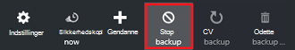

<properties
    pageTitle="Administrere ressourcestyring installeret virtuel machine-sikkerhedskopiering | Microsoft Azure"
    description="Lær at administrere og overvåge ressourcestyring installeret virtuel machine-sikkerhedskopiering"
    services="backup"
    documentationCenter=""
    authors="trinadhk"
    manager="shreeshd"
    editor=""/>

<tags
    ms.service="backup"
    ms.workload="storage-backup-recovery"
    ms.tgt_pltfrm="na"
    ms.devlang="na"
    ms.topic="article"
    ms.date="08/11/2016"
    ms.author="jimpark; markgal; trinadhk"/>

# Administrere Azure virtuel machine-sikkerhedskopiering

> [AZURE.SELECTOR]
- [Administrere Azure VM sikkerhedskopier](backup-azure-manage-vms.md)
- [Administrere klassisk VM sikkerhedskopier](backup-azure-manage-vms-classic.md)

I denne artikel giver vejledning om administration af VM sikkerhedskopier og logfil for hver ekstra beskeder tilgængelig i dashboardet til portalen. Vejledning i denne artikel gælder for brug af FOS med gendannelse Services vaults. I denne artikel omhandler ikke oprettelse af virtuelle maskiner, og ikke indeholder det beskriver, hvordan du beskytter virtuelle maskiner. Grundlæggende om at beskytte Azure ressourcestyring installeret FOS i Azure med en samling af legitimationsoplysninger gendannelse Services, se [først se: sikkerhedskopiere FOS til en samling af legitimationsoplysninger gendannelse Services](backup-azure-vms-first-look-arm.md).

## Administrere vaults og beskyttet virtuelle maskiner

Gendannelse Services samling dashboardet giver adgang til oplysninger om tilføjelse af samling i Azure-portalen:

- den seneste sikkerhedskopiering øjebliksbillede, der også er det seneste gendannelsespunkt < br\>
- politikken sikkerhedskopiering < br\>
- Samlet størrelse af alle sikkerhedskopiering snapshots < br\>
- antal virtuelle maskiner, der er beskyttet med samling af legitimationsoplysninger < br\>

Mange administrationsopgaver med et virtuelt sikkerhedskopiering begynde med at åbne samling af legitimationsoplysninger i dashboardet. Men fordi vaults kan bruges til at beskytte flere elementer (eller flere FOS), hvis du vil se detaljer om en bestemt VM, åbne dashboardet samling element. Følgende procedure viser, hvordan til at åbne *samling dashboard* og derefter fortsætte med at *samling element dashboard*. Der er "Tip" i begge fremgangsmåder, der peger ud af, hvordan du tilføjer samling af legitimationsoplysninger og samling element til Azure dashboard ved hjælp af Fastgør til dashboard kommandoen. Fastgør til dashboard er en måde at oprette en genvej til samling af legitimationsoplysninger eller emne. Du kan også udføre almindelige kommandoer fra genvejen.

>[AZURE.TIP] Hvis du har flere dashboards og blade åbner, kan du bruge skyderen mørkeblå nederst i vinduet til slide Azure dashboardet frem og tilbage.

### Åbn en samling af legitimationsoplysninger gendannelsestjenester i dashboardet:

1. Log på [Azure-portalen](https://portal.azure.com/).

2. Klik på **Gennemse** , og skriv **Gendannelsestjenester**på listen over ressourcer, i menuen Hub. Når du begynder at skrive, filtrene liste baseret på dit input. Klik på **tjenester til genoprettelse samling**.

      

    På listen over tjenester til genoprettelse vaults vises.

      

    >[AZURE.TIP] Hvis du fastgøre en samling af legitimationsoplysninger til Azure Dashboard, er samlingen tilgængelig med det samme, når du åbner Azure portalen. Hvis du vil fastgøre en samling af legitimationsoplysninger til dashboard, på listen samling, skal du højreklikke på samling af legitimationsoplysninger, og vælg **Fastgør til dashboard**.

3. På listen over vaults, Vælg samling af legitimationsoplysninger til at åbne dets dashboard. Når du vælger samling af legitimationsoplysninger, Åbn dashboardet samling af legitimationsoplysninger og bladet **Indstillinger** . I det følgende billede er fremhævet dashboardet for **Contoso-samling** .

    

### Åbne en samling af legitimationsoplysninger element dashboard

Du har åbnet samling dashboard i den foregående fremgangsmåde. Sådan åbnes dashboardet samling element:

1. Klik på **virtuelle Azure-computere**i dashboardet til samling, i feltet **Sikkerhedskopiér elementer** .

    

    Bladet **Sikkerhedskopiering elementer** viser den sidste sikkerhedskopiering for hvert element. I dette eksempel er der en virtuel maskine, demovm-markgal beskyttet af denne samling af legitimationsoplysninger.  

    

    >[AZURE.TIP] Til Øget tilgængelighed, kan du fastgøre en samling af legitimationsoplysninger element til Azure Dashboard. Hvis du vil fastgøre en samling af legitimationsoplysninger element på listen samling element, skal du højreklikke på elementet, og vælg **Fastgør til dashboard**.

2. Klik på elementet for at åbne dashboardet samling element i bladet **Sikkerhedskopi elementer** .

    

    Dashboardet samling element og dens **Indstillinger** blade åbne.

    

    Samling element dashboard kan du udføre mange vigtige administrationsopgaver, f.eks.:

    - ændre politikker eller oprette en ny politik for sikkerhedskopiering < br\>
    - få vist gendannelsespunkter, og se deres konsistens tilstand < br\>
    - efter behov sikkerhedskopi af en virtuel maskine < br\>
    - fjerne beskyttelsen af virtuelle maskiner < br\>
    - genoptage beskyttelse af en virtuel maskine < br\>
    - slette en backup-data (eller gendannelsespunkt) < br\>
    - [gendanne en sikkerhedskopi (eller gendannelsespunkt)](./backup-azure-arm-restore-vms.md#restore-a-recovery-point) < br\>

For følgende procedurer er udgangspunktet dashboardet samling element.

## Administrere politikker for sikkerhedskopiering

1. Klik på **Alle indstillinger** for at åbne bladet **Indstillinger** på [samling element dashboard](backup-azure-manage-vms.md#open-a-vault-item-dashboard).

    

2. Klik på **Sikkerhedskopiér politik** for at åbne blade bladet **Indstillinger** .

    På bladet vises sikkerhedskopiering frekvens og opbevaring område oplysninger.

    

3. I menuen **Vælg sikkerhedskopiering politik** :
    - Vælg en anden politik for at ændre politikker, og klik på **Gem**. Den nye politik er øjeblikkeligt bliver anvendt i samling af legitimationsoplysninger. < br\>
    - For at oprette en politik, skal du vælge **Opret ny**.

    

    Flere oplysninger om oprettelse af en politik for sikkerhedskopiering, under [definere en politik for en sikkerhedskopi](backup-azure-manage-vms.md#defining-a-backup-policy).

[AZURE.INCLUDE [backup-create-backup-policy-for-vm](../../includes/backup-create-backup-policy-for-vm.md)]

## Efter behov sikkerhedskopi af en virtuel maskine
Du kan tage et efter behov sikkerhedskopiering af en virtuel maskine, når den er konfigureret til beskyttelse. Hvis den første sikkerhedskopi er ventende, opretter efter behov sikkerhedskopi en fuldstændig kopi af den virtuelle maskine i samling af legitimationsoplysninger gendannelsestjenester. Hvis den første sikkerhedskopi er afsluttet, vil en sikkerhedskopi af efter behov kun sende ændringer fra det foregående snapshot til gendannelse Services samling. Det vil sige, er efterfølgende sikkerhedskopier altid stigende.

>[AZURE.NOTE] Opbevaring område til en sikkerhedskopi efter behov er den værdi for opbevaring, der er angivet for den daglige sikkerhedskopiering punkt i politikken. Hvis ingen daglig sikkerhedskopiering punkt er markeret, bruges det ugentlige sikkerhedskopiering punkt.

Udløse en efter behov sikkerhedskopiering af en virtuel maskine:

- Klik på [samling element dashboard](backup-azure-manage-vms.md#open-a-vault-item-dashboard) **sikkerhedskopi nu**.

    

    På portalen sikrer, at, som du vil starte en sikkerhedskopieringsjob efter behov. Klik på **Ja** for at starte sikkerhedskopieringen.

    

    Den Sikkerhedskopiering opretter et gendannelsespunkt. Området opbevaring af punktet gendannelse er den samme som opbevaring område, der er angivet i den politik, der er knyttet til den virtuelle maskine. Klik på feltet **Sikkerhedskopi Jobs** for at få vist status for sagen, i dashboardet samling af legitimationsoplysninger.  

## Fjerne beskyttelsen af virtuelle maskiner
Hvis du vælger at fjerne beskyttelsen af en virtuel maskine, bliver du spurgt, hvis du vil bevare de gendannelse punkter. Der er to måder at fjerne beskyttelsen af virtuelle maskiner:
- stoppe alle fremtidige sikkerhedskopieringsjob og slette alle gendannelse punkter eller
- stoppe alle fremtidige sikkerhedskopieringsjob, men lade gendannelse punkter  

Der findes en omkostning, der er knyttet til bibeholder den gendannelse for peger på lagerplads. Fordelen ved at forlade gendannelse punkter er dog kan du gendanne den virtuelle maskine senere, hvis du ønsker. Finde oplysninger om omkostninger for at forlade gendannelse punkter, [priser detaljer](https://azure.microsoft.com/pricing/details/backup/). Hvis du vælger at slette alle gendannelse punkter, kan du ikke gendanne den virtuelle maskine.

Sådan stopper du beskyttelse til en virtuel maskine:

1. Klik på **Stop sikkerhedskopi**på [samling element dashboard](backup-azure-manage-vms.md#open-a-vault-item-dashboard).

    

    Stoppe sikkerhedskopi blade åbnes.

    

2. Vælge, om du vil beholde eller slette sikkerhedskopidataene på bladet **Stoppe sikkerhedskopiering** . Feltet oplysninger indeholder oplysninger om dine valg.

    

3. Hvis du vælger at bevare de sikkerhedskopierede data, kan du gå videre til trin 4. Skriv navnet på elementet, hvis du vælger at slette sikkerhedskopidata, skal du bekræfte, at du vil stoppe de sikkerhedskopieringsjob og slette de gendannelse punkter.

    

    Hvis du ikke er sikker på elementnavnet, hold markøren over udråbstegn til at få vist navnet. Navnet på elementet er også under **Stoppe sikkerhedskopi** øverst i bladet.

4. Du kan også angive en **årsag** eller **kommentar**.

5. Hvis du vil stoppe sikkerhedskopieringsjob for den aktuelle vare, skal du klikke på  

    En meddelelse fortæller, sikkerhedskopiering job er stoppet.

    

## Genoptag beskyttelse af en virtuel maskine
Hvis indstillingen **Bevar sikkerhedskopiering af Data** blev valgt under beskyttelse til den virtuelle maskine stoppede, er det muligt at genoptage beskyttelse. Hvis indstillingen **Slet sikkerhedskopiering af Data** er valgt, kan ikke beskyttelse til den virtuelle maskine CV.

Fortsætte med at beskyttelse til den virtuelle maskine

1. Klik på **CV sikkerhedskopi** [samling element dashboard](backup-azure-manage-vms.md#open-a-vault-item-dashboard).

    

    Bladet sikkerhedskopi politik åbnes.

    >[AZURE.NOTE] Når du igen beskytter den virtuelle maskine, kan du vælge en anden politik end politikken, som blev virtuelt indledningsvis beskyttet.

2. Følg trinnene i [ændre politikker eller Opret en ny politik for sikkerhedskopiering](backup-azure-manage-vms.md#change-policies-or-create-a-new-backup-policy), hvis du vil tildele en politik til den virtuelle maskine.

    Når sikkerhedskopiering politikken anvendes på den virtuelle maskine, kan du få vist følgende meddelelse.

    

## Slette Backup-data
Du kan slette de sikkerhedskopierede data, der er knyttet til en virtuel maskine under kørslen **stoppe sikkerhedskopi** , eller når som helst efter sikkerhedskopien jobbet er fuldført. Det kan være også være en fordel at vente dage eller uger, før du kan slette de gendannelse punkter. I modsætning til gendannelse gendannelse punkter, når du sletter backup-data, kan ikke du vælge bestemte gendannelse peger på Slet. Hvis du vælger at slette de sikkerhedskopierede data, kan du slette alle gendannelse punkter, der er knyttet til elementet.

Følgende fremgangsmåde forudsætter sikkerhedskopi sagen for den virtuelle maskine er stoppet eller deaktiveret. Når kørslen sikkerhedskopi er deaktiveret, findes indstillingerne til at **genoptage sikkerhedskopiering** og **slette sikkerhedskopi** i dashboardet samling element.

Sådan sletter du sikkerhedskopiere data på en virtuel maskine med den *sikkerhedskopi deaktiveret*:

1. Klik på **Slet sikkerhedskopi**på [samling element dashboard](backup-azure-manage-vms.md#open-a-vault-item-dashboard).

    

    Bladet **Slette sikkerhedskopiering af Data** åbnes.

    

2. Skriv navnet på elementet for at bekræfte, at du vil slette de gendannelse punkter.

    

    Hvis du ikke er sikker på elementnavnet, hold markøren over udråbstegn til at få vist navnet. Navnet på elementet er også under **Slette sikkerhedskopiering af Data** i øverst del af bladet.

3. Du kan også angive en **årsag** eller **kommentar**.

4. Hvis du vil slette de sikkerhedskopierede data for den aktuelle vare, skal du klikke på  

    En meddelelse fortæller, at de sikkerhedskopierede data er blevet slettet.

## Næste trin

Finde oplysninger om at oprette en virtuel maskine fra et gendannelsespunkt, se [Gendanne Azure FOS](backup-azure-restore-vms.md). Hvis du har brug for oplysninger om at beskytte din virtuelle maskiner, se [først se: sikkerhedskopiere FOS til en samling af legitimationsoplysninger gendannelse Services](backup-azure-vms-first-look-arm.md). Du kan finde oplysninger om overvågning begivenheder [skærm beskeder for Azure virtuelt sikkerhedskopier](backup-azure-monitor-vms.md).
