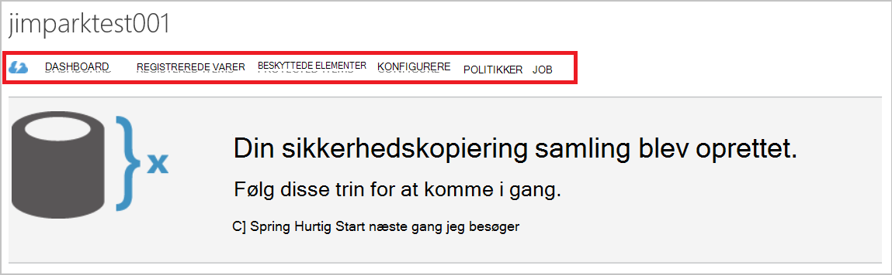
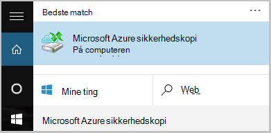

<properties
    pageTitle="Administrere Azure sikkerhedskopi vaults og servere Azure ved hjælp af den klassiske implementeringsmodel | Microsoft Azure"
    description="Brug dette selvstudium til at se, hvordan du administrere Azure sikkerhedskopi vaults og servere."
    services="backup"
    documentationCenter=""
    authors="markgalioto"
    manager="jwhit"
    editor="tysonn"/>

<tags
    ms.service="backup"
    ms.workload="storage-backup-recovery"
    ms.tgt_pltfrm="na"
    ms.devlang="na"
    ms.topic="article"
    ms.date="09/27/2016"
    ms.author="jimpark;markgal"/>

# Administrere Azure sikkerhedskopi vaults og servere, der bruger den klassiske implementeringsmodel

> [AZURE.SELECTOR]
- [Ressourcestyring](backup-azure-manage-windows-server.md)
- [Klassisk](backup-azure-manage-windows-server-classic.md)

I denne artikel finder du en oversigt over de sikkerhedskopiering administrationsopgaver, der er tilgængelige via Azure klassisk portalen og Microsoft Azure Backup agent.

[AZURE.INCLUDE [learn-about-deployment-models](../../includes/learn-about-deployment-models-classic-include.md)]Ressourcestyring implementeringsmodel.

## Portalen administrationsopgaver
1. Log på [administrationsportalen til](https://manage.windowsazure.com).

2. Klik på **Gendannelsestjenester**, og derefter klikke på navnet på sikkerhedskopien samling af legitimationsoplysninger til at få vist siden Hurtig Start.

    

Du kan se de tilgængelige administrationsopgaver ved at vælge indstillinger øverst på siden Hurtig Start.

### Dashboard
Vælg **Dashboard** til at få vist brugen oversigten for serveren. **Oversigt over brugen** indeholder:

- Antallet af Windows-servere, der er registreret til skyen
- Antallet af Azure virtuelle maskiner, der er beskyttet i skyen
- Den samlede lagerplads consumed i Azure
- Status for seneste job

Nederst i Dashboard kan du udføre følgende opgaver:

- **Administrer certifikat** – Hvis et certifikat, der blev brugt til at registrere serveren, og klik derefter bruges til at opdatere certifikatet. Hvis du bruger samling legitimationsoplysninger, skal du ikke bruge **Administrer certifikat**.
- **Slet** - sletter den aktuelle sikkerhedskopiering samling af legitimationsoplysninger. Hvis en sikkerhedskopi samling af legitimationsoplysninger er ikke længere bruges, kan du slette den for at frigøre lagerplads. **Slette** aktiveres kun, når alle registrerede servere er blevet slettet fra samling af legitimationsoplysninger.

## Registrerede varer
Vælg **Registered elementer** til at få vist navnene på de servere, der er registreret til denne samling af legitimationsoplysninger.

**Type** filteret som standard til Azure Virtual Machine. Vælg **Windows server** på rullelisten for at få vist navnene på de servere, der er registreret til denne samling af legitimationsoplysninger.

Her kan du udføre følgende opgaver:

- **Tillad nyt-registrering** – når denne indstilling er markeret for en server kan du bruge **Guiden registrering** i den lokale Microsoft Azure Backup agent til at registrere serveren med den ekstra samling af legitimationsoplysninger endnu en gang. Det være nødvendigt at registrere igen på grund af en fejl i certifikatet, eller hvis en server, der havde genopbygges.
- **Slet** - sletter en server fra sikkerhedskopien samling. Alle de lagrede data, der er knyttet til serveren, der slettes med det samme.

    

## Beskyttede elementer
Vælg **Beskyttet elementer** til at få vist de elementer, der er sikkerhedskopieret fra serverne.

## Konfigurere

Du kan vælge den relevante redundans datalager fra fanen **Konfigurer** . Det bedste tidspunkt at vælge indstillingen lagerplads redundans er rigtigt, når du har oprettet en samling af legitimationsoplysninger og alle computere er registreret til den.

>[AZURE.WARNING] Når et element er registreret til samling af legitimationsoplysninger, redundans datalager er låst og kan ikke ændres.

Se denne artikel kan finde flere oplysninger om [lagerplads redundans](../storage/storage-redundancy.md).

## Microsoft Azure Backup agent for opgaver

### Console

Åbn **Microsoft Azure Backup agent** (du kan finde det ved at søge computeren til *Microsoft Azure sikkerhedskopi*).

Du kan udføre følgende administrationsopgaver fra **Handlinger** findes på højre for sikkerhedskopiering agent konsollen:

- Registrere Server
- Planlægge sikkerhedskopiering
- Sikkerhedskopiere nu
- Ændre egenskaber

>[AZURE.NOTE] **Gendanne Data**, du se under [Gendan filer til en Windows server eller Windows klientmaskinen](backup-azure-restore-windows-server.md).

### Ændre en eksisterende sikkerhedskopi

1. Klik på **Tidsplan sikkerhedskopi**i Microsoft Azure Backup agent.

    

2. I **Guiden Sikkerhedskopiering tidsplan** Lad indstillingen **Foretag ændringer til sikkerhedskopiering elementer eller klokkeslæt** er markeret, og klik på **Næste**.

    

3. Hvis du vil tilføje eller ændre elementer, skal du klikke på **Tilføj elementer**på skærmbilledet **Vælg elementer til sikkerhedskopi** .

    Du kan også angive **Indstillinger for udelukkelse** fra denne side i guiden. Hvis du vil udelade filer eller filtyper Læs fremgangsmåden for at tilføje [udelukkelse indstillinger](#exclusion-settings).

4. Vælg de filer og mapper, du vil sikkerhedskopiere, og klik på **OK**.

    

5. Angiv **tidsplanen for sikkerhedskopiering** , og klik på **Næste**.

    Du kan planlægge dagligt (i op til 3 gange om dagen) eller ugentlig sikkerhedskopier.

    

    >[AZURE.NOTE] Angive tidsplanen for sikkerhedskopiering er beskrevet i detaljer i denne [artikel](backup-azure-backup-cloud-as-tape.md).

6. Vælg den **Opbevaringspolitik** for sikkerhedskopien, og klik på **Næste**.

    

7. Gennemse oplysningerne på skærmen for **bekræftelse** , og klik på **Udfør**.

8. Når guiden er færdig med at oprette **planen for sikkerhedskopiering**, skal du klikke på **Luk**.

    Efter at have ændret beskyttelse, kan du bekræfte, at sikkerhedskopiering der udløser korrekt ved at gå til fanen **job** og bekræfter, afspejles ændringer i de sikkerhedskopieringsjob.

### Aktivere netværk (throttling)  
Azure Backup agent indeholder en Throttling fane, hvor du kan styre, hvordan netværksbåndbredde bruges under dataoverførsel. Dette objekt kan være nyttigt, hvis du vil sikkerhedskopiere data under arbejdstimer, men ikke vil sikkerhedskopieringen forstyrrer andre internettrafik. Begrænsning af data gælder filoverførsel for at sikkerhedskopiere og gendanne aktiviteter.  

Sådan aktiveres (throttling):

1. Klik på **Skift egenskaber**i **Backup agent**.

2. Marker afkrydsningsfeltet **Aktiver brug af internetbåndbredde (throttling) for sikkerhedskopiering** .

    

3. Når du har aktiveret (throttling), skal du angive den tilladte båndbredde til sikkerhedskopiering dataoverførsel under **arbejdstimer** og **ikke - arbejdstid**.

    Værdierne i de båndbredde begynde på 512 kilobyte per sekund () og kan gå op til 1023 MB sekundet (Mbps). Du kan også angive start og Afslut for **arbejdstimer**, og hvilke dage i ugen betragtes som arbejde dage. Tidspunktet uden for det angivne antal arbejdstimer anses for ikke-arbejdstid.

4. Klik på **OK**.

## Indstillinger for udelukkelse

1. Åbn **Microsoft Azure Backup agent** (du kan finde det ved at søge computeren til *Microsoft Azure sikkerhedskopi*).

    

2. Klik på **Tidsplan sikkerhedskopi**i Microsoft Azure Backup agent.

    

3. I guiden tidsplan sikkerhedskopiering Lad indstillingen **Foretag ændringer til sikkerhedskopiering elementer eller klokkeslæt** er markeret, og klik på **Næste**.

    

4. Klik på **udeladelser indstillinger**.

    

5. Klik på **Tilføj udelukkelse**.

    

6. Vælg placeringen, og klik derefter på **OK**.

    

7. Tilføje filtypenavnet i feltet **Filtype** .

    

    Tilføje et .mp3 filtypenavn

    

    Hvis du vil tilføje et andet filtypenavn, skal du klikke på **Tilføj udelukkelse** og angive en anden filtypen (tilføje filtypenavnet .jpg).

    

8. Klik på **OK**, når du har tilføjet alle udvidelser.

9. Forsæt med guiden tidsplan sikkerhedskopiering ved at klikke på **Næste** indtil **bekræftelsessiden**og derefter klikke på **Udfør**.

    

## Næste trin
- [Gendanne Windows Server eller Windows-klient fra Azure](backup-azure-restore-windows-server.md)
- Hvis du vil vide mere om Azure sikkerhedskopi, se [Oversigt over sikkerhedskopiering af Azure](backup-introduction-to-azure-backup.md)
- Besøg [Azure sikkerhedskopiering Forum](http://go.microsoft.com/fwlink/p/?LinkId=290933)
