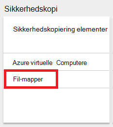

<properties
    pageTitle="Administrere Azure gendannelse services vaults og servere | Microsoft Azure"
    description="Brug dette selvstudium til at se, hvordan du administrere Azure gendannelse services vaults og servere."
    services="backup"
    documentationCenter=""
    authors="markgalioto"
    manager="cfreeman"
    editor="tysonn"/>

<tags
    ms.service="backup"
    ms.workload="storage-backup-recovery"
    ms.tgt_pltfrm="na"
    ms.devlang="na"
    ms.topic="article"
    ms.date="10/19/2016"
    ms.author="jimpark; markgal"/>


# <a name="monitor-and-manage-azure-recovery-services-vaults-and-servers-for-windows-machines"></a>Overvåge og administrere Azure gendannelse services vaults og -servere til Windows-computere

> [AZURE.SELECTOR]
- [Ressourcestyring](backup-azure-manage-windows-server.md)
- [Klassisk](backup-azure-manage-windows-server-classic.md)

I denne artikel finder du en oversigt over de sikkerhedskopiering administrationsopgaver, der er tilgængelige via portalen Azure og Microsoft Azure Backup agent.

[AZURE.INCLUDE [learn-about-deployment-models](../../includes/learn-about-deployment-models-rm-include.md)]Klassisk implementeringsmodel.

## <a name="management-portal-tasks"></a>Portalen administrationsopgaver

### <a name="access-your-recovery-services-vaults"></a>Få adgang til dine tjenester til genoprettelse vaults

1. Log på [Azure-portalen](https://portal.azure.com/) med dit Azure-abonnement.

2. Klik på **Gennemse** , og skriv **Gendannelsestjenester**på listen over ressourcer, i menuen Hub. Når du begynder at skrive, på listen filtrerer baseret på dit input. Klik på **tjenester til genoprettelse vaults**.

     <br/>

2. Vælg navnet på den samling, du vil have vist fra listen for at åbne bladet gendannelse Services samling dashboard.

     <br/>

## <a name="monitor-jobs-and-alerts"></a>Overvåge job og beskeder
Du overvåge job og beskeder fra dashboardet gendannelse Services samling, hvor der står:

- Oplysninger om sikkerhedskopiering beskeder
- Filer og mapper samt Azure virtuelle maskiner, der er beskyttet i skyen
- Samlede lager consumed i Azure
- Status for sikkerhedskopieringsjob


Hvis du klikker på oplysningerne i hver af disse felter, åbnes den tilknyttede blade, hvor du administrerer relaterede opgaver.

Fra toppen af dashboardet:

- Indstillinger giver adgang tilgængelige sikkerhedskopiering opgaver.
- Sikkerhedskopi - hjælper med at du sikkerhedskopierer nye filer og mapper (eller Azure FOS) til samling af legitimationsoplysninger gendannelsestjenester.
- Slet - Hvis en gendannelse services samling af legitimationsoplysninger er ikke længere bruges, kan du slette den for at frigøre lagerplads. Slet aktiveres kun, når alle servere, der er beskyttet er blevet slettet fra samling af legitimationsoplysninger.


## <a name="alerts-for-backups-using-azure-backup-agent"></a>Beskeder for sikkerhedskopier ved hjælp af Azure Sikkerhedskopiér agent:
| Beskeder om niveau  | Beskeder, der er sendt |
| ------------- | ------------- |
| Kritisk | Sikkerhedskopiering mislykket nedbrud-fejl  |
| Advarsel  | Sikkerhedskopieringen blev fuldført med advarsler (når færre end en 100 filer sikkerhedskopieres ikke på grund af problemer med beskadigelse af og mere end en million filer er sikkerhedskopieret)  |
| Informativ  | Ingen  |
## <a name="manage-backup-alerts"></a>Administrer beskeder for sikkerhedskopiering
Klik på feltet **Sikkerhedskopi beskeder** for at åbne bladet **Sikkerhedskopi beskeder** og administrere beskeder.


Feltet sikkerhedskopi beskeder viser antallet af:

- vigtige beskeder uløste i seneste 24 timer
- advarsel om beskeder uløste i seneste 24 timer

At klikke på hver af disse links, fører dig til bladet **Sikkerhedskopi beskeder** med en filtreret visning af disse beskeder (kritiske eller advarsel).

Fra bladet sikkerhedskopi beskeder du:

- Vælg de relevante oplysninger føjes til dine beskeder.

    

- Filtrere beskeder for alvor, status og start/slut tidspunkter.

    

- Konfigurere beskeder for alvor, hyppighed og modtagere, samt slå beskeder til eller fra.

    

Hvis **Per besked** er markeret som **Informer** hyppigheden forekommer ingen grupperings- eller reduktion i mails. Hver besked resulterer i 1 meddelelse. Dette er standardindstillingen og opløsning e-mailen sendes også med det samme.

Hvis **Hver time samlet** er markeret som sendes **Informer** frekvens en mail til den bruger, der fortæller dem om, at der er uløste nye beskeder, der er oprettet i den seneste time. En mail med opløsning bliver sendt ud i slutningen af timen.

Du kan sende beskeder til følgende alvorlighed niveauer:

- kritisk
- advarsel
- Du kan finde oplysninger

Du Deaktiver påmindelsen med knappen **Deaktiver** i bladet job detaljer. Når du klikker på Deaktiver, du kan angive opløsning noter.

Du kan vælge de kolonner, der skal vises som en del af den vigtige besked med knappen **Vælg kolonner** .

>[AZURE.NOTE] Fra bladet **Indstillinger** du administrere sikkerhedskopiering beskeder ved at vælge **overvågnings- og rapporter > beskeder og begivenheder > sikkerhedskopiering beskeder** og derefter klikke på **Filter** eller **Konfigurere beskeder**.

## <a name="manage-backup-items"></a>Administrere sikkerhedskopi
Administrere lokale sikkerhedskopier er nu tilgængelig på administrationsportalen. I sektionen sikkerhedskopiering af dashboardet i viser feltet **Sikkerhedskopiering elementer** antallet af sikkerhedskopiering elementer, der er beskyttet til samling af legitimationsoplysninger.

Klik på **Fil-mapper** i feltet Sikkerhedskopiér elementer.



Bladet sikkerhedskopiering elementer åbnes med det filter, der er angivet til fil-mappe, hvor der står hver bestemt sikkerhedskopi angivet element.


Hvis du vælger et bestemt sikkerhedskopiering element på listen, kan du se de vigtigste oplysninger for det pågældende element.

>[AZURE.NOTE] Fra bladet **Indstillinger** du administrerer filer og mapper ved at vælge **beskyttet elementer > sikkerhedskopi elementer** og derefter vælge **Arkiver mapper** på rullelisten.


## <a name="manage-backup-jobs"></a>Administrere sikkerhedskopi job
Sikkerhedskopi job både lokalt (når lokal server sikkerhedskopierer til Azure) og Azure sikkerhedskopier er synlige i dashboardet.

I sektionen sikkerhedskopiering af dashboardet viser feltet sikkerhedskopi job antallet af job:

- igangværende
- mislykkedes i de seneste 24 timer.

Klik på feltet **Sikkerhedskopieringsjob** , som åbner bladet sikkerhedskopieringsjob for at administrere din sikkerhedskopieringsjob skal.


Du kan ændre de oplysninger, der er tilgængelige i bladet sikkerhedskopi job med knappen **Vælg kolonner** øverst på siden.

Brug knappen **Filter** for at vælge mellem filer og mapper og Azure virtuelt sikkerhedskopi.

Hvis du ikke kan se dine sikkerhedskopierede filer og mapper, skal du klikke på knappen **Filter** øverst på siden, og vælg **filer og mapper** i menuen elementtype.

>[AZURE.NOTE] Fra bladet **Indstillinger** du administrerer sikkerhedskopieringsjob ved at vælge **overvågnings- og rapporter > job > sikkerhedskopieringsjob** og derefter vælge **Arkiver mapper** på rullelisten.

## <a name="monitor-backup-usage"></a>Overvåge brugen af sikkerhedskopi
I sektionen sikkerhedskopiering af dashboardet viser feltet sikkerhedskopi brugen opbevaring consumed i Azure. Lagerforbrug er beregnet til:
- LRS lagerforbrug, der er knyttet til samling af legitimationsoplysninger i skyen
- GRS lagerforbrug, der er knyttet til samling af legitimationsoplysninger i skyen

## <a name="production-servers"></a>Fremstilling servere
Klik på **Indstillinger**for at administrere serverne fremstilling skal. Klik på under Administrer **sikkerhedskopi infrastruktur > fremstilling servere**.

Fremstilling servere blade lister over alle tilgængelige fremstilling-servere. Klik på en server på listen for at åbne server oplysninger.


## <a name="microsoft-azure-backup-agent-tasks"></a>Microsoft Azure Backup agent for opgaver

## <a name="open-the-backup-agent"></a>Åbn den ekstra agent

Åbn **Microsoft Azure Backup agent** (du finde det ved at søge computeren til *Microsoft Azure sikkerhedskopi*).


Du kan udføre følgende administrationsopgaver fra **Handlinger** findes på højre for sikkerhedskopiering agent konsollen:

- Registrere Server
- Planlægge sikkerhedskopiering
- Sikkerhedskopiere nu
- Ændre egenskaber


>[AZURE.NOTE] **Gendanne Data**, du se under [Gendan filer til en Windows server eller Windows klientmaskinen](backup-azure-restore-windows-server.md).

## <a name="modify-an-existing-backup"></a>Ændre en eksisterende sikkerhedskopi

1. Klik på **Tidsplan sikkerhedskopi**i Microsoft Azure Backup agent.

    

2. I **Guiden Sikkerhedskopiering tidsplan** Lad indstillingen **Foretag ændringer til sikkerhedskopiering elementer eller klokkeslæt** er markeret, og klik på **Næste**.

    

3. Hvis du vil tilføje eller ændre elementer, skal du klikke på **Tilføj elementer**på skærmbilledet **Vælg elementer til sikkerhedskopi** .

    Du kan også angive **Indstillinger for udelukkelse** fra denne side i guiden. Hvis du vil udelade filer eller filtyper Læs fremgangsmåden for at tilføje [udelukkelse indstillinger](#exclusion-settings).

4. Vælg de filer og mapper, du vil sikkerhedskopiere, og klik på **OK**.

    

5. Angiv **tidsplanen for sikkerhedskopiering** , og klik på **Næste**.

    Du kan planlægge dagligt (i op til 3 gange om dagen) eller ugentlig sikkerhedskopier.

    

    >[AZURE.NOTE] Angive tidsplanen for sikkerhedskopiering er beskrevet i detaljer i denne [artikel](backup-azure-backup-cloud-as-tape.md).

6. Vælg den **Opbevaringspolitik** for sikkerhedskopien, og klik på **Næste**.

    

7. Gennemse oplysningerne på skærmen for **bekræftelse** , og klik på **Udfør**.

8. Når guiden er færdig med at oprette **planen for sikkerhedskopiering**, skal du klikke på **Luk**.

    Efter at have ændret beskyttelse, kan du bekræfte, at sikkerhedskopiering der udløser korrekt ved at gå til fanen **job** og bekræfter, afspejles ændringer i de sikkerhedskopieringsjob.

## <a name="enable-network-throttling"></a>Aktivere netværk (throttling)  
Azure Backup agent indeholder en Throttling fane, hvor du kan styre, hvordan netværksbåndbredde bruges under dataoverførsel. Dette objekt kan være nyttigt, hvis du vil sikkerhedskopiere data under arbejdstimer, men ikke vil sikkerhedskopieringen forstyrrer andre internettrafik. Begrænsning af data gælder filoverførsel for at sikkerhedskopiere og gendanne aktiviteter.  

Sådan aktiveres (throttling):

1. Klik på **Skift egenskaber**i **Backup agent**.

2. Aktiver brug af internetbåndbredde (throttling) for sikkerhedskopiering handlinger ** **(throttling) under fanen Vælg **.

    

    Når du har aktiveret (throttling), skal du angive den tilladte båndbredde til sikkerhedskopiering dataoverførsel under **arbejdstimer** og **ikke - arbejdstid**.

    Værdierne i de båndbredde begynde på 512 kilobyte per sekund () og kan gå op til 1023 MB sekundet (Mbps). Du kan også angive start og Afslut for **arbejdstimer**, og hvilke dage i ugen betragtes som arbejde dage. Tidspunktet uden for det angivne antal arbejdstimer anses for ikke-arbejdstid.

3. Klik på **OK**.

## <a name="manage-exclusion-settings"></a>Administrere indstillinger for udelukkelse

1. Åbn **Microsoft Azure Backup agent** (du kan finde det ved at søge computeren til *Microsoft Azure sikkerhedskopi*).

    

2. Klik på **Tidsplan sikkerhedskopi**i Microsoft Azure Backup agent.

    

3. I guiden tidsplan sikkerhedskopiering Lad indstillingen **Foretag ændringer til sikkerhedskopiering elementer eller klokkeslæt** er markeret, og klik på **Næste**.

    

4. Klik på **udeladelser indstillinger**.

    

5. Klik på **Tilføj udelukkelse**.

    

6. Vælg placeringen, og klik derefter på **OK**.

    

7. Tilføje filtypenavnet i feltet **Filtype** .

    

    Tilføje et .mp3 filtypenavn

    

    Hvis du vil tilføje et andet filtypenavn, skal du klikke på **Tilføj udelukkelse** og angive en anden filtypen (tilføje filtypenavnet .jpg).

    

8. Klik på **OK**, når du har tilføjet alle udvidelser.

9. Forsæt med guiden tidsplan sikkerhedskopiering ved at klikke på **Næste** indtil **bekræftelsessiden**og derefter klikke på **Udfør**.

    

## <a name="frequently-asked-questions"></a>Ofte stillede spørgsmål
**KVT1. Sikkerhedskopieringsjob status vises som fuldført i Azure sikkerhedskopiering agent, hvorfor ikke den få afspejles med det samme i portalen?**

A1. Der er på maksimale forsinkelse på 15 minutter mellem sikkerhedskopieringsjob status afspejles i Azure sikkerhedskopiering agent og Azure portalen.

**Q.2, når en sikkerhedskopieringsjob mislykkes, hvor lang tid tager det for at udløse en besked?**

A.2 en besked opløftes i 20 minutter til Azure sikkerhedskopiering fejlen.

**K3. Er der en sag, hvor en mail ikke sendes, hvis meddelelser er konfigureret?**

A3. Er tilfælde under når meddelelsen ikke bliver sendt for at reducere den beskeder om støj:

   - Hvis meddelelser er konfigureret hver time og en besked er opløftet og løst inden for en time
   - Jobbet er annulleret.
   - Anden sikkerhedskopieringsjob mislykkedes, fordi oprindelige sikkerhedskopieringsjob er i gang.

## <a name="troubleshooting-monitoring-issues"></a>Fejlfinding af problemer med overvågning

**Problem:** Job og/eller beskeder fra Azure Backup agent vises ikke på portalen.

**Fejlfindingstrin:** Processen, ```OBRecoveryServicesManagementAgent```, sender job og besked dataene til Azure sikkerhedskopi-tjenesten. Nogle gange kan blive sidder fast denne proces eller lukning.

1. Åbn **Jobliste** for at bekræfte processen ikke kører, og Markér, hvis den ```OBRecoveryServicesManagementAgent``` processen kører.

2. Forudsætter, at der ikke kører processen, Åbn **Kontrolpanel** , og gennemse listen over tjenester. Start eller genstart **Microsoft Azure betroet Services Management bruger**.

    Find logge på for at få yderligere oplysninger:<br/>
`<AzureBackup_agent_install_folder>\Microsoft Azure Recovery Services Agent\Temp\GatewayProvider*`. Eksempel:<br/> `C:\Program Files\Microsoft Azure Recovery Services Agent\Temp\GatewayProvider0.errlog`.

## <a name="next-steps"></a>Næste trin
- [Gendanne Windows Server eller Windows-klient fra Azure](backup-azure-restore-windows-server.md)
- Hvis du vil vide mere om Azure sikkerhedskopi, se [Oversigt over sikkerhedskopiering af Azure](backup-introduction-to-azure-backup.md)
- Besøg [Azure sikkerhedskopiering Forum](http://go.microsoft.com/fwlink/p/?LinkId=290933)
